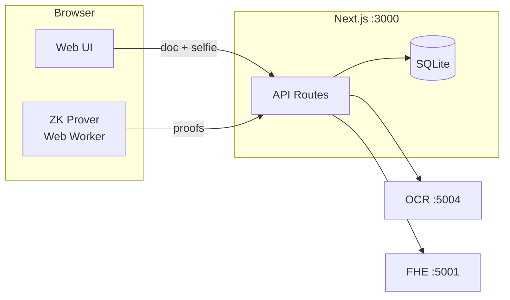

# Zentity

<p align="center">
  
</p>

<div align="center">

**Traditional KYC is a honeypot by design**

"Prove you're over 18" → stores your exact birthday<br>
"Prove your identity" → stores your passport photo<br>
"Prove you're real" → stores biometric templates

Every database is a breach waiting to happen. The model itself is broken.
**We're storing data we don't need to store.**

---

**Zentity** proves you can verify identity claims without storing the underlying data.
Built with zero-knowledge proofs, fully homomorphic encryption, and cryptographic commitments.

</div>

> [!CAUTION]
> This is a **PoC**. Breaking changes are expected and backward compatibility is not a goal.

## Contents

- [TL;DR (run + test)](#tldr-run--test)
- [Architecture (start here)](#architecture-start-here)
- [What's implemented (PoC)](#whats-implemented-poc)
- [Data handling (at a glance)](#data-handling-at-a-glance)
- [Background and use cases](#background-and-use-cases) *(collapsed)*
- [Cryptographic architecture](#cryptographic-architecture) *(collapsed)*
- [Technical reference](#technical-reference) *(collapsed)*
- [Documentation](#documentation)

## TL;DR (run + test)

```bash
docker compose up --build
```

- Web UI: `http://localhost:3000`
- FHE service: `http://localhost:5001`
- OCR service: `http://localhost:5004`

Quick manual test (happy path):
- Go to `/sign-up` → complete the 4-step wizard (email → upload → liveness → complete)
- After completion, open `/dashboard` and check verification + proof status

## Architecture (start here)



Deep-dive docs:
- [`docs/architecture.md`](docs/architecture.md) — system components, data flow, storage model
- [`docs/zk-architecture.md`](docs/zk-architecture.md) — ZK circuits, proving/verifying
- [`docs/zk-nationality-proofs.md`](docs/zk-nationality-proofs.md) — nationality Merkle proofs

## What’s Implemented (PoC)

- 4-step onboarding wizard (email → upload ID → liveness → complete)
- Client-side ZK proving (Web Worker) + server-side verification:
  - age proof (`age ≥ 18`, persisted)
  - doc validity, nationality membership, face-match threshold proofs (available as circuits/demos)
- Salted SHA256 commitments for dedup + later integrity checks (name, document number, nationality)
- FHE service integration (encrypt + compare on ciphertexts) for PoC policy checks
- Disclosure demo flow (RP-style verification of received proof payloads)

## Data Handling (at a glance)

The PoC stores a mix of auth data and cryptographic artifacts; it does **not** store raw ID images or selfies.

- Plaintext at rest: account email (authentication)
- Encrypted at rest: short-lived onboarding PII (wizard continuity), display-only first name
- Non-reversible at rest: salted commitments (SHA256)
- Proof/ciphertext at rest: ZK proof payloads + TFHE ciphertexts

Details: `docs/architecture.md`

<details id="background-and-use-cases">
<summary>Background and use cases</summary>

## Why Zentity Exists

### The Problem

Advanced cryptographic techniques—zero-knowledge proofs, fully homomorphic encryption, Merkle trees—have existed for decades. They solve real problems: proving claims without revealing data, computing on encrypted values, verifying set membership privately.

Yet these techniques are **rarely used in mainstream applications**.

Why? The barrier isn't mathematical—it's practical:
- Complex setup (trusted ceremonies, circuit compilation, key generation)
- Specialized expertise required
- No reference implementations for common use cases
- Perceived performance overhead

Meanwhile, identity verification systems store millions of passport photos, birth dates, and biometric templates in plaintext databases—creating honeypots for attackers and compliance nightmares for organizations.

### The Opportunity

KYC and identity verification is the perfect domain for privacy-preserving cryptography:
- **High-value PII**: Names, birthdates, document numbers, face images
- **Binary decisions**: "Is this person over 18?" doesn't require knowing their exact birthday
- **Regulatory pressure**: GDPR, data minimization laws demand "privacy by design"
- **Business alignment**: Companies *want* to verify without the liability of storing

### What This Project Demonstrates

Zentity proves these cryptographic techniques **can work together** in a real application:

| Technique | Traditional Barrier | Zentity Approach |
|-----------|---------------------|------------------|
| Zero-Knowledge Proofs | Complex circuit design | Pre-built circuits for age, nationality, document validity |
| Fully Homomorphic Encryption | Slow, requires expertise | TFHE-rs with optimized operations for KYC use cases |
| Cryptographic Commitments | Roll-your-own risk | Standardized SHA256 + salt with GDPR erasure support |
| Merkle Trees | Custom implementation | Ready-to-use country group trees (EU, EEA, SCHENGEN) |

The result: **complete identity verification with minimized plaintext storage** (no raw ID images/selfies stored; cryptographic artifacts persisted; authentication data stored as required).

> [!NOTE]
> Zentity is a demonstration project showing that privacy-preserving KYC is technically feasible today. It serves as a reference architecture for teams building production systems.

## What is Zentity?

Zentity is a privacy-preserving KYC platform that enables identity verification for banks, crypto exchanges, and fintechs—without storing or accessing sensitive personal information.

### Currently Available

- **Verify age** without revealing date of birth (ZK proofs + FHE)
- **Verify nationality group membership** without revealing country (ZK Merkle proofs)
- **Verify liveness** with multi-gesture challenges (smile, blink, head turns)
- **Verify liveness scores** without revealing biometric data (FHE threshold comparisons)
- **Match faces** to ID documents without storing biometrics (DeepFace/ArcFace)
- **Verify document validity** without exposing expiration date (ZK proofs)

### Planned Features

- **ZK Face Match Proofs** - Prove face similarity inside a ZK circuit
- **AML/Sanctions screening** - Privacy-preserving sanctions list checking
- **Accredited investor verification** - Prove income thresholds without revealing amounts
- **Source of funds verification** - ZK proofs for financial compliance

## Business Use Cases

### Privacy-Preserving Liveness Verification

Traditional liveness detection exposes exact anti-spoof confidence scores. Zentity encrypts liveness scores using FHE, enabling threshold comparisons without revealing the actual score:

```
User → Liveness Service: Submit face capture
Liveness Service → FHE: encrypt(score=0.85)
FHE → Storage: ciphertext (score hidden)
Verifier → FHE: verify(ciphertext >= 0.3)
FHE → Verifier: true/false (score never revealed)
```

**Benefits:**
- Prevents gaming the system by knowing exact thresholds
- Protects biometric scoring algorithms from reverse engineering
- Enables different threshold policies per use case

**Current POC implementation (Human.js):**
- Real-time challenges (smile + head turns) run in the browser for instant feedback.
- The client captures a baseline frame and one frame per challenge.
- Those frames are sent to `POST /api/liveness/verify`, where Next.js re-runs Human.js on Node to make the authoritative decision and return a face embedding.

> [!WARNING]
> **Limitations (non-production):**
> - Server-side re-scoring blocks simple UI tampering, but can't prove frames came from a live camera; replayed or edited frames can still be submitted.
> - Human's antispoof/liveness models are lightweight "quick checks" and not KYC‑grade on their own.
> - Model weights are bundled locally via `@vladmandic/human-models` and served from `/human-models/*`; first run may still be slow while models initialize, but no external download is needed.
> - Liveness sessions are stored in memory and reset on server restart.

### Nationality Group Membership

Proving citizenship often requires revealing exact nationality, which can lead to discrimination. Zentity's ZK Merkle proofs enable group membership verification:

```
User → Zentity: "Prove I'm EU citizen"
Zentity (browser) → Web Worker: Generate Merkle membership proof
Zentity → Verifier: proof + merkleRoot (EU identifier)
Verifier: Knows user is EU citizen, but NOT which of 27 countries
```

**Use Cases:**
- **EU Right to Work**: Verify employment authorization without revealing specific nationality
- **Schengen Travel**: Prove travel zone eligibility without passport country disclosure
- **Regional Compliance**: Meet LATAM or EEA requirements without over-sharing
- **Anti-Discrimination**: Prevent nationality-based bias in hiring/services

### Multi-Threshold Age Verification

Different jurisdictions require different age thresholds. The `age_verification` circuit supports a public `min_age` input (e.g. 18/21/25).

| Threshold | Use Case |
|-----------|----------|
| 18+ | General adult verification (EU, most jurisdictions) |
| 21+ | US alcohol/cannabis, car rental |
| 25+ | Premium car rental, certain financial products |

> [!NOTE]
> **Current PoC status:** The onboarding flow persists an `age ≥ 18` proof payload. Other thresholds can be generated/verified, but aren't fully wired into the default UI/storage flows yet.

</details>

<details id="cryptographic-architecture">
<summary>Cryptographic architecture</summary>

## Cryptographic Architecture

Zentity uses three complementary cryptographic techniques to enable privacy-preserving identity verification:

### The Privacy Stack

```
┌─────────────────────────────────────────────────────────────────┐
│                    ZERO-KNOWLEDGE PROOFS                        │
│         Prove claims without revealing underlying data          │
│    "I am over 18" • "I am EU citizen" • "Document not expired"  │
├─────────────────────────────────────────────────────────────────┤
│              FULLY HOMOMORPHIC ENCRYPTION (FHE)                 │
│           Perform computations on encrypted data                │
│         Age comparisons • Gender matching • Liveness scores     │
├─────────────────────────────────────────────────────────────────┤
│               CRYPTOGRAPHIC COMMITMENTS                         │
│           One-way hashes for identity verification              │
│              Names • Document numbers • Nationality             │
└─────────────────────────────────────────────────────────────────┘
```

### Why Three Techniques?

Each cryptographic primitive solves a specific problem:

| Problem | Solution | How It Works |
|---------|----------|--------------|
| "Verify my name without storing it" | **Commitment** | SHA256(name + salt) stored; verify by recomputing |
| "Check if I'm over 18 without seeing my DOB" | **FHE** | Encrypted DOB compared homomorphically |
| "Prove I'm EU citizen without revealing country" | **ZK Proof** | Merkle tree membership proof |
| "Delete my data for GDPR" | **Commitment** | Delete salt → commitment becomes unlinkable |

### Cryptographic Commitments

A commitment is a one-way hash that binds you to a value without revealing it.

> [!IMPORTANT]
> In Zentity, commitments are **per-attribute** (name, document number, nationality), not a single "commitment to the entire credential".

**How it works:**
1. During verification: `commitment = SHA256("John Doe" + random_salt)`
2. Commitment stored in database (hash, not name)
3. Later verification: Recompute hash with claimed name + stored salt
4. Match = verified. No name ever stored.

**GDPR compliance:** Deleting the salt makes the commitment cryptographically unlinkable to any identity.

#### What commitments are (in this repo)

- **Storage minimization:** Persist only hashes instead of raw values.
- **Deduplication / integrity checks:** Detect repeated document numbers (via hashed doc number), validate “this disclosed value matches what was verified” (by recomputing the hash with the same salt).
- **Erasure primitive:** If you delete the `user_salt`, the commitments are no longer linkable to the original attributes.

#### What commitments are not (in this repo)

- They are **not** currently a single “identity commitment” that all ZK proofs are derived from.
- They are **not** a cryptographic proof that “these attributes came from a signed passport”; provenance comes from the document-processing pipeline and verification logic, not from a passport-signature ZK circuit.

### Fully Homomorphic Encryption (FHE)

FHE allows computations on encrypted data without decryption.

**How it works:**
1. Your date of birth is encrypted: `encrypted_dob = FHE.encrypt(1990-05-15)`
2. Server performs comparison: `is_adult = encrypted_dob <= (current_year - 18)`
3. Only the boolean result is decrypted: `true`
4. Server never sees your actual birthday

**Library:** [TFHE-rs](https://github.com/zama-ai/tfhe-rs) (Rust) - industry-leading FHE implementation from Zama

### Zero-Knowledge Proofs

ZK proofs let you prove a statement is true without revealing why it's true.

**In this repo, ZK proofs are statements about private inputs** (e.g., birth year, expiry date, nationality code, face similarity score) and include a nonce for replay resistance. They are verified cryptographically, and the verifier additionally enforces policy checks against the proof’s public outputs.

**How it works:**
1. You want to prove: "I am an EU citizen"
2. Circuit checks: Is your nationality in the EU Merkle tree?
3. Proof generated: Mathematical proof that passes verification
4. Verifier learns: "Yes, EU citizen" but NOT which of 27 countries

**Components:**
- **UltraHonk** - Proof system (compact proofs, fast verification, no trusted setup)
- **Noir** - Circuit language defining provable statements
- **Barretenberg** - WASM proving backend from Aztec
- **Client-side** - Proofs generated in browser via Web Workers

### The Complete Flow

```
┌──────────────┐     ┌──────────────┐     ┌──────────────┐
│   Document   │────▶│     OCR      │────▶│  Commitments │
│    Image     │     │   Extract    │     │   (SHA256)   │
└──────────────┘     └──────────────┘     └──────────────┘
                            │                    │
                            ▼                    ▼
                     ┌──────────────┐     ┌──────────────┐
                     │     FHE      │     │   Database   │
                     │   Encrypt    │────▶│ (No raw      │
                     │  DOB/Gender  │     │ images/PII)  │
                     └──────────────┘     └──────────────┘
                                            ▲
                            │                    │
                            ▼                    │
                     ┌──────────────┐            │
                     │  ZK Proofs   │────────────┘
                     │  Age/Nation  │
                     └──────────────┘

┌──────────────┐     ┌──────────────┐     ┌──────────────┐
│    Selfie    │────▶│   Liveness   │────▶│  FHE Score   │
│    Image     │     │    Check     │     │  + Boolean   │
└──────────────┘     └──────────────┘     └──────────────┘
```

**Result:** Complete identity verification with minimized plaintext storage (no raw ID images/selfies stored; cryptographic artifacts persisted; authentication data stored as required).

### Privacy-First Design

#### What We Store

| Data | Storage Type | Purpose |
|------|--------------|---------|
| Birth Year | FHE ciphertext | Age verification at any threshold |
| Full DOB | FHE ciphertext (u32) | Precise age calculation (YYYYMMDD) |
| Liveness Score | FHE ciphertext (u16) | Privacy-preserving anti-spoof threshold |
| Gender | FHE ciphertext (u8) | ISO 5218 encoded, FHE comparisons |
| Name | SHA256 commitment (salted) | Minimization + later integrity checks |
| Document # | SHA256 commitment (salted) | Duplicate detection + later integrity checks |
| Nationality | SHA256 commitment (salted) | Minimization + later integrity checks |
| Age Proof | ZK proof payload | Persisted proof + public signals for `age ≥ 18` |
| Doc Validity Proof | ZK proof | Proves document not expired |
| Nationality Group Proof | ZK Merkle proof | Proves EU/EEA/SCHENGEN membership |

#### What We NEVER Store

| Data | Reason |
|------|--------|
| Document Image | Processed transiently, discarded |
| Selfie Image | Processed transiently, discarded |
| Face Embeddings | Discarded after comparison |
| Liveness Signals | Discarded after analysis |
| Actual Name/DOB | No plaintext stored (only commitments/ciphertexts) |

## Two-Tier Architecture

### Tier 1: Non-Regulated (Age-Gated Services)

```
User → Zentity: "Verify me"
Zentity → User: age proof payload + liveness result
User → Retailer: "Here's my age proof"
Retailer → Verify: verify(proof) → true/false

No raw ID images or plaintext identity attributes are shared. The relying party only learns the verified result (e.g. “over a threshold” + liveness passed) and any explicitly disclosed values.
```

### Tier 2: Regulated Entities (Banks, Exchanges)

```
User → Zentity: Complete verification
User → Exchange: "I want to onboard"
Exchange → User (via Zentity): Request PII disclosure
Zentity → Exchange: Encrypted package (RSA-OAEP + AES-GCM)
  - Name, DOB, Nationality (E2E encrypted)
  - Face match result (verified, no biometrics shared)
  - Liveness attestation

Exchange stores: PII (regulatory requirement)
Zentity stores: Cryptographic artifacts (commitments, proofs, ciphertexts) but no raw PII
Biometrics: NEVER stored by either party
```

</details>

<details id="technical-reference">
<summary>Technical reference</summary>

## Technical Reference

### Project Structure

```
zentity/
├── apps/
│   ├── web/                  # Next.js 16 frontend (ZK proofs + liveness via Human.js)
│   ├── fhe/                  # Rust/Axum - Homomorphic Encryption
│   └── ocr/                  # Python/FastAPI - Document OCR (local RapidOCR)
├── tooling/
│   └── bruno-collection/     # API testing
└── docs/                     # Documentation
```

### System Architecture

```
┌───────────────────────────────────────────────────────────────────────────┐
│                           FRONTEND (Next.js 16)                           │
│                           http://localhost:3000                           │
│                                                                           │
│   ┌─────────────────────────────────────────────────────────────────┐     │
│   │  ZK PROOFS (Noir.js + Barretenberg)                             │     │
│   │  • Age verification (UltraHonk proofs)                          │     │
│   │  • Document validity proofs                                     │     │
│   │  • Nationality group membership (Merkle proofs)                 │     │
│   │  • Generated client-side via Web Workers                        │     │
│   └─────────────────────────────────────────────────────────────────┘     │
│   ┌─────────────────────────────────────────────────────────────────┐     │
│   │  LIVENESS (Human.js)                                            │     │
│   │  • Multi-gesture challenges (smile, blink, head turns)          │     │
│   │  • Face detection and matching                                  │     │
│   │  • Runs locally via tfjs-node (no external API calls)           │     │
│   └─────────────────────────────────────────────────────────────────┘     │
│                                                                           │
│   ┌─────────────────────────────────────────────────────────────────┐     │
│   │ /api/crypto/*    /api/liveness/*    /api/kyc/*    /api/identity/*│     │
│   └──────────┬──────────────────────────────────┬───────────────────┘     │
└──────────────┼──────────────────────────────────┼─────────────────────────┘
               │                                  │
    ┌──────────▼──────────┐              ┌────────▼───────────────┐
    │   FHE SERVICE       │              │   OCR SERVICE          │
    │   Rust/Axum         │              │   Python/FastAPI       │
    │   Port 5001         │              │   Port 5004            │
    │                     │              │                        │
    │ • /encrypt          │              │ • /process             │
    │ • /verify-age       │              │ • /extract             │
    │ • /keys/generate    │              │ • /ocr                 │
    │ • /encrypt-liveness │              │                        │
    │ • /verify-liveness  │              │ Local RapidOCR         │
    │ TFHE-rs v1.4.2      │              │ (no external calls)    │
    └─────────────────────┘              └────────────────────────┘
```

### Technology Stack

| Service | Language | Framework | Crypto Library | Port |
|---------|----------|-----------|----------------|------|
| Frontend + ZK + Liveness | TypeScript | Next.js 16, Noir.js, Human.js | Barretenberg (UltraHonk) | 3000 |
| FHE Service | Rust | Axum | TFHE-rs v1.4.2 | 5001 |
| OCR | Python 3.10+ | FastAPI, RapidOCR | SHA256 | 5004 |

### ZK Proof Circuits (Noir)

All circuits are compiled with Noir and proven client-side using UltraHonk via Barretenberg WASM.

| Circuit | Purpose | Public Signals |
|---------|---------|----------------|
| Age Verification | Prove age >= threshold | `currentYear`, `minAge`, `nonce`, `isValid` |
| Document Validity | Prove not expired | `currentDate`, `nonce`, `isValid` |
| Nationality Membership | Prove nationality in group | `merkleRoot`, `nonce`, `isMember` |

#### Supported Country Groups

The Nationality Membership circuit uses Merkle tree proofs to verify membership in predefined country groups without revealing the specific country:

| Group | Countries | Use Case |
|-------|-----------|----------|
| EU | 27 countries | EU citizen verification |
| EEA | 30 countries | European work authorization |
| SCHENGEN | 25 countries | Travel zone verification |
| LATAM | 7 countries | Regional compliance |
| FIVE_EYES | 5 countries | Intelligence alliance nations |

## Quick Start

### Using Docker (Recommended)

```bash
docker-compose up
```

Open http://localhost:3000

### Manual Setup

<details>
<summary>Click to expand manual setup instructions</summary>

#### Prerequisites

- Node.js 20+ (recommended: use `.nvmrc` or `mise`)
- Rust 1.91+ (recommended: `mise`)
- Python 3.12+ (recommended: `mise`)
- pnpm

#### Setup Toolchain

```bash
# Install mise (https://mise.jdx.dev)
curl https://mise.run | sh

# Install project toolchain versions
mise install
```

#### Install Dependencies

```bash
# Frontend (includes ZK proof generation via Noir.js)
cd apps/web && pnpm install

# OCR service (Python)
cd apps/ocr && python -m venv venv && source venv/bin/activate && pip install -r requirements.txt

# FHE Service (Rust - compiles on first run)
cd apps/fhe && cargo build --release
```

#### Start Services

```bash
# Terminal 1: Frontend
cd apps/web && pnpm dev

# Terminal 2: FHE Service
cd apps/fhe && cargo run --release

# Terminal 3: OCR Service
cd apps/ocr && source venv/bin/activate && uvicorn app.main:app --reload --port 5004
```

</details>

## Documentation

| Document | Description |
|----------|-------------|
| [System Architecture](docs/architecture.md) | End-to-end components + data flow + storage model |
| [ZK Proof Architecture](docs/zk-architecture.md) | Circuits + proving/verifying model |
| [ZK Nationality Proofs](docs/zk-nationality-proofs.md) | Merkle tree nationality verification |
| [API Collection](tooling/bruno-collection/README.md) | Bruno API testing collection |

## License

MIT

## Contributing

Contributions welcome! Please read the contributing guidelines before submitting PRs.
