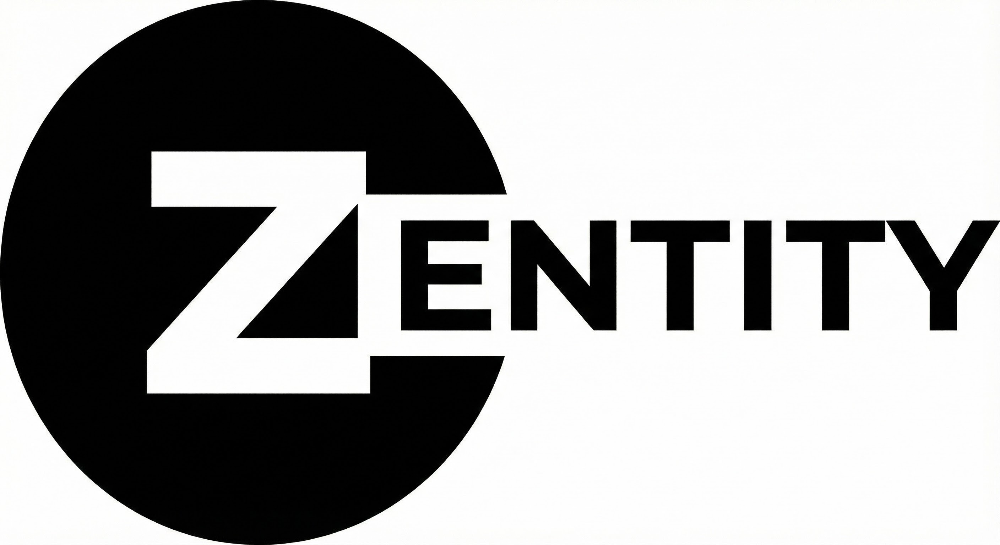
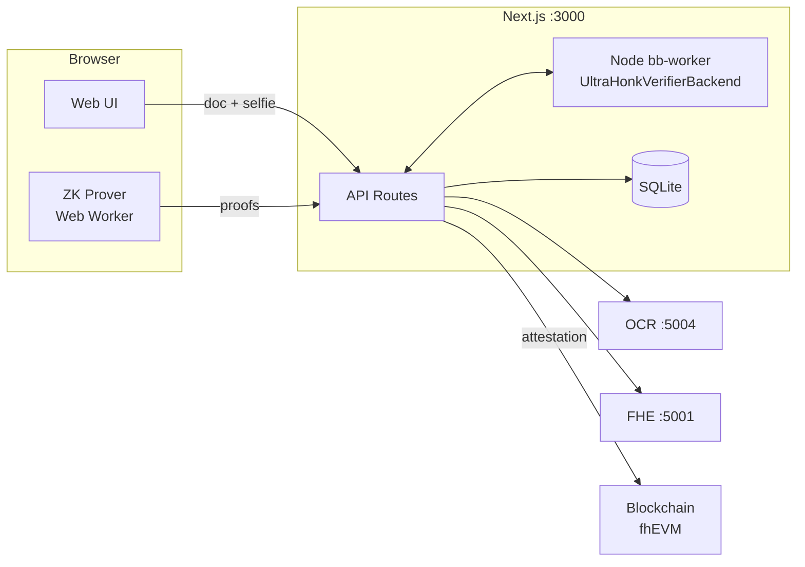

# Zentity

<p align="center">
  
</p>

<div align="center">

**Traditional KYC is a honeypot by design**

"Prove you're over 18" → stores your exact birthday<br>
"Prove your identity" → stores your passport photo<br>
"Prove you're real" → stores biometric templates

Every database is a breach waiting to happen. The model itself is broken.
**We're storing data we don't need to store.**

---

**Zentity** proves you can verify identity claims without storing plaintext underlying data.
Built with passkeys for authentication and key custody, zero-knowledge proofs, fully homomorphic encryption, and cryptographic commitments.

</div>

> [!CAUTION]
> **Proof of Concept - Active Development**
>
> Zentity is a PoC demonstrating privacy-preserving compliance and identity verification. While we apply best-effort security practices:
>
> - **Breaking changes expected** - Backward compatibility is not a goal
> - **Cryptographic validation in progress** - Our ZK/FHE approach is still being validated
> - **Not production-ready** - Do not use with sensitive personal data
> - **No security guarantees** - Credentials and information may not be in a fully secure state
>
> Use this project for **evaluation and learning**, not production deployments with real user data.

## Contents

- [Project guide](#project-guide)
- [TL;DR run and test](#tldr-run-and-test)
- [Architecture](#architecture)
- [What's implemented](#whats-implemented)
- [Use cases](#use-cases)
- [Planned features](#planned-features)
- [Data handling at a glance](#data-handling-at-a-glance)
- [Services and ports](#services-and-ports)

## Project Guide

Zentity is building a **privacy-first user management and KYC onboarding layer** that sits **alongside** existing authentication systems. It lets users prove things like age, residency, and verification status **without exposing raw PII**.

### Why we are building this

- Minimize breach impact so attackers only see ciphertexts and proofs.
- Allow selective disclosure without sharing full documents or attributes.
- Keep the UX familiar and fast.
- Support KYC-grade onboarding while storing as little sensitive data as possible.
- Fit into existing IdPs and auth stacks instead of replacing them.

### What this project demonstrates

- Four cryptographic pillars—passkeys (auth + PRF key custody), ZK proofs, FHE, and commitments—work together in a real flow.
- Merkle trees extend those pillars for private group membership proofs.
- Privacy-preserving compliance can be practical without sacrificing usability.

### How the pieces connect

1. **Onboarding and KYC**:
   - Document capture and selfie/liveness flows run in the app.
   - OCR and liveness checks produce verified attributes and scores.
   - Passkey registration creates the account and enables passwordless sign-in.
2. **Encryption and storage**:
   - Sensitive attributes are encrypted before storage.
   - Passkey vaults use PRF-derived keys to seal profiles and wrap FHE keys.
3. **Proof layer**:
   - ZK proofs are generated client-side.
   - Proofs are verified server-side.
4. **Consumption**:
   - Apps request privacy-preserving signals such as `is_over_18`.
   - Raw attributes are never shared with integrators.

### Tech choices and rationale

| Capability | Tech | Why we chose it | Deep dive |
|---|---|---|---|
| ZK proving and verification | Noir + Barretenberg (bb.js + bb-worker) | Modern DSL, efficient proving, browser-capable client proofs with server verification | [ZK Architecture](docs/zk-architecture.md), [ADR ZK](docs/adr/zk/0001-client-side-zk-proving.md) |
| Encrypted computation | TFHE-rs + fhEVM | Compute on encrypted attributes and support optional on-chain attestations | [Web3 Architecture](docs/web3-architecture.md), [ADR FHE](docs/adr/fhe/0001-fhevm-onchain-attestations.md) |
| Passkey auth + key custody | Passkey vaults + PRF-derived keys | Passwordless authentication and user-held keys for sealing profiles and wrapping FHE keys | [ADR Privacy](docs/adr/privacy/0001-passkey-first-auth-prf-custody.md), [ADR Privacy](docs/adr/privacy/0003-passkey-sealed-profile.md) |
| Data integrity and dedup | SHA256 commitments + salts | Bind data without storing it and allow erasure by deleting salt | [Tamper Model](docs/tamper-model.md), [ADR Privacy](docs/adr/privacy/0005-hash-only-claims-and-audit-hashes.md) |
| KYC extraction | OCR + liveness services | Extract structured attributes and validate liveness without storing raw media | [System Architecture](docs/architecture.md) |

### Documentation map

**Start here (recommended order)**:

1. [docs/architecture.md](docs/architecture.md) - system map and data flow
2. [docs/cryptographic-pillars.md](docs/cryptographic-pillars.md) - what we use and why
3. [docs/attestation-privacy-architecture.md](docs/attestation-privacy-architecture.md) - data classification and privacy boundaries
4. [docs/tamper-model.md](docs/tamper-model.md) - integrity controls and threat model

**Deep dives (pick what you need)**:

- [docs/zk-architecture.md](docs/zk-architecture.md) - Noir circuits and proof system
- [docs/zk-nationality-proofs.md](docs/zk-nationality-proofs.md) - Merkle membership proofs
- [docs/web3-architecture.md](docs/web3-architecture.md) - Web2-to-Web3 transition and on-chain flow
- [docs/blockchain-setup.md](docs/blockchain-setup.md) - fhEVM envs and deployment
- [docs/rp-redirect-flow.md](docs/rp-redirect-flow.md) - RP integration flow
- [docs/password-security.md](docs/password-security.md) - Argon2id settings
- [docs/verification.md](docs/verification.md) - deployment verification
- [docs/adr/README.md](docs/adr/README.md) - decision records
- [tooling/bruno-collection/README.md](tooling/bruno-collection/README.md) - API collection

## TL;DR run and test

```bash
# Set required secrets (do this once)
cp .env.example .env
# Generate a strong auth secret (required for production-mode containers)
openssl rand -base64 32
# Paste it into .env as BETTER_AUTH_SECRET

# Optional: increase FHE request body limit if key registration fails
# Default is 64MB
# FHE_BODY_LIMIT_MB=64

docker compose up --build
```

<details>
<summary>Building individual services with Docker</summary>

The web service requires a secret for building (BuildKit secret mount):

```bash
# Generate a secret file (one-time setup)
openssl rand -base64 32 > ~/.zentity-auth-secret

# Build web service
docker build \
  --secret id=better_auth_secret,src=$HOME/.zentity-auth-secret \
  -t zentity-web apps/web

# FHE and OCR services don't require secrets
docker build -t zentity-fhe apps/fhe
docker build -t zentity-ocr apps/ocr
```

**Why?** Secrets are never baked into image layers. The build fails without the secret to prevent running with insecure defaults.

</details>

- Web UI: `http://localhost:3000`
- FHE service: `http://localhost:5001`
- OCR service: `http://localhost:5004`

Optional observability:

```bash
OTEL_ENABLED=true
OTEL_EXPORTER_OTLP_ENDPOINT=http://localhost:4318/v1/traces
```

Quick manual test (happy path):

- Go to `/sign-up` → complete the 4-step wizard (email → upload ID → liveness → create account)
- After completion, open `/dashboard` and check verification + proof status

## Architecture



## What’s implemented

This is a proof of concept and will change quickly.

- 4-step onboarding wizard: email → upload ID → liveness → create account
- Server-side OCR/liveness/face match with signed claims for tamper resistance
- Client-side ZK proving (Web Worker) + server-side verification (Node bb-worker):
  - age, doc validity, nationality membership, face-match threshold proofs
- Multi-document identity model with document-scoped proofs + evidence packs
- Salted SHA256 commitments for dedup + later integrity checks (name, document number, nationality)
- FHE key registration + encryption for birth_year_offset, country_code, compliance_level, liveness score
- Passkey-first auth + passkey-sealed profile secret for user-controlled PII (client decrypt only)
- Passkey-wrapped FHE key storage (multi-device support; explicit user unlock required)
- Disclosure demo flow (client decrypt → re-encrypt to RP + consent receipt)
- OAuth-style RP redirect flow (clean URL + one-time authorization code exchange)

## Use cases

- **Age verification** without revealing date of birth.
- **Nationality group membership** without revealing the exact country.
- **Liveness checks** without exposing biometric scores.
- **Document validity** without sharing expiration dates.

## Planned features

- **AML and sanctions screening** with privacy-preserving list checks.
- **Accredited investor verification** without exposing income.
- **Source of funds verification** with minimal disclosure.

## Data handling at a glance

The PoC stores a mix of auth data and cryptographic artifacts; it does **not** store raw ID images or selfies.

- Plaintext at rest: account email; document metadata (type, issuer country, document hash)
- Encrypted at rest: passkey-sealed profile (full name, DOB, document number, nationality), passkey-wrapped FHE key blobs
- Non-reversible at rest: salted commitments (SHA256)
- Proof/ciphertext at rest: ZK proofs, TFHE ciphertexts, signed claim hashes, evidence pack hashes, proof metadata (noir/bb versions + vkey hashes)
- On-chain (optional): encrypted identity attestation via FHEVM—registrar encrypts, only user can decrypt

**User-controlled privacy:** The passkey vault derives encryption keys using WebAuthn PRF. Those PRF-derived keys seal the profile and wrap FHE keys, so the server never holds a decryption secret. FHE keys are generated in the browser and stored server-side as passkey-wrapped encrypted secrets with per-credential wrappers. The server registers only public + server keys (evaluation keys) for computation and cannot decrypt user data. Only the user can decrypt their own encrypted attributes after an explicit passkey unlock.

Details: [docs/architecture.md](docs/architecture.md) | [docs/attestation-privacy-architecture.md](docs/attestation-privacy-architecture.md)

## Services and ports

| Service | Stack | Port |
|---------|-------|------|
| Web Frontend | Next.js 16, React 19, Noir.js, bb.js, Human.js | 3000 |
| FHE Service | Rust, Axum, TFHE-rs | 5001 |
| OCR Service | Python, FastAPI, RapidOCR | 5004 |

## License

This project is licensed under the [O'Saasy License](LICENSE) ([osaasy.dev](https://osaasy.dev/)) - a permissive source-available license based on MIT.

**You may:** use, copy, modify, distribute, sublicense, and sell the software.

**Restriction:** You may not offer this software (or derivatives) as a competing hosted SaaS/cloud service where the primary value is the functionality of the software itself.

See the [LICENSE](LICENSE) file for full terms.

## Contributing

Contributions welcome! Please read the contributing guidelines before submitting PRs.
