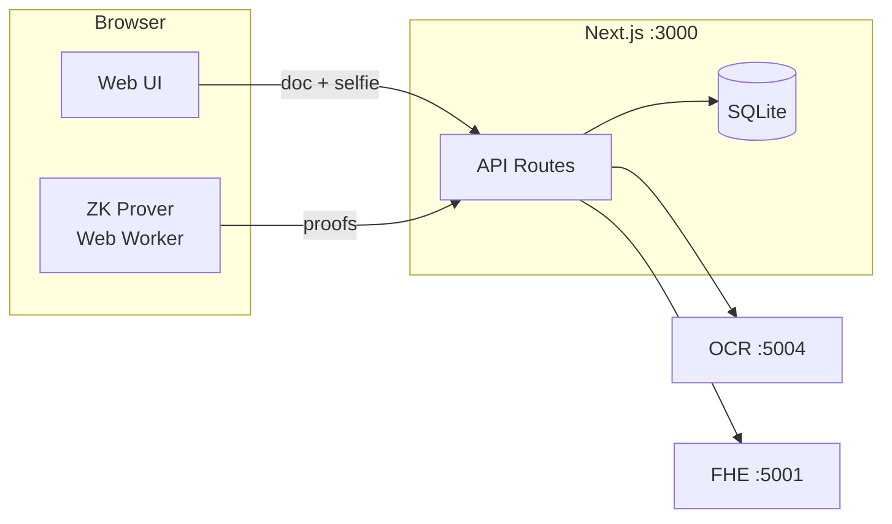

# Zentity

<p align="center">
  
</p>

<div align="center">

**Traditional KYC is a honeypot by design**

"Prove you're over 18" → stores your exact birthday<br>
"Prove your identity" → stores your passport photo<br>
"Prove you're real" → stores biometric templates

Every database is a breach waiting to happen. The model itself is broken.
**We're storing data we don't need to store.**

---

**Zentity** proves you can verify identity claims without storing the underlying data.
Built with zero-knowledge proofs, fully homomorphic encryption, and cryptographic commitments.

</div>

> [!CAUTION]
> This is a **PoC**. Breaking changes are expected and backward compatibility is not a goal.

## Contents

- [TL;DR (run + test)](#tldr-run--test)
- [Architecture (start here)](#architecture-start-here)
- [What's implemented (PoC)](#whats-implemented-poc)
- [Data handling (at a glance)](#data-handling-at-a-glance)
- [Background and use cases](#background-and-use-cases) *(collapsed)*
- [Cryptographic architecture](#cryptographic-architecture) *(collapsed)*
- [Technical reference](#technical-reference) *(collapsed)*
- [Documentation](#documentation)

## TL;DR (run + test)

```bash
# Set required secrets (do this once)
cp .env.example .env
# Generate a strong auth secret (required for production-mode containers)
openssl rand -base64 32
# Paste it into .env as BETTER_AUTH_SECRET

docker compose up --build
```

- Web UI: `http://localhost:3000`
- FHE service: `http://localhost:5001`
- OCR service: `http://localhost:5004`

Quick manual test (happy path):
- Go to `/sign-up` → complete the 4-step wizard (email → upload → liveness → complete)
- After completion, open `/dashboard` and check verification + proof status

## Architecture (start here)



> [!TIP]
> **Deep-dive documentation:**
> - [System Architecture](docs/architecture.md) — data flow, storage model, privacy guarantees
> - [ZK Circuits](docs/zk-architecture.md) — circuit specs, client/server proving
> - [Nationality Proofs](docs/zk-nationality-proofs.md) — Merkle trees, country groups
> - [Password Security](docs/password-security.md) — breached-password blocking + privacy-preserving UX pre-check
> - [RP Redirect Flow](docs/rp-redirect-flow.md) — OAuth-style RP handoff (clean URL + one-time code exchange)

## What’s Implemented (PoC)

- 4-step onboarding wizard (email → upload ID → liveness → complete)
- Client-side ZK proving (Web Worker) + server-side verification:
  - age proof (`age ≥ 18`, persisted)
  - doc validity, nationality membership, face-match threshold proofs (available as circuits/demos)
- Salted SHA256 commitments for dedup + later integrity checks (name, document number, nationality)
- FHE service integration (encrypt + compare on ciphertexts) for PoC policy checks
- Disclosure demo flow (RP-style verification of received proof payloads)
- OAuth-style RP redirect flow (clean URL + one-time authorization code exchange)

## Data Handling (at a glance)

The PoC stores a mix of auth data and cryptographic artifacts; it does **not** store raw ID images or selfies.

- Plaintext at rest: account email (authentication)
- Encrypted at rest: short-lived onboarding PII (wizard continuity), display-only first name
- Non-reversible at rest: salted commitments (SHA256)
- Proof/ciphertext at rest: ZK proof payloads + TFHE ciphertexts

Details: `docs/architecture.md`

<details id="background-and-use-cases">
<summary>Background and use cases</summary>

## Why Zentity Exists

### The Problem

Advanced cryptographic techniques—zero-knowledge proofs, fully homomorphic encryption, Merkle trees—have existed for decades. They solve real problems: proving claims without revealing data, computing on encrypted values, verifying set membership privately.

Yet these techniques are **rarely used in mainstream applications**.

Why? The barrier isn't mathematical—it's practical:
- Complex setup (trusted ceremonies, circuit compilation, key generation)
- Specialized expertise required
- No reference implementations for common use cases
- Perceived performance overhead

Meanwhile, identity verification systems store millions of passport photos, birth dates, and biometric templates in plaintext databases—creating honeypots for attackers and compliance nightmares for organizations.

### The Opportunity

KYC and identity verification is the perfect domain for privacy-preserving cryptography:
- **High-value PII**: Names, birthdates, document numbers, face images
- **Binary decisions**: "Is this person over 18?" doesn't require knowing their exact birthday
- **Regulatory pressure**: GDPR, data minimization laws demand "privacy by design"
- **Business alignment**: Companies *want* to verify without the liability of storing

### What This Project Demonstrates

Zentity proves these cryptographic techniques **can work together** in a real application:

| Technique | Traditional Barrier | Zentity Approach |
|-----------|---------------------|------------------|
| Zero-Knowledge Proofs | Complex circuit design | Pre-built circuits for age, nationality, document validity |
| Fully Homomorphic Encryption | Slow, requires expertise | TFHE-rs with optimized operations for KYC use cases |
| Cryptographic Commitments | Roll-your-own risk | Standardized SHA256 + salt with GDPR erasure support |
| Merkle Trees | Custom implementation | Ready-to-use country group trees (EU, EEA, SCHENGEN) |

The result: **complete identity verification with minimized plaintext storage** (no raw ID images/selfies stored; cryptographic artifacts persisted; authentication data stored as required).

> [!NOTE]
> Zentity is a demonstration project showing that privacy-preserving KYC is technically feasible today. It serves as a reference architecture for teams building production systems.

## What is Zentity?

Zentity is a privacy-preserving KYC platform that enables identity verification for banks, crypto exchanges, and fintechs—without storing or accessing sensitive personal information.

### Currently Available

- **Verify age** without revealing date of birth (ZK proofs + FHE)
- **Verify nationality group membership** without revealing country (ZK Merkle proofs)
- **Verify liveness** with multi-gesture challenges (smile, blink, head turns)
- **Verify liveness scores** without revealing biometric data (FHE threshold comparisons)
- **Match faces** to ID documents without storing biometrics (DeepFace/ArcFace)
- **Verify document validity** without exposing expiration date (ZK proofs)

### Planned Features

- **ZK Face Match Proofs** - Prove face similarity inside a ZK circuit
- **AML/Sanctions screening** - Privacy-preserving sanctions list checking
- **Accredited investor verification** - Prove income thresholds without revealing amounts
- **Source of funds verification** - ZK proofs for financial compliance

## Business Use Cases

### Privacy-Preserving Liveness Verification

Traditional liveness detection exposes exact anti-spoof confidence scores. Zentity encrypts liveness scores using FHE, enabling threshold comparisons without revealing the actual score:

```
User → Liveness Service: Submit face capture
Liveness Service → FHE: encrypt(score=0.85)
FHE → Storage: ciphertext (score hidden)
Verifier → FHE: verify(ciphertext >= 0.3)
FHE → Verifier: true/false (score never revealed)
```

**Benefits:**
- Prevents gaming the system by knowing exact thresholds
- Protects biometric scoring algorithms from reverse engineering
- Enables different threshold policies per use case

**Current POC implementation (Human.js):**
- Real-time challenges (smile + head turns) run in the browser for instant feedback.
- The client captures a baseline frame and one frame per challenge.
- Those frames are sent to the server via tRPC (`liveness.verify` on `/api/trpc/*`), where Next.js re-runs Human.js on Node to make the authoritative decision and return a face embedding.

> [!WARNING]
> **Limitations (non-production):**
> - Server-side re-scoring blocks simple UI tampering, but can't prove frames came from a live camera; replayed or edited frames can still be submitted.
> - Human's antispoof/liveness models are lightweight "quick checks" and not KYC‑grade on their own.
> - Model weights are bundled locally via `@vladmandic/human-models` and served from `/human-models/*`; first run may still be slow while models initialize, but no external download is needed.
> - Liveness sessions are stored in memory and reset on server restart.

### Nationality Group Membership

Proving citizenship often requires revealing exact nationality, which can lead to discrimination. Zentity's ZK Merkle proofs enable group membership verification:

```
User → Zentity: "Prove I'm EU citizen"
Zentity (browser) → Web Worker: Generate Merkle membership proof
Zentity → Verifier: proof + merkleRoot (EU identifier)
Verifier: Knows user is EU citizen, but NOT which of 27 countries
```

**Use Cases:**
- **EU Right to Work**: Verify employment authorization without revealing specific nationality
- **Schengen Travel**: Prove travel zone eligibility without passport country disclosure
- **Regional Compliance**: Meet LATAM or EEA requirements without over-sharing
- **Anti-Discrimination**: Prevent nationality-based bias in hiring/services

### Multi-Threshold Age Verification

Different jurisdictions require different age thresholds. The `age_verification` circuit supports a public `min_age` input (e.g. 18/21/25).

| Threshold | Use Case |
|-----------|----------|
| 18+ | General adult verification (EU, most jurisdictions) |
| 21+ | US alcohol/cannabis, car rental |
| 25+ | Premium car rental, certain financial products |

> [!NOTE]
> **Current PoC status:** The onboarding flow persists an `age ≥ 18` proof payload. Other thresholds can be generated/verified, but aren't fully wired into the default UI/storage flows yet.

</details>

<details id="cryptographic-architecture">
<summary>Cryptographic architecture</summary>

## Cryptographic Architecture

Zentity uses three complementary techniques:

| Technique | Purpose | Example |
|-----------|---------|---------|
| **Zero-Knowledge Proofs** | Prove claims without revealing data | "I'm over 18" without showing birthday |
| **FHE (TFHE-rs)** | Compute on encrypted data | Age comparison on ciphertext |
| **Commitments (SHA256)** | Bind data without storing it | Name hash for dedup |

**Why three techniques?** Each solves a specific problem:
- **ZK**: Prove boolean claims (age threshold, nationality group)
- **FHE**: Server-side arithmetic on encrypted values
- **Commitments**: Data binding + GDPR erasure (delete salt → unlinkable)

> [!NOTE]
> For detailed explanations, data flow diagrams, and storage model, see [docs/architecture.md](docs/architecture.md).

</details>

<details id="technical-reference">
<summary>Technical reference</summary>

## Technical Reference

| Service | Stack | Port |
|---------|-------|------|
| Web Frontend | Next.js 16, React 19, Noir.js, Human.js | 3000 |
| FHE Service | Rust, Axum, TFHE-rs | 5001 |
| OCR Service | Python, FastAPI, RapidOCR | 5004 |

**ZK Circuits:** `age_verification`, `doc_validity`, `nationality_membership`, `face_match`

> [!NOTE]
> For development commands and detailed architecture, see [CLAUDE.md](CLAUDE.md) and [docs/architecture.md](docs/architecture.md).

</details>

## Documentation

| Document | Description |
|----------|-------------|
| [System Architecture](docs/architecture.md) | End-to-end components + data flow + storage model |
| [ZK Proof Architecture](docs/zk-architecture.md) | Circuits + proving/verifying model |
| [ZK Nationality Proofs](docs/zk-nationality-proofs.md) | Merkle tree nationality verification |
| [API Collection](tooling/bruno-collection/README.md) | Bruno API testing collection |

## License

MIT

## Contributing

Contributions welcome! Please read the contributing guidelines before submitting PRs.
