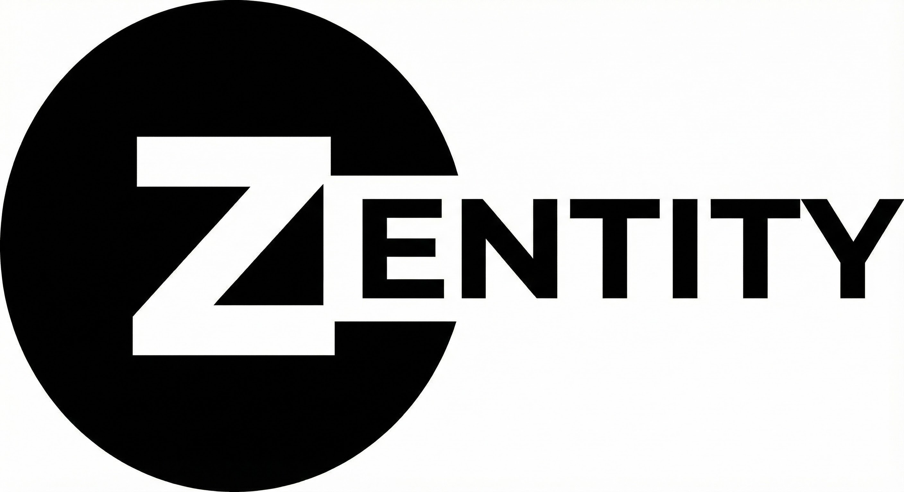
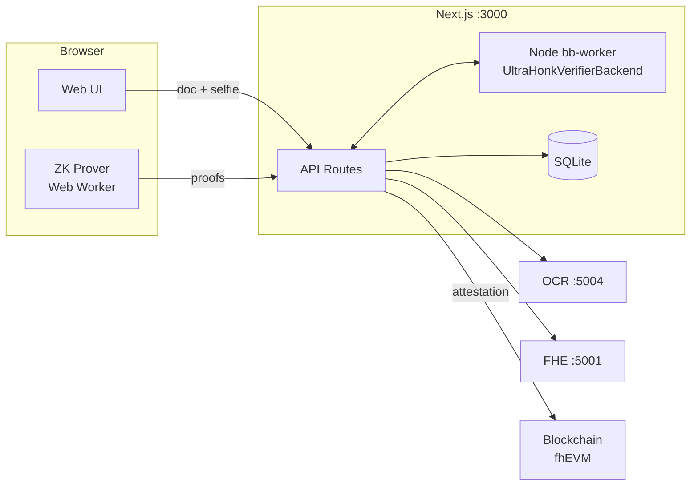

# Zentity

<p align="center">
  
</p>

<div align="center">

**A cryptographic verification layer that proves compliance without collecting the evidence.**

Verification and revelation are separable operations. A bank needs to know "eligible";
it does not need to store the passport. An exchange needs "permitted jurisdiction";
it does not need the country. A retailer needs "old enough"; it does not need the date of birth.

Zentity uses zero-knowledge proofs, fully homomorphic encryption, credential-wrapped
key custody, and cryptographic commitments to satisfy these requirements through
standard OAuth 2.1 and OpenID Connect, without storing plaintext personal data.

</div>

> [!CAUTION]
> **Pre-Audit Beta**
>
> Zentity's cryptographic architecture is implemented and functional. Independent
> security audit is pending.
>
> - **Breaking changes expected**: backward compatibility is not a goal
> - **Cryptographic validation in progress**: the ZK/FHE approach is being validated
> - **Not production-ready**: do not use with sensitive personal data
>
> Use this project for **evaluation and development integration**, not production deployments with real user data.

## Contents

- [Zentity](#zentity)
  - [Contents](#contents)
  - [Three audiences, one protocol](#three-audiences-one-protocol)
  - [Two integration paths](#two-integration-paths)
  - [What a relying party receives](#what-a-relying-party-receives)
  - [How the pieces connect](#how-the-pieces-connect)
  - [Key custody in plain English](#key-custody-in-plain-english)
  - [Tech choices and rationale](#tech-choices-and-rationale)
  - [Documentation map](#documentation-map)
  - [TL;DR run and test](#tldr-run-and-test)
  - [Architecture](#architecture)
  - [What's implemented](#whats-implemented)
  - [Scenarios](#scenarios)
  - [Data handling at a glance](#data-handling-at-a-glance)
  - [Services and ports](#services-and-ports)
  - [License](#license)
  - [Contributing](#contributing)

## Three audiences, one protocol

- **Users** prove facts (age, nationality, verification status) without revealing the data behind them.
- **Companies** verify compliance without collecting or storing identity documents.
- **Developers** integrate via standard OAuth 2.1 and OpenID Connect. No SDK, no custom protocol, no cryptography code.

## Two integration paths

**Full-stack verification:** For applications without existing identity verification. Zentity handles document OCR, liveness detection, face matching, proof generation, and credential delivery. The relying party integrates via OAuth 2.1.

**Proof layer:** The same cryptographic primitives work over externally-verified identity. When a trusted provider verifies identity, Zentity generates zero-knowledge proofs over those signed claims and delivers them via OIDC. The relying party receives proofs instead of raw identity data. The verification provider never learns which service requested the proof.

## What a relying party receives

The protocol distinguishes between **proof scopes** and **identity scopes**:

- `proof:age`, `proof:verification`, `proof:nationality`: boolean flags derived from ZK proofs. The relying party learns "eligible" without seeing the underlying data.
- `identity.name`, `identity.dob`: actual PII, delivered ephemerally via `id_token` only when regulation requires it, after explicit user consent and credential unlock.

Most integrations need only proof scopes.

## How the pieces connect

1. **Verification**:
   - Document capture and selfie/liveness flows run in the app.
   - OCR and liveness checks produce verified attributes and scores.
   - The server signs extracted measurements as tamper-evident claims.
2. **Encryption and storage**:
   - Sensitive attributes are encrypted before storage.
   - All three auth methods (passkey, OPAQUE password, wallet) derive KEKs to seal profiles and wrap FHE keys.
3. **Proof generation**:
   - ZK proofs are generated client-side over server-signed claims.
   - Proofs are verified server-side; private inputs never leave the browser.
4. **Delivery**:
   - Relying parties request privacy-preserving signals via standard OIDC scopes.
   - Raw attributes are never shared with integrators unless explicitly authorized.

## Key custody in plain English

- The browser encrypts sensitive data with a random **data key (DEK)**.
- That DEK is wrapped by a **key-encryption key (KEK)** derived client-side from the user's credential.
- The server stores only encrypted blobs and wrapped DEKs, so it **cannot decrypt** user data.
- When a user unlocks, the browser unwraps the DEK and decrypts locally.

## Tech choices and rationale

| Capability | Tech | Why | Deep dive |
| --- | --- | --- | --- |
| ZK proving and verification | Noir + Barretenberg (bb.js + bb-worker) | Modern DSL, efficient proving, browser-capable client proofs with server verification | [ZK Architecture](docs/zk-architecture.md), [ADR ZK](docs/adr/zk/0001-client-side-zk-proving.md) |
| Encrypted computation | TFHE-rs + fhEVM | Compute on encrypted attributes and support optional on-chain attestations | [Web3 Architecture](docs/web3-architecture.md), [ADR FHE](docs/adr/fhe/0001-fhevm-onchain-attestations.md) |
| Auth + key custody | Passkey PRF + OPAQUE + EIP-712 Wallet | Passwordless, password-based, or Web3-native auth with user-held keys for sealing profiles and wrapping FHE keys | [ADR Privacy](docs/adr/privacy/0001-passkey-first-auth-prf-custody.md), [ADR Privacy](docs/adr/privacy/0003-passkey-sealed-profile.md), [ADR Privacy](docs/adr/privacy/0010-opaque-password-auth.md) |
| Verifiable credentials | OIDC4VCI + OIDC4VP + SD-JWT + DCQL + JARM | Standards-based wallet interoperability with selective disclosure and encrypted responses | [SSI Architecture](docs/ssi-architecture.md), [RFC-0016](docs/rfcs/0016-oidc-vc-issuance-and-presentation.md) |
| HAIP compliance | DPoP, PAR, wallet attestation, DCQL, JARM, x5c | High Assurance Interoperability Profile for regulated wallet integrations (eIDAS 2.0 alignment) | [OAuth Integrations](docs/oauth-integrations.md) |
| Data integrity | SHA256 commitments + salts | Bind data without storing it and allow erasure by deleting salt | [Tamper Model](docs/tamper-model.md), [ADR Privacy](docs/adr/privacy/0005-hash-only-claims-and-audit-hashes.md) |
| Document extraction | OCR + liveness services | Extract structured attributes and validate liveness without storing raw media | [System Architecture](docs/architecture.md) |

## Documentation map

**Start here (recommended order)**:

1. [docs/architecture.md](docs/architecture.md) - system map and data flow
2. [docs/cryptographic-pillars.md](docs/cryptographic-pillars.md) - the four cryptographic primitives and why each is necessary
3. [docs/attestation-privacy-architecture.md](docs/attestation-privacy-architecture.md) - data classification and privacy boundaries
4. [docs/ssi-architecture.md](docs/ssi-architecture.md) - Self-Sovereign Identity and verifiable credentials
5. [docs/tamper-model.md](docs/tamper-model.md) - integrity controls and threat model

**Deep dives (pick what you need)**:

- [docs/zk-architecture.md](docs/zk-architecture.md) - Noir circuits and proof system
- [docs/zk-nationality-proofs.md](docs/zk-nationality-proofs.md) - Merkle membership proofs
- [docs/web3-architecture.md](docs/web3-architecture.md) - Web2-to-Web3 transition and on-chain flow
- [docs/blockchain-setup.md](docs/blockchain-setup.md) - fhEVM envs and deployment
- [docs/oauth-integrations.md](docs/oauth-integrations.md) - OAuth provider, client management, scopes, OIDC4VCI/VP
- [docs/password-security.md](docs/password-security.md) - OPAQUE password model and breach checks
- [docs/verification.md](docs/verification.md) - deployment verification
- [docs/adr/README.md](docs/adr/README.md) - decision records
- [tooling/bruno-collection/README.md](tooling/bruno-collection/README.md) - API collection

## TL;DR run and test

```bash
# Set required secrets (do this once)
cp .env.example .env
# Generate a strong auth secret (required for production-mode containers)
openssl rand -base64 32
# Paste it into .env as BETTER_AUTH_SECRET

# Generate OPAQUE server setup (required for password auth)
npx @serenity-kit/opaque@latest create-server-setup
# Paste it into .env as OPAQUE_SERVER_SETUP
# Optional (recommended for production): pin the OPAQUE public key for MITM protection
# npx @serenity-kit/opaque@latest get-server-public-key "<OPAQUE_SERVER_SETUP>"
# Paste it into .env as NEXT_PUBLIC_OPAQUE_SERVER_PUBLIC_KEY

# Optional: increase FHE request body limit if key registration fails
# Default is 64MB
# FHE_BODY_LIMIT_MB=64

docker compose up --build
```

<details>
<summary>Building individual services with Docker</summary>

The web service requires a secret for building (BuildKit secret mount):

```bash
# Generate a secret file (one-time setup)
openssl rand -base64 32 > ~/.zentity-auth-secret

# Build web service
docker build \
  --secret id=better_auth_secret,src=$HOME/.zentity-auth-secret \
  -t zentity-web apps/web

# FHE and OCR services don't require secrets
docker build -t zentity-fhe apps/fhe
docker build -t zentity-ocr apps/ocr
```

**Why?** Secrets are never baked into image layers. The build fails without the
secret to prevent running with insecure defaults.

</details>

- Web UI: `http://localhost:3000`
- FHE service: `http://localhost:5001`
- OCR service: `http://localhost:5004`

Optional observability:

```bash
OTEL_ENABLED=true
OTEL_EXPORTER_OTLP_ENDPOINT=http://localhost:4318/v1/traces
```

Quick manual test (happy path):

- Go to `/sign-up` and complete the onboarding wizard (email, upload ID, liveness, create account)
- After completion, open `/dashboard` and check verification and proof status

## Architecture


```mermaid
flowchart LR
  subgraph Browser
    UI[Web UI]
    W[ZK Prover<br/>Web Worker]
  end
  subgraph Server["Next.js :3000"]
    API[API Routes]
    BB[Node bb-worker<br/>UltraHonkVerifierBackend]
    DB[(SQLite)]
    API <--> BB
  end
  OCR[OCR :5004]
  FHE[FHE :5001]
  BC[Blockchain<br/>fhEVM]

  UI -->|doc + selfie| API
  API --> OCR
  API --> FHE
  W -->|proofs| API
  API --> DB
  API -->|attestation| BC
```

## What's implemented

- Onboarding wizard: email, upload ID, liveness, create account
- Server-side OCR/liveness/face match with signed claims for tamper resistance
- Client-side ZK proving (Web Worker) + server-side verification (Node bb-worker):
  - age, doc validity, nationality membership, face-match threshold proofs
- Multi-document identity model with document-scoped proofs and evidence packs
- Salted SHA256 commitments for dedup and integrity checks (name, document number, nationality)
- FHE key registration + encryption for birth_year_offset, country_code, compliance_level, liveness score
- Passkey-first auth with OPAQUE password and wallet (EIP-712) alternatives
- Credential-sealed profile secret for user-controlled PII (client decrypt only)
- Credential-wrapped FHE key storage (multi-device support; explicit user unlock required)
- Social recovery with guardian approvals (email + authenticator), backed by FROST signer services
- OAuth 2.1 provider flow (authorize, consent, token exchange)
- HAIP compliance: DPoP with server-managed nonce store, PAR (required), wallet attestation, pairwise subject identifiers
- OIDC4VCI credential issuance (SD-JWT VC, DPoP-bound tokens, deferred issuance, status list revocation)
- OIDC4VP credential presentation (DCQL queries, JARM encrypted responses, x509_hash client_id, KB-JWT holder binding)
- VeriPass demo verifier (4 OID4VP scenarios: border control, background check, age-restricted venue, financial KYC)
- MCP identity server with OAuth-authenticated tools (whoami, my_proofs, check_compliance, purchase, request_approval)
- Agent authorization via CIBA: AI agent initiates backchannel auth, user approves via push notification, agent receives identity data

## Scenarios

**Threshold proofs** (prove a value crosses a boundary without revealing it):

- **Age verification** without revealing date of birth
- **Nationality group membership** without revealing the exact country
- **Document validity** without sharing expiration dates

**Graduated trust** (disclosure depth scales with risk, not with onboarding):

- **Liveness checks** without exposing biometric scores
- **Step-up authentication** from basic login to document-verified identity via OAuth scopes

**Portable verification** (verify once, prove everywhere, correlate never):

- **Zero-knowledge SSO** with pairwise pseudonyms per relying party
- **SD-JWT credentials** issued via OIDC4VCI with selective disclosure
- **OID4VP wallet presentation** with DCQL queries, QR code deep links, and JARM-encrypted responses

## Data handling at a glance

The system stores a mix of auth data and cryptographic artifacts; it does **not** store raw ID images or selfies.

- Plaintext at rest: account email; document metadata (type, issuer country, document hash)
- Encrypted at rest: credential-sealed profile (full name, DOB, document number, nationality), credential-wrapped FHE key blobs
- Non-reversible at rest: salted commitments (SHA256)
- Proof/ciphertext at rest: ZK proofs, TFHE ciphertexts, signed claim hashes, evidence pack hashes, proof metadata (noir/bb versions + vkey hashes)
- On-chain (optional): encrypted identity attestation via fhEVM; registrar encrypts, only user can decrypt

**User-controlled privacy:** The credential vault derives encryption keys using
WebAuthn PRF, OPAQUE export keys, or wallet signatures via HKDF. These keys seal the profile and wrap FHE keys, so the
server never holds a decryption secret. FHE keys are generated in the browser
and stored server-side as credential-wrapped encrypted secrets with per-credential
wrappers. The server registers only public + server keys (evaluation keys) for
computation and cannot decrypt user data. Only the user can decrypt their own
encrypted attributes after an explicit credential unlock.

Details: [docs/architecture.md](docs/architecture.md) |
[docs/attestation-privacy-architecture.md](docs/attestation-privacy-architecture.md)

## Services and ports

| Service | Stack | Port |
| --- | --- | --- |
| Web Frontend | Next.js 16, React 19, Noir.js, bb.js, Human.js | 3000 |
| FHE Service | Rust, Axum, TFHE-rs | 5001 |
| OCR Service | Python, FastAPI, RapidOCR | 5004 |
| Signer Coordinator | Rust (Actix), FROST coordinator | 5002 |
| Signer Services | Rust (Actix), FROST signers | 5101+ |
| MCP Server | Node.js, Hono, @modelcontextprotocol/sdk | 3300 (HTTP) / stdio |

## License

This project is licensed under the [O'Saasy License](LICENSE)
([osaasy.dev](https://osaasy.dev/)) - a permissive source-available license
based on MIT.

**You may:** use, copy, modify, distribute, sublicense, and sell the software.

**Restriction:** You may not offer this software (or derivatives) as a
competing hosted SaaS/cloud service where the primary value is the
functionality of the software itself.

See the [LICENSE](LICENSE) file for full terms.

## Contributing

Contributions welcome! Please read the contributing guidelines before submitting PRs.
