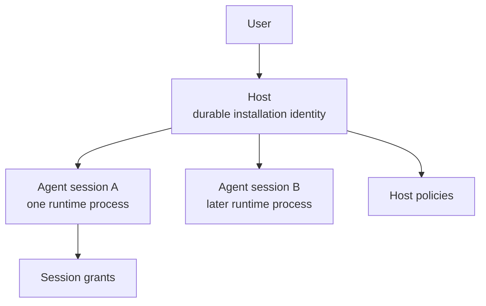
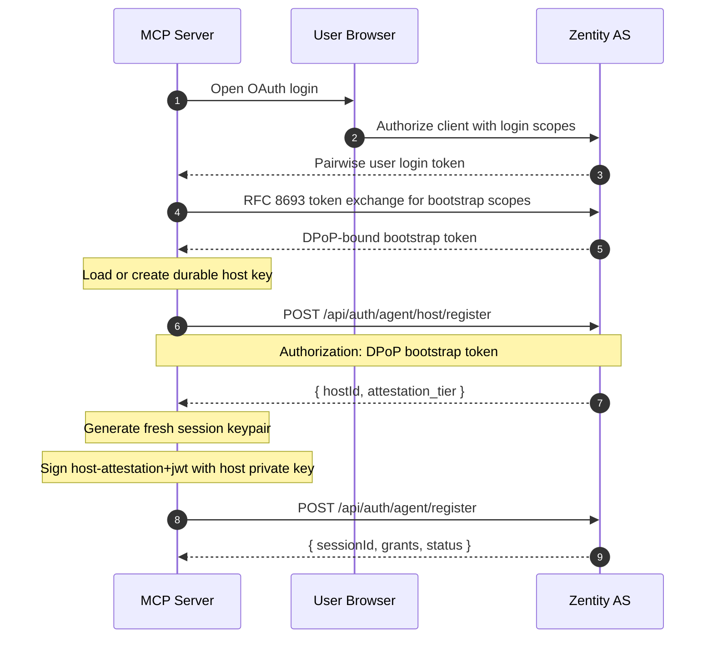
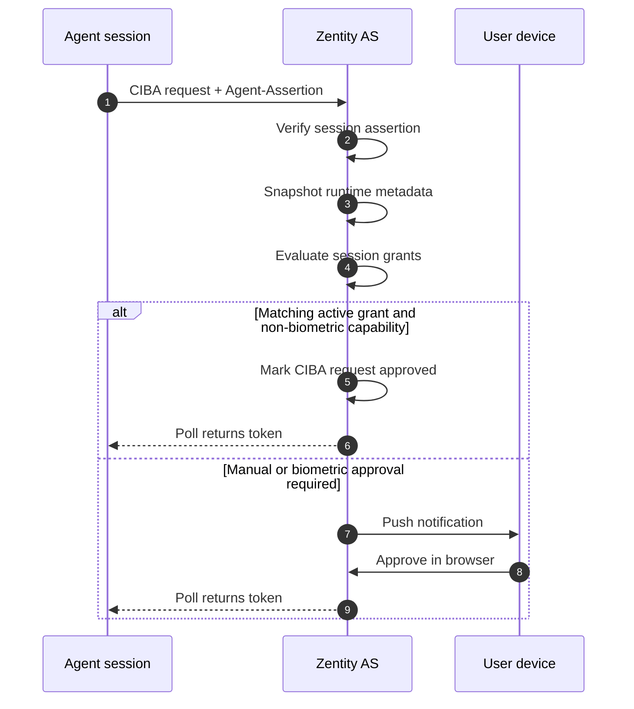
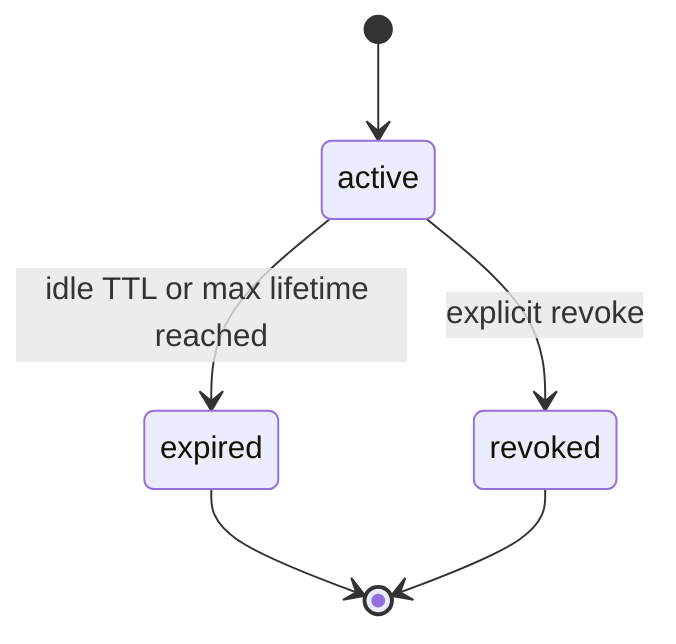
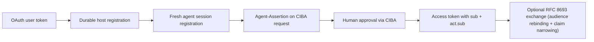
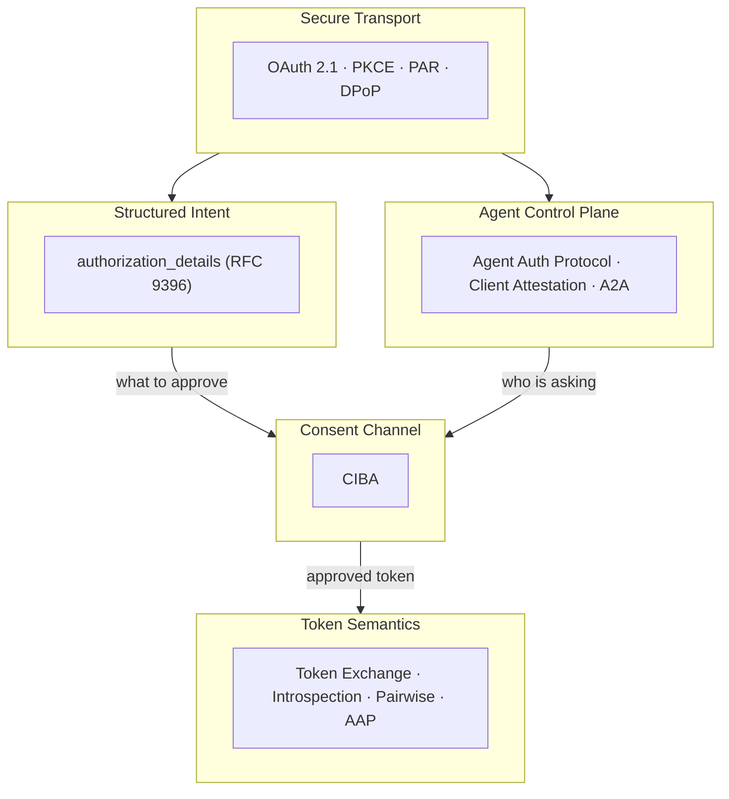

Zentity's agent architecture separates durable host identity from ephemeral session state so that agents can act on behalf of humans without accumulating long-term PII or globally trackable identifiers. This document maps the principal hierarchy, capability containment, approval routing, and token anatomy from registration through delegation, with the trust tier (unverified vs. attested) as the axis of variation.

---

## Principal Boundaries

The first structural question is not "what can the agent do?" It is "who is calling?" Zentity splits browser sessions, user-bound OAuth tokens, and machine tokens into distinct principal types, then builds the agent features on top of that split.

Zentity uses three distinct caller classes:

| Caller | How it authenticates | Where it belongs |
| --- | --- | --- |
| Browser user | Better Auth session cookie | Dashboard and browser-only surfaces |
| User-delegated machine | OAuth access token exchanged into a dedicated DPoP-bound bootstrap token | Agent host and session registration, session revoke |
| Pure machine client | `client_credentials` access token | Introspection and resource-server style machine APIs |

This split is enforced in the web app by explicit helpers:

- `requireBrowserSession()` for browser-only routes
- `requireUserAccessToken()` for user-bound OAuth callers
- `requireClientCredentials()` for machine-only callers

That separation matters because the agent protocol is machine-facing even when a human is still in the loop. Registration, introspection, and token exchange are all OAuth surfaces. The human approval step happens later, through CIBA.

The model is:

- **Browsers** are for user interaction.
- **OAuth user tokens** are for delegated machine setup.
- **Machine tokens** are for protocol operations between services.

Once those boundaries are fixed, the rest of the architecture can be built around stable identities instead of accidental session state.

---

## Host and Session Hierarchy

Agent identity in Zentity clusters into two layers because two different lifetimes need two different keys. The installation needs continuity across runs. The live runtime needs a fresh, auditable identity for each process. The implementation therefore uses a durable host plus an ephemeral agent session.

### Durable host

A host is the long-lived installation identity for an MCP server or similar agent runtime. In the MCP client, the host key is an Ed25519 keypair persisted under a namespace derived from `{zentityUrl, clientId, accountSub}`:

```text
~/.zentity/hosts/<sha256(zentityUrl:clientId:accountSub)>.json
```

On the server side, hosts are stored in `agent_host` with:

- `user_id`
- `client_id`
- `public_key`
- `public_key_thumbprint`
- `name`
- attestation metadata
- status

The uniqueness boundary is the host key thumbprint, not `(user_id, client_id)`. That means one user and one OAuth client can legitimately have multiple hosts, such as separate laptops, containers, or installations. A host key cannot be rebound across users or OAuth clients.

### Ephemeral agent session

An agent session is the runtime identity for one live process. Each session gets its own Ed25519 keypair. The MCP keeps the private key in memory and registers the public key with Zentity. On the server side, sessions live in `agent_session` with:

- `host_id`
- `public_key`
- `public_key_thumbprint`
- `display_name`
- `runtime`
- `model`
- `version`
- `idle_ttl_sec`
- `max_lifetime_sec`
- `last_seen_at`
- status

The public server model is therefore:



### Registration sequence

Registration happens in two steps because the two identities prove different things.

1. The MCP authenticates via OAuth and receives a pairwise user login token.
2. The MCP exchanges that login token via RFC 8693 for a short-lived DPoP-bound bootstrap token carrying `agent:host.register`, `agent:session.register`, and `agent:session.revoke`.
3. The MCP ensures its durable host exists by calling `POST /api/auth/agent/host/register` with the bootstrap token.
4. The MCP signs a short-lived host JWT proving possession of the host private key.
5. The MCP starts a fresh process keypair and calls `POST /api/auth/agent/register` with the bootstrap token.
6. Zentity creates a new `agent_session`, seeds default grants from host policy, and records any requested extra capabilities as pending grants.



This host/session split answers the core lifecycle question up front: continuity belongs to the host, not to the runtime process.
The bootstrap token is intentionally narrow and short-lived; it exists only to authorize host/session bootstrap and revocation, not to replace the login token everywhere else.

---

## Trust Tiers

The trust model clusters around what Zentity can verify about the installation itself. The operational model exposes two effective tiers and reserves a third label in type space for future expansion.

| Tier | How it is reached | What it means today |
| --- | --- | --- |
| `unverified` | Default host registration | No external attestation was verified |
| `attested` | Valid `OAuth-Client-Attestation` plus PoP JWT | Host metadata was verified against a trusted attester JWKS |
| `self-declared` | Not used by the current registration flow | Reserved in verification types, not an active host tier today |

### Attested hosts

Host registration optionally accepts:

- `OAuth-Client-Attestation`
- `OAuth-Client-Attestation-PoP`

If those headers are present, Zentity verifies them against the trusted attesters configured in `TRUSTED_AGENT_ATTESTERS`. Verification uses the hardened JWKS fetcher, which rejects unsafe remote key sources before the JWT is even evaluated.

An attested host receives:

- `attestation_provider`
- `attestation_tier = "attested"`
- `attestation_verified_at`

Attestation is not the same thing as runtime proof. Vendor attestation says something about the installation or vendor lineage. Runtime proof comes later from the session key through `Agent-Assertion`.

### What attestation changes

Attestation does not widen the silent-approval set for identity-disclosing capabilities. Unverified hosts receive default durable policies for:

- `check_compliance`
- `request_approval`

`purchase` is not auto-granted because it requires biometric approval strength and therefore always routes through explicit human approval.

This keeps the trust model practical rather than ceremonial. Verification changes how the runtime is presented and audited without bypassing vault unlock or other explicit approval boundaries.

---

## Capability Containment

The capability system exists to answer one narrow question repeatedly: "Can this exact session do this exact kind of action without interrupting the user again?" It is not a general policy engine. It is the containment layer that decides when CIBA can short-circuit into an approval result and when human interaction is still required.

### Seeded capabilities

Zentity seeds four capabilities:

| Capability | Approval strength | Default host policy |
| --- | --- | --- |
| `purchase` | `biometric` | No |
| `read_profile` | `session` | No |
| `check_compliance` | `none` | Yes |
| `request_approval` | `session` | Yes |

The authoritative metadata lives in `agent_capability`, including optional input and output schemas plus the approval strength.

### Durable host policy vs session grant

The policy model is split for the same reason identity is split: durable defaults and per-runtime elevation are different things.

`agent_host_policy` is durable and host-scoped:

- survives across sessions
- can be seeded by defaults or attestation
- can carry constraints and rate limits

`agent_session_grant` is ephemeral and session-scoped:

- belongs to one live session
- may be copied from host policy
- may be created as pending elevation for requested capabilities
- carries statuses such as `pending`, `active`, `denied`, and `revoked`

At session registration, Zentity:

1. ensures the capabilities table is seeded
2. ensures default host policies exist for the host
3. copies active host policies into active session grants
4. creates pending session grants for requested capabilities outside the defaults

### Constraint matching

Capability matching is intentionally narrow. The current evaluator supports:

- `eq`
- `in`
- `max`
- `min`
- `not_in`

Within one grant, all constraints must pass. Across multiple grants for the same capability, any matching active grant is enough.

For purchase-like requests, the evaluator extracts action parameters from `authorization_details`, including:

- `amount.value`
- `amount.currency`
- `merchant`
- `item`

### Usage limits

Containment is not only about shape matching. It is also about repetition. The usage ledger therefore records executions against the narrowest applicable scope:

- host policy if the grant came from durable host policy
- session grant if the permission is session-specific
- session fallback if neither exists

Each grant can carry:

- `daily_limit_count`
- `daily_limit_amount`
- `cooldown_sec`

The ledger is append-only and used as the enforcement source for cooldown and daily cap checks.

### What auto-approval can never do

The evaluator refuses automatic approval in these cases:

- any request containing identity scopes
- any request whose derived capability is missing
- any capability whose approval strength is `biometric`
- any request without an active matching grant
- any request that exceeds cooldown or daily limits

That refusal is as important as the happy path. Containment works because the "no" cases are crisp.

---

## Approval Routing

Approval flows are organized by risk rather than transport. CIBA carries the human consent step. Session grant evaluation determines whether the request still needs human interaction.

### Three routing outcomes

The approval router produces three practical outcomes:

| Outcome | When it happens | Human interruption |
| --- | --- | --- |
| Silent approval | Matching active grant and non-biometric capability | None |
| Push approval | No matching grant, identity scope present, or manual approval required | Push notification and approval page |
| Biometric approval | Capability strength is `biometric` | Always push and explicit approval |

### Runtime proof enters here

The MCP sends `Agent-Assertion` on CIBA requests. That assertion is a short-lived EdDSA JWT signed by the session private key. It contains:

- `iss = <sessionId>`
- `jti`
- `iat`
- `exp`
- `host_id`
- `task_id`
- `task_hash`

When Zentity receives a valid assertion, it snapshots server-owned runtime metadata onto the CIBA request:

- `agent_session_id`
- `host_id`
- `display_name`
- `runtime`
- `model`
- `task_id`
- `task_hash`
- `assertion_verified`
- `pairwise_act_sub`

That snapshot is what ties the later token to the actual registered runtime, not a free-form claim supplied by the client at approval time.

### The two main approval paths



### Purchase vs profile reads

The difference between profile reads and purchases is structural rather than cosmetic:

- `read_profile` always remains an explicit approval because identity scopes require vault unlock in a full browser context.
- `purchase` cannot because its approval strength is `biometric`.

That means both profile disclosure and purchase execution stay on the human approval boundary, with purchase additionally requiring biometric-grade verification.

---

## Lifecycle Boundaries

Lifecycle rules exist to answer when a runtime stops being trustworthy even if its keys still exist. Session lifetime is short and explicit, and continuity belongs to the durable host.

### Two clocks

Each session has two clocks:

- idle TTL: `idle_ttl_sec`, default `1800` seconds, or 30 minutes
- max lifetime: `max_lifetime_sec`, default `86400` seconds, or 24 hours

The server evaluates both against:

- `last_seen_at`
- `created_at`

### Terminal states

The lifecycle state machine is intentionally small:



There is no reactivation path. If a session expires, the MCP creates a new session under the same host.

### How expiry is applied

Session expiry is computed and applied together. `computeSessionState(sessionId)`:

1. loads the session row
2. checks revoked status
3. compares `now` against idle and lifetime deadlines
4. updates the row to `expired` if either deadline passed

Expiry is not only inferred at read time. It is persisted once observed.

`touchSessionActivity(sessionId)` updates `last_seen_at` after successful authenticated operations. In practice, the session boundary is renewed by successful use, not by mere existence.

### User-visible consequence

For MCP users, the lifecycle rule is simple:

- host identity survives
- session identity does not

A long-lived installation can therefore feel continuous while each runtime still has a short, auditable security envelope.

---

## Token Anatomy

The Agent Auth Protocol authenticates and manages the runtime. The delegated OAuth token is shaped by the AAP claim profile together with standard OAuth fields such as `sub`, `act`, `authorization_details`, and `cnf`.

### CIBA access token

After approval, the agent receives a CIBA access token that identifies both the human subject and the acting agent session.

```json
{
  "iss": "https://app.zentity.xyz/api/auth",
  "aud": "rp_client_id",
  "sub": "user_pairwise_sub_for_rp",
  "act": {
    "sub": "agent_pairwise_sub_for_rp"
  },
  "agent": {
    "id": "agent_pairwise_sub_for_rp",
    "type": "mcp-agent",
    "model": {
      "id": "gpt-4",
      "version": "1.0.0"
    },
    "runtime": {
      "environment": "node",
      "attested": true
    }
  },
  "task": {
    "id": "task-123",
    "purpose": "purchase"
  },
  "capabilities": [
    {
      "action": "purchase",
      "constraints": [
        {
          "field": "merchant",
          "op": "eq",
          "value": "Acme"
        }
      ]
    }
  ],
  "oversight": {
    "approval_reference": "grant-123",
    "requires_human_approval_for": ["purchase"]
  },
  "audit": {
    "trace_id": "auth_req_id",
    "session_id": "agent_pairwise_sub_for_rp"
  },
  "scope": "openid identity.name identity.address",
  "authorization_details": [
    {
      "type": "purchase",
      "merchant": "Acme",
      "item": "Widget",
      "amount": {
        "value": "29.99",
        "currency": "USD"
      }
    }
  ],
  "cnf": {
    "jkt": "dpop_key_thumbprint"
  },
  "exp": 1760000000,
  "iat": 1759996400
}
```

Key points:

- `sub` identifies the human for the target client.
- `act.sub` and `agent.id` identify the acting session for the target client.
- `agent`, `task`, `capabilities`, `oversight`, and `audit` are the AAP-profiled token sections.
- `authorization_details` preserves what was approved.
- `cnf.jkt` sender-constrains the token when DPoP is in play.

### Claim narrowing on token exchange

RFC 8693 token exchange has a single output in the agent flow: a downstream access token re-bound to the target audience. Whether the audience is another agent runtime or a non-agent relying party (a merchant, a facilitator, an API) is reflected in which claims survive the exchange, not in which token type is issued.

When the target audience is itself an agent runtime, the exchanged token retains the full AAP profile (`agent`, `task`, `capabilities`, `oversight`, `audit`) and adds `delegation` to project the chain. When the target audience is a non-agent relying party, those agent control-plane claims are dropped: the exchanged token carries only pairwise `sub`, pairwise `act.sub`, the approved `authorization_details`, and `cnf.jkt`.

```json
{
  "iss": "https://app.zentity.xyz/api/auth",
  "aud": "merchant_client_id",
  "sub": "user_pairwise_sub_for_merchant",
  "act": {
    "sub": "agent_pairwise_sub_for_merchant"
  },
  "authorization_details": [
    {
      "type": "purchase",
      "merchant": "Acme",
      "item": "Widget",
      "amount": {
        "value": "29.99",
        "currency": "USD"
      }
    }
  ],
  "cnf": {
    "jkt": "dpop_key_thumbprint"
  },
  "iat": 1759996400,
  "exp": 1760000000
}
```

The token response uses the standard RFC 8693 access-token form:

```json
{
  "access_token": "<token>",
  "issued_token_type": "urn:ietf:params:oauth:token-type:access_token",
  "token_type": "Bearer",
  "expires_in": 3600
}
```

The exchange is also the privilege-reduction step: scopes and `authorization_details` are a subset of the subject token's, lifetime is capped by the subject token's remaining lifetime, and `cnf.jkt` is rebound to the caller's DPoP proof.

### Host and runtime proofs

The web-facing registration flow uses two small JWT types:

- `host-attestation+jwt` for session registration bootstrap
- `agent-assertion+jwt` for runtime proof on CIBA requests

Neither is a substitute for OAuth access tokens. They are proof artifacts layered around the OAuth flow.

---

## Pairwise Agent Identifiers

Pairwise privacy matters because the same agent installation may interact with multiple relying parties. Without a pairwise layer, every RP could correlate the same runtime or host across ecosystems. Zentity avoids that by deriving actor identifiers per client configuration.

### Current derivation rule

Agent pairwise identifiers are derived from:

- the `agent_session.id`
- the target client's sector identifier
- the shared `PAIRWISE_SECRET`

The server uses the same sector-identifier logic as human pairwise subject derivation. In the current deployment that sector is derived from the first registered `redirect_uri` host because registrations are constrained to a single host until `sector_identifier_uri` support exists.

Actor publicity is controlled independently from the human `sub`. Client metadata may set `agent_subject_type` to `public` or `pairwise`; when absent, the actor layer defaults to pairwise identifiers. Using a dedicated `agent_subject_type` avoids coupling where making `act.sub` public also makes the human `sub` public. When the effective agent subject type is `public`, the actor identifier falls back to the raw session ID. Otherwise it becomes a pairwise pseudonym derived from the session ID and the client's sector.

That gives the actor layer the same privacy model as the user layer without forcing both layers to share the same publicity setting:

- `agent_subject_type: "public"` opts the actor layer into stable identifiers
- `agent_subject_type: "pairwise"` yields RP-scoped pseudonyms even if the user `sub` is public

### Why session IDs are used

The derivation starts from the session ID rather than the host ID because the runtime session is the acting principal. A relying party should learn "which runtime acted for this user in this context," not "which installation owns all future sessions."

### Where pairwise actor IDs appear

Current pairwise actor identifiers appear in:

- `agent.id` and `act.sub` inside access tokens
- `act.sub` inside tokens issued by token exchange to non-agent audiences
- the introspection response AAP `agent.id` for the calling machine client
- the CIBA request snapshot stored on the server

This makes actor privacy a transport-wide property rather than a UI-only convention.

---

## Binding Chains

The system hangs together because each phase produces evidence the next phase can reuse. These bindings are not separate features. They are the chain that lets a relying party infer a real delegation story from a set of otherwise normal OAuth messages.

### Session binding

The MCP authenticates with a user-bound OAuth access token, typically sender-constrained through DPoP. That binds the delegated setup work to the caller's proof-of-possession key.

### Host binding

Host registration binds a durable Ed25519 public key to:

- one user
- one OAuth client
- one installation thumbprint

The signed `host-attestation+jwt` used during session registration proves that the caller still possesses the durable host private key.

### Runtime binding

Session registration binds a fresh Ed25519 public key to:

- one host
- one runtime process
- one display metadata snapshot

Later, `Agent-Assertion` proves possession of that runtime key on each CIBA request.

### Consent binding

CIBA binds human approval to:

- one `auth_req_id`
- one binding message
- one scope set
- one optional `authorization_details` payload

If the runtime proof is present and valid, the server snapshots runtime metadata into the CIBA request before the approval result is finalized.

### Disclosure binding

Identity release is still kept off the token path. If identity scopes are approved, PII is staged ephemerally and later redeemed through userinfo. That keeps long-lived JWTs free of identity payloads while preserving the consent record that authorized disclosure.

### Delegation binding

The delegated access token carries:

- `sub` for the human principal
- `act.sub` for the acting agent session
- AAP `agent`, `task`, `capabilities`, `oversight`, and `audit`

Tokens issued by token exchange to a non-agent audience carry pairwise `sub`, pairwise `act.sub`, the approved `authorization_details`, and `cnf.jkt`, all rebound for the target audience.

The full binding chain is:



Each step narrows who can continue the flow. The architecture remains OAuth-native while keeping the human and the agent as separate principals.

---

## Discovery and Introspection

Discovery matters because this system is meant to be integrated by machines. A resource server or agent runtime should be able to discover the protocol surface without reverse-engineering route files.

### Agent configuration document

`GET /.well-known/agent-configuration` is the Agent Auth Protocol discovery document. Zentity publishes it at the standard well-known location and includes the server-specific endpoints and features exposed by this deployment.

The document publishes:

- `registration_endpoint`
- `host_registration_endpoint`
- `capabilities_endpoint`
- `introspection_endpoint`
- `revocation_endpoint`
- `jwks_uri`
- `supported_algorithms`
- `approval_methods`
- `supported_features`

The bootstrap contract implied by the document is narrow: the client first exchanges its login token for a dedicated DPoP-bound bootstrap token, then uses that token for host/session registration and revocation. The raw login token is not the bootstrap credential.

The current feature document advertises:

```json
{
  "task_attestation": true,
  "pairwise_agents": true,
  "risk_graduated_approval": true,
  "capability_constraints": true,
  "delegation_chains": false
}
```

The document does not claim general delegation-chain support.

### Capability discovery

`GET /api/auth/agent/capabilities` returns the current capability catalog with:

- name
- description
- input schema
- output schema
- approval strength

This lets an external runtime discover what kinds of actions Zentity knows how to route and what approval strength each one implies.

### Introspection

`POST /api/auth/agent/introspect` is the Agent Auth introspection surface for this deployment. It is machine-facing and requires a `client_credentials` token with `agent:introspect`.

The route:

1. authenticates the caller as a machine client
2. verifies the presented Zentity access token
3. resolves the acting session from server-owned token snapshot metadata
4. computes current lifecycle state
5. returns the AAP token profile for the introspecting client plus Zentity lifecycle metadata

The response includes:

- `active`
- caller-projected `sub` when the server can safely project the user identifier for the introspecting client
- top-level `agent`, `task`, `capabilities`, `oversight`, `audit`
- `delegation` when present on exchanged tokens
- `zentity.attestation`
- `zentity.lifecycle`

A relying party can ask whether an agent session is still active without learning raw internal host identifiers or another client's pairwise subject identifier.

### Agent JWKS

`GET /api/auth/agent/jwks` publishes the signing keys used for agent-facing JWT verification. The discovery document points here, not to a separate experimental path. This is the key material a client needs for validating signed agent-facing JWTs and tokens issued by token exchange.

### A2A discovery

`GET /.well-known/agent-card.json` publishes an A2A agent card with an `agent-auth` security scheme pointing back to the agent configuration document. That makes the ecosystem story machine-readable at both the protocol and capability layers.

---

## MCP Workflow

The implementation is easiest to understand when traced from the MCP server outward, because the MCP is the concrete runtime this architecture is shaping today.

### Startup

On startup, the stdio transport:

1. runs OAuth authentication
2. stores OAuth state separately from runtime identity
3. ensures the durable host is registered
4. registers a fresh agent session for the current process
5. stores runtime state in the `agentRuntimeStateStore`

Access-token refresh does not destroy runtime identity. The OAuth session can rotate while the live session key and session ID remain stable for that process.

### Long-lived operation

During a long stdio run:

- OAuth tokens refresh on a timer
- runtime state stays intact
- tools use the current OAuth state plus the current runtime state

That keeps token refresh from dropping the registered agent identity mid-session.

### Sensitive tool execution

When a tool needs user approval:

1. the MCP builds a binding message
2. it signs an `Agent-Assertion`
3. it starts a CIBA request
4. it polls until approval, denial, or timeout

When the tool needs the delegated token rebound to a non-agent relying party (a merchant, facilitator, or RP API), the downstream client can exchange the CIBA access token through RFC 8693 token exchange. The exchange rebinds the audience and narrows the claim set: agent control-plane sections are dropped, leaving only pairwise `sub`, pairwise `act.sub`, the approved `authorization_details`, and `cnf.jkt`.

### Session expiry

If the session expires or is revoked:

- the host stays valid
- the process needs a fresh session registration

That is a cleaner operational rule for MCP operators than hidden reactivation logic. The runtime either has a live session or it does not.

### MCP operating rules

The MCP model is built around four operating rules:

1. browser sessions do not authenticate machine protocol routes
2. host continuity and runtime continuity are separate concepts
3. free-form `agent_claims` are gone from the core CIBA path
4. downstream RP-bound tokens are issued through token exchange, not standalone POST routes

Those rules keep the MCP flow mostly ordinary OAuth while keeping the custom runtime layer small and explicit.

---

## Protocol Architecture

The introduction to this document identifies three moving parts: the caller authenticates as a machine, the human approves sensitive actions, and the relying party learns who acted without getting a globally trackable identifier. Each maps to a distinct architectural concern, and two infrastructure concerns support them. Together, the thirteen specifications in the agent flow cluster into five concerns that form a chain: secure transport protects the channel, structured intent defines the shape of what travels over it, the agent control plane identifies who is sending, the consent channel decides whether the human approves, and token semantics delivers the result to the right downstream party with privacy-preserving identifiers.



### Secure transport

OAuth 2.1, PKCE (RFC 7636), PAR (RFC 9126), and DPoP (RFC 9449) form the transport layer. Zentity would use all four without agents; they are prerequisites for any modern OAuth deployment, not agent-specific architecture.

Removing any one of these specs does not change the agent model, only the security properties of the channel. PKCE prevents authorization code interception, PAR moves authorization parameters from the front channel to the back channel, and DPoP sender-constrains tokens so a stolen token is useless without the holder's proof-of-possession key.

DPoP is the one transport spec that crosses into agent territory. When token exchange mints a downstream token from a CIBA access token, DPoP re-binds the issued token to the caller's key. The security property is transport-level, but its effect is agent containment: even a leaked exchanged token is useless without the caller's proof-of-possession key.

### Structured intent

Transport secures the channel; the next question is what travels over that channel when an agent requests approval. Rich Authorization Details (RFC 9396) solves a problem that scopes cannot: carrying the shape of what was approved. A scope string like `purchase` conveys nothing about the merchant, the item, or the amount. RAR's `authorization_details` carries typed, structured payloads that travel through the entire flow without transformation.

The capability constraint system depends on this structure directly. Grant evaluation extracts `amount.value`, `amount.currency`, `merchant`, and `item` from the RAR payload and matches them against grant constraints using operators like `max`, `min`, `in`, and `not_in`. Without RAR, the system would need a custom parameter format that would reinvent the same typed-array-of-detail-objects design.

RAR also shapes how capabilities are recognized: the `type` field of each detail object maps to a capability name, which prevents the capability system from becoming an unstructured bag of custom fields.

### Agent control plane

RAR defines the shape of what needs approval; the control plane defines who is asking for it. The Agent Auth Protocol (v1.0-draft) covers discovery, host registration, session registration, capability grants, and lifecycle management, which are the subjects of sections 2 through 6 and section 10 of this document.

The control plane does not define token claims, consent flows, or token exchange. What it produces is two things: the `Agent-Assertion` JWT that enters the consent channel as runtime proof, and the capability grants that determine whether the consent channel can short-circuit into an automatic approval. That boundary is deliberate; the control plane establishes identity and trust, then hands off to other concerns for consent and token shaping.

Two orthogonal capabilities attach to the control plane without creating new protocol surfaces. OAuth Client Attestation (draft-ietf-oauth-attestation-based-client-auth-08) answers whether the agent software is genuine by letting a vendor attest that the installation is authentic. No other spec in the stack addresses software provenance. Attestation changes runtime trust presentation rather than creating a separate token class or silently widening identity-disclosure defaults.

The A2A agent card (`/.well-known/agent-card.json`) publishes capabilities and security schemes for agent-to-agent discovery. It overlaps slightly with the Agent Auth Protocol's `/.well-known/agent-configuration`, but they serve different consumers: the protocol discovery document targets authorization servers and OAuth clients, while the A2A card targets inter-agent communication.

### Consent channel

The control plane establishes agent identity and trust; the consent channel uses both to decide whether the human needs to be involved. CIBA (Client-Initiated Backchannel Authentication) answers the one question no other spec can: how does a machine ask a human for permission when the human is not at the same screen? CIBA was originally designed for IoT devices, point-of-sale terminals, and call centers. In the agent context, it becomes the consent bridge between autonomous agents and human oversight.

CIBA is where the control plane and structured intent converge. The `sendNotification` callback receives the CIBA request, verifies the `Agent-Assertion` from the control plane, reads the `authorization_details` from the structured intent layer, and evaluates capability grants to produce the three routing outcomes described in [Approval Routing](#approval-routing): silent approval, push approval, or biometric approval.

The runtime proof is bound to a specific consent request rather than floating as a general authentication mechanism, which means the CIBA `auth_req_id` becomes the trace ID that correlates agent identity, consent, and token issuance across the entire flow. This binding makes CIBA the architectural linchpin rather than a replaceable transport; removing it means inventing a custom push-and-poll mechanism with its own request lifecycle, polling semantics, and token binding.

### Token semantics

Once consent is obtained, the question shifts from "does the human approve?" to "how does the approved action reach the right party with the right identifiers?" Four specs shape the answer.

**Token exchange** (RFC 8693) rebinds the CIBA access token for a different audience. Without it, the agent would present the same token to every relying party, leaking cross-party correlation. Token exchange performs scope attenuation (narrowing what the downstream RP can see), audience rebinding (recomputing pairwise identifiers for the target client), and claim narrowing (dropping agent control-plane claims when issuing for non-agent audiences, leaving `sub`, `act.sub`, the approved `authorization_details`, and `cnf.jkt`). The current deployment does not advertise general delegation-chain support, so multi-hop chain portability is not part of the published contract.

Token exchange also issues the agent bootstrap token used for host/session registration. That bootstrap token is DPoP-bound and carries only the narrow agent scopes needed for bootstrap and revocation; it is intentionally separate from the login token and from downstream RP-bound tokens.

**Token introspection** (RFC 7662) provides the verification channel. A downstream RP that receives an agent-presented token can query whether it is still active, who the actor is, and what trust level it carries. Introspection re-evaluates session lifecycle at query time, so an agent session that expired between token issuance and introspection reports `active: false` even if the JWT itself has not expired. This makes the lifecycle model operational rather than theoretical.

**Pairwise subject identifiers** (OIDC Core) extend to both `act.sub` and the AAP `agent.id`, applying the same derivation that prevents RP-to-RP user correlation to agent correlation. A merchant that receives an exchanged token cannot correlate the acting agent with the same agent's activity at a different merchant.

**The Agent Authorization Profile** (AAP draft) provides the JWT claim vocabulary: `agent`, `task`, `capabilities`, `oversight`, `delegation`, and `audit`. Verified agent-backed CIBA tokens emit `agent`, `task`, `capabilities`, `oversight`, and `audit`. Exchanged access tokens additionally emit `delegation`. Discovery still advertises `delegation_chains: false`, so the current implementation supports single-server token lineage rather than general multi-hop delegation protocols.

### Where the specs meet

Two convergence points tie the five concerns together rather than letting them exist as parallel tracks.

The `assertionVerified` flag on the CIBA request row is the first. It is set when the `Agent-Assertion` from the control plane passes verification inside the consent channel. If verification fails, four downstream effects cascade: the AAP profile builder returns nothing (no agent claims enter the token), introspection returns `active: false` for agent consumers, token exchange cannot rebind for non-agent audiences (no `act.sub` to resolve), and the token reverts to a standard CIBA token without agent semantics.

The `authorization_details` payload is the second. It enters at the structured intent layer, drives capability matching in the consent channel, survives into the CIBA access token, and is forward-copied into the exchanged token for the downstream audience. The same structured data flows through four specs without transformation, which is evidence that the specs compose cleanly rather than fighting over data representation.

### Standards map

| Surface | Concern | Spec | Role in the agent flow |
| --- | --- | --- | --- |
| Authorization code, PKCE, `client_credentials` | Transport | [RFC 6749](https://datatracker.ietf.org/doc/html/rfc6749), [RFC 7636](https://datatracker.ietf.org/doc/html/rfc7636) | Base OAuth machinery for login and machine access |
| Pushed Authorization Requests | Transport | [RFC 9126](https://datatracker.ietf.org/doc/html/rfc9126) | Moves authorization parameters to the back channel |
| DPoP sender constraining | Transport | [RFC 9449](https://datatracker.ietf.org/doc/html/rfc9449) | Binds tokens to holder keys; re-binds artifacts at exchange |
| Rich authorization details | Intent | [RFC 9396](https://datatracker.ietf.org/doc/html/rfc9396) | Carries typed approval payloads through the full flow |
| Backchannel authentication | Consent | [OIDC CIBA Core 1.0](https://openid.net/specs/openid-client-initiated-backchannel-authentication-core-1_0.html) | Human approval channel for agent actions |
| Discovery, registration, lifecycle | Control plane | [Agent Auth Protocol v1.0-draft](https://agent-auth-protocol.com/specification/v1.0-draft) | Host/session identity, capability grants, `/.well-known/agent-configuration` |
| Host and agent JWTs | Control plane | [Agent Auth Protocol v1.0-draft](https://agent-auth-protocol.com/specification/v1.0-draft) | Signed proofs for registration and CIBA runtime binding |
| Vendor attestation | Control plane | [draft-ietf-oauth-attestation-based-client-auth-08](https://datatracker.ietf.org/doc/html/draft-ietf-oauth-attestation-based-client-auth-08) | Optional host attestation against trusted JWKS |
| A2A agent card | Control plane | [A2A Protocol v0.3.0](https://a2a-protocol.org/v0.3.0/specification/) | Agent skills and security scheme for inter-agent discovery |
| Token exchange | Token semantics | [RFC 8693](https://datatracker.ietf.org/doc/html/rfc8693) | Audience rebinding with claim narrowing for downstream RPs |
| Token introspection | Token semantics | [RFC 7662](https://datatracker.ietf.org/doc/html/rfc7662) | Runtime session status for downstream RPs |
| Pairwise subject identifiers | Token semantics | [OIDC Core 1.0](https://openid.net/specs/openid-connect-core-1_0-18.html) | Privacy for both `sub` and `act.sub` across RPs |
| Agent authorization claims | Token semantics | [AAP draft](https://datatracker.ietf.org/doc/draft-aap-oauth-profile/) | JWT claim vocabulary for delegation, task, and capabilities |
| `Agent-Assertion` on CIBA | Zentity-specific | [Agent Architecture](agent-architecture.md) | Runtime proof through CIBA rather than the protocol's standard execution shape |
| Host policy / session grant split | Zentity-specific | Agent schema | Durable host defaults and session-scoped grants as separate records |
| Claim narrowing on token exchange | PACT | Token exchange handler | Drops agent control-plane claims when issuing for non-agent audiences (PACT §8) |
