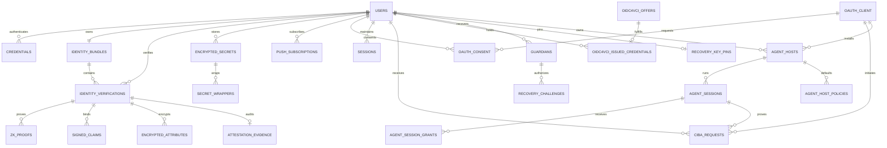

Zentity's attestation model classifies every piece of identity data by who can access it (server, client, on-chain) and what form it takes (plaintext, ciphertext, hash, proof), ensuring that no single storage layer contains enough information to reconstruct a user's identity without their credential. This document is the single source of truth for the attestation schema, data classification boundaries, and privacy guarantees. The four cryptographic pillars that make this possible are covered in [Cryptographic Pillars](cryptographic-pillars.md).

## Executive Summary

The system separates identity data into distinct artifact types, each stored in a form that enforces a specific privacy boundary:

- **ZK proofs**: age (day-precise), document validity, nationality membership, face match threshold, identity binding (replay protection).
- **FHE ciphertexts**: DOB days for server-side threshold computation, liveness score for threshold checks.
- **Commitments + hashes**: document hash, name commitment, DOB commitment, address commitment, proof hashes.
- **Screening attestations**: PEP/sanctions screening results as signed claims.
- **Credential-wrapped secrets**: FHE keys and profile data encrypted with passkey PRF, OPAQUE export key, or wallet signature; only the user can unwrap them in the browser. See [FHE Key Lifecycle](fhe-key-lifecycle.md) for the full encryption hierarchy.
- **Evidence pack**: `policy_hash` + `proof_set_hash` for durable auditability.

This model supports multi-document identities, an account-scoped current snapshot, revocable and stale validity states, periodic re-verification, and auditable disclosures across Web2 and Web3.

### Identity storage model

The persistence model separates snapshot state from history and downstream delivery:

- `identity_bundles` stores the current account snapshot (`validityStatus`, `effectiveVerificationId`, `rpNullifierSeed`, `verificationExpiresAt`, and related metadata).
- `identity_verifications` stores credential history for OCR and NFC verification rows, including supersession lineage.
- `identity_validity_events` records immutable lifecycle transitions such as `verified`, `stale`, `revoked`, and `superseded`.
- `identity_validity_deliveries` tracks the per-target execution state of downstream effects such as credential-status updates, RP validity notice, back-channel logout, CIBA cancellation, and blockchain revocation delivery.

### Regulatory Alignment

Zentity provides the cryptographic infrastructure; the relying party determines which regulatory requirements apply to their use case. This architecture supports:

- **US (FinCEN CIP Rule)**: Full DOB precision, address collection, name verification
- **EU (AMLD5/AMLD6)**: 5-year retention, PEP/sanctions screening, re-verification scheduling
- **FATF Travel Rule**: Address collection + eligibility disclosures with minimal data release

---

## Trust & Privacy Boundaries

### Core trust model

- **Browser is untrusted for integrity**: users can tamper with client code.
- **Browser is best for privacy**: ZK proofs and passkey/OPAQUE/wallet-based key custody run locally.
- **Passkeys, OPAQUE, and wallets anchor auth and key custody**: WebAuthn signatures prove user presence; PRF outputs, OPAQUE export keys, and wallet signatures derive KEKs locally and never leave the client.
- **Server is trusted for integrity**: verification, signing, and policy enforcement.
- **Server is not trusted for plaintext access**: only commitments and ciphertext.
- **Client storage (sessionStorage/localStorage) is not used for PII**. Verification data exists only in memory during the active flow. If the user refreshes, the state is lost and they restart verification. Long-term PII is stored only as credential-encrypted secrets (profile vault).

### Encryption boundaries

| Layer | What happens | Who can decrypt | Why |
|---|---|---|---|
| **Web2 (off-chain)** | TFHE encryption via FHE service using client public key | **User only** (client key in browser) | Server can compute on ciphertext without decryption. |
| **Web3 (on-chain)** | Attestation encryption via registrar (server relayer SDK); client SDK used for wallet-initiated ops (transfers, decrypt) | **User only** (wallet signature auth) | On-chain compliance checks operate on ciphertext; decryption is user-authorized. |

**Important**: The server persists encrypted key bundles (passkey-, OPAQUE-, or wallet-wrapped) and registers public + server keys with the FHE service under a `key_id`. Client keys are only decryptable in the browser.

### Why the server can't decrypt

- The browser encrypts data with a random **data key (DEK)**.
- That DEK is wrapped by a **key‑encryption key (KEK)** derived client‑side.
- The server stores only the encrypted blob + wrapped DEK, but **never sees the KEK source material**.
- Result: the server can store and verify, but cannot decrypt user data.

### Integrity controls

- All ZK proofs include a **server-issued nonce** (replay protection).
- Proofs are **verified server-side**; on-chain InputVerifier validates FHE input proofs.
- High-risk measurements (OCR results, liveness, face match) are **server-signed claims**.
- Proofs are **bound to a claim hash** to prevent client tampering.
- **Identity binding proofs** cryptographically link proofs to a specific user via Poseidon2 commitment, preventing proof replay across users or documents. No proofs can be generated without binding. Works with all three auth modes (passkey PRF, OPAQUE export key, wallet signature).
- Passkey authentication is **origin-bound** and uses **signature counters** to reduce replay and phishing risk.
- OPAQUE authentication keeps raw passwords off the server; clients verify the server's static public key (pinned in production).
- Passkey PRF-derived KEKs are **credential-bound**; secret wrappers reference the credential ID + PRF salt.
- **DPoP nonces**: server-issued single-use tokens prevent DPoP proof replay (RFC 9449).
- **KB-JWT freshness**: verifiers enforce max age on Key Binding JWT timestamps.
- **x509_hash client binding**: OID4VP verifier identity bound to leaf certificate thumbprint.
- **FHE ciphertext HMAC binding**: HMAC-SHA256 keyed by `CIPHERTEXT_HMAC_SECRET` (HKDF-derived) over length-prefixed `[userId, attributeType, ciphertext]`, stored in `ciphertext_hash`, verified with `timingSafeEqual` on every read. Detects ciphertext swap attacks.
- **Consent scope HMAC**: HMAC-SHA256 keyed by an HKDF derivation of `BETTER_AUTH_SECRET` over length-prefixed `[context, userId, clientId, referenceId, sortedScopes]`, stored in `scope_hmac`. Detects DB-level scope escalation.
- **JWKS private key encryption at rest**: AES-256-GCM envelope encryption via `KEY_ENCRYPTION_KEY` (required in production). Prevents token forgery from DB read access. Stored format: `{"v":1,"iv":"...","ct":"..."}`.
- **JARM response encryption**: ECDH-ES P-256 key encrypts OID4VP presentation responses. Keys rotate every 90 days with grace period for in-flight decryption.

---

## Data Classification Matrix

**Legend:** ✅ primary form, ◐ optional/derived, — not used.
**Vault** = passkey-sealed profile or passkey-wrapped encrypted secrets stored in the server DB as encrypted blobs and only decryptable client-side after a passkey PRF unlock.

### Core Identity & Eligibility

| Data / Claim | ZK | FHE | Commit | Vault | Notes |
|---|---|---|---|---|---|
| Age >= threshold | ✅ | ◐ | Proof hash | — | Boolean eligibility; no DOB revealed. Uses `dobDays` for day-level precision. |
| Document validity | ✅ | — | Proof hash | — | Binary eligibility; no expiry disclosure. |
| Nationality in allowlist | ✅ | ◐ | Merkle root | — | Group membership only (EU, US, etc.). |
| Face match >= threshold | ✅ | — | Proof hash | — | Pass/fail only. |
| Liveness score | — | ✅ | Signed claim | — | Score stays private; server attests. |
| Compliance level | — | ✅ | Server-derived | — | Policy gating input. Computed by a pure function from ZK proof existence + signed claim types (no mutable booleans). See [Architecture: Compliance Derivation Engine](architecture.md#compliance-derivation-engine). |

### DOB Storage (Production)

| Data | ZK | FHE | Commit | Vault | Notes |
|---|---|---|---|---|---|
| DOB days since 1900-01-01 | ◐ | ✅ | — | — | Full date precision for compliance. u32 days since 1900-01-01 (UTC). |
| DOB commitment | — | — | ✅ | — | SHA256(dob + salt) for audit trail. |

### Geographic & Address

| Data | ZK | FHE | Commit | Vault | Notes |
|---|---|---|---|---|---|
| Nationality | ✅ | — | — | ✅ | Proven once via ZK (nationality membership proof). Stored in profile vault for OAuth disclosure. |
| Address country code | ◐ | — | — | — | Country code from residential address. Stored as plaintext integer on `identity_bundles` and `identity_verifications`. |
| Address commitment | — | — | ✅ | — | SHA256(address + salt) for audit. |

### Screening & Risk (Server-Side)

| Data | ZK | FHE | Commit | Vault | Notes |
|---|---|---|---|---|---|
| PEP screening result | — | — | Signed claim | — | Boolean result + attestation. |
| Sanctions screening result | — | — | Signed claim | — | Boolean result + attestation. |
| Risk level | — | — | Server-derived | — | low/medium/high/critical. |
| Risk score | — | — | — | — | Numeric score (0-100). Stored as plaintext integer on `identity_bundles`. |

### Identity & Vault

| Data | ZK | FHE | Commit | Vault | Notes |
|---|---|---|---|---|---|
| Name (full name) | — | — | ✅ | ✅ | Commitment for audit; plaintext only in vault. |
| Profile PII (DOB, document #, nationality, document type, issuing country) | — | — | — | ✅ | Stored only in vault. Created after document OCR with cached credential material. |
| Address (full plaintext) | — | — | — | ✅ | Plaintext only in vault. |
| User salt (for commitments) | — | — | — | ✅ | Lives with profile; delete breaks linkability. |
| FHE client keys (secret key material) | — | — | — | ✅ | Stored as encrypted secrets + wrappers. |

**Document metadata** (`documentType`, `issuerCountry`) is stored directly on `identity_verifications` for operational use. Full PII lives only in the profile vault. It also exists in:

- **Profile vault**: credential-encrypted, for OAuth identity claims (`identity.document` scope)
- **Signed OCR claims**: integrity-protected attestation (`ocr_result` signed claim)

### NFC Chip Claims

| Data / Claim | ZK | FHE | Commit | Vault | Notes |
|---|---|---|---|---|---|
| Chip verified | — | — | — | — | Boolean flag from ZKPassport proof verification (`proof:chip` scope). |
| Chip verification method | — | — | — | — | `"nfc_chip"` — discriminator on `identity_verifications.method`. |

### Auth & System

| Data | ZK | FHE | Commit | Vault | Notes |
|---|---|---|---|---|---|
| Passkey credential metadata | — | — | — | — | Stored in the `passkey` table for WebAuthn verification. |
| OPAQUE registration record | — | — | — | — | Stored in the `account` table; not a password hash and not plaintext. |
| Wallet address | — | — | — | — | Stored in the `wallet_address` table for wallet-based auth. |
| Raw images / biometrics | — | — | — | — | Never stored; transient only. |

### Re-verification Tracking

| Data | ZK | FHE | Commit | Vault | Notes |
|---|---|---|---|---|---|
| Last verified at | — | — | — | — | Timestamp of the current authoritative verification on `identity_bundles.lastVerifiedAt`. |
| Freshness deadline | — | — | — | — | `identity_bundles.verificationExpiresAt` drives `verified -> stale`. |
| Freshness checked at | — | — | — | — | `identity_bundles.freshnessCheckedAt` records the last freshness evaluation. |
| Verification count | — | — | — | — | `identity_bundles.verificationCount` counts authoritative verification wins over time. |
| Supersession lineage | — | — | — | — | `identity_verifications.supersededAt` and `supersededByVerificationId` preserve prior-authoritative history. |

Current validity state itself lives on `identity_bundles.validityStatus`, while immutable lifecycle transitions live in `identity_validity_events`.

**Note:** Passkey credential metadata (public keys, counters, transports) is stored in the `passkey` table for authentication and key custody. Wallet addresses are stored in the `wallet_address` table for wallet-based authentication.

---

## Storage Boundaries

This system intentionally splits data across server storage and client-only access. The vault is stored server-side in encrypted form, but only the user can decrypt it using their passkey, OPAQUE export key, or wallet signature.

### Summary view

| Location | What lives there | Access & encryption | Why |
|---|---|---|---|
| **Server DB (plaintext)** | Account email, auth metadata (passkey public keys, wallet addresses), OPAQUE registration records, OAuth operational metadata (client/consent/token records), PAR request objects (`haip_pushed_request`), OID4VP session state (`haip_vp_session`), status fields | Server readable | Required for basic UX, auth, and workflow state |
| **Server DB (encrypted)** | Passkey‑sealed profile, passkey/OPAQUE/wallet‑wrapped FHE keys, FHE ciphertexts, JWKS private keys (AES-256-GCM envelope via `KEY_ENCRYPTION_KEY`, format `{"v":1,"iv":"...","ct":"..."}`) | Client‑decrypt only for user secrets (PRF‑, OPAQUE‑, or wallet‑derived keys); server‑decrypt for JWKS (server‑held KEK) | User‑controlled privacy + encrypted computation + key-at-rest protection |
| **Server DB (non‑reversible)** | Commitments, proof hashes, evidence pack hashes | Irreversible hashes | Auditability, dedup, integrity checks |
| **Client memory (ephemeral)** | Plaintext profile data, decrypted secrets, OCR previews | In‑memory only, cleared after session | Prevent persistent PII exposure |
| **On‑chain (optional)** | Encrypted attestations + public metadata | User‑decrypt only | Auditable compliance checks without PII |

### Why some data exists in two forms

- **Commitment + vault plaintext** is intentional: the server can **verify/dedup** using commitments, while the user retains **full control** of disclosure via the passkey vault.
- **Encrypted secrets + wrappers** live in the DB for **multi‑device access**, but the **decrypting key never leaves the user’s authenticator**.

### What "vault" means here

The vault is a server-stored encrypted blob (`encrypted_secrets` + `secret_wrappers`) that can only be decrypted client-side after WebAuthn + PRF, OPAQUE export-key derivation, or wallet signature + HKDF derivation.

---

## Privacy Guarantees

1. **Transient media**: document and selfie images are processed in memory and discarded.
2. **No plaintext PII at rest**: sensitive attributes live only in the passkey-sealed profile or as ciphertext.
3. **One-way commitments**: hash commitments allow integrity checks without storing values.
4. **Client-side proving**: private inputs remain in the browser during ZK proof generation.
5. **User-controlled erasure**: deleting the passkey-sealed profile breaks access to PII and salts.
6. **No biometric storage**: liveness and face match scores are stored as signed claims, not raw biometrics.
7. **DPoP token binding**: access tokens bound to client's ephemeral key pair, preventing replay of stolen tokens.
8. **PAR prevents parameter leakage**: authorization parameters submitted server-side, not in browser URLs.
9. **JARM encrypted VP responses**: presentation responses encrypted to verifier's key, visible only to intended recipient.
10. **Pairwise subject identifiers**: DCR clients default to `subject_type: "pairwise"`, preventing cross-RP user correlation.
11. **Transient OAuth linkage (ARCOM)**: consent records deleted after code issuance for pairwise proof-only flows; access token DB records deleted after JWT issuance; session IP/UA metadata scrubbed.
12. **Consent HMAC integrity**: consent scope lists are HMAC-tagged; any DB-level scope widening is detected and the consent is invalidated.
13. **FHE ciphertext integrity binding**: every FHE ciphertext is HMAC-bound to its owner and attribute type; ciphertext swap attacks are detected before use.
14. **Sybil HMAC deduplication**: same identity document always produces the same `dedup_key` via `HMAC-SHA256(DEDUP_HMAC_SECRET, docNumber+issuerCountry+dob)`, enforcing one-verification-per-document across accounts without storing PII.
15. **FHE public key fingerprint**: SHA-256 fingerprint computed client-side at keygen, verified on every key load; prevents server-side key substitution. See [Tamper Model](tamper-model.md#fhe-public-key-substitution).
16. **Client-computed blob hash**: secret blob integrity hash computed client-side before upload, cross-validated against server record; prevents coordinated blob+hash replacement. See [Tamper Model](tamper-model.md#secret-blob-integrity).

## Attestation Schema

### Entity Relationship Overview

The diagram below shows entity names and cardinality only. The Drizzle schema is the authoritative source for column-level detail.

### Core Tables

The diagram above shows cardinality only. The Drizzle schema is the authoritative source for column definitions and constraints.

---

## Evidence Pack

The evidence pack binds **policy + proof set** into a durable, auditable commitment.

- **`policy_hash`**: hash of the active compliance policy inputs (age threshold, liveness thresholds, nationality group, etc.)
- **`proof_hash`**: hash of each proof payload + public inputs + policy version
- **`proof_set_hash`**: hash of sorted `proof_hashes` + `policy_hash`
- **`consent_receipt`**: JSON consent receipt (RP + scope + timestamps)
- **`consent_receipt_hash`**: hash of the receipt (computed when building disclosure payloads)
- **`consent_scope`**: explicit fields the user approved for disclosure

**Where it appears:**

- Stored in `attestation_evidence`
- Included in disclosure payloads
- Suitable for on-chain attestation metadata

This enables auditors and relying parties to validate **exactly which proofs** and **which policy** were used.

---

## Compliance Derivation

Compliance status (none, basic, full, chip) is computed from the attestation artifacts stored by this schema. The derivation engine is the canonical source of truth for how 7 boolean checks (document, liveness, age, face match, nationality, identity binding, sybil resistance) map to compliance levels. See [Architecture: Compliance Derivation Engine](architecture.md#compliance-derivation-engine) for the full check matrix and level definitions.

---

## Multi-Document Model

- Users can register **multiple documents** (passport, ID, license) via OCR or NFC chip.
- Every proof and evidence pack is **verification-scoped** (`verification_id`).
- The **bundle status** is derived from the selected/most trusted verification.

This supports upgrades and re-verification without overwriting previous evidence.

---

## Web3 Attestation Schema

Encrypted attributes are stored on‑chain in the IdentityRegistry (fhEVM), including **birth year offset** (`birthYearOffset`, u8 0–255), **compliance level**, and optional flags.
Public metadata includes **proofSetHash**, **policyHash**, **issuerId**, and timestamps for auditability.

The encrypted attributes allow compliance checks **under encryption**. The public metadata enables audits without revealing PII. See [Web3 Architecture](web3-architecture.md) for the implementation details.

---

## Disclosure Payload

A relying party receives:

- **Proof payloads** + public inputs (for verification)
- **Commitments** (document hash, name commitment)
- **Encrypted attributes** (if required for encrypted checks)
- **Evidence pack** (`policy_hash`, `proof_set_hash`)
- **Signed claims** (liveness / face match scores)

**Consent model:** PII disclosure is user-authorized. The client decrypts the passkey-sealed profile and re-encrypts to the RP. Zentity never handles plaintext PII.

This enables a bank or exchange to:

- Verify all ZK proofs independently
- Store an immutable audit trail
- Enforce compliance without handling raw PII

---

## Verifiable Credential Issuance

Zentity issues SD-JWT verifiable credentials containing **derived claims only**:

- `verification_level` (`none` | `basic` | `full` | `chip`)
- `verified`, `document_verified`, `liveness_verified`, `face_match_verified`
- `age_verified`, `nationality_verified`, `identity_bound`, `sybil_resistant`
- `policy_version`, `issuer_id`, `verification_time`

**No raw PII** is included in credentials. Claims derive from existing verification artifacts (ZK proofs, signed claims, FHE).

### Credential tables

- `oidc4vci_offers`: Pre-authorized credential offers (short-lived). Supports deferred issuance for credentials requiring asynchronous verification.
- `oidc4vci_issued_credentials`: Issued credential metadata + status. Includes `statusListId` + `statusListIndex` for revocation tracking via Status List 2021.
- `jwks`: Signing and encryption key material (EdDSA, ML-DSA-65, RS256, ES256, ECDH-ES). Keys are generated on first use; public keys served via `/api/auth/oauth2/jwks`.

### Selective disclosure

SD-JWT format allows users to reveal only specific claims during presentation. The holder controls which disclosure keys are included.

Verifiers validate KB-JWT holder binding: issuer signature → disclosure decode → `cnf.jkt` thumbprint match → KB-JWT signature → audience/nonce/freshness check. See [SSI Architecture](ssi-architecture.md) for the full credential model.

---

## Implementation Notes

- FHE keys are generated in the browser and stored server-side as credential-wrapped encrypted secrets (no plaintext at rest). See [FHE Key Lifecycle](fhe-key-lifecycle.md) for the full encryption hierarchy.
- Integrity controls (HMAC binding, key fingerprinting, consent scope verification) are detailed in [Tamper Model](tamper-model.md).
- Pairwise subject identifiers and selective disclosure mechanics are detailed in [OAuth Integrations](oauth-integrations.md).
