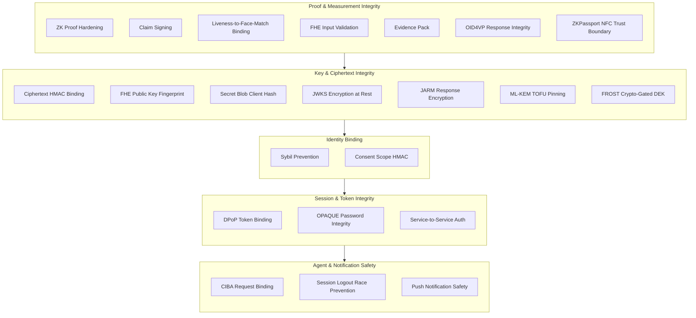

Zentity treats the browser as a hostile environment and the server as a trusted-but-minimized authority, placing cryptographic verification at every boundary where a forged value could alter an identity decision. This document maps each integrity control to the trust assumption it enforces, organized by the class of attack each cluster mitigates.

## Deployment Modes

The integrity model applies to both deployment modes. What changes between them is which component serves as the final authority.

| Aspect | Web2 (Off-chain) | Web3 (On-chain) |
|--------|------------------|-----------------|
| **Proof verification** | Backend verifies ZK proofs | Backend for ZK proofs; on-chain InputVerifier for FHE inputs |
| **FHE inputs** | Server-derived + server-side encryption | FHEVM InputVerifier on-chain (wallet/registrar inputs) |
| **Nonce issuance** | Server-issued nonces for ZK proofs | Same ZK challenge flow (not used for attestation/transfer) |
| **Attestation authority** | Server database records | IdentityRegistry contract |
| **Replay resistance** | Single-use nonces in DB (ZK proofs) | On-chain state + InputVerifier proofs |

In Web3 mode, the blockchain enforces immutability and ACL permissions. In Web2 mode, the server is the sole authority.

## Trust Boundaries

Three components participate in the verification pipeline, each with a different trust posture:

- **Browser (hostile)**: Users can modify UI code, API calls, and client-side logic. Any value computed in the browser can be forged.
- **Server (trusted for integrity)**: The server is the verification authority but should minimize access to plaintext.
- **Blockchain (integrity via consensus)**: Provides immutability, but all inputs must be independently verifiable through proofs or signatures.

The browser generates ZK proofs (private inputs remain local), encrypts data for FHEVM and TFHE, and decrypts data intended for the user. The browser must not be trusted for liveness score calculation, face match scoring, document OCR extraction, compliance decisions, or VP token authenticity. These must be verified by the backend or by on-chain cryptographic checks.

## Integrity Principles

Every control in this document derives from these principles:

1. Never trust client claims without cryptographic verification.
2. All client-generated proofs must be verified server-side or on-chain.
3. Bind proofs to server nonces to prevent replay attacks.
4. Use server-signed claims when a trusted measurement is required (e.g., liveness score).
5. Persist an evidence pack (`policy_hash` + `proof_set_hash`) for auditability.
6. Sign verifiable credentials with issuer keys; validate holder binding on presentation.
7. Issue and validate server-managed DPoP nonces (RFC 9449 §4.1) with single-use semantics and configurable TTL.
8. Cryptographically verify KB-JWT holder binding in SD-JWT VP tokens: resolve the holder key from `cnf.jwk` or KB-JWT header, verify the JWK thumbprint against `cnf.jkt`, then signature-verify the KB-JWT before accepting disclosed claims.

## Structural Overview

The controls cluster into five groups based on the class of attack they mitigate. Each group protects a different stage in the identity pipeline.



---

The sections below follow this structure. Each begins with the shared threat pattern, then details the individual controls.

## Proof and Measurement Integrity

Every control in this section addresses the same class of attack: a hostile browser submitting forged values where a server-signed measurement or a cryptographic proof is required. They differ in what is being forged (a ZK proof, a liveness score, a face match, an FHE ciphertext, or a VP token) and which verification mechanism catches the forgery.

### ZK Proof Hardening

- Each proof includes a server-issued nonce as a public input.
- Nonces are single-use and short-lived.
- Proof verification rejects stale or reused nonces.
- Verification validates public input length against the verification key before cryptographic checks.
- Proof metadata stores circuit and verification key hashes for audit and registry alignment (see [ZK Architecture](zk-architecture.md)).

### Claim Signing

- The backend signs claim hashes for high-risk values (liveness score, face match score, OCR-derived attributes).
- The client creates ZK proofs over signed claim hashes using Poseidon2 binding.
- The server verifies the signature before accepting any proof. No raw PII is stored in claim payloads.

### Liveness-to-Face-Match Binding

- When liveness completes, the backend stores a SHA-256 hash of the verified selfie frame on the verification draft.
- Face match verification requires a draft ID, verifies draft ownership, and checks the submitted selfie hash against the stored liveness hash before running face detection.
- This blocks selfie substitution attacks where a client reuses a valid liveness session with a different selfie.

### FHE Input Validation

- Web3: rely on FHEVM input proofs and on-chain InputVerifier.
- Web2: FHE inputs are derived server-side from verified data; the backend does not accept client-encrypted values as truth.

### Evidence Pack

- Compute proof and policy hashes for each verified proof set.
- Persist evidence to support audits and relying-party verification.
- See [Attestation & Privacy Architecture](attestation-privacy-architecture.md).

### OID4VP Response Integrity

- VP responses use `response_mode: direct_post.jwt`, where the wallet encrypts the response JWE to an ephemeral ECDH-ES P-256 key, preventing interception in transit.
- The `client_id_scheme: x509_hash` is enforced through full x5c chain validation: the leaf certificate's SHA-256 thumbprint must match `client_id`, certificate validity periods are checked, and the leaf must be signed by the CA.
- KB-JWT signature verification is two-phase: first the issuer signature is verified against the Zentity JWKS, then the KB-JWT is verified against the holder public key resolved from `cnf.jkt`.

### ZKPassport NFC Trust Boundary

When using the NFC chip verification path:

- **Proof generation**: Proofs are generated by the ZKPassport SDK on the user's mobile device and verified server-side. The server does not generate or modify proofs.
- **Nullifier uniqueness**: The unique identifier (nullifier) is checked for uniqueness across all accounts before accepting a verification, preventing cross-account replay where the same physical passport is registered under multiple identities.
- **Synthetic liveness**: A liveness score of 1.0 is assigned server-side because NFC chip challenge-response proves physical possession of the document. No face match or gesture-based liveness is performed.
- **Dev mode**: Development and test environments accept proofs without full cryptographic checks. Production enforces strict verification; this relaxation must never be enabled in production.
- **Vault-only re-verification**: When a chip-verified user's profile secret storage failed (dialog dismissed, credential expired), they can re-submit the same passport to retrieve disclosed PII for vault storage. The re-verify path enforces three constraints: proofs are re-verified, the nullifier must match the existing verification's unique identifier (prevents different-passport substitution), and no new verification record, signed claim, or FHE encryption is created (existing artifacts are reused).

---

The previous section addressed forgery of values that enter the system. The next section addresses substitution and extraction of values already stored.

## Key and Ciphertext Integrity

Every control in this section addresses storage-level attacks: an adversary with database access who substitutes, extracts, or corrupts stored cryptographic material. They differ in what is protected (FHE ciphertexts, FHE public keys, encrypted secret blobs, JWKS private keys, JARM encryption keys, or recovery key material) and the binding mechanism that detects tampering.

### FHE Ciphertext HMAC Binding

**Threat:** Ciphertext swap, where an attacker with DB access replaces one user's FHE ciphertext with another's. For example, an attacker could swap a minor's encrypted DOB with an adult's.

**Control:** Every ciphertext is bound to its owner and attribute type via HMAC:

```text
key = HKDF-SHA256(CIPHERTEXT_HMAC_SECRET, info="zentity:ciphertext-hmac:v1")
tag = HMAC-SHA256(key, encodeAad([userId, attributeType]) || ciphertext)
```

The tag is verified with timing-safe comparison on every read. A tampered or substituted ciphertext is rejected before it can be used for any computation. The `encodeAad` function uses length-prefixed encoding to prevent concatenation collisions.

### FHE Public Key Fingerprint

**Threat:** A malicious server replaces the stored FHE public key with one it controls, so all subsequent FHE computations use the attacker's key.

**Control:** A SHA-256 fingerprint of the public key is computed client-side at keygen time and stored in the secret's metadata. On every load, the fingerprint is recomputed and compared against the stored value. A mismatch throws before the key can be used. The public key itself lives inside the AES-GCM encrypted blob (tamper-proof via AAD), so the fingerprint is a second-layer check that catches metadata-level substitution.

### Secret Blob Client Hash

**Threat:** A malicious server replaces the encrypted secret blob and updates the server-computed hash in tandem, making the substitution undetectable.

**Control:** The blob SHA-256 hash is computed client-side before upload and stored via a separate endpoint. On download, the client verifies the blob against this client-asserted hash. The enrollment/complete endpoint cross-validates the client hash against the server's upload record to catch buggy clients. AES-GCM authenticated encryption remains the primary integrity boundary; the client hash is defense-in-depth.

### JWKS Private Key Encryption at Rest

**Threat:** An attacker with DB read access extracts JWKS private keys and forges tokens (id_tokens, access tokens, logout tokens).

**Control:** When `KEY_ENCRYPTION_KEY` is set (required in production, min 32 chars), all JWKS private keys are encrypted with AES-256-GCM before storage. The KEK is derived via SHA-256 to normalize any input to 32 bytes. Without the KEK, extracted ciphertext is unusable.

### JARM Response Encryption Key

**Threat:** OID4VP presentation responses intercepted in transit or extracted from server storage, exposing holder credentials.

**Control:** JARM responses are encrypted with ECDH-ES using a P-256 key that is lazy-created on first VP session and persisted encrypted. Keys rotate every 90 days; expired keys are retained for a grace period so in-flight VP responses can still be decrypted. The private key component follows the same AES-256-GCM envelope encryption as other JWKS keys.

### ML-KEM Recovery Key TOFU Pinning

**Threat:** Key substitution, where an attacker replaces the ML-KEM-768 public key after a user has stored recovery wrappers. The user's wrappers are encrypted under the original key, but new wrappers (or recovery attempts) would use the attacker's key.

**Control:** Trust-On-First-Use (TOFU) pinning records `SHA-256(publicKey)` per user on first wrapper store. Every subsequent wrapper operation and recovery challenge verifies the stored fingerprint against the current key. A mismatch throws before any wrap/unwrap proceeds.

### FROST Crypto-Gated DEK Release

**Threat:** Server bypass, where an attacker with DB access reads wrapped DEK material and unwraps without guardian authorization.

**Control:** The FROST aggregated signature is cryptographically entangled with DEK release. HKDF-SHA256 derives a 32-byte AES-256-GCM key from the signature and challenge ID. The recovery DEK is wrapped under this key at enrollment time. Without a valid FROST threshold signature for the specific challenge, the unwrap key cannot be derived and the DEK remains inaccessible. Combined with ML-KEM TOFU pinning, this provides defense-in-depth: pinning catches key substitution, crypto-gating prevents server bypass.

---

The previous sections addressed data integrity at the proof and storage layers. The next section addresses identity-level attacks that exploit the binding between a user and their verified attributes.

## Identity Binding

The controls in this section prevent two categories of attack: duplicate identity registration (Sybil) and unauthorized privilege escalation through consent manipulation. Both exploit the binding between a user account and the claims associated with it.

### Sybil and Duplicate Identity Prevention

**Threat:** Same identity document registered under multiple accounts (Sybil attack).

**Control (OCR path):** An HMAC-SHA256 dedup key derived from document number, issuer country, and date of birth is stored on the verification record with a unique index. Duplicate registration fails at the database constraint level.

**Control (NFC path):** The ZKPassport nullifier (unique identifier) is checked for uniqueness across all accounts before accepting the verification.

**Control (RP disclosure stability):** The per-RP `sybil_nullifier` is derived from a user-scoped seed stored on `identity_bundles.rp_nullifier_seed`, not from "the latest verification." The seed is written once from the first verified credential, survives later credential additions, and is only cleared on full identity revocation. This prevents relying parties from seeing the nullifier rotate when a user upgrades or adds credentials while still allowing re-verification after revocation to establish a new unlinkable seed.

### Consent Scope HMAC

**Threat:** DB-level scope escalation, where an attacker widens a consent record's scope list to gain access to claims the user never approved.

**Control:** Consent scope HMAC stored alongside the consent record:

```text
key = HKDF-SHA256(BETTER_AUTH_SECRET, info="zentity:consent-hmac:v1")
tag = HMAC-SHA256(key, encodeAad([CONSENT_HMAC_CONTEXT, userId, clientId, referenceId, sortedScopes]))
```

Scopes are sorted before HMAC computation to make the tag order-independent. The authorization flow verifies the HMAC before auto-skip logic runs. If the HMAC is invalid or missing, the consent record is deleted, forcing the user to re-consent.

---

The previous sections assumed a single user acting on their own behalf. The remaining sections address integrity at the session and delegation layers, where multiple parties (tokens, services, agents) interact.

## Session and Token Integrity

The controls in this section prevent session-level attacks: token replay, credential interception, and unauthorized service-to-service communication. They share a common mechanism (cryptographic binding of a token or credential to a specific context) but differ in what is bound (a DPoP proof to a keypair, an OPAQUE exchange to a server identity, or a service request to an authentication token).

### DPoP Token Binding

- DPoP access tokens are bound to an ephemeral ES256 keypair; all credential endpoint requests require a valid DPoP proof.
- The server-managed nonce store enforces single-use semantics with configurable TTL and periodic sweep.
- Nonces are validated and deleted atomically; a replayed nonce is rejected even within the TTL window.

### OPAQUE Password Integrity

- The server never receives plaintext passwords; it stores OPAQUE registration records.
- Clients verify the server's static public key (pinned in production) to prevent MITM.
- Login state is encrypted and time-limited to reduce replay risk.
- OPAQUE endpoints are rate-limited to slow online guessing.

### Service-to-Service Authentication

- Internal services (FHE, OCR) require authenticated requests in production.
- Public endpoints are explicitly audited and limited.

---

The final section addresses integrity in delegated authorization, where an agent acts on behalf of a user through CIBA and push notifications.

## Agent and Notification Safety

The controls in this section prevent attacks on the backchannel authorization flow, where timing windows and notification channels create opportunities for interception and replay. They share a common concern (preventing unauthorized token acquisition through a delegated channel) but differ in the attack vector: request interception, logout race conditions, or notification spoofing.

### CIBA Request Binding and Replay Protection

**Threat:** An attacker intercepts or guesses an `auth_req_id` and redeems it at the token endpoint, or replays a previously approved request.

**Controls:**

- The `auth_req_id` is generated with cryptographic entropy.
- **Release handle triple binding**: the release handle is sealed with AES-GCM and bound to `(userId, authReqId, clientId)`. A handle from one request cannot be used for another.
- **Ephemeral TTL**: Release handles expire after 5 minutes, matching the CIBA request lifetime.
- **CAS-based status transitions**: `approved → claiming → redeemed` using compare-and-swap updates. Only one token exchange can succeed per request; concurrent polling attempts that race the transition fail atomically.
- **Expired/rejected requests**: Polling against an expired or rejected request returns an error (`expired_token` or `access_denied`), not a pending status.

### Session Logout Race Prevention

When a user terminates their session, pending CIBA requests are revoked server-side (status set to `rejected`). This prevents a race condition where an agent polls for a CIBA token after the user has logged out; without this control, an agent could obtain tokens for a session that no longer exists.

### Push Notification Safety

**Threat:** Notification spoofing, unauthorized vault unlock via push, or stale notification exploitation.

**Controls:**

- **VAPID signing + payload encryption**: Push messages are VAPID-signed (RFC 8292) and payload-encrypted per RFC 8291 using the subscription's P-256DH and auth keys. The push service cannot read the payload.
- **Vault unlock restriction**: When a CIBA request includes identity scopes, the push notification shows only a "Deny" inline action. Vault unlock requires a full browser context, as the service worker cannot trigger a passkey PRF prompt or OPAQUE password dialog. The user must navigate to the approval page to unlock their vault.
- **Expired request fallback**: If a user taps a notification after the request has expired or been rejected, the service worker falls back to opening the approval page, which shows the expired state in the UI.
- **Push subscription ownership**: Subscriptions are stored per-user. When a user switches accounts, stale subscriptions from the previous user are not inherited; the subscription endpoint is unique per browser and device.

## Verification Decision Flow

The end-to-end verification pipeline enforces the controls above in sequence:

1. Backend performs OCR, liveness, and face match.
2. Backend binds face match input to the verified liveness selfie hash.
3. Backend signs derived attributes and thresholds.
4. Client generates ZK proofs using those values.
5. Backend verifies proofs and signatures.
6. Backend updates evidence pack (policy_hash + proof_set_hash).
7. Backend issues attestation.

Privacy, integrity, and auditability reinforce each other at every step: the client retains sensitive inputs so proofs reveal only eligibility, the server verifies all claims with proofs and signatures, and signed claims combined with evidence pack hashes enable durable audits.
