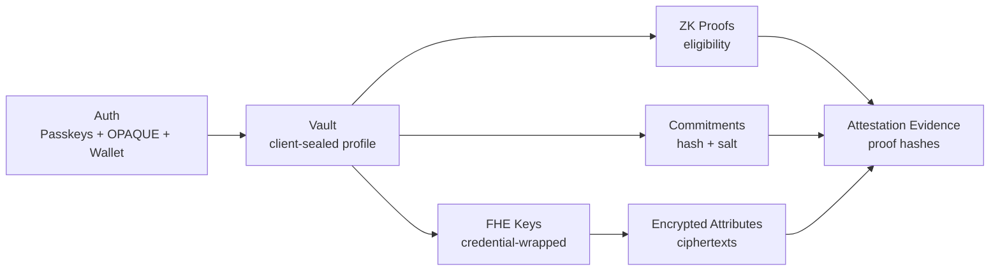

Zentity eliminates plaintext data handling through four interlocking cryptographic pillars, each addressing a different privacy threat boundary. This document explains why four primitives are needed (not three, not five), how they bind together, and where each appears in the verification lifecycle. The axis of variation is the threat each pillar addresses: custody, disclosure, computation, and integrity.

## The Four Pillars

| Pillar | What it protects | Where it runs | Why it exists |
|---|---|---|---|
| **Auth + key custody (Passkeys + OPAQUE + Wallet)** | Authentication + key custody | Browser + authenticator / wallet | Passkeys for passwordless login, OPAQUE for privacy-preserving passwords, and wallet signatures (EIP-712) for Web3-native auth; all three yield client-held keys that seal profiles and wrap FHE keys. |
| **Zero-Knowledge Proofs (ZKPs)** | Eligibility without disclosure | Browser (prove) + server (verify) | Prove age, nationality group, or document validity without revealing the underlying values. |
| **Fully Homomorphic Encryption (FHE)** | Encrypted computation | Server + fhEVM | Compute on encrypted attributes (age, nationality, compliance level) without decryption. |
| **Cryptographic Commitments** | Integrity + dedup + erasure | Server DB | One-way hashes bind values without storing them; deleting the salt breaks linkability. |

## Plain-English snapshot

- **Passkeys + OPAQUE + Wallet**: log in and derive a key that unlocks your encrypted data on the client. Passkeys use hardware-backed PRF, OPAQUE uses password-derived keys, and wallets use EIP-712 signatures. The server stores encrypted blobs only.
- **ZK proofs**: prove a statement like "over 18" without revealing the birth year.
- **FHE**: run policy checks on encrypted data without decrypting it.
- **Commitments**: store one-way hashes so you can verify later without storing plaintext.

## Why Four

Each pillar addresses a different threat boundary:

- **Passkeys + OPAQUE + Wallet** guarantee user-owned custody of secret material (passwordless, password-based, or Web3-native).
- **ZKPs** prove statements without exposing private inputs.
- **FHE** enables computation on ciphertext when ZKPs are not practical for repeated policy checks.
- **Commitments** give integrity and deduplication without storing plaintext.

Removing any one creates a gap: ZK can prove eligibility but not enable encrypted re-checks; FHE can compute but does not prove origin; commitments ensure integrity but not privacy-preserving verification.

## How They Interlock



### Example: Proving age without exposing DOB

1. **Passkey, password, or wallet** unlocks the sealed profile (DOB stays client-side).
2. **ZK proof** shows "age >= 18" without revealing the birth year.
3. **Commitment** allows later integrity checks without storing DOB.
4. **FHE** encrypts the full DOB (dobDays) so policy checks can be run later without re-collecting PII.

## Pillar Details

### Commitments

A commitment is a one-way hash that binds a value without storing it:

1. Compute `commitment = SHA256(value + user_salt)` during verification.
2. Store only the commitment server-side.
3. Keep `user_salt` in the passkey-sealed profile (client-only decrypt).
4. Later, recompute to verify without storing the original value.

Deleting the sealed profile **breaks linkability** while commitments remain non-reversible.

### FHE

FHE allows policy checks on encrypted data:

1. Encrypt sensitive attributes (e.g., DOB days, country code).
2. Store ciphertexts server-side or on-chain.
3. Evaluate compliance under encryption (no plaintext exposure).

### Passkey + OPAQUE + Wallet Key Custody

Passkeys, OPAQUE, and wallet signatures secure the keys used for encryption and disclosure:

| Aspect | What we do |
|---|---|
| Key generation | Client generates keys in the browser |
| Key storage | Encrypted blobs stored server-side |
| Key protection | KEK derived from passkey PRF, OPAQUE export key, or wallet signature (HKDF) wraps a random DEK |
| Who can decrypt | Only the user with their passkey, password, or wallet |
| Result | User-controlled erasure and multi-device access |

| Method | KEK Source | Security Model |
|--------|-----------|----------------|
| Passkey | PRF output from WebAuthn | Hardware-backed, phishing-resistant |
| Password | OPAQUE export key | Zero-knowledge, server never sees password |
| Wallet | HKDF(EIP-712 signature) | Hardware wallet support, Web3 native |

### ZK Proofs

ZK proofs let a verifier learn only a boolean outcome (e.g., "over 18") while the underlying data stays private in the browser.

## Where Each Pillar Appears in the Flow

- **Sign-Up + Verification**: Passkeys, OPAQUE passwords, or wallet signatures create the account; commitments + signed claims are stored; ZK proofs are generated client-side.
- **Compliance checks**: FHE ciphertexts allow encrypted evaluation; ZK proofs provide eligibility guarantees.
- **Disclosure**: Passkeys, OPAQUE-derived keys, or wallet signatures authorize decryption and re-encryption to relying parties.
- **Credential issuance**: SD-JWT VCs package derived claims from ZK proofs and signed claims. Signed with RS256 (default), EdDSA (opt-in), or ML-DSA-65 (post-quantum opt-in) via the multi-algorithm JWT dispatcher.
- **Auditability**: Commitments + proof hashes form an evidence pack for compliance.

## Supporting Techniques

- **JWT Signing (RS256 + EdDSA + ML-DSA-65)**: Zentity signs OAuth tokens (access tokens, ID tokens) and SD-JWT verifiable credentials. RS256 (RSA-2048) is the default for id_tokens per OIDC Discovery 1.0 §3. EdDSA (Ed25519) is used for access tokens (compact size) and available as an opt-in for id_tokens. ML-DSA-65 (post-quantum, IANA-registered as `AKP` key type) is opt-in per client. Signing keys are generated on first use and persisted in the database (standard OIDC provider pattern), distinct from encryption keys (like the ML-KEM recovery key) which require env-var management because key loss means permanent data loss. See [OAuth Integrations § JWT signing](<../(protocols)/oauth-integrations.md#jwt-signing-and-jwks>).
- **JWKS Private Key Encryption at Rest**: When `KEY_ENCRYPTION_KEY` is set (required in production, min 32 chars), JWKS private keys are encrypted with AES-256-GCM before storage. The KEK is derived via `SHA-256(KEY_ENCRYPTION_KEY)` to normalize any input to 32 bytes. Stored format: `{"v":1,"iv":"...","ct":"..."}` (version field enables future format changes). Plaintext detection: if stored value doesn't start with `{"v":`, it's treated as plaintext (backward-compatible migration). No KEK = no-op (keys stored as plaintext, for dev convenience).
- **JARM Key Rotation**: ECDH-ES P-256 decryption keys for JARM responses are rotated every 90 days (`KEY_LIFETIME_MS`). On expiry, a new key is generated and the old key is retained in the `jwks` table for a grace period (in-flight VP responses can still be decrypted). The cache is invalidated on rotation so the new key is used immediately.
- **Merkle Trees**: Enable group membership proofs (e.g., EU nationality) without revealing which country. Used inside ZK proofs.
- **Hash Functions**: Poseidon2 for ZK efficiency, SHA-256 for commitments.
- **BBS+ Signatures**: Enable selective disclosure credentials for wallet users. A wallet can prove identity without revealing the wallet address, and multiple presentations are unlinkable. Used internally for privacy-preserving wallet binding.

## Cryptographic Details

This section goes deeper than the architectural overview and explains the cryptographic choices, primitives, and bindings used across Zentity.

### 1) Passkeys + PRF

**WebAuthn authentication**

- Uses WebAuthn for passwordless authentication (origin-bound public-key signatures).
- Signature counters provide replay resistance at the authenticator level.

**PRF extension (key derivation)**

We use the WebAuthn PRF extension to derive a deterministic secret that never leaves the authenticator:

- PRF output is used as key material.
- We derive a KEK via HKDF-SHA-256.
- The KEK wraps a random DEK using AES-256-GCM.

The DEK then encrypts sensitive payloads (profile vault, FHE keys). This keeps secret custody user-owned while allowing multi-device access across both passkey and password flows.

### 1b) OPAQUE (password-based authentication)

OPAQUE is an **augmented PAKE** that keeps raw passwords off the server:

- The client never transmits the plaintext password.
- The server stores an **OPAQUE registration record**, not a password hash.
- The client derives an **export key** on registration/login; we use it to derive a KEK (via HKDF) that wraps the DEK, mirroring the passkey PRF flow.
- Clients verify the server's static public key (pinned in production) to prevent MITM.

### 1c) Wallet (EIP-712 signature authentication)

Web3 wallet authentication uses EIP-712 typed data signing for key derivation:

- The user signs an EIP-712 typed data message during wallet authentication and verification preflight to derive a KEK (via HKDF) that wraps/unlocks the DEK, mirroring the passkey PRF flow.
- At sign-up, we perform a best-effort stability check (sign twice, compare) to reject obviously unstable wallet signers.
- This check is not a long-term guarantee across wallet firmware/app changes or device migrations. Wallet users should immediately add a backup passkey and/or guardian recovery wrapper.
- Sign-in also requires a **SIWE (EIP-191)** signature for session authentication (nonce-based replay protection).
- The private key never leaves the wallet; the signature stays in the browser.
- Supports hardware wallets (Ledger/Trezor) for enhanced security.
- The server stores only the wallet address for account association.

**Enhanced privacy mode (BBS+)**: Wallet users can optionally receive BBS+ credentials that enable unlinkable presentations. Multiple presentations to the same verifier cannot be correlated, and the wallet address is never revealed.

### 2) Commitments + Hashing

**Commitments**

We use SHA-256 commitments to bind values without storing them:

```text
commitment = SHA256(normalized_value + user_salt)
```

- `user_salt` lives in the passkey-sealed profile.
- Deleting the profile breaks linkability while commitments remain non-reversible.

**HMAC-SHA256 integrity tags**

HMAC-SHA256 tags protect against DB-level tampering across three domains: sybil deduplication, FHE ciphertext integrity, and consent scope integrity. A fourth mechanism uses client-side SHA-256 fingerprinting to detect FHE public key substitution. These server-keyed integrity tags are architecturally distinct from user-salted commitment hashes: HMACs are server-verifiable and protect system integrity, while commitments use a user-held salt and are user-erasable, preserving privacy and the right to deletion. See [Tamper Model](<../(architecture)/tamper-model.md>) for the full threat model and control details for each.

**Evidence pack hashes**

We compute audit hashes for policy/proof sets and store them in the evidence pack. See Attestation & Privacy Architecture for the schema and rationale.

**Dual verification-key hashes**

ZK verification keys are stored with two hash formats:

- SHA-256 for ops/audit identity
- Poseidon2 (field-friendly) for registry/on-chain compatibility

### 3) ZK Proofs

**Proof system**

- Circuits are written in Noir.
- Proofs are generated in the browser using bb.js (Barretenberg).
- Verification runs server-side using UltraHonk.

**Universal setup (SRS/CRS)**

UltraHonk relies on a universal structured reference string (SRS/CRS). The Barretenberg tooling manages fetching and caching the SRS as part of proof generation and verification.

**Hashing in circuits**

- Poseidon2 is used inside circuits for efficiency in field arithmetic.
- It binds proofs to server-signed claims: `claim_hash = Poseidon2(value, document_hash)`.

**Replay protection**

Every circuit accepts a public nonce that is issued by the server and consumed on submission.

**Identity binding** is mandatory for all proof sets. The `identity_binding` circuit computes a Poseidon2 commitment over auth-mode-specific secrets (passkey PRF, OPAQUE export key, or wallet signature), hashed user ID, document hash, and caller/audience context hashes (`msg_sender_hash`, `audience_hash`). This ensures proofs cannot be replayed across users, documents, or relying-party audiences, regardless of which authentication method was used. If the user's credential material cache has expired, a re-authentication dialog blocks proof generation until material is re-obtained. See [ZK Architecture: Identity Binding](<../(protocols)/zk-architecture.md#identity-binding-circuit>) for details.

**Field constraints**: All circuit inputs must fit within the BN254 scalar field (~254 bits), requiring HKDF-based hash-to-field mapping for cryptographic outputs. See [ZK Architecture](<../(protocols)/zk-architecture.md#bn254-field-constraints>) for details.

See [ZK Architecture](<../(protocols)/zk-architecture.md>) for circuit flows and verifier isolation.

### 4) FHE

**Off-chain FHE (Web2)**

- TFHE-rs encrypts sensitive attributes (DOB days, country code, compliance level).
- Ciphertexts are stored server-side but only decryptable by the user's keys.

**On-chain FHE (Web3 / fhEVM)**

- Attestations are encrypted server-side by the registrar and submitted on-chain.
- Wallet operations (encrypted transfers, decrypt requests) use the client SDK.
- On-chain contracts operate only on ciphertext handles and input proofs.

**Relationship to relayer / gateway**

The registrar uses the relayer SDK to encrypt and submit attestation inputs. Decryption and access are mediated through the fhEVM gateway and ACL patterns (see [Web3 Architecture](<../(architecture)/web3-architecture.md>)).

The Base compliance mirror is deliberately outside the FHE pillar. It is a public-read derivative for payment-time predicates and carries only wallet address, active mirrored attestation state, and numeric compliance level. See [ADR-0005](../adr/fhe/0005-base-compliance-mirror-for-payment-reads.md).

### 5) How the Pillars Bind Together

- Passkeys, OPAQUE passwords, or wallet signatures seal the profile vault and wrap FHE keys.
- Commitments let the server verify values without storing them.
- ZK proofs assert eligibility using vault data + server-signed claims.
- FHE enables repeated encrypted policy checks without re-collecting PII.

This combination yields privacy (no plaintext storage) and integrity (verifiable proofs + hashes) while keeping user key custody intact.

### Agent and MCP Authentication

The MCP identity server authenticates to Zentity's OAuth endpoints using the same DPoP-bound token chain as any other client: OAuth discovery, DCR, PKCE+PAR or headless FPA, and DPoP proof binding. See [Agent Architecture](<../(architecture)/agent-architecture.md>) for the host registration and session lifecycle model, and [OAuth Integrations](<../(protocols)/oauth-integrations.md>) for protocol details.

## Deep Dives

- [Attestation & Privacy Architecture](<../(architecture)/attestation-privacy-architecture.md>) for data classification and storage boundaries
- [ZK Architecture](<../(protocols)/zk-architecture.md>) for proof system design
- [Web3 Architecture](<../(architecture)/web3-architecture.md>) for on-chain encrypted attestation
- [SSI Architecture](<../(architecture)/ssi-architecture.md>) for verifiable credential issuance and presentation
