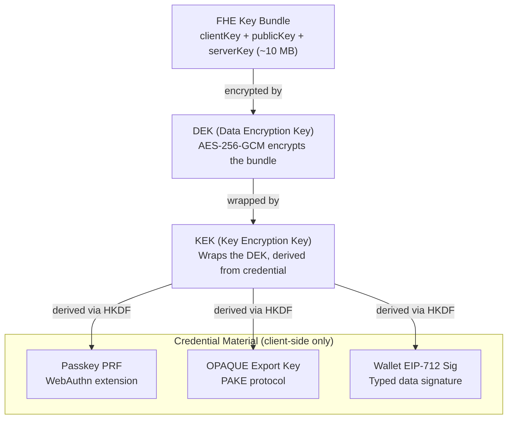

Zentity's FHE key lifecycle implements credential-gated key custody: the server stores encrypted key material but cannot decrypt it, because the decryption key is derived from a credential that only the user possesses. This document traces how FHE keys are created, wrapped, stored, and used, with the credential type (passkey PRF, OPAQUE export key, or wallet EIP-712 signature) as the axis of variation.

## Key Protection Architecture

### Encryption Hierarchy

FHE keys are protected by a two-layer encryption scheme. A Data Encryption Key (DEK) encrypts the FHE key bundle using AES-256-GCM, and a Key Encryption Key (KEK) wraps the DEK. The KEK is derived via HKDF-SHA256 from credential material that exists only on the client.

### Credential-to-KEK Derivation

Each credential type derives a KEK through a different mechanism, but all use HKDF-SHA256 as the final derivation step.

| Credential | Source Material | Derivation |
|------------|-----------------|------------|
| **Passkey** | WebAuthn PRF extension output (32 bytes) | HKDF-SHA256 |
| **OPAQUE** | PAKE protocol export key (64 bytes) | HKDF-SHA256 |
| **Wallet** | EIP-712 typed data signature (65 bytes) | HKDF-SHA256 |
| **FROST recovery** | Aggregated FROST signature (hex, 64 bytes) | ML-KEM-768 decapsulation for DEK unwrap; HKDF-SHA256 from signature + challenge ID for FROST-wrapped DEKs |

The DEK is wrapped with the KEK using AES-256-GCM with authenticated additional data (AAD) binding the secret to a specific user and credential.

---

The encryption hierarchy describes how keys are protected at rest. The next sections trace when this hierarchy is exercised across the user lifecycle.

## Lifecycle Phases

The FHE key bundle passes through distinct phases. What varies across phases is whether the full bundle is needed (client-side decryption) or just the server-side key reference (server-side computation).

| Operation | FHE Keys Needed? | Credential Material Needed? |
|-----------|------------------|----------------------------|
| **Sign-up** | No | No |
| **Sign-in** | No | Sometimes (cached for later access) |
| **Verification preflight** | Yes (generate + wrap) | Yes (to create wrapper) |
| **Dashboard view** | No | No |
| **Identity verification (server-side encryption)** | No (uses key reference) | No |
| **FHE computation** | Yes (decrypt results) | Yes (to unwrap DEK) |
| **OAuth to RP** | No | No |
| **Credential management** | Yes (re-wrap DEK) | Yes (to unwrap then re-wrap) |
| **Recovery (FROST guardian threshold)** | Yes | No (FROST signature replaces credential) |

The FHE service stores the registered public key and server key, addressed by a key identifier. Most server-side operations during verification use only this identifier and do not require unwrapping the local key bundle.

### Account Creation

Sign-up is lightweight and does not generate FHE keys. The user creates an account (passkey, OPAQUE, or wallet), a session is established, and an identity bundle stub is created without an FHE key reference. FHE enrollment is deferred to a dedicated verification preflight step.

### Sign-in

Sign-in creates a session but does not unwrap FHE keys. Credential material may be cached in memory for later use if the user needs to access FHE-encrypted data during the session. Passkey PRF output is typically obtained later via a WebAuthn PRF prompt rather than automatically during sign-in.

### Client-Side Decryption

Local FHE keys are required when the browser needs to decrypt FHE outputs (e.g., decrypting a boolean result). This triggers secret loading, which checks the credential cache and prompts the user if the cache has expired (passkey) or fails with a re-authentication request (OPAQUE).

### Verification Preflight

Before document upload, users complete a "Secure your verification data" gate that performs FHE enrollment. The sequence is: confirm credential (passkey PRF, wallet signature, or password step-up), generate FHE keys client-side, encrypt keys and store wrappers, register the public and server key to receive a key identifier, then update the identity bundle. Only after this preflight succeeds can users proceed to document upload.

### Server-Side FHE Encryption

During identity verification, server-side FHE encryption uses the stored key identifier and calls the FHE service directly. This does not require unwrapping the local FHE key bundle in the browser.

---

The lifecycle phases show when credential material is consumed. The next section examines how each credential type differs in availability and re-obtainability.

## Credential Material Availability

All three credential types can derive a KEK, but they differ fundamentally in when the source material is available and whether it can be re-obtained after the initial ceremony.

| Credential | At Sign-up | At Sign-in | Cache Lifetime | Re-obtainable? |
|------------|-----------|-----------|----------------|----------------|
| **Passkey PRF** | Captured | Not fetched by default | ~15 min TTL (in-memory) | Yes (new WebAuthn prompt) |
| **OPAQUE Export** | Captured | Captured + cached | ~15 min TTL (in-memory) | No (must re-login) |
| **Wallet Signature** | Captured | Often captured + cached | ~24h TTL (in-memory) | Yes (new signature request) |

### The OPAQUE Constraint

OPAQUE presents a unique challenge. The export key is only available during the login ceremony, as the PAKE protocol derives it as part of the authentication handshake. Once the ceremony completes, the export key exists only in the client's memory cache. If the cache expires or the user closes the browser, OPAQUE users must re-authenticate with their password, while passkey users can re-prompt for PRF and wallet users can re-request a signature.

This constraint is why OPAQUE users see re-authentication requests when their session cache expires but their HTTP session is still valid.

### Wallet Signature Stability

Wallet-derived KEKs are operationally fragile compared to passkeys and passwords. ECDSA permits multiple valid signatures for the same message, and sign-up includes a best-effort stability check (sign twice, compare). If a wallet later emits different signature bytes for the same payload, the derived KEK changes and wallet-only wrappers become unrecoverable.

For this reason, wallet-auth users should set up at least one independent recovery path immediately: add a backup passkey, or enable guardian recovery wrappers.

---

The credential availability constraints above influence when FHE enrollment can occur. The next section examines the design decision to defer enrollment and the UX implications.

## Deferred Enrollment

FHE enrollment is deferred to verification preflight because: sign-up remains quick and familiar, users understand why encryption is required before verification, and any credential type (passkey, wallet, or password step-up) can be used on demand.

### Credential-Specific Behavior

All credential types support deferred preflight, but the UX differs:

- **Passkey (PRF)**: Prompts for a WebAuthn PRF assertion during preflight; stores `prfSalt` with the wrapper so PRF output can be re-obtained later.
- **Wallet (EIP-712)**: Requests an EIP-712 signature during preflight; caches it for the session; stores a wallet wrapper.
- **OPAQUE (password)**: Preflight includes a password step-up. The export key only exists during the OPAQUE ceremony, so the user enters their password at preflight time.

All three credential types use the same unified enrollment path during the deferred preflight.

### Failure Modes and Mitigations

- **User cancels credential prompt**: Safe cancel; verification remains unopened.
- **Device doesn't support PRF**: Detected early; user steered to another credential type.
- **TFHE WASM keygen slow or fails**: Explicit progress step with retry; avoids duplicate work if keys already exist.
- **Network failure during blob upload**: Preflight is resumable; verification does not proceed until confirmed stored.
- **Wallet mismatch (wrong address/chain)**: Detected and blocked with actionable messaging.
- **OPAQUE cache expiry mid-verification**: Another password step-up may be needed; scoped and clearly explained.

### Atomicity Requirement

Before the verification flow continues, all of the following must hold: a stable key identifier exists (FHE service registration complete), the encrypted FHE key secret exists server-side, at least one valid wrapper exists for the FHE key secret, and the identity bundle references the correct key identifier. If any step fails, the user retries preflight safely, and verification does not start.

## OAuth Flows

When a user authenticates to a Relying Party (RP) via OAuth, no step requires FHE key unwrapping. The RP receives identity claims from the user's already-verified identity bundle, not raw FHE-encrypted data. Custom auth methods (passkey, OPAQUE, SIWE) continue the OAuth flow explicitly after authentication, since they do not natively integrate with the OAuth provider plugin.

## Security Properties

### Server Cannot Decrypt

The server stores the encrypted FHE key bundle (ciphertext), the wrapped DEK, and the PRF salt (for passkey users). The server does not have the passkey PRF output (derived client-side), the OPAQUE export key (derived in PAKE, never transmitted), or the wallet signature (signed client-side). The server cannot derive the KEK, cannot unwrap the DEK, and therefore cannot decrypt FHE keys.

### Replay Protection

DEK wrapping uses Authenticated Additional Data (AAD) binding the wrapped key to a specific secret ID, credential ID, and user ID. This prevents a wrapped DEK from being used with different secrets or users. Recovery wrappers use additional AAD binding with a recovery-specific context to prevent cross-user and cross-secret wrapper substitution.

### FHE Ciphertext Integrity

Every FHE ciphertext stored in encrypted attributes includes an HMAC-SHA256 tag binding the ciphertext to its owner and attribute type. The tag is verified with timing-safe comparison on every read, preventing ciphertext swap attacks where an attacker substitutes one user's encrypted data with another's.

### FHE Public Key Fingerprint

A SHA-256 fingerprint is computed at keygen time and persisted in the secret's metadata. On load, the fingerprint is recomputed and the key is rejected on mismatch. Existing keys without a fingerprint are accepted for backward compatibility, with the fingerprint added on the next operation. See [Tamper Model](<../(architecture)/tamper-model.md#fhe-public-key-fingerprint>) for the threat model.

### Server-Side FHE Input Validation

The server never accepts client-encrypted values as FHE truth. FHE inputs are derived server-side from verified data (signed OCR claims, liveness scores). This prevents a hostile browser from submitting pre-computed ciphertexts that encode false attributes.

### Multi-Credential Support

Users can have multiple credentials wrapping the same DEK: primary passkey plus backup passkey, passkey plus OPAQUE password, or passkey plus recovery guardians; custodial email guardians are limited to one and cannot be the sole guardian. Each credential has its own wrapper entry; the DEK itself is shared. Recovery wrappers use ML-KEM-768 encapsulated DEK envelopes.

## Related Documentation

- [Attestation & Privacy Architecture](<../(architecture)/attestation-privacy-architecture.md>) for data classification and privacy boundaries
