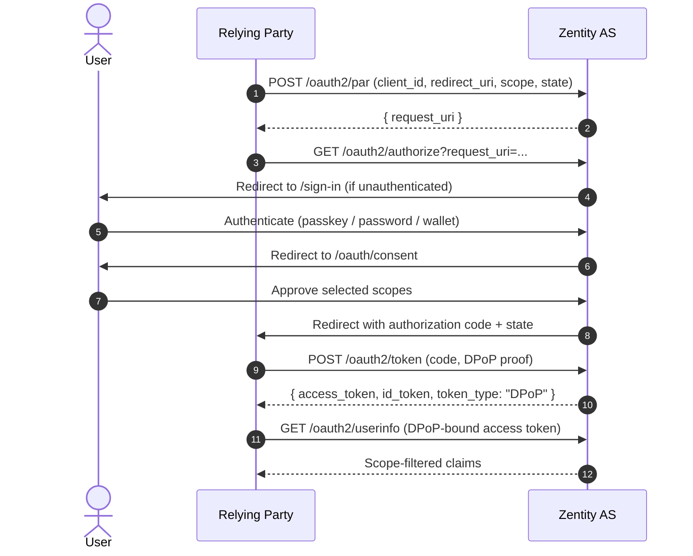
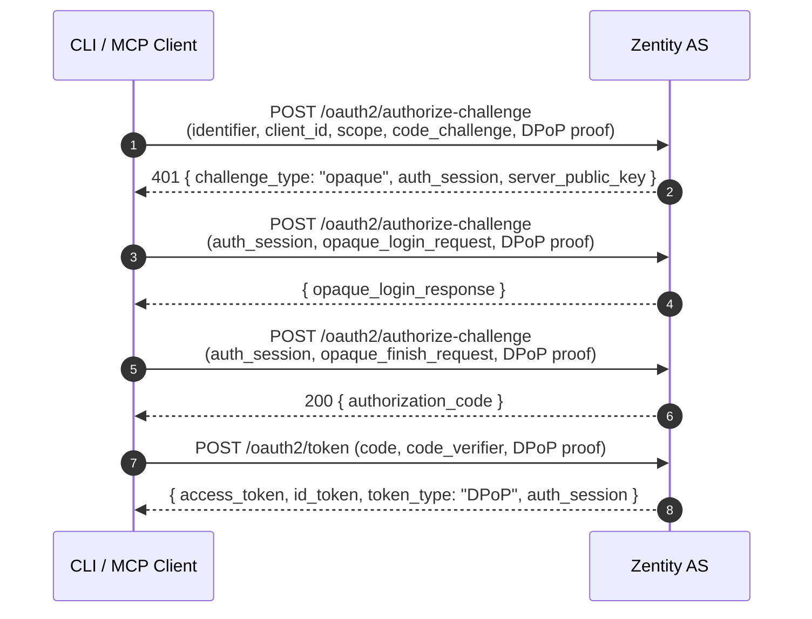
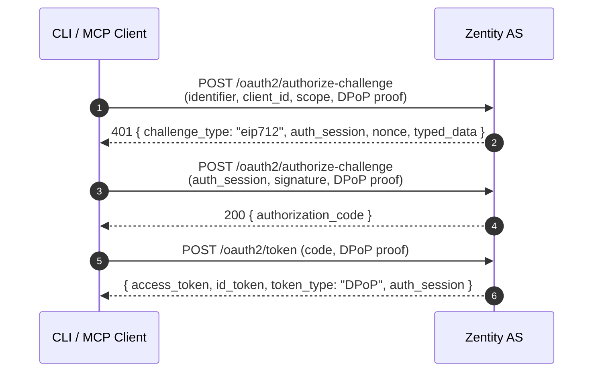
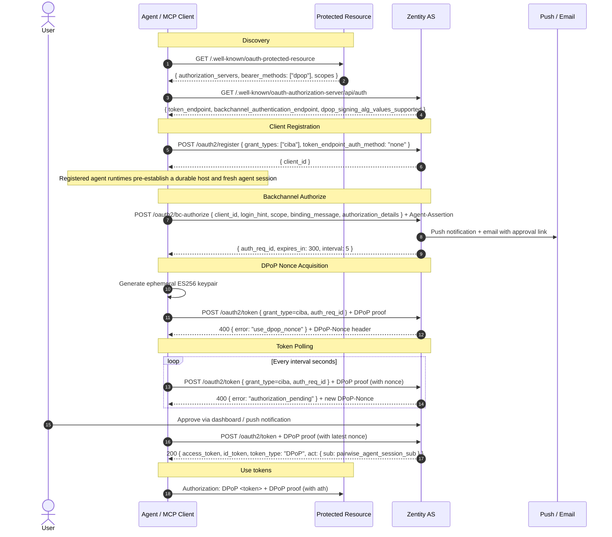
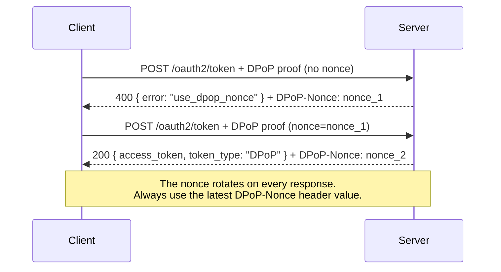
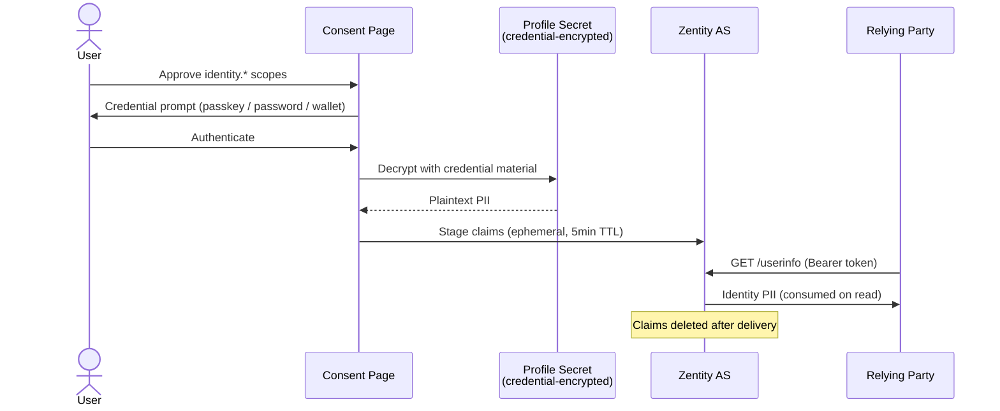

Zentity's OAuth integration implements a zero-PII authorization model: relying parties receive cryptographically verified identity claims without the server ever storing or transmitting plaintext personal data. This document maps the protocol surface area from endpoints through token security to privacy guarantees, with the delivery mechanism (scope-based, credential-based, or backchannel) as the axis of variation.

## Endpoints

The endpoints below cluster by lifecycle stage: discovery, authorization, token exchange, user data, client management, and CIBA.

### Discovery

| Endpoint | Standard | Purpose |
| --- | --- | --- |
| `GET /.well-known/oauth-protected-resource` | RFC 9728 | Protected resource metadata (AS pointers, scopes, bearer methods) |
| `GET /.well-known/oauth-authorization-server/api/auth` | RFC 8414 | Authorization server metadata |
| `GET /api/auth/.well-known/openid-configuration` | OIDC Discovery | OpenID Connect discovery |

### Authorization

| Endpoint | Standard | Purpose |
| --- | --- | --- |
| `POST /api/auth/oauth2/par` | RFC 9126 | Pushed Authorization Request (required) |
| `GET /api/auth/oauth2/authorize` | OAuth 2.1 | Authorization request (interactive) |
| `POST /api/auth/oauth2/bc-authorize` | OIDC CIBA | Backchannel authorization (headless) |
| `POST /api/auth/oauth2/consent` | OAuth 2.1 | User consent submission |
| `POST /api/oauth2/authorize-challenge` | draft-ietf-oauth-first-party-apps | First-party app challenge (headless, no redirect) |

### Tokens

| Endpoint | Standard | Purpose |
| --- | --- | --- |
| `POST /api/auth/oauth2/token` | OAuth 2.1 | Token exchange (all grant types) |
| `POST /api/auth/oauth2/introspect` | RFC 7662 | Token introspection |
| `POST /api/auth/oauth2/revoke` | RFC 7009 | Token revocation |
| `GET /api/auth/oauth2/jwks` | RFC 7517 | Public signing keys (RSA, Ed25519, ML-DSA-65) |
| `GET /api/auth/jwks` | (custom) | Post-quantum signing keys (ML-DSA-65) |

### User data

| Endpoint | Standard | Purpose |
| --- | --- | --- |
| `GET /api/auth/oauth2/userinfo` | OIDC Core | Scope-filtered verified claims + identity PII (sole PII delivery endpoint) |
| `GET /api/auth/oauth2/end-session` | OIDC Session | Session logout |

### Client management

| Endpoint | Standard | Purpose |
| --- | --- | --- |
| `POST /api/auth/oauth2/register` | RFC 7591 | Dynamic Client Registration |
| `GET /api/auth/oauth2/get-consents` | (custom) | List user's active consents |
| `POST /api/auth/oauth2/delete-consent` | (custom) | Revoke a consent grant |
| `POST /api/auth/oauth2/update-consent` | (custom) | Update consented scopes |

### CIBA lifecycle

| Endpoint | Purpose |
| --- | --- |
| `GET /api/auth/ciba/verify?auth_req_id=...` | Fetch pending request details (for approval page) |
| `POST /api/ciba/identity/intent` | Acquire intent token for PII staging (binds user + CIBA request + scopes) |
| `POST /api/ciba/identity/stage` | Stage vault-unlocked PII with intent token (ephemeral, 10-min TTL) |
| `POST /api/auth/ciba/authorize` | Approve a pending CIBA request |
| `POST /api/auth/ciba/reject` | Deny a pending CIBA request |
| `POST /api/ciba/push/subscribe` | Register browser push subscription for CIBA notifications |
| `POST /api/ciba/push/unsubscribe` | Remove push subscription |

---

The endpoints above define the protocol surface. The next section traces the three authorization paths that traverse these endpoints, each optimized for a different client context.

## Authorization Flows

Zentity supports three authorization paths. All require DPoP and produce the same token format. They differ in where the user is present: in the RP's browser (interactive), at a CLI (first-party challenge), or on a separate device (CIBA).

### Interactive (browser redirect)

For traditional web applications where the user is present at the RP.



**Grant type**: `authorization_code`

PAR is required: all authorization requests must first be pushed to the PAR endpoint, which returns a `request_uri` (60-second TTL) passed to the authorize endpoint.

### First-Party Challenge (headless, no redirect)

For first-party CLI clients (e.g., the MCP server) that authenticate directly without browser redirects. Implements `draft-ietf-oauth-first-party-apps`.

The AS resolves the user's credentials and selects the best CLI-compatible challenge: OPAQUE (password) > EIP-712 (wallet) > `redirect_to_web` (passkey-only fallback). Only clients with the `firstParty` flag can use this endpoint.

#### OPAQUE flow (3 rounds)



#### EIP-712 flow (2 rounds)



**Credential resolution**: The AS queries registered credentials and selects OPAQUE > EIP-712 > `redirect_to_web`. Unknown users receive a timing-safe OPAQUE challenge (indistinguishable from real). Passkey-only users receive `redirect_to_web` with a PAR `request_uri` (when PKCE is present) so they can complete authorization in a browser.

**DPoP binding**: The DPoP key thumbprint (`jkt`) is bound to the `auth_session` at creation and enforced on all subsequent rounds. Key mismatch returns `invalid_session`.

**Step-up re-authentication**: When a CIBA token exchange fails due to `acr_values` mismatch, first-party clients receive HTTP 403 with `{ error: "insufficient_authorization", auth_session }` instead of 400 `interaction_required`. The client re-enters the challenge endpoint with the `auth_session` to re-authenticate at a higher assurance level, then exchanges the resulting code for upgraded tokens.

**Rate limiting**: 10 requests/minute per IP. Exceeded returns 429.

### Headless (CIBA)

For agents and background services where the user approves from a separate device. This is the path MCP clients take.



**Grant type**: `urn:openid:params:grant-type:ciba`

CIBA requests support `authorization_details` (RFC 9396) for structured action metadata such as purchase amounts and merchant info. Registered agent runtimes do not send self-declared `agent_claims`. They send an `Agent-Assertion` header signed by the live session key. When that assertion verifies, the server snapshots the registered session metadata onto `ciba_request` and later emits an AAP-profiled delegated token with `agent`, `task`, `capabilities`, `oversight`, and `audit` claims alongside the standard pairwise `act.sub` actor identifier. See [Agent Architecture](agent-architecture.md) for the host registration and session lifecycle model.

The user is notified through three channels: web push notifications with inline approve/deny actions, email with an approval link, and a dashboard listing at `/dashboard/ciba`. Push notifications route to the standalone approval page at `/approve/[authReqId]` (no dashboard chrome). The dashboard-integrated page at `/dashboard/ciba/approve` is a secondary entry point.

**`requiresVaultUnlock`**: When a CIBA request includes identity scopes, the push notification shows only a "Deny" inline action (vault unlock requires a full browser context). All clicks route the user to the approval page where they can unlock their vault and approve.

#### Ping mode

CIBA also supports **ping mode** for clients that can receive callbacks instead of polling:

1. The client registers a `backchannel_client_notification_endpoint` via DCR
2. The client includes a `client_notification_token` in the `POST /oauth2/bc-authorize` request
3. When the user approves, the AS sends a POST to the client's notification endpoint with `{ "auth_req_id": "..." }`
4. The client then exchanges the `auth_req_id` at the token endpoint (with DPoP proof) to obtain tokens

Ping mode eliminates polling overhead and reduces latency between approval and token acquisition.

**`acr_values` enforcement**: CIBA requests can include `acr_values` to require a minimum assurance tier. Enforcement happens at two points: (1) at approval time, the user cannot approve if their tier is insufficient, and (2) at token exchange, as a safety net if the tier decreased between approval and polling. For first-party clients, the token exchange safety net returns HTTP 403 + `auth_session` (enabling step-up via the Authorization Challenge Endpoint). Non-first-party clients receive 400 `interaction_required`.

### Grant types

| Grant type | Flow |
| --- | --- |
| `authorization_code` | Browser redirect (PAR required) or first-party challenge |
| `urn:openid:params:grant-type:ciba` | CIBA poll and ping modes |
| `client_credentials` | Machine-to-machine (RFC 8707 resource required) |
| `urn:ietf:params:oauth:grant-type:token-exchange` | RFC 8693 token exchange (audience narrowing, delegation) |
| `urn:ietf:params:oauth:grant-type:pre-authorized_code` | OIDC4VCI credential issuance |

### Token Exchange (RFC 8693)

Token Exchange enables audience narrowing and token repackaging at the standard token endpoint (`grant_type=urn:ietf:params:oauth:grant-type:token-exchange`). The current deployment publishes `delegation_chains: false`, so general multi-hop delegation-chain portability is not part of the active contract.

One active use of token exchange is agent bootstrap. A client first receives a pairwise login token, then exchanges it for a dedicated DPoP-bound bootstrap token carrying narrow agent scopes (`agent:host.register`, `agent:session.register`, and `agent:session.revoke`). That bootstrap token is the credential used at the agent registration endpoints; it is intentionally distinct from the original login token and from downstream delegated purchase artifacts.

**Exchange modes:**

| Source token | Target | Use case |
| --- | --- | --- |
| Access token | Access token | Narrow audience for a specific merchant/resource |
| Access token | ID token | Obtain an OpenID assertion for a downstream service |
| ID token | Access token | Convert identity assertion to an access credential |

**Scope attenuation:** The requested scope must be a subset of the source token's scope. Requesting scopes beyond what the source token carries is rejected. The ID token branch defaults to `["openid"]` regardless of source token scopes.

**DPoP passthrough:** If the source token is DPoP-bound, the exchanged token inherits the same sender constraint.

**Delegation profile:** Exchanged agent-backed access tokens keep the standard nested `act` chain for OAuth compatibility and add AAP `delegation` metadata. The current deployment supports single-server lineage on exchanged access tokens, with `delegation.depth = 1` and `delegation.parent_jti = <source token jti>` on the first exchange. Purchase authorization artifacts omit `delegation` because discovery advertises `delegation_chains: false`; a deployment that advertises `delegation_chains: true` would need to preserve the projected `delegation` lineage on those artifacts as well.

**`at_hash` in ID token exchanges:** When the source token is an access token and the output type is an ID token, the response includes an `at_hash` claim, computed as the left half of SHA-256 of the access token (base64url-encoded), following the same algorithm as standard OIDC at_hash computation and using the signing algorithm's hash function.

**`resource`/`audience` parameter:** The `resource` parameter (RFC 8707) specifies the intended audience for the exchanged token. Precedence: `resource` > `audience` > issuer URI.

**Bootstrap exchange:** When the source token is a login token used for agent bootstrap, the exchange is scope-narrowing rather than delegation-heavy. The output token is DPoP-bound and audience-bound to Zentity's agent control plane, and it should not be reused for unrelated downstream APIs.

---

The authorization flows above produce tokens. The next section describes how those tokens are secured against theft and replay.

## Token Security

### DPoP (RFC 9449)

All token requests require Demonstrating Proof-of-Possession. DPoP binds access tokens to the client's ephemeral keypair, preventing token theft and replay.

**How it works:**

1. The client generates an ephemeral ES256 keypair (once per session)
2. Each request to the token endpoint includes a `DPoP` header: a JWT signed by the client's private key containing the HTTP method (`htm`), URL (`htu`), and a server-issued nonce
3. The server binds the access token to the client's public key via `cnf.jkt` (JWK thumbprint)
4. When using the access token at a resource endpoint, the client includes a DPoP proof with an `ath` claim (SHA-256 hash of the access token)

**Nonce protocol:**



**DPoP proof structure:**

```json
{
  "header": {
    "alg": "ES256",
    "typ": "dpop+jwt",
    "jwk": { "kty": "EC", "crv": "P-256", "x": "...", "y": "..." }
  },
  "payload": {
    "htm": "POST",
    "htu": "https://app.zentity.xyz/api/auth/oauth2/token",
    "jti": "unique-per-request",
    "iat": 1741654800,
    "nonce": "server-provided-nonce",
    "ath": "base64url(SHA-256(access_token))"
  }
}
```

The `ath` claim is only included when presenting the access token at a resource endpoint, not at the token endpoint.

### Token format

| Token | Format | Signing |
| --- | --- | --- |
| Access token | Opaque (random string) | n/a |
| ID token | JWT | RS256 (default), ES256, EdDSA, or ML-DSA-65 per client preference |
| Token type | `"DPoP"` | n/a |

Access tokens are opaque by design; they prevent `sub` leakage for pairwise clients and keep DPoP binding server-side.

### JWT signing algorithms

| Algorithm | Usage | Notes |
| --- | --- | --- |
| RS256 | ID tokens (default) | OIDC Discovery 1.0 mandates RS256 support |
| ES256 | DPoP proofs | Client-side only |
| EdDSA | Access token JWTs (internal) | Compact 64-byte signatures |
| ML-DSA-65 | ID tokens (opt-in) | Post-quantum, requires compatible JWT library |

Clients opt into non-default signing algorithms via `id_token_signed_response_alg` in DCR metadata. Keys are generated on first use and persisted in the database (standard OIDC provider pattern).

### Client registration

All clients register via RFC 7591 Dynamic Client Registration. CIBA clients register as public clients (`token_endpoint_auth_method: "none"`). The user-facing `subject_type` defaults to `"pairwise"` for DCR clients.

```json
{
  "client_name": "My Agent",
  "redirect_uris": ["http://localhost/callback"],
  "scope": "openid",
  "token_endpoint_auth_method": "none",
  "grant_types": ["urn:openid:params:grant-type:ciba"]
}
```

Optional metadata fields: `id_token_signed_response_alg` (signing algorithm preference), `optionalScopes` (scopes selectable but not required at consent), `backchannel_client_notification_endpoint` (CIBA ping mode callback URL), `backchannel_logout_uri` (OIDC Back-Channel Logout endpoint), `subject_type` (`"pairwise"` default for the human `sub`, `"public"` available), and `agent_subject_type` (`"pairwise"` default for `act.sub`/`agent.id`, `"public"` available independently of the user setting). Clients with the `firstParty` flag can use the Authorization Challenge Endpoint: headless authentication without redirects, and step-up `auth_session` tokens on authorization failure.

**`software_statement` validation:** If a `software_statement` is present in the DCR request, it must be a syntactically valid JWT (three base64url-encoded parts with a parseable JSON payload). Malformed statements return HTTP 400. The signature is not verified (no trusted SSA issuers configured), but structural validation prevents garbage data from being accepted.

---

Token security ensures tokens cannot be stolen or replayed. The next section describes what claims those tokens carry, and how the user controls disclosure.

## Scopes and Selective Disclosure

> **Canonical reference:** [Zentity OIDC Disclosure Profile](disclosure-profile.md)
> **Code authority:** `apps/web/src/lib/auth/oidc/disclosure-registry.ts`
> **Architectural rationale:** [ADR-0015 Disclosure surface assignment](../adr/privacy/0015-disclosure-surface-assignment.md)

Scopes cluster into four families with distinct privacy properties. The full contract — including delivery rules, vault requirements, exact-binding semantics, and channel mapping — is defined in the [disclosure profile](disclosure-profile.md). This section summarizes the scope-to-claim mappings.

### Standard session scopes

| Scope | Claims | Notes |
| --- | --- | --- |
| `openid` | `sub` | Required for all flows |
| `email` | `email`, `email_verified` | Account email (not vault-gated PII, disclosed only when requested) |
| `offline_access` | — | Enables refresh tokens |

### Proof scopes (`proof:*`)

Non-PII boolean verification flags, generally delivered via id_token and userinfo. `proof:sybil` is the exception: it is access-token-only.

| Scope | Claims |
| --- | --- |
| `proof:identity` | All verification claims (umbrella, expanded at consent) |
| `proof:verification` | `verification_level`, `verified`, `identity_bound`, `sybil_resistant` |
| `proof:age` | `age_verification` |
| `proof:document` | `document_verified` |
| `proof:liveness` | `liveness_verified`, `face_match_verified` |
| `proof:nationality` | `nationality_verified`, `nationality_group` |
| `proof:compliance` | `policy_version`, `verification_time`, `attestation_expires_at` |
| `proof:chip` | `chip_verified`, `chip_verification_method` |
| `proof:sybil` | `sybil_nullifier` — per-RP pseudonymous nullifier (access tokens only) |

### Identity scopes (`identity.*`)

Vault-gated PII, delivered exclusively via the userinfo endpoint with exact disclosure binding (single-consume, intent-bound). See the [disclosure profile](disclosure-profile.md) for the full privacy contract.

| Scope | Claims |
| --- | --- |
| `identity.name` | `given_name`, `family_name`, `name` |
| `identity.dob` | `birthdate` |
| `identity.address` | `address` |
| `identity.document` | `document_number`, `document_type`, `issuing_country` |
| `identity.nationality` | `nationality`, `nationalities` |

### Operational scopes

| Scope | Purpose |
| --- | --- |
| `compliance:key:read` | Read RP FHE encryption keys |
| `compliance:key:write` | Register/rotate RP encryption keys |
| `identity_verification` | Pre-authorization for credential issuance (OIDC4VCI) |
| `agent:host.register` | Register an agent host |
| `agent:session.register` | Register an agent session |
| `agent:session.revoke` | Revoke an agent session |
| `agent:introspect` | Introspect agent state |

### Consent and selective disclosure

When an RP requests `proof:identity`, the consent page expands it into individual sub-scope checkboxes. All start unchecked; the user actively opts into each claim.

```text
Consent page:
  [auto] Basic authentication (openid)
  [auto] Email address (email)

  Verification Claims:
  [ ] Whether your identity is verified (proof:verification)
  [ ] Whether your age has been proven (proof:age)
  [ ] Whether your document has been verified (proof:document)
  ...
```

### Identity PII delivery pipeline

Identity scopes require a special pipeline because the server stores no plaintext PII. During verification, the user's PII is encrypted with their credential (passkey PRF, OPAQUE export key, or wallet signature) and stored as a profile secret, an opaque blob the server cannot decrypt.



PII is delivered exclusively via the userinfo endpoint and never embedded in id_tokens. This prevents identity data from persisting in JWT artifacts (browser caches, logs, forwarded tokens). The id_token may contain standard session claims (`sub`, optional `email`, `email_verified`), authentication context claims (`acr`, `amr`, `at_hash`, `sid`), proof claims (except the access-token-only `proof:sybil`), and an opaque `zentity_release_id` pointer when an identity release context exists, but never the identity payload itself.

For CIBA flows, the same mechanism applies with a 10-minute TTL: the agent calls the standard userinfo endpoint with the CIBA access token after approval.

Identity scopes are never persisted in consent records. The consent page reappears each session, requiring a fresh credential unlock because the server cannot decrypt the profile secret itself.

**Consent scope integrity:** Each consent record is HMAC-tagged (`scope_hmac` column). The HMAC covers userId, clientId, referenceId, and sorted scopes. On every authorize request, the before-hook verifies the HMAC before the plugin's auto-skip logic runs. Invalid or missing HMACs cause the consent to be deleted, forcing re-consent. This prevents DB-level scope escalation.

### Disclosure paths

| Path | Standard | Delivery |
| --- | --- | --- |
| `proof:*` scopes (except `proof:sybil`) | OAuth 2.1 custom scopes | id_token + userinfo |
| `proof:sybil` | OAuth 2.1 custom scopes | access_token only |
| `identity.*` scopes | OAuth 2.1 custom scopes | userinfo only (PII never in id_token) |
| `verified_claims` parameter | OIDC for Identity Assurance | userinfo |
| SD-JWT VC | OIDC4VCI | Holder-controlled at presentation |

---

The previous sections addressed server-mediated disclosure. The next two sections address wallet-mediated disclosure, where the user holds and presents credentials directly.

## Credential Issuance (OIDC4VCI)

Zentity acts as a Verifiable Credential Issuer following the OIDC4VCI specification.

**Discovery**: `GET /.well-known/openid-credential-issuer`

**Credential endpoint**: `POST /api/auth/oidc4vci/credential` (DPoP required)

**Supported format**: `dc+sd-jwt` (SD-JWT VC), credential type `zentity_identity`

**Flow:**

1. User completes identity verification
2. Server creates credential offer with pre-authorized code
3. Wallet scans QR or follows deep link
4. Wallet exchanges code for DPoP-bound access token
5. Wallet requests credential with holder binding proof

**Deferred issuance**: When verification is pending, the issuer returns a `transaction_id`. The wallet polls `POST /api/auth/oidc4vci/deferred-credential` until ready.

Credentials contain only derived claims (e.g., `verified`, `verification_level`, `age_verified`), never raw PII.

---

## Credential Presentation (OIDC4VP)

Zentity can act as a verifier requesting presentations from wallets using DCQL (Digital Credentials Query Language).

**Request**: `POST /api/auth/oidc4vp/verify` returns a `request_uri`

**Response**: `response_mode: direct_post.jwt`, where the wallet posts a JARM-encrypted response (ECDH-ES, P-256) to `/api/auth/oidc4vp/response`

**Client identification**: `client_id_scheme: x509_hash`, where the `client_id` is the SHA-256 thumbprint of the leaf certificate in the x5c chain.

**KB-JWT verification** order: issuer signature → disclosure decode → `cnf.jkt` match → KB-JWT signature → nonce/audience/freshness.

See [SSI Architecture](ssi-architecture.md) for the complete model.

---

## Discovery and Metadata

### Authorization server (RFC 8414)

`GET /.well-known/oauth-authorization-server/api/auth` returns:

```json
{
  "issuer": "https://app.zentity.xyz/api/auth",
  "token_endpoint": "https://app.zentity.xyz/api/auth/oauth2/token",
  "authorization_endpoint": "https://app.zentity.xyz/api/auth/oauth2/authorize",
  "jwks_uri": "https://app.zentity.xyz/api/auth/oauth2/jwks",
  "backchannel_authentication_endpoint": "https://app.zentity.xyz/api/auth/oauth2/bc-authorize",
  "authorization_challenge_endpoint": "https://app.zentity.xyz/api/oauth2/authorize-challenge",
  "pushed_authorization_request_endpoint": "https://app.zentity.xyz/api/auth/oauth2/par",
  "require_pushed_authorization_requests": true,
  "grant_types_supported": ["authorization_code", "urn:openid:params:grant-type:ciba", "..."],
  "dpop_signing_alg_values_supported": ["ES256"],
  "id_token_signing_alg_values_supported": ["RS256", "ES256", "EdDSA", "ML-DSA-65"],
  "subject_types_supported": ["public", "pairwise"],
  "acr_values_supported": ["urn:zentity:assurance:tier-0", "urn:zentity:assurance:tier-1", "urn:zentity:assurance:tier-2", "urn:zentity:assurance:tier-3"],
  "backchannel_token_delivery_modes_supported": ["poll", "ping"],
  "client_id_metadata_document_supported": true,
  "resource_indicators_supported": true
}
```

### Protected resource (RFC 9728)

`GET /.well-known/oauth-protected-resource` is the starting point for MCP-compatible clients:

```json
{
  "resource": "https://app.zentity.xyz",
  "authorization_servers": ["https://app.zentity.xyz/api/auth"],
  "bearer_methods_supported": ["header", "dpop"],
  "scopes_supported": ["openid", "email", "proof:identity", "proof:age", "..."],
  "resource_signing_alg_values_supported": ["EdDSA"]
}
```

Clients follow `authorization_servers[0]` to the AS metadata, then proceed with DCR and authorization.

---

The previous sections described the protocol mechanics. This final section describes the privacy properties that emerge from those mechanics.

## Privacy Guarantees

The privacy guarantees cluster by what they prevent: cross-RP user correlation (pairwise identifiers), server-side user tracking (double anonymity), and PII persistence (zero persistent PII).

### Pairwise subject identifiers

All DCR clients use `subject_type: "pairwise"`. Each (user, client) pair gets a unique opaque `sub`:

```text
sub = Base64(HMAC-SHA256(PAIRWISE_SECRET, sectorId + "." + userId))
```

Current implementation note: `sectorId` is derived from the host of the client's first registered `redirect_uri`, mirroring the provider library's current pairwise derivation. This is an implementation detail, not full `sector_identifier_uri` support, so registrations are constrained to redirect URIs that share the same host.

### Double anonymity (ARCOM)

For pairwise proof-only flows, additional measures remove all server-side linkage:

- **Opaque access tokens**: random strings prevent `sub` leakage (JWT access tokens would embed it)
- **Consent record deletion**: consent rows deleted after authorization code issuance
- **Token record deletion**: token DB records deleted after JWT issuance
- **Session metadata scrubbing**: IP address and user-agent scrubbed from session records

### Zero persistent PII

The server never stores plaintext PII. The user's profile secret (encrypted with their credential) is the only copy. Identity claims are staged ephemerally at consent time (5-minute TTL for OAuth2, 10-minute for CIBA) and delivered exclusively via the userinfo endpoint (single-consume). After delivery, no trace remains. The id_token never contains identity PII.

### Back-Channel Logout (OIDC BCL)

Zentity supports OIDC Back-Channel Logout for notifying RPs when a user session ends.

**RP registration:** Include `backchannel_logout_uri` in DCR client metadata. The URI must be an HTTPS endpoint that accepts POST requests with a `logout_token` form parameter.

**`sid` claim:** Injected into id_tokens only for clients with a registered `backchannel_logout_uri`. This allows the RP to correlate the logout token with a specific session.

**Logout token format:** OIDC BCL §2.4 compliant JWT containing `sub`, `sid`, `events: { "http://schemas.openid.net/event/backchannel-logout": {} }`, and standard JWT claims.

**Retry behavior:** 10-second timeout per RP. On 5xx responses, retries at 1s then 3s (exponential backoff). The user's sign-out completes regardless of delivery success.

**CIBA revocation:** `revokePendingCibaOnLogout()` sets all pending CIBA requests for the user to `rejected`. This prevents agents from polling for tokens after the user has logged out.

**Discovery fields:** `backchannel_logout_supported: true`, `backchannel_logout_session_supported: true`, `end_session_endpoint`.

### HAIP compliance

| Feature | Standard | Status |
| --- | --- | --- |
| DPoP | RFC 9449 | Enforced at token endpoint; tRPC accepts Bearer fallback |
| PAR | RFC 9126 | Required |
| Wallet attestation | HAIP | Supported (`TRUSTED_WALLET_ISSUERS` config) |
| JARM | OIDC JARM | ECDH-ES P-256, 90-day key rotation (old keys retained for in-flight decryption) |
| x5c certificate chain | RFC 5280 | Full chain validation: SHA-256 thumbprint match + validity period (leaf + CA) + CA signature via `X509Certificate.checkIssued()` |
| Step-up authentication | RFC 9470 / FPA draft | `acr_values` enforcement at authorize, CIBA approval, and token exchange |
| First-party apps | draft-ietf-oauth-first-party-apps | Authorization Challenge Endpoint for CLI/headless clients |
| Pairwise subjects | OIDC Core §8.1 | Enforced for all DCR clients |

### `acr_eidas` claim

ID tokens include an `acr_eidas` claim that maps Zentity assurance tiers to eIDAS Levels of Assurance:

| Tier | `acr_eidas` value |
| --- | --- |
| 0–1 | `http://eidas.europa.eu/LoA/low` |
| 2 | `http://eidas.europa.eu/LoA/substantial` |
| 3 | `http://eidas.europa.eu/LoA/high` |

This claim is emitted alongside `acr` (Zentity-native URN) whenever the `openid` scope is present. Relying parties in EU-regulated contexts can use `acr_eidas` to map Zentity tiers to eIDAS trust framework requirements.
