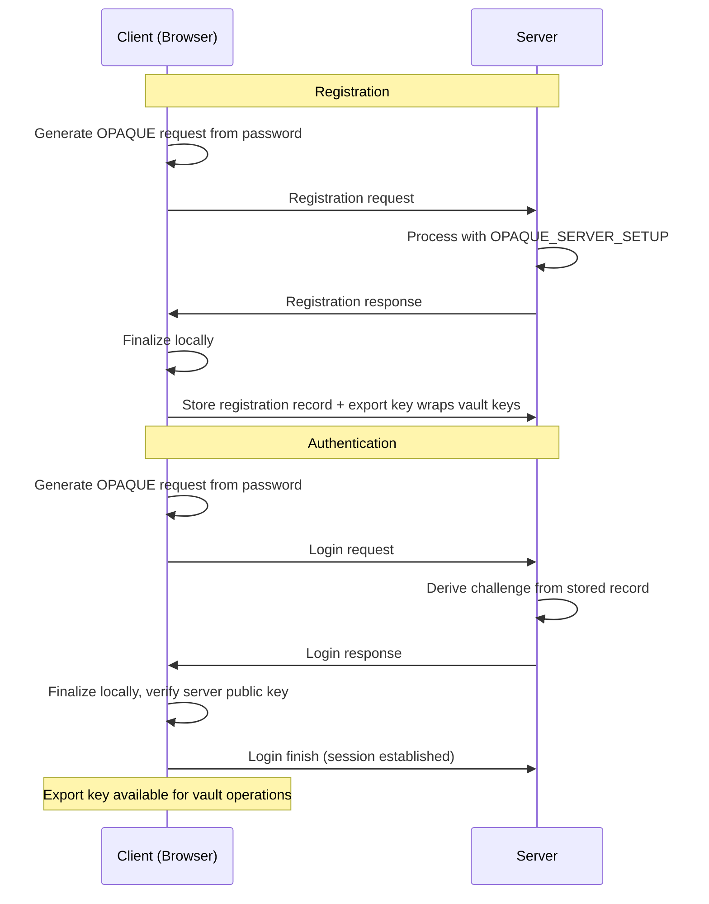

Password authentication in Zentity uses OPAQUE, an augmented PAKE protocol that ensures the server never receives or stores the plaintext password. This document explains the protocol's security properties, the breach impact model, and the layered password policy. The axis of variation is where each defense operates: the protocol layer (OPAQUE), the policy layer (HIBP blocking), or the UX layer (client-side pre-checks). For users without passkey support, OPAQUE provides password-based authentication. For Web3-native users, wallet-based authentication (EIP-712) is available as an alternative that requires no password at all; see [Cryptographic Pillars](<../(concepts)/cryptographic-pillars.md>) for the wallet KEK derivation model.

## OPAQUE Protocol

OPAQUE is an augmented PAKE: the client never sends the raw password to the server, and the server stores a registration record instead of a password hash.

During both registration and login, the client generates an OPAQUE request from the password. The server replies with a challenge derived from its private server setup. The client finishes the flow locally, producing a registration record (stored server-side) and an export key (used client-side to wrap secret vault keys).

To prevent man-in-the-middle attacks, the client verifies the server's static public key. In production, this key is pinned via a public configuration value, with a fallback to the OPAQUE public key endpoint.

---

The protocol ensures the password never reaches the server. The next section examines what an attacker gains under different compromise scenarios.

## Breach Impact Model

The security value of OPAQUE is most visible under breach scenarios. The three levels of compromise produce progressively worse outcomes, but even the worst case is significantly better than traditional password hashing.

- **DB compromise only**: Attackers obtain registration records but cannot validate password guesses offline without the server setup secret.
- **DB + server setup compromise**: Attackers can attempt offline guesses; Argon2 key stretching increases the cost of each guess.
- **Server logs**: Never contain plaintext passwords, because the server never receives them.

All three auth methods (passkey, OPAQUE, wallet) provide equivalent key custody guarantees. Current OPAQUE ciphersuites are not post-quantum; if PQ requirements arise, alternative PAKEs or future OPAQUE suites will be evaluated.

---

OPAQUE handles the password exchange. The next section describes the policy layer that prevents users from choosing compromised passwords in the first place.

## Password Policy

The policy operates at two layers with different enforcement boundaries. The server-enforced rules are the security boundary; the client-side checks are UX helpers that reduce friction.

### Server-Enforced (Authoritative)

- Length: 10 to 128 characters
- Breached password blocking via HIBP

The server enforces breached-password blocking during email+password sign-up, password reset, and password change. If the password appears in known breaches, the request is rejected with `PASSWORD_COMPROMISED`. This is the real security boundary.

### Client-Side (UX Guidance Only)

- Avoid containing the user's email
- Avoid containing the document number (when available in the flow)
- Recommended diversity: upper, lower, number, symbol (not enforced)

Client-side checks must never be relied on for enforcement.

---

The server-enforced policy rejects known-compromised passwords, but checking against HIBP requires care to avoid leaking the password. The next section explains the privacy model for this check.

## Breach Check Privacy Model

### UX Pre-Check

To reduce frustration, the UI performs a pre-check after the user completes both password fields. The check runs on blur when fields match, and the UI can hold submission while the check completes. If the password is compromised, the UI shows a warning and blocks the submit button.

### What the Browser Sends

The client does not send the plaintext password. It computes SHA-1 of the password (uppercase hex) and sends only the hash to the server-side route handler.

### What the Server Sends to HIBP

The route handler uses the Have I Been Pwned range API (k-anonymity): it sends only the first 5 characters of the SHA-1 hash prefix to HIBP, never the plaintext password. The HIBP `Add-Padding` header reduces response size leakage.

### DevTools Visibility

Users can inspect what their browser sends in the Network tab. The goal is not to hide requests from the user (impossible) but to ensure plaintext passwords are not transmitted or stored for a UX-only check.

## Future Improvements

- **Reduce duplicate upstream checks**: Better Auth also runs its own HIBP check on submit. Short-lived, non-identifying caching on the server-side route handler can reduce external calls without weakening enforcement.
- **Rate limiting**: Per-IP and per-session limits on the pre-check endpoint to prevent abuse.
- **Passwordless**: Prefer passkeys, wallet auth, or magic links for stronger phishing resistance and less password exposure.
- **Key-stretching profiles**: Make OPAQUE key stretching configurable per environment with careful migration planning.
