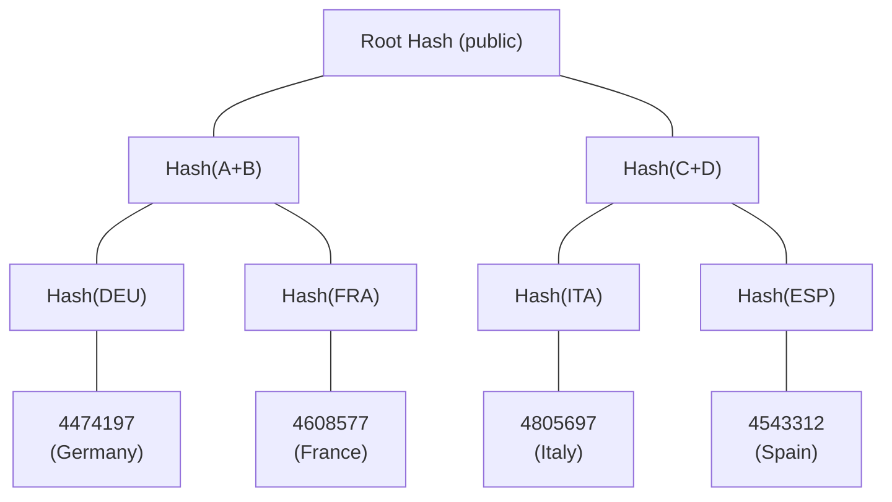

Nationality verification in Zentity uses zero-knowledge Merkle membership proofs: the user proves their country belongs to a defined group (e.g., EU, SCHENGEN) without revealing which country it is. This document explains the Merkle tree construction, the proof mechanism, and the performance and security properties. The axis of variation is privacy versus verifiability: how much the verifier learns as a function of what the user reveals.

## The Problem

In traditional KYC/AML systems, when a service needs to verify that a user is from an EU country, they must:

1. See the user's actual passport
2. Extract the nationality field (e.g., "Germany")
3. Check if "Germany" is in the EU list

The service now knows the user is German. This information can be:

- Leaked in data breaches
- Sold to third parties
- Used for profiling or discrimination

What if we could prove "I'm from an EU country" without revealing which one?

---

## The Solution: Zero-Knowledge Merkle Membership Proofs

A Zero-Knowledge (ZK) proof allows someone to prove a statement is true without revealing the underlying data.

### Our Approach

```text
Traditional:        "I'm German" → Service knows: German
ZK Proof:           "I'm in the EU" → Service knows: EU member (but not which country)
```

We use a **Merkle tree** structure where:

- Each EU country is a "leaf" in the tree
- The tree has a unique "root hash" that identifies the EU group
- A user can prove their country is a leaf in the tree without revealing which leaf

---

## How Merkle Trees Work

### Building the Tree



1. Each country code is converted to a **weighted-sum encoding**: `char1×65536 + char2×256 + char3` (e.g., DEU = `'D'×65536 + 'E'×256 + 'U'` = 4474197). This encoding is compatible with the ZKPassport ecosystem via `getCountryWeightedSum()`.
2. Each code is hashed using **Poseidon2** (a ZK-friendly hash function)
3. Hashes are paired and hashed together, building up to a single root

> **ZK vs FHE encoding:** ZK circuits use the weighted-sum encoding described above. FHE encryption uses a separate numeric encoding for homomorphic operations on country codes. The two encodings serve different subsystems and are not interchangeable.

### The Merkle Root

The root hash uniquely identifies the set of countries:

- EU has one root
- SCHENGEN has a different root
- LATAM has another different root

You can publish the root without revealing what's in the tree.

### Proving Membership

To prove Germany (DEU) is in the EU tree, you provide:

1. Your country code (private): 4474197 (weighted-sum of "DEU")
2. The "sibling" hashes along the path to the root (private)
3. The path directions - left or right at each level (private)
4. The expected root (public)

The circuit:

1. Hashes your country code
2. Combines it with each sibling hash following the path
3. Checks if the result equals the expected root

If it matches → your country IS in the set (but verifier doesn't know which one!)

---

## Implementation Notes

- **Claim binding**: proofs are bound to a server‑signed claim hash to prevent client tampering.
- **Public inputs**: include the Merkle root, nonce, and claim hash; see [ZK Architecture](zk-architecture.md) for the proof structure.
- **Merkle roots** are computed with Poseidon2 and cached client‑side for repeat proofs.

## Poseidon2 vs SHA256 in ZK Circuits

### The Problem with SHA256 in ZK Circuits

ZK circuits work over a mathematical structure called a "finite field."

SHA256 uses:

- Bitwise operations (XOR, AND, OR)
- Bit rotations
- 32-bit integer arithmetic

These operations are **extremely expensive** in ZK circuits because:

- Each bit operation becomes many "constraints"
- A single SHA256 hash = ~25,000 constraints
- Our 8-level Merkle tree would need ~200,000 constraints just for hashing

### Poseidon: Designed for ZK

Poseidon hash was specifically designed for ZK circuits:

- Uses field arithmetic (addition, multiplication mod prime)
- These operations are "native" to ZK circuits
- A single Poseidon hash = ~200-300 constraints
- 8-level Merkle tree = ~2,500 constraints total

100x more efficient, faster proof generation, smaller proofs.

---

## Tree Depth

| Levels | Max Countries | Use Case |
|--------|---------------|----------|
| 4      | 16            | Small groups (FIVE_EYES) |
| 8      | 256           | All country groups |
| 12     | 4,096         | Overkill |

8 levels supports up to 256 countries per group, which is more than enough for any country group (EU has 27, SCHENGEN has 26, etc.).

Implementation details (circuit code and client prover wiring) live in [ZK Architecture](zk-architecture.md).

---

## Country Groups

### Supported Groups

| Group | Countries | Example Members |
|-------|-----------|-----------------|
| `EU` | 27 | DEU, FRA, ITA, ESP, POL... |
| `SCHENGEN` | 26 | EU minus IRL/CYP/BGR/ROU + CHE, NOR, ISL, LIE |
| `EEA` | 30 | EU + ISL, NOR, LIE |
| `LATAM` | 19 | DOM, MEX, BRA, ARG, CHL, COL, PER... |
| `FIVE_EYES` | 5 | USA, GBR, CAN, AUS, NZL |

### Each Group Has a Unique Root

The Merkle root is computed from each group’s country codes and uniquely identifies the set. The verifier only needs the root; the group membership itself stays private.

---

## Performance

Performance varies by device, thread availability, and circuit size.
Treat any numbers as **order-of-magnitude guidance**, not guarantees.

Proofs are generated in Web Workers to keep the UI responsive.

---

## Security Properties

### What the Proof Guarantees

1. **Soundness:** Cannot prove membership for a country NOT in the group
2. **Zero-Knowledge:** Verifier learns ONLY that the country is in the group
3. **Non-Interactive:** Proof can be verified without interaction with prover
4. **Replay Resistance:** Nonce binding prevents proof reuse

### What the Proof Does NOT Guarantee

1. **Liveness:** Doesn't prove you're actually from that country (need passport verification)
2. **Uniqueness:** ZK proofs alone don't prevent duplicates. Platform-level HMAC dedup on the OCR path (`dedupKey` unique constraint) prevents the same document from registering under multiple accounts. NFC path uses ZKPassport's `uniqueIdentifier` nullifier.
3. **Timeliness:** Nonce provides session binding, not timestamp

### Integration with KYC / Regulated Verification

In Zentity's flow:

1. OCR extracts nationality from passport (e.g., "DEU") and signs the claim
2. MRZ checksums validate document data consistency
3. Face match verifies it's your passport
4. ZK nationality proof is generated **client-side** in the browser, bound to `claim_hash`
5. Only the proof + public inputs are sent to the server and stored, never "DEU"

---

## Further Reading

- [Poseidon Hash Paper](https://eprint.iacr.org/2019/458.pdf)
- [Noir Documentation](https://noir-lang.org/docs)
- [Barretenberg (bb.js)](https://github.com/AztecProtocol/aztec-packages/tree/master/barretenberg)
