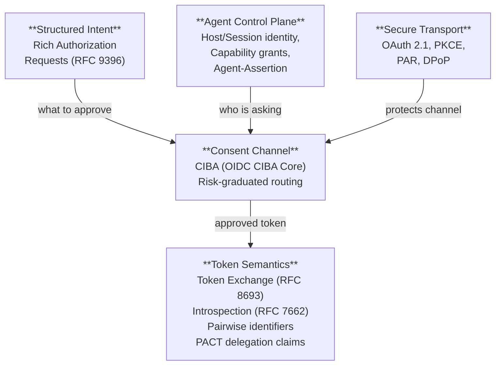
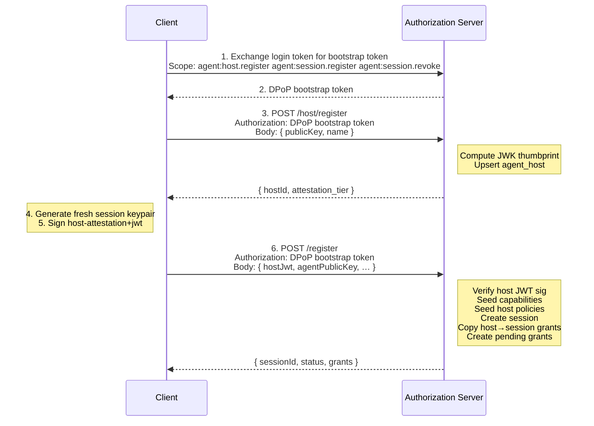
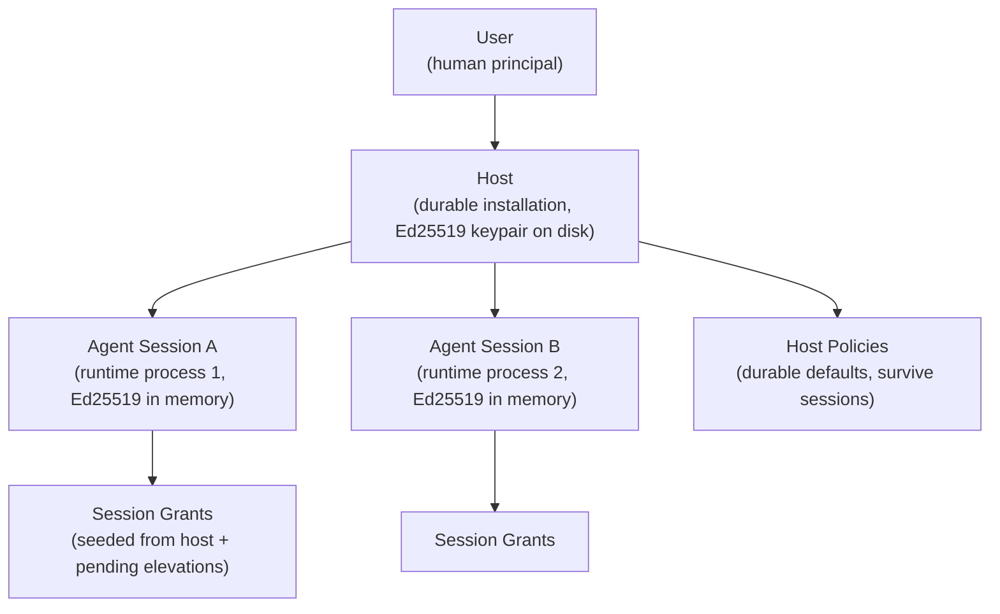
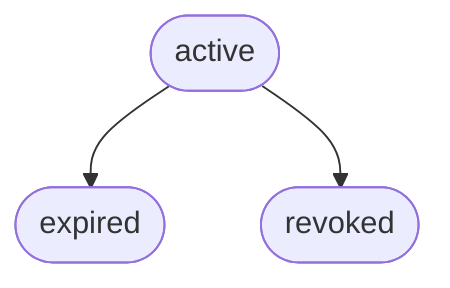
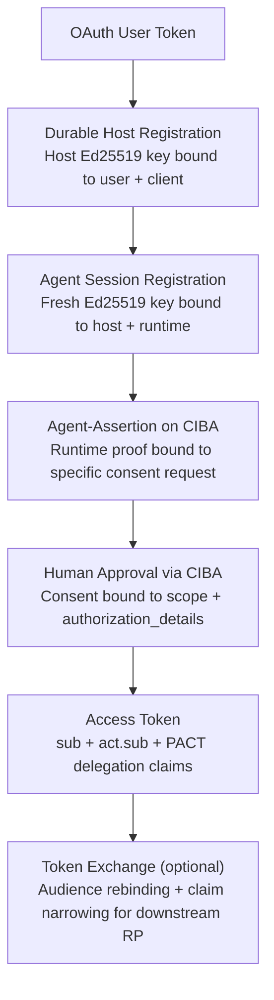

## Version 0.1-draft

**Status:** Draft\
**Date:** 2026-03-22

---

## Abstract

PACT (Private Agent Consent and Trust Profile) is a security profile of OAuth 2.1 for privacy-preserving agent delegation. It extends VEIL and composes OIDC CIBA Core 1.0 and OAuth Token Exchange (RFC 8693). PACT defines a durable-host plus ephemeral-session control plane, a delegation token claim vocabulary, runtime identity proofs using Ed25519 JWTs, capability grants with typed constraints and usage limits, risk-graduated consent routing, and claim narrowing on token exchange to non-agent audiences. Claim names align with the Agent Auth Protocol and draft-aap-oauth-profile (§17).

---

## 1. Introduction

An agent acting on behalf of a human needs three properties at once: machine authentication (the caller proves it is a specific runtime, not merely the application that launched it), human consent (the human approves sensitive actions through a channel the agent cannot subvert), and privacy-preserving delegation (the relying party learns who acted without receiving a globally trackable identifier).

Existing specifications cover each property in isolation. CIBA (OIDC CIBA Core 1.0) provides a backchannel consent channel. DPoP (RFC 9449) sender-constrains tokens. RAR (RFC 9396) carries structured authorization payloads. Token Exchange (RFC 8693) rebinds audience and scope. PACT specifies how agent identity, human consent, and token issuance compose into a single delegation flow.

The profile composes and constrains the following specifications:

| Concern | Specifications |
|---------|---------------|
| Secure Transport | OAuth 2.1 (draft-ietf-oauth-v2-1), PKCE (RFC 7636), PAR (RFC 9126), DPoP (RFC 9449) |
| Structured Intent | Rich Authorization Requests (RFC 9396) |
| Agent Control Plane | PACT (this document), OAuth Client Attestation (draft-ietf-oauth-attestation-based-client-auth-08) |
| Consent Channel | CIBA (OIDC CIBA Core 1.0) |
| Token Semantics | Token Exchange (RFC 8693), Token Introspection (RFC 7662), OIDC Core Pairwise Identifiers |

This document specifies: pairwise agent identifiers (§4.3), risk-graduated consent routing (§6.2), usage-limited capability grants (§5.5), cryptographic binding chains (§11), ephemeral identity disclosure (§11.5), and claim narrowing on token exchange (§8).

---

## 2. Conventions and Terminology

### 2.1 Notational Conventions

The key words "MUST", "MUST NOT", "REQUIRED", "SHALL", "SHALL NOT", "SHOULD", "SHOULD NOT", "RECOMMENDED", "MAY", and "OPTIONAL" in this document are to be interpreted as described in RFC 2119 and RFC 8174.

### 2.2 Versioning

PACT uses `MAJOR.MINOR[-draft]` versioning. Implementations MUST reject configurations or discovery documents with an unrecognized major version. Implementations SHOULD accept documents with a higher minor version than expected and ignore unrecognized fields, preserving forward compatibility.

### 2.3 Definitions

**Agent Session.** An ephemeral runtime identity for one live process. Each session holds its own Ed25519 keypair. The private key exists only in process memory.

**Agent-Assertion.** A short-lived EdDSA JWT (`typ: agent-assertion+jwt`) signed by the session private key, proving possession of the runtime identity at the time of a consent request.

**Approval Strength.** A capability-level declaration of the minimum consent mechanism required: `none` (auto-approve), `session` (active user interaction), or `biometric` (unforgeable user verification).

**Authorization Server (AS).** The server that implements this profile, managing identity registration, capability grants, consent routing, and token issuance.

**Binding Chain.** The sequence of cryptographic proofs connecting an OAuth user token through host registration, session registration, runtime assertion, human consent, and delegated token issuance.

**Capability.** A server-defined named action with optional JSON Schema for input and output, and a required approval strength. PACT's unit of authorization.

**Capability Grant.** An authorization record linking one agent session to one capability, with optional typed constraints, usage limits, and an expiration time.

**Client.** The process that holds the host identity, manages keys, signs JWTs, and presents tools to the agent runtime. In MCP deployments, the MCP server.

**Constraint.** A typed restriction on a grant's input parameters. Operators: `eq`, `min`, `max`, `in`, `not_in`.

**Durable Host.** The persistent installation identity for a client environment. Survives across process restarts. Holds an Ed25519 keypair persisted to disk.

**Host Policy.** A durable capability grant attached to a host rather than a session. Survives session expiry and seeds new sessions.

**Pairwise Agent Identifier.** A per-relying-party pseudonym derived from the session ID and the RP's sector identifier, preventing cross-RP agent correlation.

**Relying Party (RP).** A service that receives and validates delegated agent tokens.

**Session Grant.** An ephemeral capability grant attached to one agent session. Seeded from host policies at registration; may be elevated via consent.

**Usage Ledger.** An append-only record of capability executions, used to enforce daily limits and cooldowns atomically.

---

## 3. Compositional Architecture

### 3.1 Five Compositional Concerns

PACT's constituent standards group into five concerns: secure transport, structured intent, agent control plane, consent channel, and token semantics. Each concern produces inputs for the next, from machine authentication through human approval to token issuance and relying-party verification.



**Secure Transport** sits beneath the other four concerns because removing any transport spec changes security properties, not the agent model. DPoP is the one transport spec that crosses into agent territory: when token exchange mints a downstream token from a CIBA access token, DPoP re-binds the issued token to the caller's proof-of-possession key.

**Structured Intent** carries typed payloads through the flow. RAR (`authorization_details`) is submitted on the CIBA request, retained on the CIBA request record during consent evaluation, and projected onto downstream exchanged tokens (§8). The approved typed payload does not appear on the CIBA-issued access token itself.

**Agent Control Plane** establishes who is asking. It produces two outputs: the `Agent-Assertion` JWT that enters the consent channel as runtime proof, and the capability grants that determine whether consent can short-circuit into automatic approval.

**Consent Channel** carries the human approval interaction. CIBA binds the runtime proof to a specific consent request. The CIBA `auth_req_id` serves as the trace identifier correlating agent identity, consent, and token issuance.

**Token Semantics** encodes the authorized delegation. Token exchange rebinds audience and recomputes pairwise identifiers. Introspection re-evaluates session lifecycle at query time. The delegation claim vocabulary is defined in §7.

### 3.2 Runtime Participants

| Role | Function |
|------|----------|
| **Agent** | The AI actor scoped to a conversation, task, or session. Does not hold keys directly. |
| **Client** | Process holding the host identity; manages keys, signs JWTs, presents tools. |
| **Authorization Server** | Manages registrations, capability grants, consent routing, and token issuance. |
| **Relying Party** | Receives delegated tokens; validates agent identity via introspection or JWT verification. |
| **User** | The human principal who approves sensitive actions via CIBA. |

### 3.3 Three Caller Classes

PACT distinguishes three caller classes by authentication mode and scope.

| Caller | Authentication | Scope |
|--------|---------------|-------|
| Browser user | Session cookie | Dashboard and browser-only surfaces |
| User-delegated machine | OAuth access token exchanged into a dedicated DPoP-bound bootstrap token | Agent host/session registration, revocation |
| Pure machine client | `client_credentials` access token | Introspection, resource-server APIs |

Registration, introspection, and token exchange are machine-facing OAuth surfaces; human consent is obtained separately through CIBA (§6). A client bootstrapping an agent host MUST NOT reuse a login token for registration: it MUST first exchange that token for a DPoP-bound bootstrap token carrying narrow agent scopes (§4.1).

---

## 4. Principal Separation

PACT separates agent identity into three layers with distinct lifetimes and audiences. The host is durable (persistent across process restarts). The session is ephemeral (fresh per runtime instance, enabling per-session audit). The pairwise identifier shown to each relying party is uncorrelatable across services.

### 4.1 Durable Host

A host is the persistent installation identity for a client environment. It represents a specific installation on a specific machine, not a user or an application.

**Bootstrap.** The client first exchanges its pairwise login token via RFC 8693 for a short-lived DPoP-bound bootstrap token carrying `agent:host.register`. `POST {host_registration_endpoint}` authenticates with that bootstrap token, not the login token.

**Request:**

```json
{
  "publicKey": "<Ed25519 JWK as JSON string>",
  "name": "Claude Code on laptop-A"
}
```

**Response:**

```json
{
  "hostId": "ah_...",
  "created": true,
  "attestation_tier": "unverified"
}
```

**Identity properties:**

| Property | Value |
|----------|-------|
| Key type | Ed25519 (RFC 8037) |
| Identity anchor | JWK Thumbprint (RFC 7638, SHA-256) |
| Persistence | Client-side file, server-side record |
| Uniqueness | One thumbprint per `(user, client)` pair. Same user and client MAY have multiple hosts (different machines). |
| Binding | A host key MUST NOT be rebound across users or OAuth clients. |

**Key storage.** The client MUST persist the host keypair in a namespace derived from the server URL, OAuth client ID, and the authenticated account subject (or another stable per-user identifier):

```text
~/.zentity/hosts/<SHA-256(zentityUrl + ":" + clientId + ":" + accountSub)>.json
```

The file MUST be stored with mode `0600`. The directory MUST be created with mode `0700`.

**Attestation.** Host registration MAY include vendor attestation headers per draft-ietf-oauth-attestation-based-client-auth-08:

- `OAuth-Client-Attestation`: a JWT signed by a trusted vendor (e.g., Anthropic), containing a `cnf.jwk` matching the host's public key.
- `OAuth-Client-Attestation-PoP`: a proof-of-possession JWT signed by the host's private key.

The server verifies attestation JWTs against JWKS URLs configured in `TRUSTED_AGENT_ATTESTERS`. Verification uses a hardened JWKS fetcher that rejects unsafe remote key sources (private/loopback IPs, non-HTTPS in production, responses exceeding 1 MB, timeouts beyond 5 seconds).

Attestation results in an elevated trust tier that widens default host policy (Section 5.4).

### 4.2 Ephemeral Session

An agent session is the runtime identity for one live process. Each session holds its own Ed25519 keypair. The private key MUST exist only in process memory, and MUST NOT be persisted to disk.

**Registration.** `POST {registration_endpoint}` with the bootstrap token carrying `agent:session.register` and a host attestation JWT.

The host attestation JWT (`typ: host-attestation+jwt`) proves the client possesses the durable host key:

```json
{
  "typ": "host-attestation+jwt",
  "alg": "EdDSA"
}
.
{
  "iss": "<hostId>",
  "sub": "agent-registration",
  "iat": 1711000000,
  "exp": 1711000060
}
```

This JWT MUST be signed with the host's Ed25519 private key and MUST expire within 60 seconds.

**Request:**

```json
{
  "hostJwt": "<host-attestation+jwt>",
  "agentPublicKey": "<Ed25519 JWK as JSON string>",
  "requestedCapabilities": ["purchase", "read_profile"],
  "display": {
    "name": "Claude Code",
    "model": "claude-sonnet-4-20250514",
    "runtime": "node",
    "version": "1.0.0"
  }
}
```

**Response:**

```json
{
  "sessionId": "as_...",
  "status": "active",
  "grants": [
    { "capability": "check_compliance", "status": "active" },
    { "capability": "request_approval", "status": "active" },
    { "capability": "purchase", "status": "pending" },
    { "capability": "read_profile", "status": "pending" }
  ]
}
```

**Registration sequence:**



**Identity hierarchy:**



### 4.3 Cross-Party Unlinkability

Agent identifiers in delegated tokens MUST be pairwise per relying party by default. Without pairwise derivation, the session identifier would travel to every relying party as a stable cross-service correlator (see §13.1 for the full threat analysis).

**Derivation:**

```text
act.sub = MAC(PAIRWISE_SECRET, sector + "." + sessionId)
```

Where:

- `MAC` is a keyed message authentication code with at least 128 bits of output. HMAC-SHA-256 (RFC 2104) meets this requirement.
- `PAIRWISE_SECRET` is a server-side secret of at least 32 bytes.
- `sector` is the RP's registered sector identifier, following the same mechanism used for user pairwise `sub` in VEIL Section 4.2. Deployments that do not yet support `sector_identifier_uri` MUST still enforce a stable single-host registration rule so the derived sector remains deterministic.
- `sessionId` is the internal agent session identifier.

**Properties:**

- Two RPs receiving tokens from the same agent session see different `act.sub` values.
- The same derivation applies to `agent.id` in the PACT delegation claim set.
- Deployments that need global agent tracking MUST use an agent-specific client setting distinct from VEIL's user-facing `subject_type`. Reusing `subject_type` would disable pairwise user identifiers at the same time.
- Pairwise derivation uses the session ID (not host ID) because the acting principal is the runtime session, not the installation.

**Where pairwise identifiers appear:**

- `act.sub` in access tokens
- `agent.id` in the PACT delegation claim set
- `act.sub` in tokens issued by token exchange (re-derived for the target audience; §8)
- The introspection response
- The CIBA request snapshot (server-side)

The threat model and mitigation rationale are described in §13.1. Pairwise derivation extends OIDC Core's user-`sub` privacy model to the agent principal.

### 4.4 Trust Gradation

Host attestation assigns a host to one of two trust tiers. Attestation widens the default host policy but does not create a separate token class or silently widen identity-disclosure capabilities.

| Tier | How reached | Effect on default host policy |
|------|-------------|-------------------------------|
| `unverified` | Default registration | `check_compliance`, `request_approval` |
| `attested` | Valid `OAuth-Client-Attestation` + PoP | Same default capability floor; trust tier is surfaced in UI, tokens, and introspection |

A host's attestation tier is recorded at registration and surfaces in the approval UI (for example, "Verified by Anthropic" versus "Unverified agent"), in token claims (`agent.runtime.attested: true/false`), and in introspection responses.

---

## 5. Named-Action Containment

Capability-based authorization determines whether a session can perform an action without interrupting the user. The registry defines named actions, grants bind them to sessions, constraints restrict parameters, and the usage ledger enforces temporal and cumulative limits.

### 5.1 The Registry

Capabilities are server-defined named actions. Each capability declares:

| Field | Type | Required | Description |
|-------|------|----------|-------------|
| `name` | string | Yes | Stable snake_case identifier |
| `description` | string | Yes | Human-readable description |
| `input_schema` | JSON Schema | No | Expected input parameters |
| `output_schema` | JSON Schema | No | Expected output shape |
| `approval_strength` | enum | Yes | `none`, `session`, or `biometric` |

**Discovery.** `GET {capabilities_endpoint}` returns the full registry. No authentication required.

```json
[
  {
    "name": "purchase",
    "description": "Authorize and execute purchases on behalf of the user",
    "input_schema": { "..." },
    "output_schema": { "..." },
    "approval_strength": "biometric"
  },
  {
    "name": "read_profile",
    "description": "Read identity profile and verification status",
    "approval_strength": "session"
  },
  {
    "name": "check_compliance",
    "description": "Check on-chain attestation and compliance status",
    "approval_strength": "none"
  },
  {
    "name": "request_approval",
    "description": "Request explicit user approval via push notification",
    "approval_strength": "session"
  }
]
```

### 5.2 Grants

A grant links one agent session (or host) to one capability with optional constraints, usage limits, and an expiration time.

| Field | Type | Description |
|-------|------|-------------|
| `capability_name` | string | The capability being granted |
| `status` | enum | `pending`, `active`, `denied`, `revoked` |
| `constraints` | object | Typed constraint operators (Section 5.3) |
| `daily_limit_count` | integer | Max executions per 24-hour window |
| `daily_limit_amount` | number | Max cumulative amount per 24-hour window |
| `cooldown_sec` | integer | Minimum seconds between executions |
| `source` | string | `host_policy`, `session_elevation`, or `user_grant` |
| `expires_at` | timestamp | Per-grant TTL, independent of session TTL |

### 5.3 Typed Constraints

Constraints restrict the input values a grant authorizes. They use the input schema field names as keys.

| Operator | Type | Semantics |
|----------|------|-----------|
| `max` | number | Value MUST be `<=` max |
| `min` | number | Value MUST be `>=` min |
| `eq` | any | Value MUST equal the constraint value |
| `in` | array | Value MUST be a member of the array |
| `not_in` | array | Value MUST NOT be a member of the array |

Within one grant, all constraints are AND (all must pass). Across multiple grants for the same capability, the first matching active grant wins (OR).

**Example:**

```json
{
  "capability": "purchase",
  "status": "active",
  "constraints": {
    "amount.value": { "max": 100 },
    "amount.currency": { "in": ["USD", "EUR"] },
    "merchant": { "not_in": ["blocked-merchant"] }
  },
  "daily_limit_count": 10,
  "daily_limit_amount": 500,
  "cooldown_sec": 60
}
```

**Constraint extraction.** For capability evaluation, the server extracts constraint-matchable values from `authorization_details` (RFC 9396). The `type` field maps to a capability name. Nested fields use dot notation (`amount.value`, `amount.currency`).

**Bidirectional negotiation.** The agent proposes constraints at registration, and the server or user can narrow them. The server MUST NOT widen constraints beyond what the agent proposed without a new approval.

**Unknown operators.** If a grant contains an unrecognized constraint operator, the server MUST reject the evaluation with a `constraint_violated` error.

### 5.4 Durable Defaults vs. Ephemeral Elevations

The policy model is split for the same reason identity is split: durable defaults and per-runtime elevations have different lifetimes and different trust properties.

**Host policies** are durable and host-scoped. They survive across sessions, are seeded by defaults or attestation tier, carry constraints and usage limits, and are modified only by the user or server admin.

**Session grants** are ephemeral and session-scoped. They belong to one live session, are copied from host policies at session registration (status: `active`), are created as pending elevations for requested capabilities beyond defaults (status: `pending`), and expire when the session expires or is revoked.

**Seeding sequence** at session registration:

1. Ensure the capability registry is populated.
2. Ensure default host policies exist for the host's trust tier.
3. Copy all active host policies into active session grants (`source: host_policy`).
4. Create pending session grants for requested capabilities not in the defaults (`source: session_elevation`).

### 5.5 Temporal and Cumulative Limits

The usage ledger is an append-only table recording each approved execution. It enforces limits on execution frequency and cumulative totals, independent of the per-request constraint checks in §5.3.

**Scope determination.** Usage is scoped to the narrowest applicable boundary:

- If the grant is backed by a host policy: scope to the host policy (shared across sessions).
- If the grant is session-specific: scope to the session grant.
- Fallback: scope to the session.

This allows daily limits on host policies to be shared across sessions for the same installation.

**Enforcement sequence** (within a single database transaction):

1. **Cooldown check.** Query the ledger for any execution within `cooldown_sec` of `now`. If found, reject.
2. **Daily count check.** Count executions in the last 24 hours. If `count >= daily_limit_count`, reject.
3. **Daily amount check.** Sum `amount` in the last 24 hours. If `sum + request.amount > daily_limit_amount`, reject.
4. **Record.** Insert a new ledger entry. Return success.

The transaction ensures atomicity; two concurrent requests cannot both pass a limit that only has room for one.

Capability containment defines what an agent may do. It does not answer when the human must be involved in that decision.

---

## 6. Risk-Proportional Consent

At runtime, a delegation request must be routed to one of three outcomes: auto-approved (within pre-authorized limits), interactive approval (user prompt required), or denied. PACT uses CIBA (Client-Initiated Backchannel Authentication) as the transport and defines the routing logic that selects the outcome.

### 6.1 CIBA as Correlation Point

The CIBA `auth_req_id` correlates agent identity (from the control plane), human consent (from the approval interaction), token issuance (from the token endpoint), and the audit trail (from the usage ledger). An `Agent-Assertion` JWT MUST be bound to a specific `auth_req_id`; it MUST NOT be accepted as general runtime authentication outside the CIBA request it carries.

### 6.2 Three Routing Outcomes

The consent router produces three outcomes based on the capability's `approval_strength` and the agent's session grants. They differ along one axis: how much human involvement is required.

| Outcome | When | Human interruption |
|---------|------|-------------------|
| **Silent approval** | Active grant exists, constraints pass, limits not exceeded, and capability strength is `none` | None |
| **Session approval** | No matching grant, or strength is `session` | Push notification with inline approve/deny |
| **Biometric approval** | Capability strength is `biometric` | Push notification with "Open to approve" link only; WebAuthn `userVerification: required` on the approval page |

**What silent approval can never do.** The evaluator MUST refuse automatic approval in these cases:

- Any request containing identity scopes (scopes that would release PII)
- Any request whose derived capability is missing from the registry
- Any capability whose approval strength is `biometric`
- Any request without an active matching grant
- Any request that exceeds cooldown or daily limits

That refusal is as important as the happy path. Containment works because the "no" cases are crisp.

### 6.3 Runtime Proof

Before requesting consent, the client signs an `Agent-Assertion` JWT with the session's Ed25519 private key:

```json
{
  "typ": "agent-assertion+jwt",
  "alg": "EdDSA"
}
.
{
  "iss": "<sessionId>",
  "jti": "<unique>",
  "iat": 1711000000,
  "exp": 1711000060,
  "host_id": "<hostId>",
  "task_id": "<unique task identifier>",
  "task_hash": "<SHA-256 hex of binding_message>"
}
```

The assertion is placed in the `Agent-Assertion` HTTP header on the CIBA backchannel authorize request.

`binding_message` is the OIDC CIBA Core 1.0 request parameter (Section 7.1 of that specification), defined there as a human-readable display value. PACT retains its human-visible role in the approval UI and additionally requires that a `binding_message` be present whenever an `Agent-Assertion` is present. The `task_hash` claim is defined as `SHA-256(binding_message)`, giving the agent cryptographic commitment to the same string the human will see. An assertion whose `task_hash` does not match the CIBA request's `binding_message` MUST NOT produce agent-bound token semantics.

**Verification sequence:**

1. Decode payload without verification to extract `iss` (= sessionId).
2. Load session from the database.
3. Verify session status is `active`.
4. Import session's stored public key.
5. Verify JWT signature with `algorithms: ["EdDSA"]`.
6. Verify `typ` header is `agent-assertion+jwt`.
7. Compute session lifecycle state (Section 9). Reject if not `active`.
8. Compute `SHA-256(binding_message)` and compare to `task_hash`. MUST match.
9. Verify host ownership: the session's host MUST belong to the same user and OAuth client as the CIBA request.

**Binding to CIBA request.** On successful verification, the server snapshots server-owned metadata onto the CIBA request record:

| Field | Source |
|-------|--------|
| `agent_session_id` | Session record |
| `host_id` | Session's parent host |
| `display_name`, `runtime`, `model`, `version` | Session registration metadata |
| `task_id`, `task_hash` | Agent-Assertion claims |
| `assertion_verified` | `true` |
| `pairwise_act_sub` | Derived for the requesting OAuth client |
| `attestation_provider`, `attestation_tier` | Host attestation metadata |

This snapshot ties the later token to the actual registered runtime, not a free-form claim supplied by the client.

**CIBA request integrity.** Three additional security properties apply to CIBA requests in PACT:

1. **Release handle binding.** The CIBA release handle (used to exchange an approved request for tokens) MUST be cryptographically bound to `(userId, authReqId, clientId)`. A handle obtained from one request MUST NOT redeem a different request.
2. **Atomic status transitions.** The transition from `approved` to `redeemed` MUST use compare-and-swap semantics. Concurrent polling attempts that race the transition MUST fail rather than duplicate-issue tokens.
3. **Entropy.** `auth_req_id` values MUST be generated with cryptographic entropy sufficient to prevent enumeration (e.g., UUID v4).

### 6.4 Biometric Approval Strength

An agent with browser control (for example, Playwright or an MCP browser tool) can navigate to approval URLs and click buttons. The `biometric` approval strength defends against self-approval by requiring WebAuthn `userVerification: required`, a biometric or PIN gesture that the agent cannot produce.

For `biometric`-strength capabilities:

- Push notifications show "Open to approve" link only; inline approve/deny actions are disabled because they cannot trigger WebAuthn.
- The approval endpoint returns a WebAuthn challenge that MUST be satisfied before the approval is accepted.
- Password-based session re-authentication is insufficient because the agent may know the password.

The `session` strength accepts any in-session re-authentication an agent with browser access could automate (cookie presence, password re-entry). The `biometric` strength requires a WebAuthn user-verification ceremony that cannot be performed without the registered authenticator.

**Identity scope exception.** When a CIBA request includes identity scopes, push notifications MUST NOT include inline approve actions, even for `session`-strength capabilities. Vault unlock (required by VEIL Section 6 for identity claim delivery) cannot be triggered from a service worker or agent browser context, making identity-scoped requests functionally equivalent to `biometric` for inline approval purposes. The user MUST navigate to the approval page in a full browser context.

### 6.5 Capability Derivation

The consent router derives a capability name from the CIBA request's `authorization_details` and `scope`:

| Condition | Derived capability |
|-----------|--------------------|
| Any detail has `type === "purchase"` | `purchase` |
| Any scope is an identity scope | `read_profile` |
| Any scope is a proof scope (for example `proof:age` or `proof:compliance`) | `check_compliance` |
| Only `openid` scope, no typed details | `request_approval` |

The first matching row wins. The precedence order is `purchase` details, then identity scopes, then proof scopes, then `openid`-only requests. A mixed request (for example, purchase details plus `identity.*` scopes) is routed to the most sensitive derived capability.

---

## 7. Delegation Evidence

Approved delegations are encoded as JWT access tokens. The `sub` and `act` claims identify the user and agent principals. The `capabilities`, `oversight`, `audit`, and `delegation` claims describe the constraints and provenance.

### 7.1 The Delegation Token Profile

Access tokens issued after agent-verified CIBA approval carry the delegation claim set defined below. The `act` claim is used as specified in [RFC 8693] Section 4.1. The remaining claims (`agent`, `task`, `capabilities`, `oversight`, `audit`, `delegation`) are defined normatively in this document. Approved `authorization_details` (RFC 9396) are retained on the CIBA request record and emitted on exchange artifacts (§8), not on the CIBA-issued access token. Claim names align with draft-aap-oauth-profile (see §16, informative).

```json
{
  "iss": "https://as.example.com",
  "sub": "<pairwise user id for RP>",
  "aud": "<RP client_id>",
  "exp": 1711003600,
  "iat": 1711000000,
  "jti": "<unique>",
  "scope": "openid purchase",

  "act": {
    "sub": "<pairwise agent id for RP>"
  },

  "agent": {
    "id": "<pairwise agent id for RP>",
    "type": "mcp-agent",
    "model": {
      "id": "claude-sonnet-4-20250514",
      "version": "1.0.0"
    },
    "runtime": {
      "environment": "node",
      "attested": true
    }
  },

  "task": {
    "id": "task-uuid",
    "purpose": "purchase"
  },

  "capabilities": [
    {
      "action": "purchase",
      "constraints": [
        { "field": "amount.value", "op": "max", "value": 100 }
      ]
    }
  ],

  "oversight": {
    "approval_reference": "<auth_req_id>",
    "requires_human_approval_for": ["identity.*"]
  },

  "audit": {
    "trace_id": "<auth_req_id>",
    "session_id": "<pairwise agent id for RP>"
  },

  "cnf": {
    "jkt": "<DPoP key thumbprint>"
  }
}
```

**Claim semantics:**

| Claim | Semantics |
|-------|-----------|
| `sub` | Pairwise user identifier for the target RP |
| `act.sub` | Pairwise agent session identifier for the target RP |
| `agent.id` | Same as `act.sub`, pairwise agent identifier |
| `agent.type` | Agent runtime type (e.g., `mcp-agent`) |
| `agent.model` | Model metadata (informational, not security-critical) |
| `agent.runtime.attested` | Whether the host passed vendor attestation |
| `task.id` | Task identifier from the Agent-Assertion |
| `task.purpose` | Category-level intent (not verbatim description) |
| `capabilities` | Approved capabilities with their constraint snapshot |
| `oversight.requires_human_approval_for` | Scopes that MUST route through human approval |
| `audit.trace_id` | CIBA `auth_req_id` for end-to-end correlation |
| `cnf.jkt` | DPoP proof-of-possession key thumbprint |

**Conditional emission.** If `assertion_verified` is `false` on the CIBA request, delegation claims MUST NOT be emitted; the token is issued as a standard CIBA token without agent semantics.

### 7.2 Chain Tracking

When tokens are exchanged via RFC 8693 Token Exchange, the `delegation` claim tracks the chain:

```json
{
  "delegation": {
    "depth": 1,
    "max_depth": 3,
    "chain": ["<pairwise-agent-A>", "<pairwise-agent-B>"],
    "parent_jti": "<original-token-jti>"
  }
}
```

**Rules enforced on token exchange:**

- The server MUST maintain delegation lineage in canonical internal actor references (for example, raw session IDs), not only in the audience-projected identifiers emitted in tokens.
- `depth` incremented by 1 on each exchange.
- Current actor appended to the canonical lineage before projection.
- `delegation.chain` in the exchanged token MUST be projected for the current audience from the canonical lineage. Previous audience-specific pairwise values MUST NOT be copied verbatim into a new audience context.
- Implementations advertising `delegation_chains: true` MUST reject the exchange if `depth >= max_depth`.
- Implementations advertising `delegation_chains: true` MUST enforce **mandatory privilege reduction**: at least one of narrower capabilities, tighter constraints, shorter TTL, or lower `max_depth`.
- The first exchange from a CIBA access token to a non-agent audience satisfies privilege reduction by applying the claim-narrowing rules of §8: the issued token omits the delegation `agent`, `task`, `capabilities`, `oversight`, and `audit` sections, narrows `authorization_details` to the approved subset, and rebinds audience. If `delegation_chains` is `false`, the issued token MAY omit `delegation` as well; if `delegation_chains` is `true`, it MUST retain the projected `delegation` lineage needed for depth enforcement and family revocation. The issued token lifetime MUST NOT exceed the subject token's remaining lifetime.

**Family revocation.** Revoking a parent token (by `jti`) revokes all descendants reachable via `parent_jti` graph traversal.

---

## 8. Claim Narrowing on Token Exchange

When delegation evidence must cross an audience boundary, the AS uses RFC 8693 Token Exchange to mint a downstream token for the new audience. This section specifies what the AS MUST strip, project, and attenuate on every such exchange. The rules apply regardless of the `requested_token_type`; PACT does not mint any profile-specific artifact type.

### 8.1 Dropping Agent Control-Plane Claims

When the target audience is not itself an agent (the common case: a resource server or relying party consuming the delegated authorization), the issued token MUST omit the delegation `agent`, `task`, `capabilities`, `oversight`, and `audit` sections. These sections describe the agent control plane and leak agent-identifying context that a non-agent audience does not need for access decisions.

- If the deployment does not advertise `delegation_chains`, the issued token MAY omit `delegation` entirely.
- If the deployment advertises `delegation_chains: true`, the issued token MUST retain a projected `delegation` claim containing only the lineage needed for depth enforcement and family revocation (`depth`, `max_depth`, `chain`, `parent_jti`, `root_jti`; see §7). Previous audience-specific pairwise values MUST NOT be copied verbatim into the new audience context and MUST be recomputed per §4.3.

Claims that the downstream audience does need (`iss`, `aud`, `sub`, `act.sub`, `scope`, `authorization_details`, `cnf`, `jti`, `iat`, `exp`) are copied or recomputed from the subject token: pairwise identifiers are recomputed for the target audience (§4.3), DPoP binding is taken from the token exchange request's proof, and `authorization_details` is narrowed per §8.2.

### 8.2 Privilege Reduction

Every token exchange MUST enforce privilege reduction on the issued token:

- `scope` MUST be a subset of the subject token's scope.
- `authorization_details` MUST be a subset of the subject token's `authorization_details`.
- Lifetime MUST NOT exceed the subject token's remaining lifetime.

### 8.3 Request and Response

A downstream audience MAY negotiate a specialized `requested_token_type` (for example, a deployment-specific signed artifact type). The specific types are out of scope for this profile; the rules in §8.1 and §8.2 apply regardless of the chosen type.

**Request:**

```http
POST {token_endpoint}
  DPoP: <proof bound to the caller key>
  grant_type=urn:ietf:params:oauth:grant-type:token-exchange
  subject_token=<CIBA access token>
  subject_token_type=urn:ietf:params:oauth:token-type:access_token
  requested_token_type=urn:ietf:params:oauth:token-type:access_token
  audience=<target RP client_id>
```

**Issued token (illustrative):**

```json
{
  "iss": "https://as.example.com",
  "aud": "<target RP client_id>",
  "sub": "<pairwise user id for target RP>",
  "act": { "sub": "<pairwise agent id for target RP>" },
  "scope": "<narrowed subset>",
  "authorization_details": [
    {
      "type": "purchase",
      "merchant": "Acme",
      "item": "Widget",
      "amount": { "value": "29.99", "currency": "USD" }
    }
  ],
  "cnf": { "jkt": "<DPoP key thumbprint>" },
  "jti": "<unique>",
  "iat": 1711000000,
  "exp": 1711003600
}
```

The target RP validates the JWT signature against the AS's JWKS, verifies a matching DPoP proof against `cnf.jkt`, and enforces the `authorization_details` constraints. It does not need to understand the agent capability model; it only needs to trust the signature and proof-of-possession binding.

---

## 9. Temporal Boundaries

Agent sessions have bounded lifetimes. Expired or terminated sessions MUST NOT be reactivated.

### 9.1 Two Independent Clocks

Each agent session has two independent lifetime clocks: one tracks inactivity, the other tracks total elapsed time since session creation.

| Clock | Measured from | Default | Purpose |
|-------|--------------|---------|---------|
| Idle TTL | Last activity (`last_seen_at`) | 1800s (30 min) | Inactivity timeout |
| Max lifetime | Session creation (`created_at`) | 86400s (24 hours) | Total session cap |

**Lifecycle computation** (`resolveSessionLifecycle`):

1. If persisted status is `revoked` or `expired`: keep it (terminal).
2. Compute `idle_expires_at = last_seen_at + idle_ttl_sec * 1000`.
3. Compute `max_expires_at = created_at + max_lifetime_sec * 1000`.
4. If `now >= idle_expires_at` OR `now >= max_expires_at`: status is `expired`.
5. Otherwise: status is `active`.

Expiry is not only inferred at read time. It MUST be persisted to the database once observed.

### 9.2 No Reactivation



There is no reactivation path for sessions. If a session expires, the client creates a new session under the same host. This is simpler and more auditable than hidden reactivation logic, and it ensures that escalated session grants do not survive across activation boundaries.

### 9.3 Renewal Through Use

Session activity (`last_seen_at`) is updated after successful authenticated operations, specifically after successful Agent-Assertion binding during CIBA requests. The idle boundary is renewed by successful use, not by mere existence.

### 9.4 Revocation Cascade

An agent session can be revoked by the user (via dashboard or API), the client (via `POST {revocation_endpoint}` with the bootstrap token carrying `agent:session.revoke`), or the server (policy-based).

Revoking a session also revokes all its session grants (`status = "revoked"`, `revoked_at = now`). Revoking a host revokes all sessions under it, cascading to all session grants.

**Logout coordination.** The authorization server MUST revoke all pending CIBA requests for a user at the time of user logout (per VEIL Section 10.2). A CIBA token MUST NOT be issuable after the user's session has been terminated. Without this, an agent polling after user logout could obtain tokens for a session the user intended to end.

---

## 10. Machine-Readable Surfaces

PACT exposes its agent authorization model through four machine-readable surfaces: an agent configuration document (§10.1), a capability registry (§10.2), token introspection (§10.3), and an optional A2A agent card (§10.4). Clients use the first two to discover what exists; relying parties use the third to verify runtime state.

### 10.1 Agent Configuration Document

`GET /.well-known/agent-configuration` is the profile discovery endpoint. No authentication required.

```json
{
  "issuer": "https://as.example.com",
  "registration_endpoint": "https://as.example.com/api/auth/agent/register",
  "host_registration_endpoint": "https://as.example.com/api/auth/agent/host/register",
  "capabilities_endpoint": "https://as.example.com/api/auth/agent/capabilities",
  "introspection_endpoint": "https://as.example.com/api/auth/agent/introspect",
  "revocation_endpoint": "https://as.example.com/api/auth/agent/revoke",
  "jwks_uri": "https://as.example.com/api/auth/agent/jwks",
  "supported_algorithms": ["EdDSA"],
  "approval_methods": ["ciba"],
  "approval_page_url_template": "https://as.example.com/approve/{auth_req_id}",
  "supported_features": {
    "task_attestation": true,
    "pairwise_agents": true,
    "risk_graduated_approval": true,
    "capability_constraints": true,
    "delegation_chains": false
  }
}
```

The document SHOULD be served with `Cache-Control: public, max-age=3600`.

### 10.2 Capability Discovery

`GET {capabilities_endpoint}` returns the full capability registry (Section 5.1).

`GET {capabilities_endpoint}/{name}` returns a single capability with full input/output schemas.

No authentication required for either endpoint.

### 10.3 Introspection with Lifecycle

`POST {introspection_endpoint}` follows the RFC 7662 model for agent token validation.

**Authentication.** Requires a `client_credentials` access token with `agent:introspect` scope.

**Request:** `application/x-www-form-urlencoded` or `application/json` with a `token` field.

**Active response:**

```json
{
  "active": true,
  "client_id": "<RP client_id>",
  "scope": "openid purchase",
  "sub": "<pairwise user id projected for the introspecting client>",
  "aud": "<RP client_id>",

  "agent": { "id": "<pairwise agent id for introspecting client>", "..." },
  "task": { "..." },
  "capabilities": [ "..." ],
  "oversight": { "..." },
  "audit": { "..." },
  "delegation": { "..." },

  "zentity": {
    "attestation": {
      "tier": "attested",
      "provider": "Anthropic"
    },
    "lifecycle": {
      "status": "active",
      "created_at": 1711000000,
      "last_active_at": 1711002000,
      "idle_expires_at": 1711003800,
      "max_expires_at": 1711086400
    }
  }
}
```

**Key behaviors:**

- Session lifecycle is re-evaluated at query time. A session that expired between token issuance and introspection returns `active: false`.
- `sub` and `agent.id` MUST come from a consistent caller-relative pairwise view. If the server cannot safely re-project `sub` for the introspecting client, it MUST omit `sub` rather than leak another client's pairwise identifier.
- `client_id` and `aud` continue to identify the token that was issued, not the introspector's own client registration.
- If `assertion_verified` is `false` on the token snapshot, delegation claims are omitted.

### 10.4 A2A Agent Card (Informational)

Deployments MAY additionally publish an A2A Protocol agent card at `GET /.well-known/agent-card.json` that references the agent configuration document, to support agent-to-agent capability discovery ecosystems that rely on that surface. The card MAY declare an `agent-auth` security scheme whose `discoveryUrl` points to `/.well-known/agent-configuration`. This integration is informational: the A2A Protocol is not a normative dependency of this profile, and conforming implementations are not required to emit the A2A card.

---

## 11. Cryptographic Continuity

Each phase of the profile produces cryptographic evidence consumed by the next. A relying party verifies the delegation chain by inspecting the resulting OAuth messages; each step requires proof that only the legitimate caller can produce.

### 11.1 The Full Chain



### 11.2 Session Binding

The client authenticates with a user-bound OAuth access token, typically sender-constrained through DPoP. This binds delegated setup work to the caller's proof-of-possession key.

### 11.3 Host Binding

Host registration binds a durable Ed25519 public key to one user, one OAuth client, and one installation thumbprint. The signed `host-attestation+jwt` used during session registration proves that the caller still possesses the durable host private key.

### 11.4 Runtime Binding

Session registration binds a fresh Ed25519 public key to one host, one runtime process, and one display metadata snapshot. The `Agent-Assertion` proves possession of that runtime key on each CIBA request.

### 11.5 Consent Binding

CIBA binds human approval to one `auth_req_id`, one binding message, one scope set, and one optional `authorization_details` payload.

If the runtime proof is present and valid, the server snapshots runtime metadata into the CIBA request before the approval result is finalized.

### 11.6 Disclosure Binding

Identity release follows VEIL §6: PII is staged in an ephemeral single-consume store and delivered via the userinfo endpoint, never embedded in `id_token` or access-token claims. PACT sets the CIBA TTL to 10 minutes; the OAuth2 TTL of 5 minutes is inherited unchanged.

### 11.7 Delegation Binding

The delegated access token carries `sub` for the human principal, `act.sub` for the acting agent session, and the full PACT delegation claim set (§7). Tokens issued by token exchange to a non-agent audience carry pairwise `sub`, pairwise `act.sub`, `cnf.jkt`, and the approved `authorization_details`, all re-derived or rebound for the target audience per §8.

---

## 12. Security Considerations

Implementations MUST satisfy the security considerations of OAuth 2.1, OIDC CIBA Core 1.0, OAuth Token Exchange (RFC 8693), and VEIL §12.

### 12.1 JTI Replay Protection

All Agent-Assertion JWTs require a `jti` claim. The server MUST reject duplicates for the same session and retain seen values until the assertion's `exp` plus a clock-skew allowance (SHOULD default to 30 seconds). Cache entries are partitioned by session ID.

### 12.2 Algorithm Confusion Prevention

JWT verification MUST derive the algorithm from the public key's curve (`Ed25519 → EdDSA`, `P-256 → ES256`), never from the JWT `alg` header.

### 12.3 JWKS Fetch Hardening

Remote JWKS URL fetches (for attestation verification) MUST block private and loopback IP addresses, enforce HTTPS in production, limit redirects (max 3), cap response size (1 MB), enforce timeout (5 seconds), and cache responses (recommended 1 hour).

### 12.4 Host Key Security

Host private keys MUST be stored with filesystem permissions restricting access to the owning user only (mode `0600`). The directory MUST be mode `0700`.

### 12.5 Session Key Ephemerality

Session private keys MUST exist only in process memory. They MUST NOT be written to disk, environment variables, or any persistent store.

### 12.6 Task Description Sensitivity

Task descriptions may contain user-specific context. They appear as `task.purpose` in tokens (category-level, not verbatim). The verbatim description is available only via introspection by authorized machine clients, not in the JWT body.

### 12.7 DPoP Binding

Delegated access tokens issued by this profile SHOULD be DPoP-bound (RFC 9449). When token exchange mints a downstream token from a CIBA access token, the issued token MUST carry `cnf.jkt` from the validated DPoP proof and the target RP MUST require a matching DPoP proof at presentation time. A leaked exchanged token is useless without the caller's proof-of-possession key.

---

## 13. Privacy Considerations

The privacy considerations of VEIL §14 apply in addition to those below. Participants are the user, the agent session, the durable host installation, the authorization server, and the relying parties receiving delegated tokens. Cross-RP correlation through agent identifiers requires explicit opt-in at registration (§13.4).

### 13.1 Cross-RP Agent Correlation

Without pairwise agent identifiers, `act.sub` in delegated tokens is a stable correlator across all RPs. Two colluding RPs can link agent activity across services, correlate the frequency and timing of operations, and infer usage patterns that may deanonymize the human.

PACT mitigates this by deriving `act.sub` per-RP using the same sector-identifier mechanism as OIDC Core pairwise subjects.

### 13.2 PII in Tokens

Identity PII MUST NOT be embedded in access tokens or any tokens issued by token exchange. PII delivery uses the ephemeral in-memory store with single-consume semantics (Section 11.6). This ensures that long-lived tokens contain only cryptographic identifiers, not personal data.

### 13.3 Metadata Minimization

Agent display metadata (`model`, `runtime`, `version`) is informational and self-declared. It SHOULD NOT be relied upon for security decisions. Trust decisions MUST be based on cryptographic verification (key signatures, attestation) rather than declared metadata.

### 13.4 Pairwise Opt-Out

RPs that require stable agent identifiers (for example, for regulatory audit trails) opt in through an agent-specific signal distinct from VEIL's user-facing `subject_type`. The default is pairwise.

---

## 14. IANA Considerations

This document requests the registrations listed below. Media types under `application/*+jwt` are registered per RFC 8417 and RFC 7515.

### 14.1 Media Type Registrations

This document requests two registrations in the "Media Types" registry under the `application/` tree:

- `application/agent-assertion+jwt`: JWT typ defined in §6.3; used in the `Agent-Assertion` HTTP header to prove runtime session identity on CIBA requests.
- `application/host-attestation+jwt`: JWT typ defined in §4.2; host-signed assertion consumed by the session registration endpoint.

Each registration specifies this document as its reference and references RFC 7515 for the `+jwt` structured syntax suffix semantics.

### 14.2 Well-Known URI Registration

This document requests one registration in the "Well-Known URIs" registry (RFC 8615):

- **URI suffix:** `agent-configuration`
- **Change Controller:** IETF
- **Reference:** This document, §10.1
- **Status:** Permanent

### 14.3 HTTP Field Name Registrations

This document requests three registrations in the "Hypertext Transfer Protocol (HTTP) Field Name Registry" (RFC 9110):

- **Field Name:** `Agent-Assertion`. Status: permanent. Reference: this document §6.3.
- **Field Name:** `OAuth-Client-Attestation`. Status: permanent. Reference: draft-ietf-oauth-attestation-based-client-auth.
- **Field Name:** `OAuth-Client-Attestation-PoP`. Status: permanent. Reference: draft-ietf-oauth-attestation-based-client-auth.

The latter two fields are registered by their originating draft; PACT references them without redefinition.

### 14.4 JWT Claim Registrations

This document requests registrations in the "JSON Web Token Claims" registry (RFC 7519) for the delegation claim vocabulary defined in §7.1:

- `agent` — Object describing the acting agent runtime and attestation posture.
- `task` — Object describing the task category under which delegation was authorized.
- `capabilities` — Array of approved named actions with typed constraint snapshots.
- `oversight` — Object carrying human-approval requirements and the originating approval reference.
- `audit` — Object carrying a CIBA trace identifier and session reference.
- `delegation` — Object tracking the delegation chain, as defined in §7.2.

The `act`, `authorization_details`, `cnf`, `jti`, `iat`, `exp`, `iss`, `aud`, `sub`, and `scope` claims are referenced as already registered and are used per their originating specifications (RFC 8693 §4.1 for `act`, RFC 9396 for `authorization_details`, RFC 7800 for `cnf`, RFC 7519 for the common set).

### 14.5 OAuth Extensions Error Registry

PACT does not currently request new OAuth error codes; it uses the step-up error contract inherited from VEIL (`interaction_required`) and standard CIBA/token-exchange errors defined in their respective specifications.

### 14.6 ACR Values

ACR URNs in `acr_values_supported` are deployment-local (see VEIL §7.3). PACT does not register ACR values or reserve an ACR namespace.

---

## 15. Conformance

### 15.1 Server Requirements

A conforming authorization server MUST:

- Implement the identity model (Sections 4.1, 4.2)
- Compute pairwise agent identifiers by default (Section 4.3)
- Implement the capability registry and grant model (Section 5)
- Route consent based on approval strength (Section 6.2)
- Verify Agent-Assertions and bind them to CIBA requests (Section 6.3)
- Issue tokens with PACT delegation claims only when assertions are verified (Section 7.1)
- Publish the agent configuration document (Section 10.1)
- Enforce JTI replay protection (Section 12.1)
- Derive JWT algorithms from public keys, not headers (Section 12.2)

A conforming authorization server SHOULD:

- Support vendor attestation (Section 4.4)
- Enforce usage limits atomically (Section 5.5)
- Support token exchange with claim narrowing for downstream audiences (Section 8)
- Provide introspection with lifecycle evaluation (Section 10.3)
- Bind tokens with DPoP (Section 12.7)

### 15.2 Client Requirements

A conforming client MUST:

- Generate and persist Ed25519 host keys (Section 4.1)
- Generate ephemeral Ed25519 session keys in memory only (Section 4.2)
- Sign host-attestation+jwt for session registration (Section 4.2)
- Sign Agent-Assertion JWTs before CIBA requests (Section 6.3)
- Include `jti` in all signed JWTs

A conforming client SHOULD:

- Present vendor attestation headers when available (Section 4.1)
- Request only the capabilities it needs (Section 5.2)
- Propose constraints that reflect its actual intended usage (Section 5.3)

---

## 16. Standards Composition

| Surface | Concern | Specification | Role in this profile |
|---------|---------|---------------|----------------------|
| Authorization, PKCE | Transport | draft-ietf-oauth-v2-1, RFC 7636 | Base OAuth machinery |
| Pushed Authorization Requests | Transport | RFC 9126 | Back-channel parameter delivery |
| DPoP sender constraining | Transport | RFC 9449 | Binds tokens to holder keys |
| Rich authorization details | Intent | RFC 9396 | Typed approval payloads through full flow |
| Backchannel authentication | Consent | OIDC CIBA Core 1.0 | Human consent channel for agent actions |
| Discovery, registration, lifecycle | Control plane | PACT (this document) | Host/session identity, capability grants |
| Host and session JWTs | Control plane | PACT | Signed proofs for registration and runtime binding |
| Vendor attestation | Control plane | draft-ietf-oauth-attestation-based-client-auth-08 | Host attestation against trusted JWKS |
| A2A agent card (informational) | Control plane | A2A Protocol | Inter-agent capability discovery, optional surface |
| Token exchange | Token semantics | RFC 8693 | Audience rebinding with claim narrowing for downstream RPs |
| Token introspection | Token semantics | RFC 7662 | Runtime lifecycle validation for downstream RPs |
| Pairwise subject identifiers | Token semantics | OIDC Core 1.0 | Privacy for both `sub` and `act.sub` |
| Agent authorization claims | Token semantics | PACT (this document) | JWT delegation claim vocabulary, §7 |
| Agent-Assertion on CIBA | PACT | | Runtime proof binding to consent request |
| Host policy / session grant split | PACT | | Durable defaults + ephemeral elevations |
| Pairwise agent identifiers | PACT | | Cross-RP agent unlinkability |
| Risk-graduated consent routing | PACT | | Approval strength matched to operation risk |
| Usage-limited capability grants | PACT | | Temporal and cumulative containment |
| Ephemeral identity disclosure | PACT | | PII off the token path |
| Claim narrowing on token exchange | PACT | | Drops agent control-plane claims for non-agent audiences (§8) |

---

## 17. References

### Normative References

- [VEIL v0.1-draft](/docs/veil-v0.1-draft) Verified Ephemeral Identity Layer, Privacy-Preserving Identity Security Profile for OAuth 2.1
- [draft-ietf-oauth-v2-1](https://datatracker.ietf.org/doc/draft-ietf-oauth-v2-1/) The OAuth 2.1 Authorization Framework
- [RFC 2119](https://datatracker.ietf.org/doc/html/rfc2119) Key words for use in RFCs to Indicate Requirement Levels
- [RFC 7515](https://datatracker.ietf.org/doc/html/rfc7515) JSON Web Signature (JWS)
- [RFC 7519](https://datatracker.ietf.org/doc/html/rfc7519) JSON Web Token (JWT)
- [RFC 7636](https://datatracker.ietf.org/doc/html/rfc7636) Proof Key for Code Exchange (PKCE)
- [RFC 7638](https://datatracker.ietf.org/doc/html/rfc7638) JSON Web Key (JWK) Thumbprint
- [RFC 7662](https://datatracker.ietf.org/doc/html/rfc7662) OAuth 2.0 Token Introspection
- [RFC 7800](https://datatracker.ietf.org/doc/html/rfc7800) Proof-of-Possession Key Semantics for JSON Web Tokens
- [RFC 8037](https://datatracker.ietf.org/doc/html/rfc8037) CFRG Elliptic Curve Diffie-Hellman (ECDH) and Signatures in JOSE (Ed25519)
- [RFC 8174](https://datatracker.ietf.org/doc/html/rfc8174) Ambiguity of Uppercase vs Lowercase in RFC 2119 Key Words
- [RFC 8615](https://datatracker.ietf.org/doc/html/rfc8615) Well-Known Uniform Resource Identifiers
- [RFC 8693](https://datatracker.ietf.org/doc/html/rfc8693) OAuth 2.0 Token Exchange
- [RFC 9110](https://datatracker.ietf.org/doc/html/rfc9110) HTTP Semantics (field name registry)
- [RFC 9126](https://datatracker.ietf.org/doc/html/rfc9126) OAuth 2.0 Pushed Authorization Requests (PAR)
- [RFC 9396](https://datatracker.ietf.org/doc/html/rfc9396) OAuth 2.0 Rich Authorization Requests (RAR)
- [RFC 9449](https://datatracker.ietf.org/doc/html/rfc9449) OAuth 2.0 Demonstrating Proof of Possession (DPoP)
- [OIDC Core 1.0](https://openid.net/specs/openid-connect-core-1_0.html) OpenID Connect Core 1.0, Section 8.1 (Pairwise Subject Identifiers)
- [OIDC CIBA Core 1.0](https://openid.net/specs/openid-connect-client-initiated-backchannel-authentication-core-1_0.html) OpenID Connect Client-Initiated Backchannel Authentication Core 1.0

### Informative References

- [RFC 6973](https://datatracker.ietf.org/doc/html/rfc6973) Privacy Considerations for Internet Protocols
- [Agent Auth Protocol v1.0-draft](https://agent-auth-protocol.com/specification/v1.0-draft) Agent Auth Protocol Specification
- [draft-aap-oauth-profile](https://datatracker.ietf.org/doc/draft-aap-oauth-profile/) Agent Authorization Profile for OAuth (terminology alignment, non-normative)
- [draft-ietf-oauth-attestation-based-client-auth](https://datatracker.ietf.org/doc/draft-ietf-oauth-attestation-based-client-auth/) Attestation-Based Client Authentication
- [A2A Protocol](https://a2a-protocol.org) Agent-to-Agent Protocol
- [draft-oauth-ai-agents-on-behalf-of-user](https://datatracker.ietf.org/doc/draft-oauth-ai-agents-on-behalf-of-user/) AI Agents Acting on Behalf of Users
