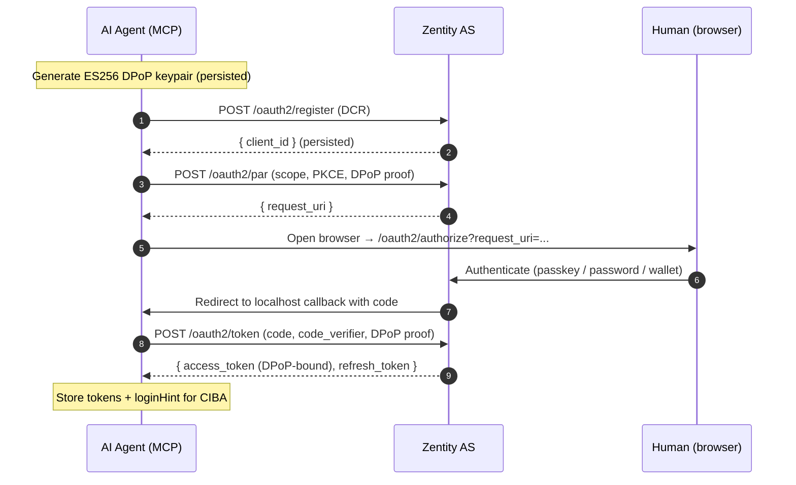
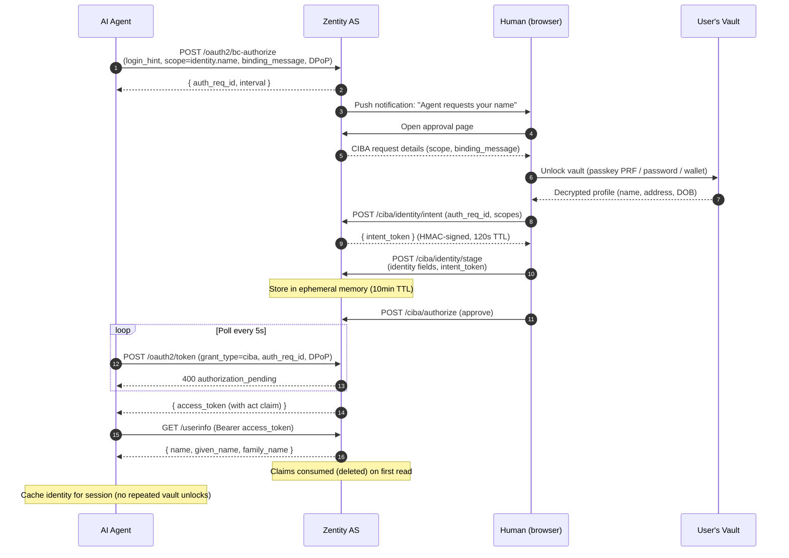
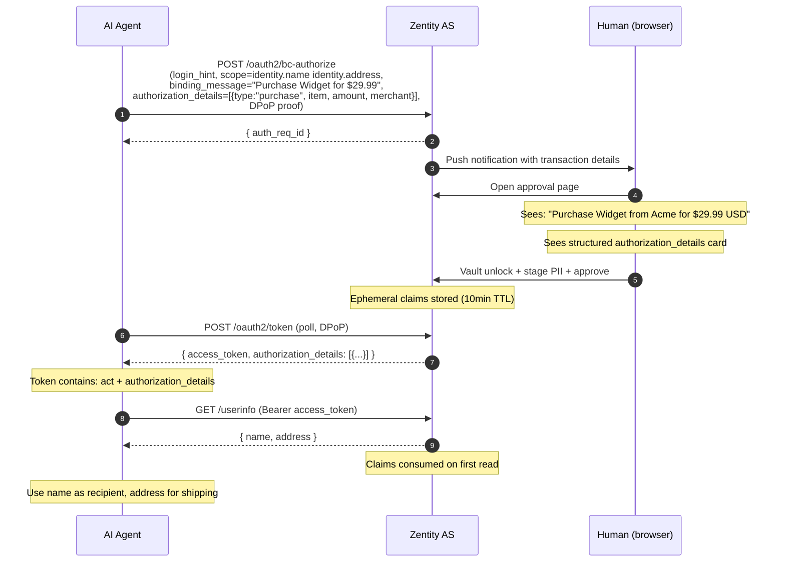

# Agentic Authorization

AI agents need to prove they act on behalf of a specific human, with that human's real-time consent, without the agent ever holding the human's identity. This document describes how Zentity composes existing OAuth and OpenID Connect specifications into a continuous cryptographic binding chain that solves this problem.

1. [The Delegation Gap](#the-delegation-gap)
2. [Protocol Composition](#protocol-composition)
3. [Binding Chains](#binding-chains)
4. [Flows](#flows)
5. [Security Properties](#security-properties)
6. [External Verification](#external-verification)
7. [Standards Reference](#standards-reference)

---

## The Delegation Gap

Standard OAuth answers one question: "who is requesting access?" An authorization code flow proves a user is present, issues a token scoped to their consent, and the relying party uses that token to call APIs. The user is the principal throughout.

AI agents break this model in three ways. First, the agent is not the user; it acts *on behalf of* the user, which means the token must identify both the human principal and the agent actor. Second, the agent may need the user's real identity (name, address) to complete a task like a purchase, but storing that identity in the agent's context would create a new privacy liability. Third, the agent operates headlessly, without a browser, which eliminates the interactive redirect flows that OAuth relies on for consent.

These three gaps are not independent. They share a structural root: OAuth assumes the party receiving the token is the party who authenticated. When the authenticator and the actor are different entities, the protocol must bind them together at every step while keeping the human's secrets out of the agent's reach.

Zentity closes these gaps by composing five protocol mechanisms, each addressing one dimension of the problem. The composition, not any individual spec, is the contribution.

---

## Protocol Composition

Every mechanism in this section is a published or draft specification. What is novel is not the individual parts but how they compose into a single binding chain where each step constrains the next.

| Dimension | Question | Mechanism | Spec |
| --- | --- | --- | --- |
| Bootstrap | How does a headless agent authenticate? | First-Party App Challenge | draft-ietf-oauth-first-party-apps |
| Sender binding | How do we prevent token replay? | DPoP (proof of possession) | RFC 9449 |
| Consent | How does the human approve each action? | CIBA (backchannel auth) | OpenID Connect CIBA Core |
| Intent | What exactly did the human approve? | Rich Authorization Requests | RFC 9396 |
| Delegation | Who sent this agent? | Actor claim (`act`) | draft-oauth-ai-agents-on-behalf-of-user |

The following sections trace how these mechanisms connect. The key insight is that the DPoP keypair generated at bootstrap becomes a thread running through every subsequent interaction: FPA challenge, authorization code exchange, CIBA poll, and token exchange. Every credential the agent receives is sender-constrained to that single key.

---

## Binding Chains

The five protocol mechanisms above do not operate independently. Each step produces a credential that the next step consumes, creating a continuous chain of cryptographic bindings. Breaking any link invalidates the entire chain.

### Session binding (DPoP + FPA)

The chain begins when the agent generates an ES256 DPoP keypair (RFC 9449). This keypair is the agent's cryptographic identity for the duration of the session. Every subsequent HTTP request includes a DPoP proof: a short-lived JWT signed with the private key, binding the request's HTTP method and URL to the key's SHA-256 thumbprint (`jkt`).

The First-Party App Challenge endpoint (draft-ietf-oauth-first-party-apps) lets the agent authenticate without a browser redirect. The agent sends its identifier and a PKCE challenge alongside a DPoP proof. The server returns an `auth_session` token bound to that DPoP thumbprint. When the agent later exchanges the authorization code for tokens, the resulting access token carries a `cnf.jkt` claim matching the same thumbprint. The access token is now sender-constrained: only the holder of the DPoP private key can present it.

### Consent binding (CIBA + push notification)

When the agent needs the human's approval for a specific action (e.g., "unlock my name" or "buy this item"), it initiates a CIBA backchannel authorization request. The request includes a `binding_message` (human-readable description of what the agent wants to do), `scope` (what data is needed), and optionally `authorization_details` (structured action metadata per RFC 9396).

The server delivers a push notification to the human's device. The human opens the approval page, sees the binding message and any structured authorization details, and decides whether to approve. If the request includes identity scopes (e.g., `identity.name`), the approval page triggers a vault unlock where the human decrypts their own profile secret client-side using their passkey, password, or wallet. The server never sees the decrypted profile.

This creates a consent binding: the CIBA access token the agent eventually receives is tied to a specific human approval of a specific action, not a blanket authorization.

### Disclosure binding (ephemeral userinfo delivery)

When the human approves a CIBA request that includes identity scopes, the approval page stages the decrypted PII through the following steps:

1. The client (browser) calls the **intent endpoint**, which returns a short-lived HMAC-signed token binding this staging attempt to the specific CIBA request, user, client, and approved scopes.

2. The client sends the decrypted PII and intent token to the **stage endpoint**. The server stores the claims in an ephemeral in-memory store with a 10-minute TTL (5 minutes for standard OAuth2 flows).

3. The agent calls the standard **userinfo endpoint** (`GET /api/auth/oauth2/userinfo`) with the CIBA access token. The server returns the staged identity claims, consuming (deleting) them on first read.

PII is never embedded in id_tokens or access tokens — it flows exclusively through the userinfo endpoint. This prevents identity data from persisting in JWT artifacts. The id_token contains only authentication claims (`sub`, `acr`, `amr`, `at_hash`) and proof claims.

The ephemeral store achieves single-consume semantics: the first userinfo call retrieves the PII, subsequent calls return only standard claims. Cross-client safety is enforced — if multiple clients have concurrent staged entries for the same user, the store returns null to prevent leakage.

### Delegation binding (act claim)

The CIBA access token includes an `act` claim per draft-oauth-ai-agents-on-behalf-of-user: `{ "sub": "<user-id>", "act": { "sub": "<agent-client-id>" } }`. This asserts that the token was issued for the human (`sub`) but is being wielded by the agent (`act.sub`).

When the agent performs a token exchange (RFC 8693, implemented at `urn:ietf:params:oauth:grant-type:token-exchange` on the standard token endpoint) to narrow the audience to a specific merchant, the delegation chain nests:

```json
{
  "sub": "<user-id>",
  "act": {
    "sub": "<merchant-client-id>",
    "act": {
      "sub": "<agent-client-id>"
    }
  }
}
```

Each exchange layer preserves the full delegation history. Resource servers inspect the chain to determine which entities participated in the delegation path and can enforce policies such as "reject tokens with more than N delegation hops."

Token exchange enforces **scope attenuation**: the requested scope must be a subset of the source token's scope. When the source is an ID token (which carries no scopes), only `openid` is permitted. **DPoP passthrough** ensures that if the source token is sender-constrained, the exchanged token inherits the same `cnf.jkt` binding. When the output type is an ID token and the source is an access token, the response includes an `at_hash` claim binding the identity assertion to the original access token.

---

The previous sections described each binding in isolation. The following section shows how they compose into complete end-to-end flows.

## Flows

Three flows cover the full lifecycle of an agent session. They share the same underlying binding chain but differ in what the agent needs: a session, identity, or transactional authorization.

### Flow 1: Session Establishment

The agent starts with nothing and ends with a sender-constrained access token.



The agent registers once via Dynamic Client Registration (RFC 7591), generating a stable `client_id` that persists across sessions. Pushed Authorization Requests (RFC 9126) ensure that authorization parameters never appear in the browser URL. PKCE (RFC 7636) prevents authorization code interception. The resulting access token carries `cnf.jkt` matching the agent's DPoP key, and the agent stores the user's identifier as `loginHint` for subsequent CIBA requests.

### Flow 2: Identity Resolution

The agent needs the human's name. This triggers CIBA, vault unlock, PII staging, and release redemption.



The vault unlock in step 5 is entirely client-side. The human decrypts their profile secret using their credential (passkey PRF extension, OPAQUE export key, or wallet-derived key material), and the browser sends only the filtered identity fields to the stage endpoint. The server never accesses the full profile secret.

The intent token (step 7) prevents a class of attacks where a malicious client attempts to stage PII for a different CIBA request. It binds `userId + clientId + authReqId + scopeHash` with HMAC-SHA256 and expires in 120 seconds.

### Flow 3: Transactional Authorization

The agent wants to make a purchase. This combines CIBA with Rich Authorization Requests (RFC 9396) so the human approves the specific transaction, not a generic capability.



The `authorization_details` parameter travels through the entire chain: from the CIBA request to the access token JWT to the token response body. Identity PII is retrieved separately via the userinfo endpoint. This creates an auditable link between what the agent requested, what the human approved, and what data was released.

---

The previous sections showed what the system does. The following section examines what guarantees it provides.

## Security Properties

The binding chain produces five security properties that together distinguish an agent acting on behalf of a human from an unauthorized agent or a bot farm.

### Sender constraining

Every token the agent receives is DPoP-bound (RFC 9449). A stolen token is useless without the corresponding ES256 private key. The DPoP proof includes an `ath` (access token hash) when presented to resource servers, binding the proof to the specific token. The same DPoP keypair threads through FPA challenge, authorization code exchange, CIBA poll, and userinfo retrieval, so a resource server can verify that the same entity performed every step.

### Real-time human consent

CIBA requires the human to actively approve each sensitive action. The approval is not a blanket grant; it is scoped to specific resources (`scope`), specific actions (`authorization_details`), and a specific moment in time (`expires_in`). Push notifications carry the binding message and structured details, so the human can make an informed decision without visiting the agent's interface. The notification body follows a priority chain: `bindingMessage` (if present) > `authorization_details` purchase details (item + amount) > fallback `"{clientLabel} is requesting access"`. Push payloads are encrypted per RFC 8291 and contain no PII — only `authReqId` and display text.

Two approval paths exist: the standalone page at `/approve/[authReqId]` (push notification target, no dashboard chrome) and the dashboard-integrated page at `/dashboard/ciba/approve` (secondary, accessible from the sidebar listing).

### Zero persistent PII

PII is never stored in plaintext on the server and never embedded in JWT artifacts. Identity claims are held in an ephemeral in-memory store (5-minute TTL for OAuth2, 10-minute for CIBA) and delivered exclusively via the userinfo endpoint. The id_token contains only authentication and proof claims — zero identity PII fields.

### One-time disclosure

The userinfo endpoint enforces single-consume semantics through the ephemeral claims store:

1. **Single-consume store**: `consumeEphemeralClaimsByUser` deletes the entry on first read. The entry is keyed by `userId:clientId` — both must match. This prevents cross-user and cross-client leakage.

2. **Cross-client safety**: If multiple clients have concurrent staged entries for the same user, the store returns null rather than risk delivering PII to the wrong client.

3. **TTL expiry**: Unclaimed entries are garbage-collected after the TTL window (5 or 10 minutes), ensuring no stale PII accumulates in server memory.

The agent caches the result in its process memory for the session, avoiding repeated CIBA prompts for the same identity data.

### Provable delegation

The `act` claim in the access token cryptographically associates the human principal (`sub`) with the agent actor (`act.sub`). A resource server receiving this token can verify that a specific human authorized a specific agent, distinguish between different agents acting for the same human, and detect multi-hop delegation chains when token exchange nesting is used.

---

## External Verification

A resource server receiving a Zentity agent token can validate the delegation chain without contacting the authorization server.

### Token validation

1. **Fetch the JWKS** from `{issuer}/api/auth/oauth2/jwks` (RSA, EC, Ed25519) or `{issuer}/api/auth/pq-jwks` (includes ML-DSA-65 post-quantum keys). Cache per standard HTTP caching headers.

2. **Verify the JWT** using the `kid` from the token's protected header. Validate `iss`, `aud`, `exp`, and `iat` per standard JWT rules.

3. **Validate the DPoP proof** in the `DPoP` request header:
   - The proof is a JWT with `typ: "dpop+jwt"` and `alg: "ES256"`.
   - The `jwk` header parameter contains the agent's public key.
   - `SHA-256(jwk)` must equal the token's `cnf.jkt` claim.
   - `htm` and `htu` must match the current request's method and URL.
   - `ath` must equal `BASE64URL(SHA-256(access_token))`.
   - `iat` must be recent (within the server's acceptable clock skew).

### Interpreting claims

| Claim | Meaning |
| --- | --- |
| `sub` | The human user who authorized the agent |
| `act.sub` | The agent's OAuth `client_id` |
| `act.act.sub` | If present, a prior agent in the delegation chain (from token exchange) |
| `sybil_nullifier` | Per-RP pseudonymous nullifier (when `proof:sybil` scope granted) |
| `authorization_details` | Structured metadata the human explicitly approved (e.g., purchase details) |
| `cnf.jkt` | DPoP key thumbprint; the agent's cryptographic identity |
| `scope` | Consented scopes, including `identity.*` for PII and `proof:*` for ZK proofs |

### Differentiating human-backed agents from bot farms

A resource server can distinguish a human-backed Zentity agent from an autonomous bot by checking three properties of the token:

1. **`act` claim present**: The token explicitly names both the human and the agent. Autonomous bots use client credentials with no `sub` or `act`.

2. **DPoP sender constraining**: The agent proves possession of a stable cryptographic key. Bot farms would need to generate and manage unique key pairs per instance, making large-scale impersonation expensive.

3. **`authorization_details` specificity**: The token carries the exact action the human approved (item, amount, merchant). A blanket-scope token without `authorization_details` indicates a less constrained authorization.

A resource server can enforce policies such as "require `act` claim for all write operations," "reject tokens without `authorization_details` for purchases above a threshold," or "rate-limit by `act.sub` to detect a single agent making unusual volumes of requests."

---

## Standards Reference

The following table catalogs every specification implemented in Zentity's agentic authorization stack, organized by the dimension of trust they address.

### Session and transport

| Specification | Status | Role in Zentity |
| --- | --- | --- |
| RFC 7591 (Dynamic Client Registration) | Standard | Agent self-registers on first startup |
| RFC 7636 (PKCE) | Standard | Prevents authorization code interception |
| RFC 8252 (OAuth for Native Apps) | BCP | Loopback redirect URIs for CLI agents |
| RFC 9126 (Pushed Authorization Requests) | Standard | Required for all authorization requests (HAIP) |
| RFC 9449 (DPoP) | Standard | Sender-constraining throughout the chain |
| RFC 9728 (Protected Resource Metadata) | Standard | Discovery of AS endpoints from resource URL |

### Authorization and consent

| Specification | Status | Role in Zentity |
| --- | --- | --- |
| OpenID Connect CIBA Core | Standard | Backchannel auth for per-action human consent |
| draft-ietf-oauth-first-party-apps | IETF Draft | Headless CLI authentication without redirects |
| RFC 9396 (Rich Authorization Requests) | Standard | Structured action metadata (purchase details) in CIBA |
| RFC 8707 (Resource Indicators) | Standard | Audience binding for tokens |
| RFC 8693 (Token Exchange) | Standard | Audience narrowing and delegation chain nesting |
| OIDC Step-Up Authentication | Standard | Tier enforcement via `acr_values` on CIBA and PAR |

### Identity and delegation

| Specification | Status | Role in Zentity |
| --- | --- | --- |
| OpenID Connect Core 1.0 | Standard | id_token issuance, standard claims, discovery |
| draft-oauth-ai-agents-on-behalf-of-user | IETF Draft | `act` claim proving agent delegation |
| OIDC for Identity Assurance (OIDC4IDA) | Standard | `verified_claims` with trust framework metadata |
| Ephemeral userinfo delivery | Zentity extension | Single-consume PII delivery via standard userinfo endpoint |

### Interoperability profiles

| Specification | Status | Role in Zentity |
| --- | --- | --- |
| OpenID HAIP | Draft | High-assurance profile (PAR, DPoP, JARM, wallet attestation) |
| OID4VCI | OpenID Draft | Verifiable credential issuance (SD-JWT VC) |
| OID4VP | OpenID Draft | Verifiable presentation (DCQL queries, JARM responses) |
| MCP Authorization | Specification | MCP protocol OAuth integration |
| A2A Protocol v0.3 | Specification | Agent card discovery for cross-platform interop |

### Cryptographic primitives

| Specification | Status | Role in Zentity |
| --- | --- | --- |
| ML-DSA-65 (FIPS 204) | NIST Standard | Post-quantum id_token signing (opt-in) |
| ML-KEM-768 (FIPS 203) | NIST Standard | Post-quantum compliance data encryption |
| RFC 8292 (VAPID) | Standard | Push notification delivery for CIBA approvals |
