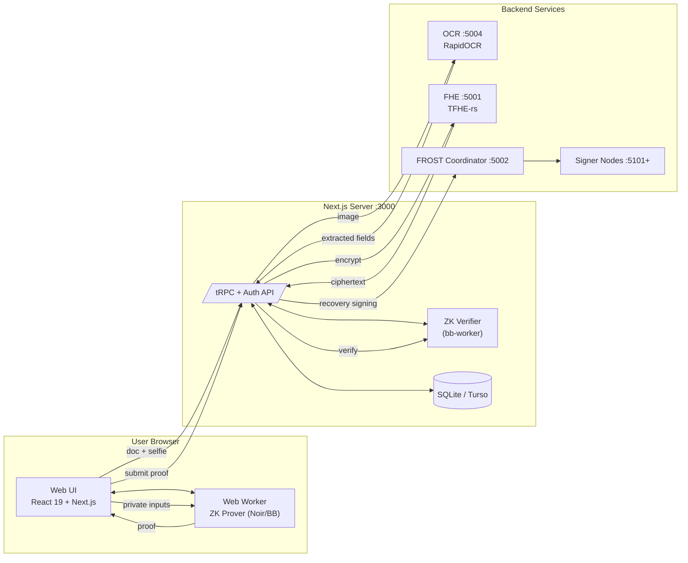
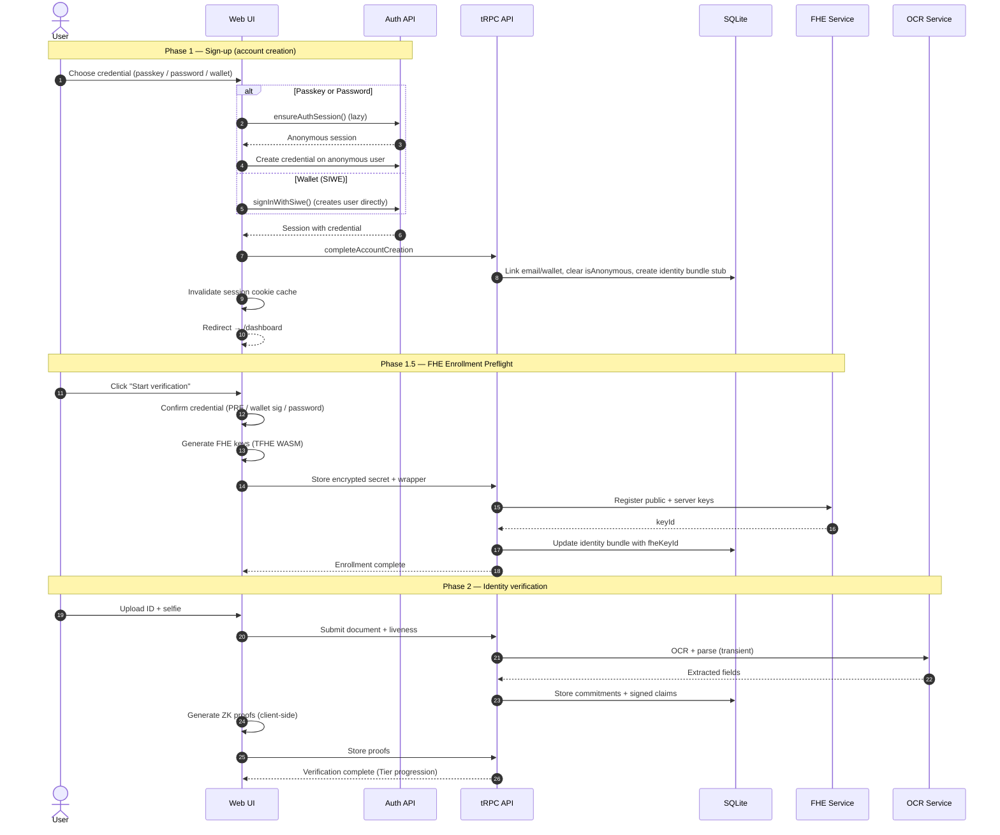
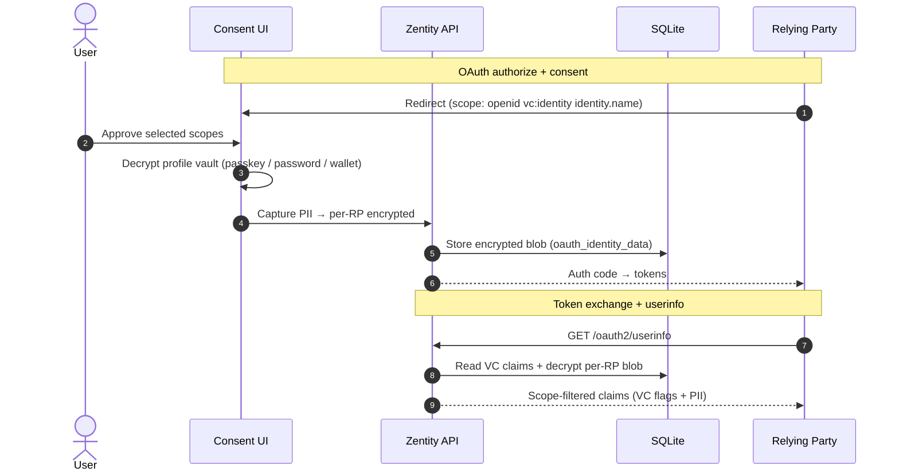

# System Architecture & Data Flow

This document describes **how Zentity's services connect**, **how data flows through the system**, and **what is (and isn't) persisted**. It stays high-level and points to deeper docs for cryptography, privacy boundaries, and integrity controls.

## Scope & Non-Goals

This is a **PoC**. Breaking changes are expected.

Non-goals:

- Cryptographically binding all claims to a signed passport/ID credential inside a single "identity commitment" circuit.
- Production-grade liveness attestation (device attestation / anti-replay guarantees).
- Production hardening (HSM/KMS, secret rotation, WAF/rate limiting, audit logging strategy).

---

## Architecture

### Components and Key Technologies

| Area | Technologies | Responsibility / Notes |
|---|---|---|
| Web UI + API | Next.js 16 (App Router), React 19, Bun, tRPC | Primary UI and orchestration layer with type-safe API routes. |
| ZK proofs | Noir, bb.js (Barretenberg), UltraHonk | Client-side proving in Web Workers; server-side verification. |
| Liveness + face match | Human.js + tfjs-node | Multi-gesture liveness and face match; real-time guidance on client, verification on server. |
| OCR | RapidOCR (PPOCRv5), python-stdnum | Document parsing, field extraction, and validation. |
| FHE | TFHE-rs (Rust), fhEVM | Encrypted computation off-chain and optional on-chain attestation. |
| Storage | SQLite (libSQL/Turso), Drizzle ORM | Privacy-first storage of commitments, proofs, and encrypted blobs. |
| Auth + key custody | Better Auth + WebAuthn + PRF + OPAQUE + EIP-712 Wallet | Passkey, OPAQUE password, or wallet signature authentication; all three derive client-held keys for sealing secrets. |
| Verifiable credentials | OIDC4VCI, OIDC4VP, SD-JWT | Portable credential issuance and presentation with selective disclosure. |
| Social recovery signing | FROST signer services (Rust/Actix) | Threshold signing for guardian-approved recovery (and future registrar). |
| Observability | OpenTelemetry | Cross-service tracing with privacy-safe attributes. |

### System Diagram

---

## Cryptographic Pillars

Zentity combines **passkeys (auth + PRF key custody)**, **OPAQUE passwords**, **wallet signatures (EIP-712)**, **zero-knowledge proofs**, **FHE**, and **commitments** to minimize plaintext data handling. This document focuses on flow and system boundaries. For cryptographic details, see:

- [Cryptographic Pillars](cryptographic-pillars.md)
- [Attestation & Privacy Architecture](attestation-privacy-architecture.md)
- [ZK Architecture](zk-architecture.md)
- [Web3 Architecture](web3-architecture.md)

---

## Data Handling

We persist **only the minimum** required for verification and auditability:

- Commitments and hashes for integrity and deduplication
- Encrypted attributes (FHE ciphertexts)
- Proof payloads + public inputs
- Passkey-sealed profile (encrypted blob; client-decrypt only)
- OPAQUE registration records for password users (no plaintext or password hashes)
- Verification status + non-sensitive metadata

### Key custody

- The browser encrypts sensitive data with a random **data key (DEK)**.
- That DEK is wrapped by a **key‑encryption key (KEK)** derived client‑side.
- The server stores only encrypted blobs + wrapped DEKs, so it cannot decrypt user data.
- Users decrypt locally after an explicit credential unlock.

We **never store** raw document images, selfies, plaintext PII, or biometric templates. Full classification and storage boundaries live in [Attestation & Privacy Architecture](attestation-privacy-architecture.md).

---

## Social Recovery

Zentity supports guardian-approved recovery for passkey loss. Recovery is initiated with email or a Recovery ID, guardians approve via email links or authenticator codes, and the signer services perform FROST threshold signing once the approval threshold is met. Recovery wrappers are stored in `recovery_secret_wrappers`, and the signer coordinator is contacted from the Next.js server (not the browser).

---

## Regulated vs Non-Regulated Usage

Zentity supports two usage modes that share the same core cryptography but differ in what is disclosed.

**Non-regulated (age-gated / consumer apps)**

- The relying party receives **proofs only** (e.g., "over 18", "document valid").
- No PII is shared. Verification is local to the relying party.

**Regulated (banks / exchanges)**

- The user authorizes disclosure with a passkey.
- The client decrypts the sealed profile and **re-encrypts to the relying party**.
- The relying party receives **PII + proofs + evidence pack** as required by regulation.
- Zentity retains **cryptographic artifacts only**, not plaintext PII.

---

## Data Flows

### Sign-Up and Verification

**Password (OPAQUE) sign-up**

OPAQUE sign-up mirrors the passkey flow but uses a password-derived export key:

- Client performs OPAQUE registration and derives an **export key**.
- Export key → HKDF → KEK wraps the DEK.
- Server stores the OPAQUE **registration record** (no plaintext password).
- Secret wrappers are stored with `kek_source = "opaque"`.

**Wallet (EIP-712) sign-up/sign-in**

Wallet authentication uses EIP-712 typed data signing to derive the KEK:

- User signs a deterministic EIP-712 message on sign-up (wrap new keys) and sign-in (unwrap existing keys).
- Signature bytes are processed through **HKDF-SHA256** to derive the KEK.
- The private key never leaves the wallet; the signature stays in the browser.
- Server stores the wallet address for account association.
- Secret wrappers are stored with `kek_source = "wallet"`.
- Sign-in also requires a **SIWE (EIP-191)** signature for session authentication (nonce-based replay protection).
- Supports hardware wallets (Ledger/Trezor) for enhanced security.

### Disclosure

Disclosure uses a two-tier scope system: **VC scopes** (`vc:*`) return derived boolean verification flags (no PII), and **Identity scopes** (`identity.*`) return actual PII that is server-encrypted per RP. Both support user-controlled selective disclosure at consent time.

---

## OCR + Liveness

**Document OCR**

- The **OCR service** extracts fields (name, DOB, document number, country) and validates formats.
- Images are processed **transiently** and never stored.
- Only derived claims and commitments return to the web app.

**Liveness + face match**

- The **client** runs Human.js for real-time detection and gesture guidance (smile, head turns).
- The **server** re-verifies frames with Human.js (tfjs-node) and issues signed liveness/face-match claims.
- This split keeps UX responsive while preserving server-side integrity.

For detailed liveness policy and integrity guarantees, see [Tamper Model](tamper-model.md) and [Attestation & Privacy Architecture](attestation-privacy-architecture.md).

---

## Web3 Layer

Zentity can **attest verified identity on-chain** using fhEVM while keeping attributes encrypted. The server (registrar) encrypts identity attributes and submits attestation; users authorize access with explicit grants.

See [Web3 Architecture](web3-architecture.md).

---

## Verifiable Credentials (SSI)

Zentity issues portable verifiable credentials following OpenID standards:

- **OIDC4VCI**: Credential issuance with pre-authorized code flow
- **OIDC4VP**: Presentation requests from verifiers
- **SD-JWT VC**: Selective disclosure format (derived claims only)
- **Holder binding**: EdDSA proof JWT ties credentials to holder keys

External wallets can receive and hold credentials; third-party verifiers can request presentations without Zentity involvement.

Credentials contain **derived claims only**—no raw PII. Claims like `verified`, `age_proof_verified`, and `verification_level` indicate verification status without exposing underlying data.

See [SSI Architecture](ssi-architecture.md) for the complete Self-Sovereign Identity model.

---

## State Durability & Shared Devices

- **Sign-up state** is local React state only (no DB, no cookies). Refreshing the page restarts the sign-up form. An anonymous session is created on load for the credential flow.
- **FHE enrollment state** is tracked server-side via `identity_bundles.fheKeyId`. Enrollment is resumable — if partial, the preflight re-checks completion criteria.
- **Verification progress** is stored in first-party DB tables keyed by user ID (drafts, signed claims, ZK proofs).
- **Profile data** lives in a credential-encrypted vault (`encrypted_secrets` + `secret_wrappers`), only decryptable client-side after a credential unlock.
- **Per-RP identity data** is stored server-encrypted in `oauth_identity_data`, created at consent time when the user approves `identity.*` scopes.

---

## Observability

- Distributed tracing via OpenTelemetry across Web, FHE, and OCR
- Sign-up and verification spans for step timing + duplicate-work signals
- Privacy-safe telemetry (hashed IDs only; no PII)

See [RFC: Observability](rfcs/0006-observability.md) for configuration details.

---

## Storage Model

Database schema and table relationships are documented in [Attestation & Privacy Architecture](attestation-privacy-architecture.md) and the Drizzle schema under `apps/web/src/lib/db/schema/`.
