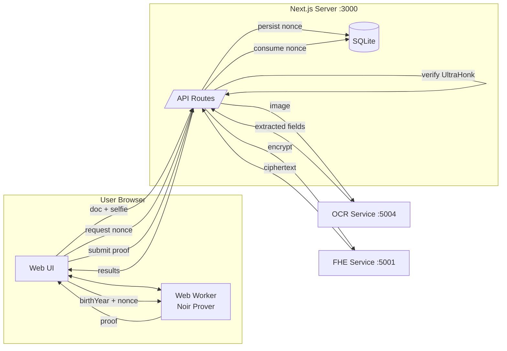
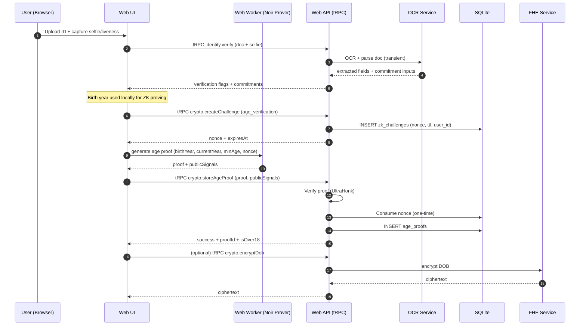
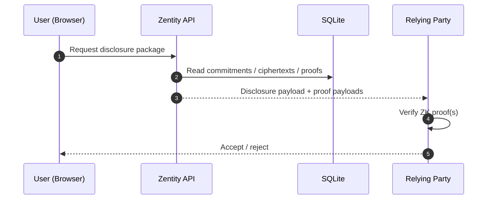

# System Architecture & Data Flow (PoC)

> **Related docs:** [ZK Architecture](zk-architecture.md) | [Nationality Proofs](zk-nationality-proofs.md) | [README](../README.md)

This document describes **how Zentity's services connect**, **how data flows through the system**, and **what is (and isn't) persisted**.

## Scope & Non‑Goals

This is a **PoC**. Breaking changes are expected.

Non-goals (current state):
- Cryptographically binding all claims to a signed passport/ID credential inside a single "identity commitment" circuit.
- Production-grade liveness attestation (device attestation / anti-replay guarantees).
- Production hardening (HSM/KMS, secret rotation, WAF/rate limiting, audit logging strategy).

---

## Architecture

### Components

| Service | Stack | Role |
|---------|-------|------|
| `apps/web` | Next.js 16, React 19 | UI, ZK proving (Web Worker), API routes, SQLite |
| `apps/ocr` | Python, FastAPI | OCR + document parsing (no image persistence) |
| `apps/fhe` | Rust, Axum, TFHE-rs | Homomorphic encryption operations |

### System Diagram



---

## Cryptographic Techniques

Zentity uses three complementary techniques:

```
┌─────────────────────────────────────────────────────────────────┐
│                    ZERO-KNOWLEDGE PROOFS                        │
│         Prove claims without revealing underlying data          │
│    "I am over 18" • "I am EU citizen" • "Document not expired"  │
├─────────────────────────────────────────────────────────────────┤
│              FULLY HOMOMORPHIC ENCRYPTION (FHE)                 │
│           Perform computations on encrypted data                │
│         Age comparisons • Gender matching • Liveness scores     │
├─────────────────────────────────────────────────────────────────┤
│               CRYPTOGRAPHIC COMMITMENTS                         │
│           One-way hashes for identity verification              │
│              Names • Document numbers • Nationality             │
└─────────────────────────────────────────────────────────────────┘
```

### Why Three Techniques?

| Problem | Solution | How It Works |
|---------|----------|--------------|
| "Verify my name without storing it" | **Commitment** | SHA256(name + salt); verify by recomputing |
| "Check if I'm over 18 without seeing my DOB" | **FHE** | Encrypted DOB compared homomorphically |
| "Prove I'm EU citizen without revealing country" | **ZK Proof** | Merkle tree membership proof |
| "Delete my data for GDPR" | **Commitment** | Delete salt → commitment becomes unlinkable |

### Commitments

A commitment is a one-way hash that binds you to a value without revealing it.

1. During verification: `commitment = SHA256("John Doe" + random_salt)`
2. Commitment stored in database (hash, not name)
3. Later verification: Recompute hash with claimed name + stored salt
4. Match = verified. No name ever stored.

**GDPR compliance:** Deleting the salt makes the commitment cryptographically unlinkable.

### FHE

FHE allows computations on encrypted data without decryption.

1. Encrypt: `encrypted_dob = FHE.encrypt(1990-05-15)`
2. Compute: `is_adult = encrypted_dob <= (current_year - 18)`
3. Decrypt result only: `true`
4. Server never sees actual birthday

**Library:** [TFHE-rs](https://github.com/zama-ai/tfhe-rs) (Rust)

---

## Data Model

### What We Store

| Data | Form | Purpose |
|------|------|---------|
| Account email | Plaintext | Authentication |
| Commitments (name, doc#, nationality) | Salted SHA256 | Dedup + integrity checks |
| Per-user salt | JWE encrypted | Enables GDPR erasure |
| ZK proof payloads | Proof + public signals | Disclosure + verification |
| Challenge nonces | Random 128-bit + TTL | Replay resistance |
| FHE ciphertexts (DOB, gender, liveness) | TFHE ciphertext | Policy checks without decrypting |
| First name (display only) | JWE encrypted | UX convenience |
| Onboarding PII | JWE encrypted + TTL | Wizard continuity (short-lived) |

### What We NEVER Store

| Data | Handling |
|------|----------|
| Document images | Request body only → discarded |
| Selfie images | Request body only → discarded |
| Face embeddings | Memory only → discarded |
| Plaintext birth date | Only as FHE ciphertext |
| Plaintext name | Only as SHA256 commitment |
| Plaintext nationality | Only as SHA256 commitment |
| Document number | Only as SHA256 commitment |

**Key guarantee:** Application-level persistence never includes raw PII or biometric data.

### Privacy Guarantees

1. **Transient image processing** — Images exist only in request bodies; discarded after verification
2. **One-way commitments** — SHA256 + user salt; cannot derive original values
3. **FHE for sensitive numerics** — Server computes on ciphertext without decryption
4. **Client-side ZK proving** — Birth year, nationality never sent to server; only proofs
5. **GDPR erasure** — Delete `user_salt` → commitments become unlinkable
6. **No biometric storage** — Face embeddings computed transiently, never persisted

---

## Two-Tier Architecture

### Tier 1: Non-Regulated (Age-Gated Services)

```
User → Zentity: "Verify me"
Zentity → User: age proof + liveness result
User → Retailer: "Here's my proof"
Retailer: verify(proof) → true/false

No PII shared. Relying party only learns "over 18" + liveness passed.
```

### Tier 2: Regulated Entities (Banks, Exchanges)

```
User → Zentity: Complete verification
User → Exchange: "I want to onboard"
Exchange → Zentity: Request PII disclosure
Zentity → Exchange: Encrypted package (RSA-OAEP + AES-GCM)
  - Name, DOB, Nationality (E2E encrypted)
  - Face match result (no biometrics)
  - Liveness attestation

Exchange stores: PII (regulatory requirement)
Zentity stores: Cryptographic artifacts only
Biometrics: NEVER stored by either party
```

---

## Data Flows

### Onboarding (happy path)



### Disclosure (Relying Party)



---

## Storage Model (SQLite)

Tables (via `better-auth` + custom):
- `user`, `session`, `account`, `verification` — Authentication
- `identity_proofs` — Salted commitments + encrypted display data + verification flags
- `age_proofs` — Proof payload + public signals + metadata
- `zk_challenges` — Server-issued one-time nonces
- `onboarding_sessions` — Short-lived wizard state (encrypted PII only)
- `kyc_documents`, `kyc_status` — KYC metadata (no image bytes)

---

## Notes for Cryptography Reviewers

- Commitments are **per-attribute** (salted SHA256), not a single identity commitment.
- ZK proofs are generated over browser-available values (e.g., birth year), not yet bound to signed passport credentials.
- Challenge nonces are server-issued and one-time-use; they mitigate replay attacks.
