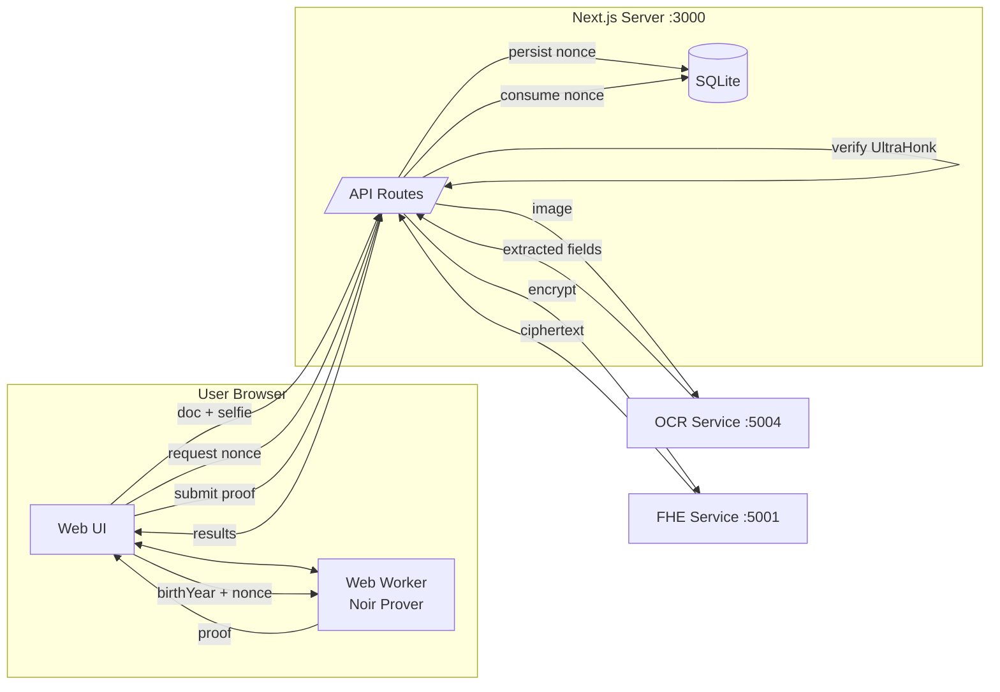
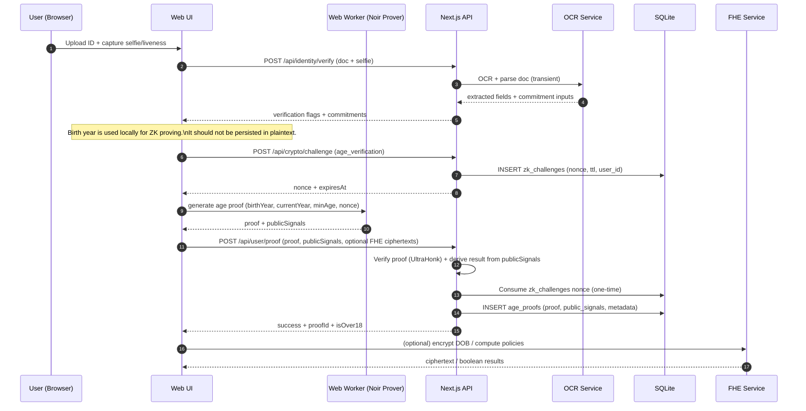
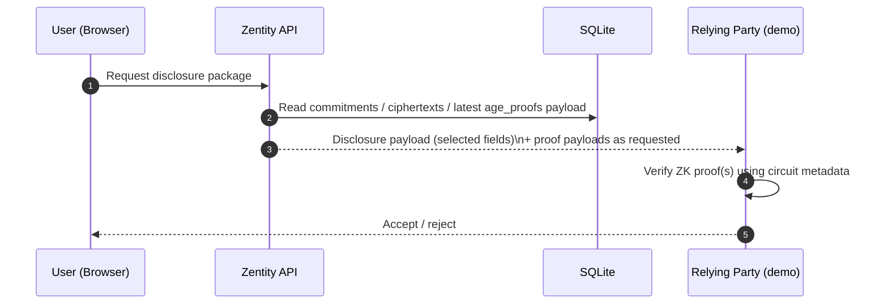

# System Architecture & Data Flow (PoC)

This document describes **how Zentity’s services connect**, **how data flows through the system**, and **what is (and isn’t) persisted**.

It is written for reviewers who want to quickly understand:
- What the current PoC implements
- Which components handle plaintext vs encrypted vs hashed vs proof data
- Which artifacts are persisted in SQLite and why

Related deep-dives:
- `docs/zk-architecture.md`
- `docs/zk-nationality-proofs.md`

## Scope & Non‑Goals

This is a **PoC**. Breaking changes are expected.

Non-goals (current state):
- Cryptographically binding all claims to a signed passport/ID credential inside a single “identity commitment” circuit.
- Production-grade liveness attestation (device attestation / anti-replay guarantees).
- Production hardening (HSM/KMS, secret rotation, WAF/rate limiting, audit logging strategy).

## Components

- `apps/web` (Next.js 16 + React 19)
  - UI + onboarding wizard
  - Browser-side ZK proving in a Web Worker (Noir.js + bb.js UltraHonk backend)
  - Server-side verification and persistence (Next.js API routes + SQLite)
- `apps/ocr` (Python/FastAPI)
  - OCR + document parsing
  - Returns extracted fields and commitment inputs; does not persist images
- `apps/fhe` (Rust/Axum)
  - TFHE operations (encrypt + comparisons) used for PoC demos/policies

## High-Level Architecture (components)

## Data Classification (what is stored)

Zentity persists a mix of plaintext auth data, encrypted blobs, commitments, ciphertexts, and proof payloads.

| Data | Where it exists | Persistence | Form | Why |
|------|------------------|-------------|------|-----|
| Account email + display name | Server | Yes | Plaintext (auth DB) | Authentication / user account |
| Document image, selfie frames | Browser + server request bodies | No (intended) | Plaintext bytes in memory | OCR + liveness processing only |
| Extracted doc fields (name/DOB/doc#) | Browser + server during onboarding | Short-lived | JWE encrypted in `onboarding_sessions.encrypted_pii` | Wizard continuity only (TTL) |
| Commitments (doc hash, name, nationality) | Server | Yes | Salted SHA256 | Dedup + later integrity checks |
| Per-user salt for commitments | Server | Yes | Encrypted (JWE) | Enables erasure (delete salt → unlinkable) |
| ZK age proof payload | Server | Yes | Proof + public signals (JSON) | Disclosure + later verification |
| ZK challenge nonces | Server | Yes | Random 128-bit nonce + TTL | Replay resistance for persisted proofs |
| FHE ciphertexts (DOB, gender, liveness score) | Server | Yes | TFHE ciphertext | Policy checks without decrypting |
| First name for dashboard display | Server | Yes | JWE encrypted (`first_name_encrypted`) | UX convenience (reversible for user display) |

## Data Handling Guarantees (PoC intent)

The PoC is designed so that **raw images and extracted identity attributes are not written to disk** by the application.

- Document images and selfie frames are processed in-memory (request bodies) and discarded after verification.
- The KYC metadata tables store **metadata only** (file name, size, type, status), not the image bytes.
- Short-lived onboarding PII is stored only as JWE-encrypted blobs with a TTL and is deleted on completion.

Caveats:
- Third-party libraries may allocate temporary memory internally; this document focuses on **application-level persistence**.
- Operational logging, reverse proxies, and tracing can accidentally capture payloads if misconfigured (treat this as a deployment responsibility for production).

## What We NEVER Store

| Data | Handling | Rationale |
|------|----------|-----------|
| Document images | Request body only | OCR processes in-memory, discards after extraction |
| Selfie images | Request body only | Liveness/face matching processes, then discards |
| Face embeddings | Memory only | Computed, compared, never written to disk |
| Plaintext birth date | Never | Only FHE ciphertext (`dob_ciphertext`, `dob_full_ciphertext`) |
| Plaintext name | Never | Only SHA256 commitment (`name_commitment`) |
| Plaintext nationality | Never | Only SHA256 commitment |
| Document number | Never | Only SHA256 commitment (`document_hash`) |
| Liveness video/frames | Never | Only boolean result persisted |

**Key guarantee**: Application-level persistence never includes raw PII or biometric data.

## Privacy Guarantees (PoC Design)

1. **Transient image processing** — Document and selfie images exist only in request bodies; discarded after verification
2. **One-way commitments** — SHA256 + user salt; cannot derive original values
3. **FHE for sensitive numerics** — DOB, gender, liveness scores encrypted; server computes on ciphertext without decryption
4. **Client-side ZK proving** — Birth year, nationality code, face similarity never sent to server; only proofs transmitted
5. **GDPR erasure path** — Delete `user_salt` → all commitments become cryptographically unlinkable to original identity
6. **No biometric storage** — Face embeddings computed transiently for comparison, never persisted

## Data Flow: Onboarding (sequence)

This shows the “happy path” for the onboarding wizard.

## Data Flow: Disclosure (Relying Party demo)

The relying party (RP) demo verifies proofs and can request encrypted disclosure packages.

## Storage Model (SQLite tables)

The PoC uses SQLite (`dev.db`, configurable via `DATABASE_PATH`).

Key tables (names as created by the app):
- `user`, `session`, `account`, `verification` (better-auth)
- `identity_proofs` (salted commitments + encrypted display data + verification flags)
- `age_proofs` (proof payload + public signals + verification metadata + optional ciphertexts)
- `zk_challenges` (server-issued one-time nonces for replay resistance)
- `onboarding_sessions` (short-lived wizard state; encrypted PII only)
- `kyc_documents`, `kyc_status` (KYC metadata; no image bytes)

## Notes for Cryptography Reviewers

- Commitments in this repo are **per-attribute** (salted SHA256). They are useful for deduplication and “value matches what was verified” checks.
- ZK proofs are currently generated over values available in the browser during onboarding (e.g. birth year), and are not yet bound to a signed passport/ID credential via a single identity commitment proof.
- Challenge nonces are server-issued and one-time-use for persisted proofs; they mitigate replay of captured proof payloads.
