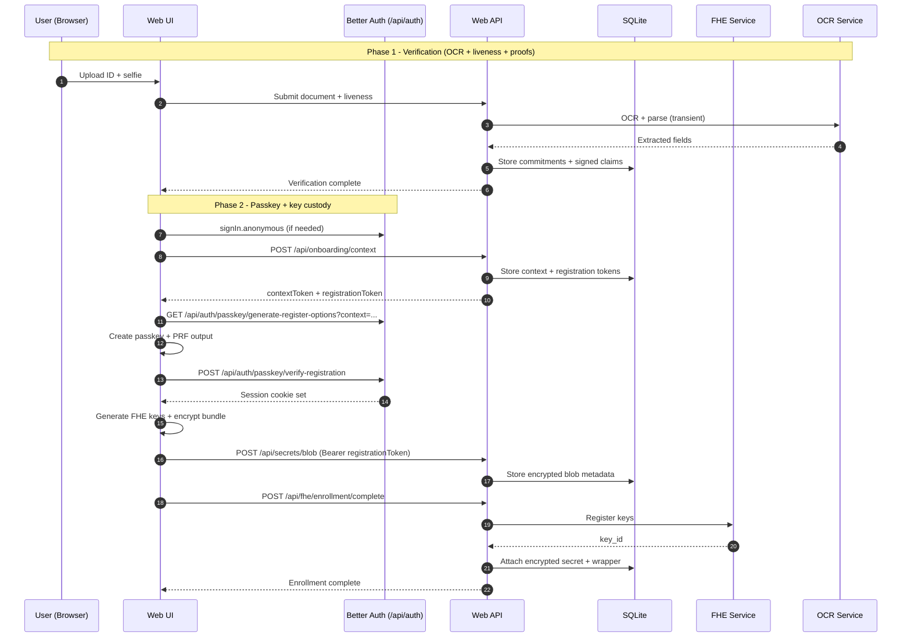

# System Architecture & Data Flow

This document describes **how Zentity's services connect**, **how data flows through the system**, and **what is (and isn't) persisted**. It stays high-level and points to deeper docs for cryptography, privacy boundaries, and integrity controls.

## Scope & Non-Goals

This is a **PoC**. Breaking changes are expected.

Non-goals:

- Cryptographically binding all claims to a signed passport/ID credential inside a single "identity commitment" circuit.
- Production-grade liveness attestation (device attestation / anti-replay guarantees).
- Production hardening (HSM/KMS, secret rotation, WAF/rate limiting, audit logging strategy).

---

## Architecture

### Components and Key Technologies

| Area | Technologies | Responsibility / Notes |
|---|---|---|
| Web UI + API | Next.js 16 (App Router), React 19, Bun, tRPC | Primary UI and orchestration layer with type-safe API routes. |
| ZK proofs | Noir, bb.js (Barretenberg), UltraHonk | Client-side proving in Web Workers; server-side verification. |
| Liveness + face match | Human.js + tfjs-node | Multi-gesture liveness and face match; real-time guidance on client, verification on server. |
| OCR | RapidOCR (PPOCRv5), python-stdnum | Document parsing, field extraction, and validation. |
| FHE | TFHE-rs (Rust), fhEVM | Encrypted computation off-chain and optional on-chain attestation. |
| Storage | SQLite (libSQL/Turso), Drizzle ORM | Privacy-first storage of commitments, proofs, and encrypted blobs. |
| Auth + key custody | Better Auth + WebAuthn + PRF | Passkey-based authentication and key derivation for sealing secrets. |
| Observability | OpenTelemetry | Cross-service tracing with privacy-safe attributes. |

### System Diagram

---

## Cryptographic Pillars

Zentity combines **passkeys (auth + PRF key custody)**, **zero-knowledge proofs**, **FHE**, and **commitments** to minimize plaintext data handling. This document focuses on flow and system boundaries. For cryptographic details, see:

- [Cryptographic Pillars](cryptographic-pillars.md)
- [Attestation & Privacy Architecture](attestation-privacy-architecture.md)
- [ZK Architecture](zk-architecture.md)
- [Web3 Architecture](web3-architecture.md)

---

## Data Handling

We persist **only the minimum** required for verification and auditability:

- Commitments and hashes for integrity and deduplication
- Encrypted attributes (FHE ciphertexts)
- Proof payloads + public inputs
- Passkey-sealed profile (encrypted blob; client-decrypt only)
- Verification status + non-sensitive metadata

We **never store** raw document images, selfies, plaintext PII, or biometric templates. Full classification and storage boundaries live in [Attestation & Privacy Architecture](attestation-privacy-architecture.md).

---

## Regulated vs Non-Regulated Usage

Zentity supports two usage modes that share the same core cryptography but differ in what is disclosed.

**Non-regulated (age-gated / consumer apps)**

- The relying party receives **proofs only** (e.g., "over 18", "document valid").
- No PII is shared. Verification is local to the relying party.

**Regulated (banks / exchanges)**

- The user authorizes disclosure with a passkey.
- The client decrypts the sealed profile and **re-encrypts to the relying party**.
- The relying party receives **PII + proofs + evidence pack** as required by regulation.
- Zentity retains **cryptographic artifacts only**, not plaintext PII.

---

## Data Flows

### Onboarding

### Disclosure

---

## OCR + Liveness

**Document OCR**

- The **OCR service** extracts fields (name, DOB, document number, country) and validates formats.
- Images are processed **transiently** and never stored.
- Only derived claims and commitments return to the web app.

**Liveness + face match**

- The **client** runs Human.js for real-time detection and gesture guidance (smile, head turns).
- The **server** re-verifies frames with Human.js (tfjs-node) and issues signed liveness/face-match claims.
- This split keeps UX responsive while preserving server-side integrity.

For detailed liveness policy and integrity guarantees, see [Tamper Model](tamper-model.md) and [Attestation & Privacy Architecture](attestation-privacy-architecture.md).

---

## Web3 Layer

Zentity can **attest verified identity on-chain** using fhEVM while keeping attributes encrypted. The server (registrar) encrypts identity attributes and submits attestation; users authorize access with explicit grants.

See [Web3 Architecture](web3-architecture.md).

---

## State Durability & Shared Devices

Onboarding uses **cookies + local storage** for short-lived progress and previews. Pre-auth onboarding context and registration tokens are stored in the Better Auth verification table with a short TTL to support the passkey-first flow. If local state is cleared (shared devices, private windows), the user may need to restart onboarding. The only durable, user-controlled source of profile data is the **passkey-sealed profile**.

---

## Observability

- Distributed tracing via OpenTelemetry across Web, FHE, and OCR
- Onboarding spans for step timing + duplicate-work signals
- Privacy-safe telemetry (hashed IDs only; no PII)

See [RFC: Observability](rfcs/0006-observability.md) for configuration details.

---

## Storage Model

Database schema and table relationships are documented in [Attestation & Privacy Architecture](attestation-privacy-architecture.md) and the Drizzle schema under `apps/web/src/lib/db/schema/`.
