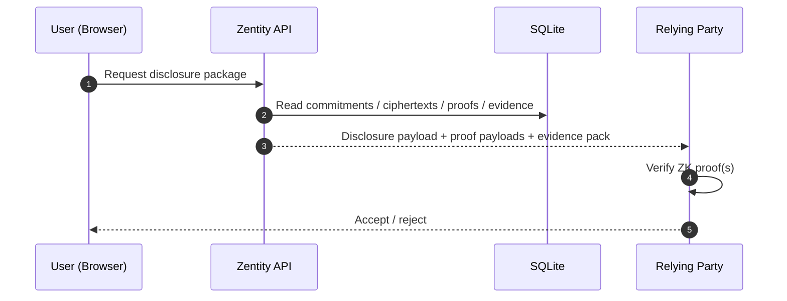

# System Architecture & Data Flow (PoC)

> **Related docs:** [ZK Architecture](zk-architecture.md) | [Nationality Proofs](zk-nationality-proofs.md) | [Attestation & Privacy Architecture](attestation-privacy-architecture.md) | [Web3 Architecture](web3-architecture.md) | [README](../README.md)

This document describes **how Zentity's services connect**, **how data flows through the system**, and **what is (and isn't) persisted**.

## Scope & Non‑Goals

This is a **PoC**. Breaking changes are expected.

Non-goals (current state):

- Cryptographically binding all claims to a signed passport/ID credential inside a single "identity commitment" circuit.
- Production-grade liveness attestation (device attestation / anti-replay guarantees).
- Production hardening (HSM/KMS, secret rotation, WAF/rate limiting, audit logging strategy).

---

## Architecture

### Components

| Service | Stack | Role |
|---------|-------|------|
| `apps/web` | Next.js 16, React 19 | UI, ZK proving (Web Worker), API routes, SQLite |
| `apps/ocr` | Python, FastAPI | OCR + document parsing (no image persistence) |
| `apps/fhe` | Rust, Axum, TFHE-rs | Homomorphic encryption operations |

### System Diagram


---

## Cryptographic Techniques

Zentity uses three complementary techniques:

```text
┌─────────────────────────────────────────────────────────────────┐
│                    ZERO-KNOWLEDGE PROOFS                        │
│         Prove claims without revealing underlying data          │
│    "I am over 18" • "I am EU citizen" • "Document not expired"  │
├─────────────────────────────────────────────────────────────────┤
│              FULLY HOMOMORPHIC ENCRYPTION (FHE)                 │
│           Perform computations on encrypted data                │
│  Birth year offset • Country code • Compliance level • Liveness │
├─────────────────────────────────────────────────────────────────┤
│               CRYPTOGRAPHIC COMMITMENTS                         │
│           One-way hashes for identity verification              │
│              Names • Document numbers • Nationality             │
└─────────────────────────────────────────────────────────────────┘
```

### Why Three Techniques?

| Problem | Solution | How It Works |
|---------|----------|--------------|
| "Verify my name without storing it" | **Commitment** | SHA256(name + salt); verify by recomputing |
| "Check if I'm over 18 without seeing my DOB" | **FHE** | Encrypted birth year offset compared homomorphically |
| "Prove I'm EU citizen without revealing country" | **ZK Proof** | Merkle tree membership proof |
| "Delete my data for GDPR" | **Commitment** | Delete salt → commitment becomes unlinkable |

### Commitments

A commitment is a one-way hash that binds you to a value without revealing it.

1. During verification: `commitment = SHA256("John Doe" + random_salt)`
2. Commitment stored in database (hash, not name)
3. Later verification: Recompute hash with claimed name + stored salt
4. Match = verified. No name ever stored.

**GDPR compliance:** Deleting the salt makes the commitment cryptographically unlinkable.

### FHE

FHE allows computations on encrypted data without decryption.

1. Encrypt: `encrypted_birth_year_offset = FHE.encrypt(90)` (years since 1900)
2. Compute: `is_adult = encrypted_birth_year_offset <= (current_year - 1900 - 18)`
3. Decrypt result only: `true`
4. Server never sees the full birth date

**Library:** [TFHE-rs](https://github.com/zama-ai/tfhe-rs) (Rust)

### Passkey-Wrapped Client Key Ownership

The FHE architecture uses passkey-wrapped client-side key ownership for user-controlled privacy and multi-device access:

| Aspect | Implementation |
|--------|----------------|
| Key generation | Browser (TFHE-rs WASM via `tfhe-browser.ts`) |
| Key storage | Server DB stores encrypted secrets + passkey wrappers (no plaintext keys) |
| Key protection | PRF-derived KEK wraps a random DEK (WebAuthn PRF + HKDF + AES-GCM) |
| Who can decrypt | Only user (passkey presence + PRF unlocks DEK) |
| Server receives | Encrypted key blob + wrappers, public + server keys for computation |

**Privacy guarantee:** The server can compute on encrypted data but cannot decrypt results—only the user can. Plaintext client keys exist only in memory during an active session.

**Planned enhancements**:

- Passkey rotation UX (add/remove passkeys, revoke wrappers)
- Optional recovery key escrow for enterprise deployments (opt-in only)
- See [Attestation & Privacy Architecture](attestation-privacy-architecture.md) for roadmap details.

---

## Data Model

### What We Store

| Data | Form | Purpose |
|------|------|---------|
| Account email | Plaintext | Authentication |
| Document metadata (type, issuer country, birth_year_offset) | Plaintext | UX + compliance context |
| Commitments (name, doc#, nationality) | Salted SHA256 | Dedup + integrity checks |
| Per-user salt | JWE encrypted | Enables GDPR erasure |
| ZK proof payloads + public inputs | Proof bytes | Disclosure + verification |
| Evidence pack (policy_hash, proof_set_hash) | Hashes | Audit trail |
| Signed claims (OCR, liveness, face match) | Signed JSON | Tamper-resistant measurements |
| FHE ciphertexts (birth_year_offset, country_code, compliance_level, liveness_score) | TFHE ciphertext | Policy checks without decrypting |
| First name (display only) | JWE encrypted | UX convenience |
| Onboarding PII | JWE encrypted + TTL | Wizard continuity (short-lived) |
| Encrypted secrets + wrappers | AES-GCM + PRF-wrapped DEK | Passkey-protected FHE key storage |

### What We NEVER Store

| Data | Handling |
|------|----------|
| Document images | Request body only → discarded |
| Selfie images | Request body only → discarded |
| Face embeddings | Memory only → discarded |
| Full DOB (YYYYMMDD) | Never stored |
| Plaintext name | Only as SHA256 commitment |
| Plaintext nationality | Only as SHA256 commitment |
| Document number | Only as SHA256 commitment |
| Plaintext client FHE keys | Decrypted only in memory; encrypted at rest with passkey PRF |

**Key guarantee:** Application-level persistence never includes raw PII or biometric data.

### Privacy Guarantees

1. **Transient image processing** — Images exist only in request bodies; discarded after verification
2. **One-way commitments** — SHA256 + user salt; cannot derive original values
3. **FHE for sensitive numerics** — Server computes on ciphertext without decryption
4. **Claim-hash binding** — Proofs are tied to server-signed claims + document hashes
5. **Client-side ZK proving** — Birth year and nationality are not persisted; only proofs are stored
6. **GDPR erasure** — Delete `user_salt` → commitments become unlinkable
7. **No biometric storage** — Face embeddings computed transiently, never persisted

---

## Two-Tier Architecture

### Tier 1: Non-Regulated (Age-Gated Services)

```text
User → Zentity: "Verify me"
Zentity → User: age proof + liveness result
User → Retailer: "Here's my proof"
Retailer: verify(proof) → true/false

No PII shared. Relying party only learns "over 18" + liveness passed.
```

### Tier 2: Regulated Entities (Banks, Exchanges)

```text
User → Zentity: Complete verification
User → Exchange: "I want to onboard"
Exchange → Zentity: Request PII disclosure
Zentity → Exchange: Encrypted package (RSA-OAEP + AES-GCM) + public proofs
  - Name, DOB, Nationality, Document number (E2E encrypted)
  - ZK proofs (age/doc validity/nationality/face match)
  - Signed claims (liveness + face match)
  - Evidence pack (policy_hash + proof_set_hash)

Exchange stores: PII (regulatory requirement)
Zentity stores: Cryptographic artifacts only
Biometrics: NEVER stored by either party
```

---

## Data Flows

### Onboarding (happy path)


### Disclosure (Relying Party)



---

## Web3 Layer (Optional)

For users who want on-chain identity attestation, Zentity supports FHEVM (Fully Homomorphic Encryption for EVM):


**Key capabilities:**

- Encrypted identity attributes stored in smart contracts (birth_year_offset, country_code, compliance_level)
- Attestation metadata includes policy_hash + proof_set_hash for auditability
- Compliance checks run on encrypted data—contracts never see plaintext
- User controls access grants via ACL (`grantAccessTo()`)
- Silent failure pattern prevents information leakage

**tRPC router:** `trpc.attestation.*` (submit, refresh, networks)

See [Web3 Architecture](web3-architecture.md) and [Web2 to Web3 Transition](web2-to-web3-transition.md) for complete details.

---

## Storage Model (SQLite)

Tables (via `better-auth` + custom):

**Authentication (better-auth):**

- `user`, `session`, `account`, `verification`

**Identity verification (Web2):**

- `identity_bundles` — User-level bundle metadata (status, policy version)
- `identity_documents` — Per-document commitments + verification metadata
- `identity_verification_drafts` — Precomputed OCR + liveness results (pre-account)
- `identity_verification_jobs` — DB-backed async finalization queue
- `zk_proofs` — Proof payloads + public signals + metadata
- `encrypted_attributes` — TFHE ciphertexts + metadata
- `signed_claims` — Server-signed scores and structured claims
- `attestation_evidence` — Policy hash + proof set hash (audit trail)
- `zk_challenges` — Server-issued one-time nonces
- `onboarding_sessions` — Short-lived wizard state (encrypted PII only)

**Blockchain attestation (Web3):**

- `blockchain_attestations` — Per-network attestation records (status, txHash, networkId, walletAddress)

**Third-party integrations:**

- `rp_authorization_codes` — OAuth-style RP flow

---

## Notes for Cryptography Reviewers

- Commitments are **per-attribute** (salted SHA256), not a single identity commitment.
- ZK proofs are bound to server-signed claims + document hash, but not yet bound to cryptographic document signatures.
- Challenge nonces are server-issued and one-time-use; they mitigate replay attacks.
