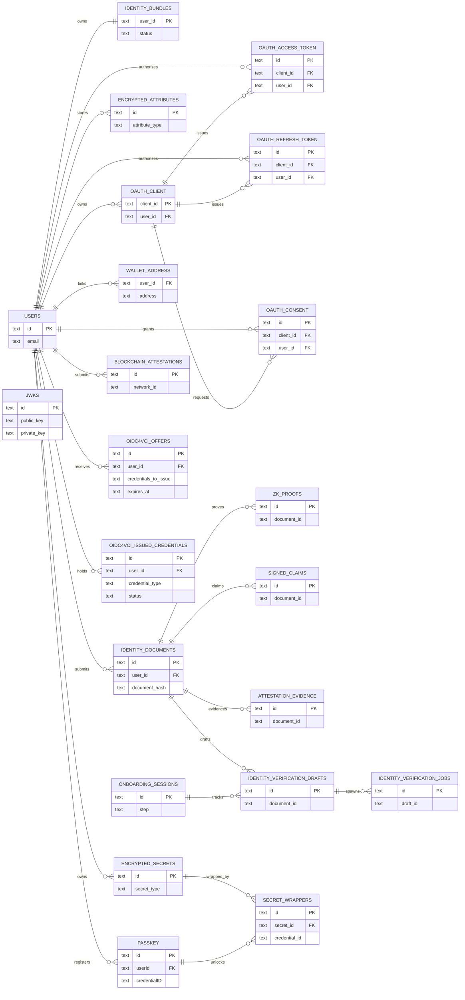

# Attestation & Privacy Architecture

> **Purpose**: Single source of truth for attestation schema, data classification, and privacy boundaries.

## Executive Summary

Zentity separates **eligibility proofs (ZK)**, **sensitive attributes (FHE)**, **audit metadata (hashes + signatures)**, and **client‑held keys (Passkeys + OPAQUE)** so banks, exchanges, and Web3 protocols can verify compliance **without receiving raw PII**. These four cryptographic pillars are used together throughout the system.

- **ZK proofs**: age (day-precise), document validity, nationality membership, address jurisdiction, face match threshold.
- **FHE encryption**: full DOB (days since 1900-01-01), country code, address country, compliance level, liveness score, risk score.
- **Commitments + hashes**: document hash, name commitment, DOB commitment, address commitment, proof hashes.
- **Screening attestations**: PEP/sanctions screening results stored as signed claims (boolean + provider + timestamp).
- **Passkeys + OPAQUE (auth + key custody)**: passkeys for passwordless auth and PRF‑derived KEKs; OPAQUE for password auth with client‑derived export keys that wrap secrets.
- **Evidence pack**: `policy_hash` + `proof_set_hash` for durable auditability.
- **User-only decryption**: client keys are stored server-side as passkey‑ or OPAQUE‑wrapped encrypted secrets—only the user can unwrap them in the browser.

This model supports **multi-document identities**, **revocable attestations**, **periodic re-verification**, and **auditable disclosures** across Web2 and Web3.

### Regulatory Compliance

This architecture supports:

- **US (FinCEN CIP Rule)**: Full DOB precision, address collection, name verification
- **EU (AMLD5/AMLD6)**: 5-year retention, PEP/sanctions screening, re-verification scheduling
- **FATF Travel Rule**: Address and jurisdiction proofs without exposing exact addresses

---

## Trust & Privacy Boundaries

### Core trust model

- **Browser is untrusted for integrity** (users can tamper with client code).
- **Browser is best for privacy** (ZK proofs + passkey/OPAQUE-based key custody).
- **Passkeys + OPAQUE are the auth + key custody anchors** (WebAuthn signatures prove user presence; PRF outputs and OPAQUE export keys derive KEKs locally and never leave the client).
- **Server is trusted for integrity** (verification, signing, policy enforcement).
- **Server is not trusted for plaintext access** (only commitments + ciphertext).

### Encryption boundaries

| Layer | What happens | Who can decrypt | Why |
|---|---|---|---|
| **Web2 (off-chain)** | TFHE encryption via FHE service using client public key | **User only** (client key in browser) | Server can compute on ciphertext without decryption. |
| **Web3 (on-chain)** | Attestation encryption via registrar (server relayer SDK); client SDK used for wallet-initiated ops (transfers, decrypt) | **User only** (wallet signature auth) | On-chain compliance checks operate on ciphertext; decryption is user-authorized. |

**Important**: The server persists **encrypted key bundles** (passkey‑ or OPAQUE‑wrapped) and registers **public + server keys** with the FHE service under a `key_id`. Client keys are only decryptable in the browser.

### Why the server can’t decrypt

- The browser encrypts data with a random **data key (DEK)**.
- That DEK is wrapped by a **key‑encryption key (KEK)** derived from either a passkey PRF output or an OPAQUE export key.
- The server stores only the encrypted blob + wrapped DEK, but **never sees the PRF output or export key**.
- Result: the server can store and verify, but cannot decrypt user data.

### Integrity controls

- All ZK proofs include a **server-issued nonce** (replay protection).
- Proofs are **verified server-side**; on-chain InputVerifier validates FHE input proofs.
- High-risk measurements (OCR results, liveness, face match) are **server-signed claims**.
- Proofs are **bound to a claim hash** to prevent client tampering.
- Passkey authentication is **origin-bound** and uses **signature counters** to reduce replay and phishing risk.
- OPAQUE authentication keeps raw passwords off the server; clients verify the server’s static public key (pinned in production).
- Passkey PRF-derived KEKs are **credential-bound**; secret wrappers reference the credential ID + PRF salt.

---

## Data Classification Matrix

**Legend:** ✅ primary form, ◐ optional/derived, — not used.
**Vault** = passkey‑sealed profile or passkey‑wrapped encrypted secrets **stored in the server DB as encrypted blobs** and only decryptable client‑side after a passkey PRF unlock.

### Core Identity & Eligibility

| Data / Claim | ZK | FHE | Commit | Vault | Notes |
|---|---|---|---|---|---|
| Age >= threshold | ✅ | ◐ | Proof hash | — | Boolean eligibility; no DOB revealed. Uses `dobDays` for day-level precision. |
| Document validity | ✅ | — | Proof hash | — | Binary eligibility; no expiry disclosure. |
| Nationality in allowlist | ✅ | ◐ | Merkle root | — | Group membership only (EU, US, etc.). |
| Address in jurisdiction | ✅ | — | Merkle root | — | **NEW**: Proves residence in allowed jurisdiction. |
| Face match >= threshold | ✅ | — | Proof hash | — | Pass/fail only. |
| Liveness score | — | ✅ | Signed claim | — | Score stays private; server attests. |
| Compliance level | — | ✅ | Server-derived | — | Policy gating input. |

### DOB Storage (Production)

| Data | ZK | FHE | Commit | Vault | Notes |
|---|---|---|---|---|---|
| DOB days since 1900-01-01 | ◐ | ✅ | — | — | Full date precision for compliance. u32 days since 1900-01-01 (UTC). |
| DOB commitment | — | — | ✅ | — | SHA256(dob + salt) for audit trail. |

### Geographic & Address

| Data | ZK | FHE | Commit | Vault | Notes |
|---|---|---|---|---|---|
| Country code (numeric) | ◐ | ✅ | — | — | Enables encrypted allowlist checks. |
| Address country code | ◐ | ✅ | — | — | **NEW**: Country code from residential address. |
| Address commitment | — | — | ✅ | — | **NEW**: SHA256(address + salt) for audit. |

### Screening & Risk (Server-Side)

| Data | ZK | FHE | Commit | Vault | Notes |
|---|---|---|---|---|---|
| PEP screening result | — | — | Signed claim | — | **NEW**: Boolean result + attestation. |
| Sanctions screening result | — | — | Signed claim | — | **NEW**: Boolean result + attestation. |
| Risk level | — | — | Server-derived | — | **NEW**: low/medium/high/critical. |
| Risk score | — | ✅ | — | — | **NEW**: Numeric score (0-100). |

### Identity & Vault

| Data | ZK | FHE | Commit | Vault | Notes |
|---|---|---|---|---|---|
| Name (full name) | — | — | ✅ | ✅ | Commitment for audit; plaintext only in vault. |
| Profile PII (DOB, document #, nationality) | — | — | — | ✅ | Stored only in vault. |
| Address (full plaintext) | — | — | — | ✅ | **NEW**: Plaintext only in vault. |
| User salt (for commitments) | — | — | — | ✅ | Lives with profile; delete breaks linkability. |
| FHE client keys (secret key material) | — | — | — | ✅ | Stored as encrypted secrets + wrappers. |

### Auth & System

| Data | ZK | FHE | Commit | Vault | Notes |
|---|---|---|---|---|---|
| Passkey credential metadata | — | — | — | — | Stored in the `passkey` table for WebAuthn verification. |
| OPAQUE registration record | — | — | — | — | Stored in the `account` table; not a password hash and not plaintext. |
| Raw images / biometrics | — | — | — | — | Never stored; transient only. |

### Re-verification Tracking

| Data | ZK | FHE | Commit | Vault | Notes |
|---|---|---|---|---|---|
| Last verified at | — | — | — | — | **NEW**: Timestamp of last verification. |
| Next verification due | — | — | — | — | **NEW**: Scheduled re-verification date. |
| Verification count | — | — | — | — | **NEW**: Number of verifications performed. |

**Note:** Passkey credential metadata (public keys, counters, transports) is stored in the `passkey` table for authentication and key custody.

---

## Storage Boundaries

This system intentionally splits data across **server storage** and **client‑only access** suggesting “vault” does **not** mean “local‑only.” The vault is **stored server‑side in encrypted form**, but only the user can decrypt it using their passkey or OPAQUE export key.

### Summary view

| Location | What lives there | Access & encryption | Why |
|---|---|---|---|
| **Server DB (plaintext)** | Account email, auth metadata (passkey public keys, wallet addresses), OPAQUE registration records, OAuth operational metadata (client/consent/token records), document metadata (type, issuer), status fields | Server readable | Required for basic UX, auth, and workflow state |
| **Server DB (encrypted)** | Passkey‑sealed profile, passkey‑wrapped FHE keys, FHE ciphertexts | Client‑decrypt only (PRF‑derived keys) | User‑controlled privacy + encrypted computation |
| **Server DB (non‑reversible)** | Commitments, proof hashes, evidence pack hashes | Irreversible hashes | Auditability, dedup, integrity checks |
| **Client memory (ephemeral)** | Plaintext profile data, decrypted secrets, OCR previews | In‑memory only, cleared after session | Prevent persistent PII exposure |
| **On‑chain (optional)** | Encrypted attestations + public metadata | User‑decrypt only | Auditable compliance checks without PII |

### Why some data exists in two forms

- **Commitment + vault plaintext** is intentional: the server can **verify/dedup** using commitments, while the user retains **full control** of disclosure via the passkey vault.
- **Encrypted secrets + wrappers** live in the DB for **multi‑device access**, but the **decrypting key never leaves the user’s authenticator**.

### What “vault” means here

The vault is **not** a separate storage system. It is a **server‑stored encrypted blob** (`encrypted_secrets` + `secret_wrappers`) that can **only be decrypted client‑side** after WebAuthn + PRF or OPAQUE export‑key derivation.

---

## Privacy Guarantees

1. **Transient media** - document and selfie images are processed in memory and discarded.
2. **No plaintext PII at rest** - sensitive attributes live only in the passkey-sealed profile or as ciphertext.
3. **One-way commitments** - hash commitments allow integrity checks without storing values.
4. **Client-side proving** - private inputs remain in the browser during ZK proof generation.
5. **User-controlled erasure** - deleting the passkey-sealed profile breaks access to PII and salts.
6. **No biometric storage** - liveness and face match scores are stored as signed claims, not raw biometrics.

## Attestation Schema

### Entity Relationship Diagram

### Core tables

SQLite is accessed via the libSQL client (Turso optional for hosted environments). The ER diagram above is the canonical overview of core tables and relationships. For readability, some user_id relationships are implied but not drawn (e.g., proofs and claims are also user-scoped).

---

## Evidence Pack

The evidence pack binds **policy + proof set** into a durable, auditable commitment.

- **`policy_hash`**: hash of the active compliance policy inputs (age threshold, liveness thresholds, nationality group, etc.)
- **`proof_hash`**: hash of each proof payload + public inputs + policy version
- **`proof_set_hash`**: hash of sorted `proof_hashes` + `policy_hash`
- **`consent_receipt`**: JSON consent receipt (RP + scope + timestamps)
- **`consent_receipt_hash`**: hash of the receipt (computed when building disclosure payloads)
- **`consent_scope`**: explicit fields the user approved for disclosure

Hash composition and canonicalization rules are described in the evidence bundle RFC. See [RFC: verification UX evidence bundle](rfcs/0013-verification-ux-evidence-bundle.md).

**Where it appears:**

- Stored in `attestation_evidence`
- Included in disclosure payloads
- Suitable for on-chain attestation metadata

This enables auditors and relying parties to validate **exactly which proofs** and **which policy** were used.

---

## Multi-Document Model

- Users can register **multiple documents** (passport, ID, license).
- Every proof and evidence pack is **document-scoped** (`document_id`).
- The **bundle status** is derived from the selected/most trusted document.

This supports upgrades and re-verification without overwriting previous evidence.

---

## Web3 Attestation Schema

Encrypted attributes are stored on‑chain in the IdentityRegistry (fhEVM), including **date of birth (dobDays)**, **country code**, **compliance level**, and optional flags.
Public metadata includes **proofSetHash**, **policyHash**, **issuerId**, and timestamps for auditability.

The encrypted attributes allow compliance checks **under encryption**. The public metadata enables audits without revealing PII. See [Web3 Architecture](web3-architecture.md) for the implementation details.

---

## Disclosure Payload

A relying party receives:

- Proof payloads + public inputs (for verification)
- Commitments (document hash, name commitment)
- Encrypted attributes (if required for encrypted checks)
- Evidence pack (`policy_hash`, `proof_set_hash`)
- Signed claims (liveness / face match scores)

**Consent model:** PII disclosure is **user‑authorized**. The client decrypts the passkey‑sealed profile and re‑encrypts to the RP. Zentity never handles plaintext PII.

This enables a bank or exchange to:

- Verify all ZK proofs independently
- Store an immutable audit trail
- Enforce compliance without handling raw PII

---

## Verifiable Credential Issuance

Zentity issues SD-JWT verifiable credentials containing **derived claims only**:

- `verification_level` (`none` | `basic` | `full`)
- `verified`, `document_verified`, `liveness_verified`, `face_match_verified`
- `age_proof_verified`, `doc_validity_proof_verified`, `nationality_proof_verified`
- `policy_version`, `issuer_id`, `verification_time`

**No raw PII** is included in credentials. Claims derive from existing verification artifacts (ZK proofs, signed claims, FHE).

### Credential tables

- `oidc4vci_offers`: Pre-authorized credential offers (short-lived)
- `oidc4vci_issued_credentials`: Issued credential metadata + status
- `jwks`: Signing key material for credential signatures

### Selective disclosure

SD-JWT format allows users to reveal only specific claims during presentation. The holder controls which disclosure keys are included.

See [SSI Architecture](ssi-architecture.md) for the full credential model.

---

## Why This Matters for Banks & Exchanges

- **Auditability**: Evidence pack + signed claims provide durable proof of what was verified.
- **Regulatory alignment**: They can store only what is required (proofs + signed claims), not full biometrics.
- **Privacy-by-design**: Encrypted attributes allow re-checks without re-collecting data.
- **Upgrade paths**: Multi-document model and policy hashing support future policy changes.

---

## Implementation Notes

- **FHE keys** are generated in the browser and stored server‑side as passkey‑wrapped encrypted secrets (no plaintext at rest).
- **Passkey‑wrapped key storage** uses `encrypted_secrets` + `secret_wrappers` for multi‑passkey access. See [RFC: passkey‑wrapped FHE keys](rfcs/0001-passkey-wrapped-fhe-keys.md).
