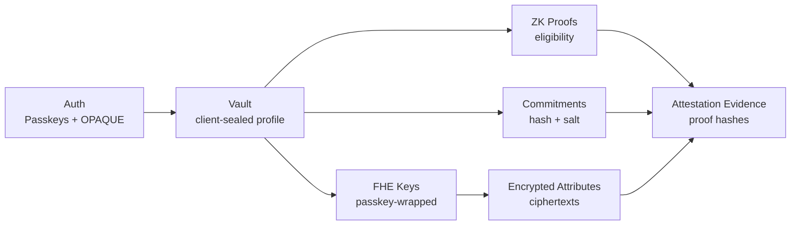

# Cryptographic Pillars

Zentity relies on **four complementary cryptographic pillars**. Each solves a different privacy problem, and the system only works because they are designed to **interlock**, not compete.

## The Four Pillars

| Pillar | What it protects | Where it runs | Why it exists |
|---|---|---|---|
| **Auth + key custody (Passkeys + OPAQUE)** | Authentication + key custody | Browser + authenticator | Passkeys for passwordless login and OPAQUE for privacy-preserving passwords; both yield client-held keys that seal profiles and wrap FHE keys. |
| **Zero-Knowledge Proofs (ZKPs)** | Eligibility without disclosure | Browser (prove) + server (verify) | Prove age, nationality group, or document validity without revealing the underlying values. |
| **Fully Homomorphic Encryption (FHE)** | Encrypted computation | Server + fhEVM | Compute on encrypted attributes (age, nationality, compliance level) without decryption. |
| **Cryptographic Commitments** | Integrity + dedup + erasure | Server DB | One-way hashes bind values without storing them; deleting the salt breaks linkability. |

## Plain-English snapshot

- **Passkeys + OPAQUE**: log in and derive a key that unlocks your encrypted data on the client. The server stores encrypted blobs only.
- **ZK proofs**: prove a statement like “over 18” without revealing the birth year.
- **FHE**: run policy checks on encrypted data without decrypting it.
- **Commitments**: store one-way hashes so you can verify later without storing plaintext.

## Why Four

Each pillar addresses a different threat boundary:

- **Passkeys + OPAQUE** guarantee user-owned custody of secret material (passwordless or password-based).
- **ZKPs** prove statements without exposing private inputs.
- **FHE** enables computation on ciphertext when ZKPs are not practical for repeated policy checks.
- **Commitments** give integrity and deduplication without storing plaintext.

Removing any one creates a gap (e.g., ZK can prove eligibility but not enable encrypted re-checks; FHE can compute but doesn't prove origin; commitments allow integrity but not privacy-preserving verification).

## How They Interlock



### Example: Proving age without exposing DOB

1. **Passkey** unlocks the sealed profile (DOB stays client-side).
2. **ZK proof** shows "age >= 18" without revealing the birth year.
3. **Commitment** allows later integrity checks without storing DOB.
4. **FHE** encrypts the full DOB (dobDays) so policy checks can be run later without re-collecting PII.

## Pillar Details

### Commitments

A commitment is a one-way hash that binds a value without storing it:

1. Compute `commitment = SHA256(value + user_salt)` during verification.
2. Store only the commitment server-side.
3. Keep `user_salt` in the passkey-sealed profile (client-only decrypt).
4. Later, recompute to verify without storing the original value.

Deleting the sealed profile **breaks linkability** while commitments remain non-reversible.

### FHE

FHE allows policy checks on encrypted data:

1. Encrypt sensitive attributes (e.g., DOB days, country code).
2. Store ciphertexts server-side or on-chain.
3. Evaluate compliance under encryption (no plaintext exposure).

### Passkey + OPAQUE Key Custody

Passkeys and OPAQUE secure the keys used for encryption and disclosure:

| Aspect | What we do |
|---|---|
| Key generation | Client generates keys in the browser |
| Key storage | Encrypted blobs stored server-side |
| Key protection | PRF-derived KEK (passkey) or OPAQUE export-derived KEK (password) wraps a random DEK |
| Who can decrypt | Only the user with their passkey or password-derived export key |
| Result | User-controlled erasure and multi-device access |

### ZK Proofs

ZK proofs let a verifier learn **only** a boolean outcome (e.g., "over 18") while the underlying data stays private in the browser.

## Where Each Pillar Appears in the Flow

- **Onboarding**: Passkeys or OPAQUE passwords create the account; commitments + signed claims are stored; ZK proofs are generated client-side.
- **Compliance checks**: FHE ciphertexts allow encrypted evaluation; ZK proofs provide eligibility guarantees.
- **Disclosure**: Passkeys or OPAQUE-derived keys authorize decryption and re-encryption to relying parties.
- **Credential issuance**: SD-JWT VCs package derived claims from ZK proofs and signed claims for portable presentation.
- **Auditability**: Commitments + proof hashes form an evidence pack for compliance.

## Supporting Techniques

- **Merkle Trees**: Enable group membership proofs (e.g., EU nationality) without revealing which country. Used inside ZK proofs.
- **Hash Functions**: Poseidon2 for ZK efficiency, SHA-256 for commitments.

## Cryptographic Details

This section goes deeper than the architectural overview and explains the cryptographic choices, primitives, and bindings used across Zentity.

### 1) Passkeys + PRF

**WebAuthn authentication**

- Uses WebAuthn for passwordless authentication (origin-bound public-key signatures).
- Signature counters provide replay resistance at the authenticator level.

**PRF extension (key derivation)**

We use the WebAuthn PRF extension to derive a deterministic secret that never leaves the authenticator:

- PRF output is used as key material.
- We derive a KEK via HKDF-SHA-256.
- The KEK wraps a random DEK using AES-256-GCM.

The DEK then encrypts sensitive payloads (profile vault, FHE keys). This keeps secret custody user-owned while allowing multi-device access across both passkey and password flows.

### 1b) OPAQUE (password-based authentication)

OPAQUE is an **augmented PAKE** that keeps raw passwords off the server:

- The client never transmits the plaintext password.
- The server stores an **OPAQUE registration record**, not a password hash.
- The client derives an **export key** on registration/login; we use it to derive a KEK (via HKDF) that wraps the DEK, mirroring the passkey PRF flow.
- Clients verify the server’s static public key (pinned in production) to prevent MITM.

### 2) Commitments + Hashing

**Commitments**

We use SHA-256 commitments to bind values without storing them:

```text
commitment = SHA256(normalized_value + user_salt)
```

- `user_salt` lives in the passkey-sealed profile.
- Deleting the profile breaks linkability while commitments remain non-reversible.

**Evidence pack hashes**

We compute audit hashes for policy/proof sets and store them in the evidence pack. See Attestation & Privacy Architecture for the schema and rationale.

**Dual verification-key hashes**

ZK verification keys are stored with two hash formats:

- SHA-256 for ops/audit identity
- Poseidon2 (field-friendly) for registry/on-chain compatibility

See ADR: `docs/adr/zk/0003-dual-vkey-hashes.md`.

### 3) ZK Proofs

**Proof system**

- Circuits are written in Noir.
- Proofs are generated in the browser using bb.js (Barretenberg).
- Verification runs server-side using UltraHonk.

**Universal setup (SRS/CRS)**

UltraHonk relies on a universal structured reference string (SRS/CRS). The Barretenberg tooling manages fetching and caching the SRS as part of proof generation and verification.

**Hashing in circuits**

- Poseidon2 is used inside circuits for efficiency in field arithmetic.
- It binds proofs to server-signed claims: `claim_hash = Poseidon2(value, document_hash)`.

**Replay protection**

Every circuit accepts a public nonce that is issued by the server and consumed on submission.

See [ZK Architecture](zk-architecture.md) for circuit flows and verifier isolation.

### 4) FHE

**Off-chain FHE (Web2)**

- TFHE-rs encrypts sensitive attributes (DOB days, country code, compliance level).
- Ciphertexts are stored server-side but only decryptable by the user's keys.

**On-chain FHE (Web3 / fhEVM)**

- Attestations are encrypted server-side by the registrar and submitted on-chain.
- Wallet operations (encrypted transfers, decrypt requests) use the client SDK.
- On-chain contracts operate only on ciphertext handles and input proofs.

**Relationship to relayer / gateway**

The registrar uses the relayer SDK to encrypt and submit attestation inputs. Decryption and access are mediated through the fhEVM gateway and ACL patterns (see [Web3 Architecture](web3-architecture.md)).

### 5) How the Pillars Bind Together

- Passkeys seal the profile vault and wrap FHE keys.
- Commitments let the server verify values without storing them.
- ZK proofs assert eligibility using vault data + server-signed claims.
- FHE enables repeated encrypted policy checks without re-collecting PII.

This combination yields privacy (no plaintext storage) and integrity (verifiable proofs + hashes) while keeping user key custody intact.

## Deep Dives

- [Attestation & Privacy Architecture](attestation-privacy-architecture.md) for data classification and storage boundaries
- [ZK Architecture](zk-architecture.md) for proof system design
- [Web3 Architecture](web3-architecture.md) for on-chain encrypted attestation
- [SSI Architecture](ssi-architecture.md) for verifiable credential issuance and presentation
