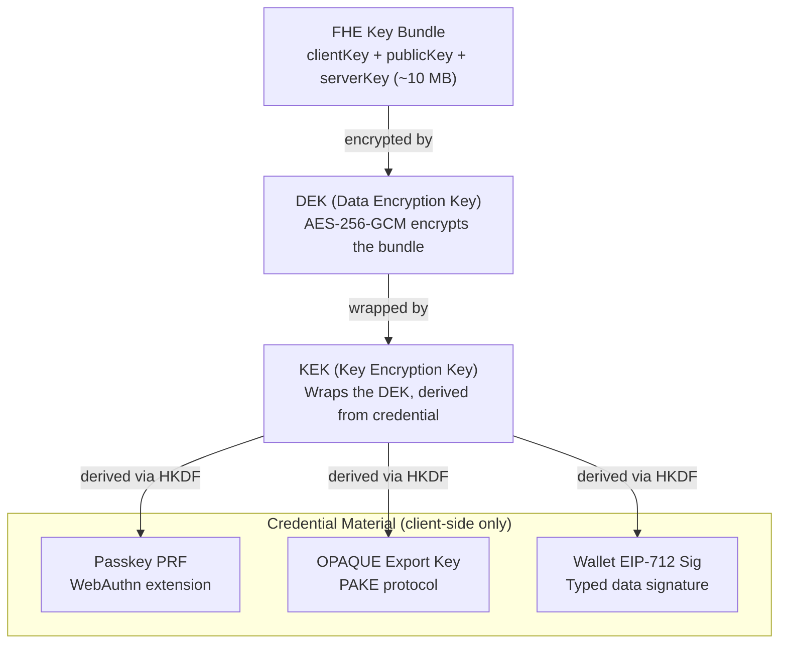

# FHE Key Lifecycle & Authentication Architecture

This document analyzes the Fully Homomorphic Encryption (FHE) key lifecycle in Zentity, explaining when keys are needed, how they're protected by credentials, and the architectural constraints that shape our authentication flows.

## Overview

Zentity uses FHE to encrypt sensitive identity data (date of birth, liveness score) such that computations can be performed on encrypted data without exposing the plaintext. FHE is used for attributes that require **server-side threshold computation without user participation** — e.g., different RPs checking different age thresholds (`today - dob_days >= 18` vs `>= 21`) on the same ciphertext. Nationality uses ZK instead (binary set membership, no variable threshold). The FHE keys are protected using credential-derived encryption, creating a user-controlled encryption model where the server cannot decrypt data without user participation.

Important nuance in the current implementation:

- The **FHE service** stores the registered `publicKey` + `serverKey` and is addressed by a `keyId`.
- The **client** needs the local FHE key bundle primarily to **decrypt FHE results** (requires `clientKey`).
- Most server-side FHE operations during verification use the `keyId` and do **not** require unwrapping the local FHE key bundle.

## Key Protection Architecture

### Encryption Hierarchy



### Credential-to-KEK Derivation

Each credential type derives a KEK differently:

| Credential | Source Material | Derivation |
|------------|-----------------|------------|
| **Passkey** | WebAuthn PRF extension output (32 bytes) | HKDF-SHA256 |
| **OPAQUE** | PAKE protocol export key (64 bytes) | HKDF-SHA256 |
| **Wallet** | EIP-712 typed data signature (65 bytes) | HKDF-SHA256 |

The DEK is wrapped (encrypted) with the KEK using AES-256-GCM with authenticated additional data (AAD) binding the secret to a specific user and credential.

## FHE Key Lifecycle

### When FHE Keys Are Used

| Operation | FHE Keys Needed? | Credential Material Needed? |
|-----------|------------------|----------------------------|
| **Sign-up** | NO | NO |
| **Sign-in** | NO | Sometimes (cached for later access) |
| **Verification preflight** | YES (generate + wrap) | YES (to create wrapper) |
| **Dashboard view** | NO | NO |
| **Identity verification (server-side encryption)** | NO (uses `keyId`) | NO |
| **FHE computation** | YES (decrypt results) | YES (to unwrap DEK) |
| **OAuth to RP** | NO | NO |
| **Credential management** | YES (re-wrap DEK) | YES (to unwrap then re-wrap) |

Notes:

- “FHE Keys Needed?” here refers to needing the **encrypted local FHE key bundle** (`clientKey/publicKey/serverKey`) via `getStoredFheKeys()`/`loadSecret()`. Server-side jobs typically operate on `keyId` only.
- On **sign-in**, credential material caching differs by auth method:
  - Passkey: PRF output is not fetched by default at sign-in; it’s obtained on demand via a WebAuthn prompt.
  - OPAQUE: export key is only available during the login ceremony and can be cached in memory.
  - Wallet: EIP-712 signature can be requested at any time and cached in memory.

### Sign-up Flow (Account Creation)

Sign-up is now lightweight and **does not** generate FHE keys. The flow:

```text
1. User creates account (passkey/OPAQUE/wallet)
2. Session established
3. Identity bundle stub created (no fheKeyId yet)
```

FHE enrollment is deferred to a dedicated verification preflight step.

### Sign-in Flow (No FHE Operations)

Sign-in creates a session but does NOT unwrap FHE keys:

```text
1. User authenticates (passkey/OPAQUE/wallet)
2. Session created
3. Credential material may be cached in memory (OPAQUE export key, wallet signature)
4. Redirect to dashboard (no FHE operations)
```

Credential material may be cached for later use if the user needs to access FHE-encrypted data during the session. Passkey PRF output is typically obtained later via a WebAuthn PRF prompt (not automatically as part of sign-in).

### Where Local FHE Keys Are Required (Client-Side Decryption)

Local FHE keys are required when the browser needs to decrypt FHE outputs (e.g., decrypting a boolean result). This triggers secret loading:

```text
1. UI needs to decrypt an FHE ciphertext
2. Call getStoredFheKeys() → triggers loadSecret()
3. loadSecret() needs to unwrap DEK:
   - Check credential cache
   - If cache miss: prompt user (passkey) or fail (OPAQUE)
4. FHE keys loaded, decryption proceeds
```

### Verification Preflight (Deferred Enrollment)

Before document upload, users must complete a “Secure your verification data”
gate that performs FHE enrollment:

```text
1. Confirm credential (passkey PRF / wallet signature / password step-up)
2. Generate FHE keys client-side
3. Encrypt keys and store wrappers
4. Register public + server key → receive keyId
5. Update identity bundle with fheKeyId + fheStatus
```

Only after this preflight succeeds can users proceed to document upload.

### Verification Flow (Server-Side FHE Encryption)

During identity verification, server-side FHE encryption typically uses the stored `keyId` and calls the FHE service. This does **not** require unwrapping the local FHE key bundle in the browser.

## Credential Material Availability

### Availability Matrix

| Credential | At Sign-up | At Sign-in | Cache Lifetime | Re-obtainable? |
|------------|-----------|-----------|----------------|----------------|
| **Passkey PRF** | Captured | Not fetched by default | ~15 min TTL (in-memory) | YES (new WebAuthn prompt) |
| **OPAQUE Export** | Captured | Captured + cached | ~15 min TTL (in-memory) | NO (must re-login) |
| **Wallet Signature** | Captured | Often captured + cached | ~24h TTL (in-memory)\* | YES (new signature request) |

\* The wallet signature also has an application-level expiry (`expiresAt`) which is currently set to ~365 days when the signature is collected, but the in-memory cache TTL is shorter (so the cache TTL typically dominates).

### The OPAQUE Constraint

OPAQUE presents a unique challenge:

```typescript
// From secrets/index.ts - OPAQUE loading
if (!hasAnyCachedOpaqueExport()) {
  throw new Error(
    `Please sign in again to access your ${ctx.label}. Your session key has expired.`
  );
}
```

**The OPAQUE export key is ONLY available during the login ceremony.** The PAKE protocol derives this key as part of the authentication handshake. Once the ceremony completes, the export key exists only in the client's memory cache.

If the cache expires or the user closes the browser:

- Passkey users: Can re-prompt for PRF (another WebAuthn interaction)
- Wallet users: Can re-request EIP-712 signature
- OPAQUE users: **Must re-authenticate with password**

This is why OPAQUE users see "Please sign in again" errors when their session cache expires but their HTTP session is still valid.

## Can FHE Enrollment Be Deferred?

### Analysis

The question: Can we create accounts WITHOUT immediate FHE key wrapping, deferring enrollment to first verification?

**For Passkey users: YES**

- PRF can be obtained later via `evaluatePrf()`
- Triggers another WebAuthn prompt, but works

**For Wallet users: YES**

- Can request new EIP-712 signature anytime
- User sees another signing prompt, but works

**For OPAQUE users: PROBLEMATIC**

- Export key only available at login time
- Deferring would require user to "log in again" after sign-up
- Confusing UX: "Why am I logging in? I just signed up!"

### Current Design Decision

FHE enrollment is **deferred to verification preflight** because:

1. **Faster sign-up**: account creation remains quick and familiar
2. **Explicit consent**: users understand why encryption is required before verification
3. **Credential flexibility**: passkey, wallet, or password step-up can be used on demand

Verification flows now gate on the preflight completion instead of assuming
`fheKeyId` exists at sign-up time.

Additional consideration:

- Deferring enrollment also impacts any logic that infers “auth mode” from the existence/type of wrappers on `SECRET_TYPES.FHE_KEYS` (e.g., gates that decide whether to prompt for PRF/password/wallet signature before encrypted workflows).

### Recommended UX for Deferred Enrollment: “Secure Keys” Preflight

If the goal is to keep sign-up/sign-in as close to “standard Better Auth” as possible while still preserving the user-controlled encryption model, the most robust pattern is to make enrollment an **explicit, atomic preflight** step that runs **before any verification work begins** (before document upload, OCR, liveness, etc.).

At a high level:

1. User clicks “Start verification”
2. App runs a “Secure your verification data” step (FHE enrollment)
3. Only after enrollment succeeds does the app proceed to document upload and the rest of verification

This keeps the slow/complex crypto setup contained and explainable, and prevents partial verification state.

#### Atomicity requirement (what “must be true” before proceeding)

Before the verification flow continues, ensure ALL of the following:

- A stable `keyId` exists (FHE service registration complete).
- The encrypted `fhe_keys` secret exists server-side (encrypted blob stored).
- At least one valid wrapper exists for `SECRET_TYPES.FHE_KEYS` (DEK wrapped by the chosen credential).
- The identity bundle references the correct `fheKeyId` (or can be created/updated in the same preflight).

If any step fails, the user should be able to retry preflight safely (idempotent/resumable), and verification should not start.

#### Credential-specific behavior in a deferred preflight

All credential types can support deferred preflight, but the UX differs:

- **Passkey (PRF)**: prompt for a WebAuthn PRF assertion during preflight; store `prfSalt` with the wrapper so PRF output can be re-obtained later.
- **Wallet (EIP-712)**: request an EIP-712 signature during preflight; cache it for the session; store a wallet wrapper on `fhe_keys`.
- **OPAQUE (password)**: preflight must include a password step-up. The export key only exists during the OPAQUE ceremony, so the user will need to enter their password at preflight time (or you must have captured it at sign-up time).

This is the main reason teams sometimes choose a **custom flow** for OPAQUE (e.g., enroll at password sign-up / set-password time), while allowing passkey/wallet enrollment to be deferred.

#### What can go wrong (and how to mitigate it)

Common failure modes with deferred enrollment, and mitigations:

- **User cancels credential prompt** (WebAuthn / wallet signature / password): treat as a safe cancel; keep verification unopened; show “You can verify later.”
- **Device doesn’t support PRF**: detect early and steer the user to another credential type (wallet/password) or a supported authenticator.
- **TFHE WASM load/keygen slow or fails**: show an explicit “this can take ~30 seconds” step with progress; allow retry; avoid doing work twice if keys already exist.
- **Network failure during blob upload / wrapper store**: make preflight resumable; retry safely; don’t proceed to verification until confirmed stored.
- **Wallet mismatch** (wrong address/chain): detect and block with actionable copy; don’t store a wrapper that can never be re-unwrapped by the user.
- **OPAQUE cache expiry mid-verification**: if verification requires decrypting later in the same session, you may need another password step-up; keep it scoped and clearly explained.

#### User-facing copy (non-technical)

Suggested framing for the preflight step:

- Title: “Secure your verification data”
- Body: “We’re preparing your account to encrypt sensitive verification data. This can take up to ~30 seconds. Please keep this tab open.”
- Button: “Continue” / “Secure now”

Avoid mentioning “FHE/PRF/OPAQUE/EIP-712”. The user action is simply “confirm with passkey / wallet / password” and “wait while we prepare encryption”.

For a concrete Option A (uniform deferred) design, see `docs/verification-preflight-option-a.md`.

## OAuth Flows and FHE Keys

### OAuth Does NOT Require FHE Keys

When a user authenticates to a Relying Party (RP) via OAuth:

```text
1. RP redirects to Zentity /authorize
2. User lands on /sign-in with oauth_query params
3. User authenticates (passkey/OPAQUE/wallet)
4. Session created
5. User approves consent
6. Redirect back to RP with auth code
7. RP exchanges code for tokens + userinfo
```

**No step requires FHE key unwrapping.** The RP receives identity claims from the user's already-verified identity bundle, not raw FHE-encrypted data.

### OAuth Post-Login Flow

Custom auth methods (passkey, OPAQUE, SIWE) don't natively integrate with better-auth's `oauthProvider` plugin. After authentication, the client must explicitly continue the OAuth flow:

```typescript
// After successful custom auth
if (hasOAuthParams()) {
  const redirectUrl = await authClient.oauth2.continue({ postLogin: true });
  redirectTo(redirectUrl);  // Goes to consent page
}
```

The `oauthProviderClient` plugin automatically injects the signed `oauth_query` from the URL into the continue request.

## Implementation Details

### Key Files

| File | Purpose |
|------|---------|
| `lib/privacy/fhe/store.ts` | FHE key storage and retrieval |
| `lib/privacy/fhe/client.ts` | FHE enrollment and computation |
| `lib/privacy/secrets/index.ts` | Secret loading with credential unwrapping |
| `lib/privacy/credentials/` | Credential-specific KEK derivation |
| `lib/privacy/credentials/resolve.ts` | Unified credential cache resolver for enrollment (checks OPAQUE → wallet → passkey) |
| `lib/auth/oauth-post-login.ts` | OAuth continuation after custom auth |

### Credential Caching

Credential material is cached in memory (not persisted) for the session:

```typescript
// Passkey PRF cache
cachePasskeyUnlock({ credentialId, prfOutput });

// OPAQUE export key cache
cacheOpaqueExportKey({ userId, exportKey });

// Wallet signature cache
cacheWalletSignature({ userId, address, chainId, signatureBytes, ... });
```

Caches have TTLs and are cleared on sign-out via `prepareForNewSession()`.

## Security Considerations

### Server Cannot Decrypt

The server stores:

- Encrypted FHE key bundle (ciphertext)
- Wrapped DEK (encrypted with KEK)
- PRF salt (for passkey users)

The server does NOT have:

- Passkey PRF output (derived client-side)
- OPAQUE export key (derived in PAKE, never transmitted)
- Wallet signature (signed client-side)

**Result**: Server cannot derive KEK → cannot unwrap DEK → cannot decrypt FHE keys.

### Replay Protection

DEK wrapping uses Authenticated Additional Data (AAD):

- Secret ID
- Credential ID
- User ID

Prevents wrapped DEK from being used with different secrets or users.

### Multi-Credential Support

Users can have multiple credentials wrapping the same DEK:

- Primary passkey + backup passkey
- Passkey + OPAQUE password
- Passkey + recovery guardians

Each credential has its own wrapper entry; the DEK itself is shared.

## Related Documentation

- [Attestation & Privacy Architecture](attestation-privacy-architecture.md) - Data classification and privacy boundaries
- [RFC-0001: Passkey-Wrapped FHE Keys](rfcs/0001-passkey-wrapped-fhe-keys.md) - Original design RFC
- [FROST Threshold Recovery](rfcs/0014-frost-social-recovery.md) - Guardian-based key recovery
