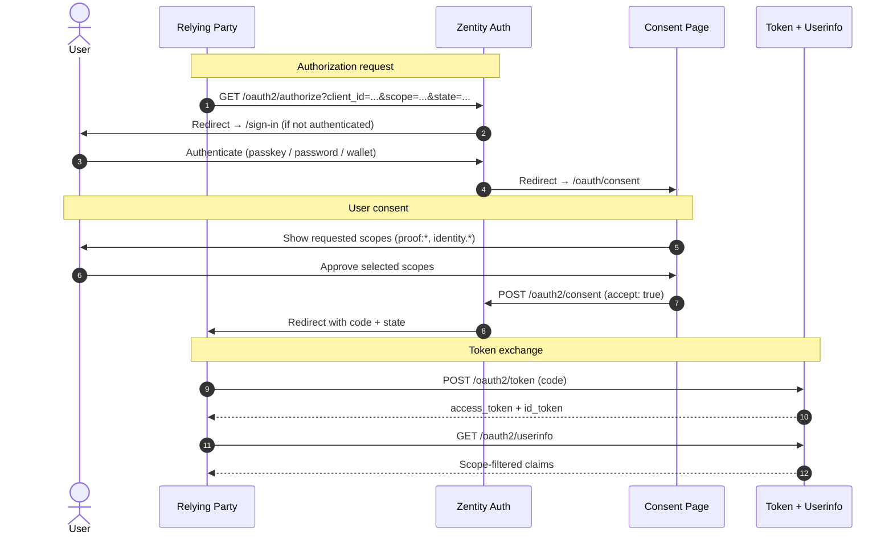

# OAuth Integrations

This doc covers all OAuth/OIDC directions in Zentity:

1. [**OAuth Provider**](#oauth-provider-zentity-as-authorization-server) — Zentity acts as an authorization server for partners
2. [**Generic OAuth**](#generic-oauth-zentity-as-oauth-client) — Zentity signs in with external OAuth/OIDC providers
3. [**OIDC4VCI**](#oidc4vci-credential-issuance) — Verifiable credential issuance to wallets
4. [**OIDC4VP**](#oidc4vp-credential-presentation) — Credential presentation from wallets

---

## OAuth Provider (Zentity as authorization server)

The OAuth Provider plugin (`@better-auth/oauth-provider`) is enabled in `apps/web/src/lib/auth/auth.ts` and exposes endpoints under `/api/auth/oauth2/*` plus discovery at `/api/auth/.well-known/*`.

Zentity acts as a standards-based OAuth 2.1 / OIDC-compatible authorization server for partners who need **verified claims** (not raw PII). This avoids custom redirect handling, allows partners to integrate with existing OAuth libraries, and keeps verification results minimal.

### Authorization flow



**Step by step:**

1. **Partner redirects the user to Zentity** — `GET /api/auth/oauth2/authorize?client_id=...&redirect_uri=...&scope=openid%20profile%20email&state=...`
2. **User authenticates** (if not already signed in) — Redirects to `/sign-in`
3. **User consents** — Redirects to `/oauth/consent`, consent page calls `POST /api/auth/oauth2/consent` with `accept: true`
4. **Authorization code is returned** — Redirects back to partner with `code` + `state`
5. **Partner exchanges code for tokens** — `POST /api/auth/oauth2/token`
6. **Partner retrieves verified claims** — `GET /api/auth/oauth2/userinfo` (requires `openid`)

### Endpoints

| Endpoint | Purpose |
|----------|---------|
| `GET /api/auth/.well-known/oauth-authorization-server` | Server metadata |
| `GET /api/auth/.well-known/openid-configuration` | OIDC discovery |
| `GET /api/auth/oauth2/authorize` | Authorization request |
| `POST /api/auth/oauth2/consent` | Consent submission |
| `POST /api/auth/oauth2/continue` | Continue after custom auth |
| `POST /api/auth/oauth2/token` | Token exchange |
| `POST /api/auth/oauth2/introspect` | Token introspection |
| `POST /api/auth/oauth2/revoke` | Token revocation |
| `GET /api/auth/oauth2/userinfo` | User claims |
| `GET /api/auth/oauth2/end-session` | Session logout |
| `GET /api/auth/oauth2/get-consents` | List all consents for current user |
| `GET /api/auth/oauth2/get-consent?id=...` | Get a specific consent |
| `POST /api/auth/oauth2/delete-consent` | Revoke consent (`{ id }`) |
| `POST /api/auth/oauth2/update-consent` | Update consented scopes (`{ id, update: { scopes } }`) |

### Client management

All OAuth clients register via **RFC 7591 Dynamic Client Registration** at `/api/auth/oauth2/register`. The user controls data access at consent time — organization assignment is for operational management (see [ADR-0003](adr/platform/0003-dcr-open-registration-user-gated-consent.md)).

**Applications UI** — `/dashboard/developer/applications` provides a dashboard for viewing and managing organization-assigned OAuth clients.

**REST API endpoints:**

| Endpoint | Method | Purpose |
|----------|--------|---------|
| `/api/rp-admin/clients/approve` | POST | Assign a DCR-registered client to an org |
| `/api/rp-admin/clients/unowned` | GET | List clients not assigned to any org |
| `/api/rp-admin/clients/owned` | GET | List clients assigned to the active org |

All RP admin endpoints require an authenticated session with an active organization where the user has `owner` or `admin` role. See `apps/web/src/lib/auth/rp-admin.ts`.

**Organization ownership** — Clients are optionally assigned to organizations via the `referenceId` column on `oauth_client`. This enables team-based management and operational visibility. Unassigned clients function normally — organization ownership is not a security boundary.

**DCR + assignment** — Clients registered via DCR start without an owner. An org admin can later assign these clients via the approve endpoint, linking them to an organization.

**Client metadata** — Clients support an optional `metadata` JSON field. For scopes that should be selectable but not required, set `optionalScopes`:

```json
{ "optionalScopes": ["identity.dob", "identity.address"] }
```

**Direct SQL setup** — OAuth clients are stored in the `oauth_client` table (`apps/web/src/lib/db/schema/oauth-provider.ts`):

```sql
INSERT INTO oauth_client (client_id, redirect_uris, scopes, created_at)
VALUES (
  'partner-client-id',
  '["https://partner.example.com/callback"]',
  '["openid","profile","email","proof:identity"]',
  datetime('now')
);
```

### Configuration

- Redirect URIs are **defined per client**, not via env allowlists.
- Login page: `/sign-in`
- Consent page: `/oauth/consent`

### Scope architecture and selective disclosure

Zentity uses two scope families to control what data RPs receive via userinfo. Both support user-controlled selective disclosure at consent time.

**Proof scopes** (`proof:*`) — non-PII boolean verification flags, delivered via **userinfo**:

| Scope | Claims returned |
|-------|----------------|
| `proof:identity` | All verification claims (umbrella) |
| `proof:verification` | `verification_level`, `verified` |
| `proof:age` | `age_proof_verified` |
| `proof:document` | `document_verified`, `doc_validity_proof_verified` |
| `proof:liveness` | `liveness_verified`, `face_match_verified` |
| `proof:nationality` | `nationality_proof_verified` |
| `proof:compliance` | `policy_version`, `issuer_id`, `verification_time`, `attestation_expires_at` |
| `compliance:key:read` | Read RP encryption keys for compliance data |
| `compliance:key:write` | Register/rotate RP encryption keys |

**Identity scopes** (`identity.*`) — actual PII, delivered via **id_token only** (the server has no persistent PII). Full scopes are persisted so the authorization code carries them, then identity scopes are stripped from the consent record so vault unlock is required each time:

| Scope | Claims returned |
|-------|----------------|
| `identity.name` | `given_name`, `family_name`, `name` |
| `identity.dob` | `birthdate` |
| `identity.address` | `address` |
| `identity.document` | `document_number`, `document_type`, `issuing_country` |
| `identity.nationality` | `nationality`, `nationalities` |

**Standard OIDC scopes** (`openid`, `profile`, `email`, `offline_access`) are auto-approved.

#### Identity PII data flow

Identity PII (`identity.*` scopes) flows through a three-stage pipeline:

1. **Profile secret creation** — During identity verification (after liveness and face match, before ZK proof generation), extracted PII (name, DOB, document number, nationality, document type, issuing country) is encrypted with the user's credential and stored as a `PROFILE` secret. The credential material (passkey PRF / OPAQUE export key / wallet signature) is cached from the FHE enrollment step that precedes verification. The server stores only opaque encrypted blobs it cannot decrypt.

2. **Consent-time vault unlock** — When the user approves `identity.*` scopes, the consent page must unlock the profile secret. The unlock method depends on the user's credential type, detected server-side from their secret wrappers:
   - **Passkey** — WebAuthn prompt (automatic browser dialog)
   - **Password (OPAQUE)** — Inline password field where the user re-enters their password
   - **Wallet (EIP-712)** — "Sign with Wallet" button requiring a deterministic EIP-712 signature (signed twice and compared, same as FHE enrollment)

   Once unlocked, the consent UI maps profile fields to OIDC claims and sends them to `/api/oauth2/identity/stage`. The stage endpoint holds the claims ephemerally in memory (5min TTL, consumed on read).

3. **id_token delivery** — When better-auth issues the id_token, the `customIdTokenClaims` hook consumes the ephemeral claims and includes only those matching the requested `identity.*` scopes. The claims are never written to persistent storage.

The server never stores plaintext PII. The profile secret is the authoritative PII source and is only decryptable by the user. Identity scopes are stripped from the persisted consent record after the code is issued, so the consent page always reappears when identity scopes are requested.

If the profile vault can't be unlocked at consent time (credential cache expired, user cancels prompt, wallet not connected), the Allow button is disabled until the vault is successfully unlocked. This prevents granting consent for scopes the server can't fulfill — otherwise better-auth would record consent as granted and auto-skip the consent page on future requests, permanently delivering empty tokens to the RP.

#### Selective disclosure at consent

When an RP requests `proof:identity`, the consent page expands it into individual `proof:*` sub-scope checkboxes. All start **unchecked** — the user actively opts in to each claim they want to share. The same applies to `identity.*` scopes.

Example: a wine shop requests `openid email proof:identity`. The user checks only "Verification status" and "Age proof". The access token carries `openid email proof:verification proof:age`, and userinfo returns only those claims.

```text
Consent page:
  [auto] Basic authentication (openid)
  [auto] Email address (email)

  Verification Claims:
  [ ] Whether your identity is verified (proof:verification)
  [ ] Whether your age has been proven (proof:age)
  [ ] Whether your document has been verified (proof:document)
  [ ] Whether liveness and face match were verified (proof:liveness)
  [ ] Whether your nationality has been proven (proof:nationality)
  [ ] Compliance metadata (proof:compliance)
```

This uses standard OAuth scope mechanics — custom scopes (RFC 6749) with scope narrowing at consent (RFC 6749 Section 3.3).

#### Dynamic Client Registration (DCR)

All OAuth clients register via DCR (RFC 7591) and can request any scope in `publicClientScopes`: `openid`, `profile`, `email`, `proof:*`, `identity.*`. The `proof:identity` umbrella is expanded at consent time, so the user still controls what gets shared. See [ADR-0003](adr/platform/0003-dcr-open-registration-user-gated-consent.md) for the three-layer access control model.

#### Userinfo response

When verification data is available and `proof:*` scopes are approved, `/oauth2/userinfo` includes scope-filtered verification claims:

```json
{
  "sub": "user-id",
  "verified": true,
  "verification_level": "full",
  "age_proof_verified": true
}
```

Proof claims come from the identity bundle (server-side, always available for verified users). Identity PII claims come from the ephemeral store populated at consent time and delivered via id_token.

#### Disclosure paths

| Path | Standard | Mechanism |
|------|----------|-----------|
| Userinfo + `proof:*`/`identity.*` scopes | OAuth 2.0 custom scopes | Scope-to-claim filtering, opt-in consent |
| OIDC4IDA `verified_claims` | OpenID for Identity Assurance | `claims` parameter in authorize request |
| OIDC4VCI SD-JWT VC | W3C SD-JWT VC | Holder-controlled selective disclosure at presentation |

#### OIDC4IDA (Identity Assurance)

The `@better-auth/oidc4ida` plugin is active and returns `verified_claims` in id_token and userinfo when an RP includes the `claims` parameter in the authorize request (per OIDC4IDA Section 7). If the `claims` parameter is absent, the plugin returns early — it does not inject `verified_claims` into every response.

The `verified_claims` structure includes:

- **`verification`** — `trust_framework: "zentity"`, `assurance_level`, `evidence` (document verification metadata, timestamps)
- **`claims`** — the attested claims: `verified`, `verification_level`, proof statuses, policy metadata

This is a separate path from `proof:*` scopes. The scope-based path uses custom OAuth scopes with opt-in consent (see [ADR-0011](adr/privacy/0011-selective-disclosure-scope-architecture.md) for why scopes are the primary mechanism). OIDC4IDA is available for RPs that specifically implement the `claims` parameter per the spec.

**Implementation:**

- Plugin config: `oidc4ida({ getVerifiedClaims })` in `apps/web/src/lib/auth/auth.ts`
- Claims builder: `buildOidcVerifiedClaims()` in `apps/web/src/lib/auth/oidc/claims.ts`
- Schema: `apps/web/src/lib/db/schema/oidc4ida.ts`

#### Consent auto-skip and management

Once a user grants consent, `@better-auth/oauth-provider` stores a row in `oauth_consent` with the consented scopes. On subsequent authorize requests, if the row exists and covers all requested scopes, the consent page is skipped. If the RP requests new scopes not in the original grant, the consent page shows again.

**Identity scope stripping**: After consent is recorded, `identity.*` scopes are immediately stripped from the consent record. This means the consent page always reappears when identity scopes are requested — the vault unlock is per-session. Only `proof:*` and standard OIDC scopes persist in the consent record for auto-skip.

**Forcing re-consent**: RPs can add `prompt=consent` to the authorize URL to force the consent page regardless of prior grants.

#### Implementation

- Scope definitions: `apps/web/src/lib/auth/oidc/proof-scopes.ts`, `apps/web/src/lib/auth/oidc/identity-scopes.ts`
- Claim filtering: `filterProofClaimsByScopes()`, `filterIdentityByScopes()`
- Ephemeral identity staging: `apps/web/src/lib/auth/oidc/ephemeral-identity-claims.ts`
- Userinfo hook: `customUserInfoClaims` in `apps/web/src/lib/auth/auth.ts`
- id_token hook: `customIdTokenClaims` in `apps/web/src/lib/auth/auth.ts`
- Consent UI: `apps/web/src/app/oauth/consent/consent-client.tsx`

---

## Generic OAuth (Zentity as OAuth client)

Generic OAuth providers are configured via the `GENERIC_OAUTH_PROVIDERS` env var. The app parses this JSON array in `apps/web/src/lib/auth/auth.ts`.

### Example configuration

```json
[
  {
    "providerId": "partner-oidc",
    "discoveryUrl": "https://partner.example.com/.well-known/openid-configuration",
    "clientId": "your-client-id",
    "clientSecret": "your-client-secret",
    "scopes": ["openid", "email", "profile"],
    "pkce": true
  }
]
```

Set it in `.env.local`:

```env
GENERIC_OAUTH_PROVIDERS='[{"providerId":"partner-oidc","discoveryUrl":"https://partner.example.com/.well-known/openid-configuration","clientId":"...","clientSecret":"...","scopes":["openid","email","profile"],"pkce":true}]'
```

### Sign in flow

- Start sign-in via Better Auth:
  - `authClient.signIn.oauth2({ providerId: "partner-oidc" })`
  - (or `POST /api/auth/sign-in/oauth2` with `{ providerId }`)
- Better Auth handles the callback at:
  - `GET /api/auth/oauth2/callback/partner-oidc`

If the user is already signed in, Better Auth can link the provider account via `authClient.oauth2.link` (optional).

---

## OIDC4VCI (Credential Issuance)

Zentity acts as a Verifiable Credential Issuer following the OIDC4VCI specification.

### Issuer metadata

- `GET /.well-known/openid-credential-issuer`
- `GET /.well-known/oauth-authorization-server`

### Credential endpoint

- `POST /api/auth/oidc4vci/credential`

### Pre-authorized code flow

1. User completes verification
2. Server creates credential offer with pre-authorized code
3. Wallet scans QR or follows deep link
4. Wallet exchanges code for access token
5. Wallet requests credential with holder binding proof

### Supported credential types

- `zentity_identity` (vct: `urn:zentity:credential:identity`)
- Format: `dc+sd-jwt` (SD-JWT VC)

### Derived claims

Credentials contain only derived claims (no raw PII):

- `verification_level` (`none` | `basic` | `full`)
- `verified`, `document_verified`, `liveness_verified`, `face_match_verified`
- `age_proof_verified`, `doc_validity_proof_verified`, `nationality_proof_verified`
- `policy_version`, `issuer_id`, `verification_time`

---

## OIDC4VP (Credential Presentation)

Zentity can act as a verifier requesting presentations from wallets.

### Verifier endpoints

- `POST /api/auth/oidc4vp/verify` — Create presentation request
- `POST /api/auth/oidc4vp/response` — Submit presentation

### Presentation definition

Verifiers specify required claims via Presentation Exchange (PEX) format.

### Holder binding

Presentations include a proof JWT demonstrating possession of the holder's private key. The verifier validates:

- Issuer signature on the credential
- Holder binding (`cnf.jkt` thumbprint)
- Required claims are present

See [SSI Architecture](ssi-architecture.md) for the complete model.

---

## Notes

- Wallet auth (SIWE) is separate and documented in `docs/web3-architecture.md`.
