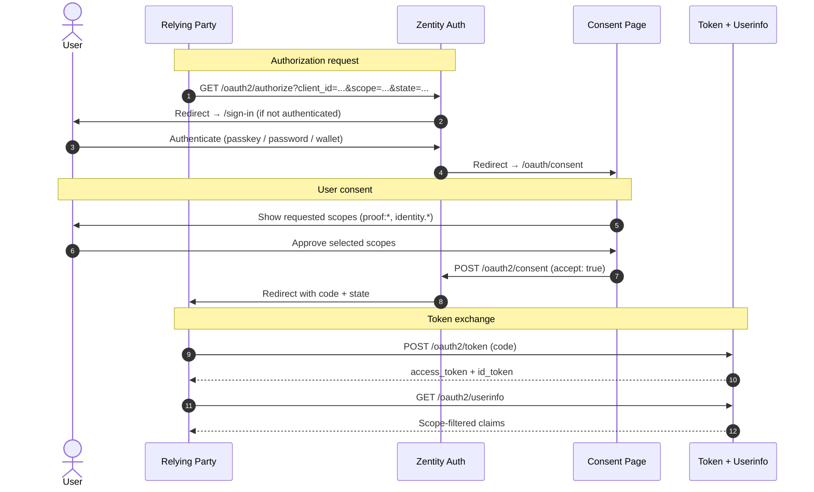
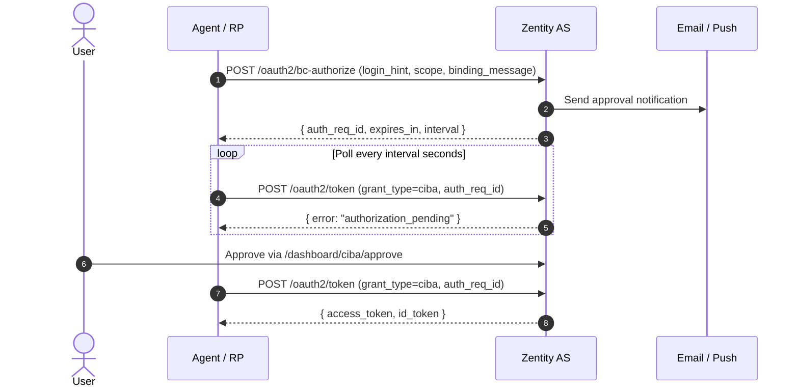

# OAuth Integrations

This doc covers all OAuth/OIDC directions in Zentity:

1. [**OAuth Provider**](#oauth-provider-zentity-as-authorization-server) — Zentity acts as an authorization server for partners
2. [**Generic OAuth**](#generic-oauth-zentity-as-oauth-client) — Zentity signs in with external OAuth/OIDC providers
3. [**OIDC4VCI**](#oidc4vci-credential-issuance) — Verifiable credential issuance to wallets
4. [**OIDC4VP**](#oidc4vp-credential-presentation) — Credential presentation from wallets
5. [**HAIP Compliance**](#haip-compliance) — DPoP, PAR, wallet attestation, JARM, x5c
6. [**CIBA (Backchannel Authorization)**](#ciba-backchannel-authorization) — Agent-initiated async approval

---

## OAuth Provider (Zentity as authorization server)

The OAuth Provider plugin (`@better-auth/oauth-provider`) is enabled in `apps/web/src/lib/auth/auth.ts` and exposes endpoints under `/api/auth/oauth2/*` plus discovery at `/api/auth/.well-known/*`.

Zentity acts as a standards-based OAuth 2.1 / OIDC-compatible authorization server for partners who need **verified claims** (not raw PII). This avoids custom redirect handling, allows partners to integrate with existing OAuth libraries, and keeps verification results minimal.

### Authorization flow


```mermaid
sequenceDiagram
  autonumber
  actor User
  participant RP as Relying Party
  participant Auth as Zentity Auth
  participant Consent as Consent Page
  participant API as Token + Userinfo

  Note over RP,Auth: Authorization request
  RP->>Auth: GET /oauth2/authorize?client_id=...&scope=...&state=...
  Auth->>User: Redirect → /sign-in (if not authenticated)
  User->>Auth: Authenticate (passkey / password / wallet)
  Auth->>Consent: Redirect → /oauth/consent

  Note over User,Consent: User consent
  Consent->>User: Show requested scopes (proof:*, identity.*)
  User->>Consent: Approve selected scopes
  Consent->>Auth: POST /oauth2/consent (accept: true)
  Auth->>RP: Redirect with code + state

  Note over RP,API: Token exchange
  RP->>API: POST /oauth2/token (code)
  API-->>RP: access_token + id_token
  RP->>API: GET /oauth2/userinfo
  API-->>RP: Scope-filtered claims
```

**Step by step:**

1. **Partner redirects the user to Zentity** — `GET /api/auth/oauth2/authorize?client_id=...&redirect_uri=...&scope=openid%20profile%20email&state=...`
2. **User authenticates** (if not already signed in) — Redirects to `/sign-in`
3. **User consents** — Redirects to `/oauth/consent`, consent page calls `POST /api/auth/oauth2/consent` with `accept: true`
4. **Authorization code is returned** — Redirects back to partner with `code` + `state`
5. **Partner exchanges code for tokens** — `POST /api/auth/oauth2/token`
6. **Partner retrieves verified claims** — `GET /api/auth/oauth2/userinfo` (requires `openid`)

### Endpoints

| Endpoint | Purpose |
|----------|---------|
| `GET /api/auth/.well-known/oauth-authorization-server` | Server metadata |
| `GET /api/auth/.well-known/openid-configuration` | OIDC discovery |
| `GET /api/auth/oauth2/authorize` | Authorization request |
| `POST /api/auth/oauth2/consent` | Consent submission |
| `POST /api/auth/oauth2/continue` | Continue after custom auth |
| `POST /api/auth/oauth2/token` | Token exchange |
| `POST /api/auth/oauth2/introspect` | Token introspection |
| `POST /api/auth/oauth2/revoke` | Token revocation |
| `POST /api/auth/oauth2/par` | Pushed Authorization Request (PAR) |
| `GET /api/auth/oauth2/userinfo` | User claims |
| `GET /api/auth/oauth2/end-session` | Session logout |
| `GET /api/auth/pq-jwks` | Combined JWKS (RSA, Ed25519, ML-DSA-65 public keys) |
| `GET /api/auth/oauth2/get-consents` | List all consents for current user |
| `GET /api/auth/oauth2/get-consent?id=...` | Get a specific consent |
| `POST /api/auth/oauth2/delete-consent` | Revoke consent (`{ id }`) |
| `POST /api/auth/oauth2/update-consent` | Update consented scopes (`{ id, update: { scopes } }`) |

### Client management

All OAuth clients register via **RFC 7591 Dynamic Client Registration** at `/api/auth/oauth2/register`. The user controls data access at consent time — organization assignment is for operational management (see [ADR-0003](adr/platform/0003-dcr-open-registration-user-gated-consent.md)).

**Applications UI** — `/dashboard/developer/applications` provides a dashboard for viewing and managing organization-assigned OAuth clients.

**REST API endpoints:**

| Endpoint | Method | Purpose |
|----------|--------|---------|
| `/api/rp-admin/clients/approve` | POST | Assign a DCR-registered client to an org |
| `/api/rp-admin/clients/unowned` | GET | List clients not assigned to any org |
| `/api/rp-admin/clients/owned` | GET | List clients assigned to the active org |

All RP admin endpoints require an authenticated session with an active organization where the user has `owner` or `admin` role. See `apps/web/src/lib/auth/rp-admin.ts`.

**Organization ownership** — Clients are optionally assigned to organizations via the `referenceId` column on `oauth_client`. This enables team-based management and operational visibility. Unassigned clients function normally — organization ownership is not a security boundary.

**DCR + assignment** — Clients registered via DCR start without an owner. An org admin can later assign these clients via the approve endpoint, linking them to an organization.

**Client metadata** — Clients support an optional `metadata` JSON field. Common metadata fields:

```json
{
  "optionalScopes": ["identity.dob", "identity.address"],
  "id_token_signed_response_alg": "ML-DSA-65"
}
```

- `optionalScopes`: Scopes that should be selectable but not required at consent
- `id_token_signed_response_alg`: `"RS256"` (default, OIDC mandatory), `"EdDSA"` (opt-in), or `"ML-DSA-65"` (post-quantum opt-in). Set via DCR or admin API.

**Direct SQL setup** — OAuth clients are stored in the `oauth_client` table (`apps/web/src/lib/db/schema/oauth-provider.ts`):

```sql
INSERT INTO oauth_client (client_id, redirect_uris, scopes, created_at)
VALUES (
  'partner-client-id',
  '["https://partner.example.com/callback"]',
  '["openid","profile","email","proof:identity"]',
  datetime('now')
);
```

### JWT signing and JWKS

Zentity uses a multi-algorithm signing architecture for JWTs:

| Token type | Signing algorithm | When |
|---|---|---|
| Access tokens | EdDSA (Ed25519) | Always — compact size for Bearer tokens sent on every API call |
| ID tokens | RS256 (RSA-2048) | Default — OIDC Discovery 1.0 §3 mandates RS256 support; OIDC Client Registration defaults `id_token_signed_response_alg` to RS256 |
| ID tokens | EdDSA (Ed25519) | Opt-in per client via DCR metadata |
| ID tokens | ML-DSA-65 (post-quantum) | Opt-in per client via DCR metadata |

**JWKS endpoint**: `GET /api/auth/pq-jwks` — serves RSA, Ed25519, and ML-DSA-65 public keys.

**Discovery metadata** (`/.well-known/openid-configuration`):

```json
{
  "jwks_uri": "https://app.zentity.xyz/api/auth/pq-jwks",
  "id_token_signing_alg_values_supported": ["RS256", "ES256", "EdDSA", "ML-DSA-65"],
  "subject_types_supported": ["public", "pairwise"],
  "dpop_signing_alg_values_supported": ["ES256"]
}
```

**Opting into EdDSA or ML-DSA-65**: Set `id_token_signed_response_alg` in DCR metadata:

```json
POST /api/auth/oauth2/register
{
  "redirect_uris": ["https://partner.example.com/callback"],
  "id_token_signed_response_alg": "ML-DSA-65"
}
```

**Key lifecycle**: Signing keys (RS256, EdDSA, and ML-DSA-65) are generated on first use and persisted in the `jwks` database table. This is the standard OIDC provider pattern (Auth0, Keycloak, etc.). Keys are not configured via environment variables — the database is the persistent store. The `expiresAt` column exists for future key rotation support.

**Verifying tokens**: Standard OAuth libraries verify RS256 and EdDSA-signed tokens against the JWKS endpoint without any special configuration. ML-DSA-65 tokens require a post-quantum-capable JWT library.

### Configuration

- Redirect URIs are **defined per client**, not via env allowlists.
- Login page: `/sign-in`
- Consent page: `/oauth/consent`

### Scope architecture and selective disclosure

Zentity uses two scope families to control what data RPs receive via userinfo. Both support user-controlled selective disclosure at consent time.

**Proof scopes** (`proof:*`) — non-PII boolean verification flags, delivered via **id_token and userinfo**:

| Scope | Claims returned |
|-------|----------------|
| `proof:identity` | All verification claims (umbrella) |
| `proof:verification` | `verification_level`, `verified`, `identity_binding_verified` |
| `proof:age` | `age_proof_verified` |
| `proof:document` | `document_verified`, `doc_validity_proof_verified` |
| `proof:liveness` | `liveness_verified`, `face_match_verified` |
| `proof:nationality` | `nationality_proof_verified` |
| `proof:compliance` | `policy_version`, `verification_time`, `attestation_expires_at` |
| `proof:chip` | `chip_verified`, `chip_verification_method` |
| `compliance:key:read` | Read RP encryption keys for compliance data |
| `compliance:key:write` | Register/rotate RP encryption keys |

**Identity scopes** (`identity.*`) — actual PII, delivered via **id_token only** (the server has no persistent PII). Identity scopes are never persisted in the consent record — they are filtered out before the consent API call, so vault unlock is required each session:

| Scope | Claims returned |
|-------|----------------|
| `identity.name` | `given_name`, `family_name`, `name` |
| `identity.dob` | `birthdate` |
| `identity.address` | `address` |
| `identity.document` | `document_number`, `document_type`, `issuing_country` |
| `identity.nationality` | `nationality`, `nationalities` |

**Standard OIDC scopes** (`openid`, `profile`, `email`, `offline_access`) are auto-approved.

#### Identity PII data flow

Identity PII (`identity.*` scopes) flows through a three-stage pipeline:

1. **Profile secret creation** — During identity verification (after liveness and face match, before ZK proof generation), extracted PII (name, DOB, document number, nationality, document type, issuing country) is encrypted with the user's credential and stored as a `PROFILE` secret. The credential material (passkey PRF / OPAQUE export key / wallet signature) is cached from the FHE enrollment step that precedes verification. The server stores only opaque encrypted blobs it cannot decrypt.

2. **Consent-time vault unlock** — When the user approves `identity.*` scopes, the consent page requires an explicit vault unlock gesture. The "Unlock vault" button triggers authentication based on the user's credential type, detected server-side from their secret wrappers:
   - **Passkey** — WebAuthn prompt (automatic browser dialog)
   - **Password (OPAQUE)** — Inline password field where the user re-enters their password
   - **Wallet (EIP-712)** — "Sign with Wallet" button requiring a deterministic EIP-712 signature (signed twice and compared, same as FHE enrollment)

   Once unlocked, the consent UI obtains an **identity intent token** from `/api/oauth2/identity/intent` (120s TTL, binds user + client + scope hash with database-backed JTI replay prevention). Then it maps profile fields to OIDC claims and sends them along with the intent token to `/api/oauth2/identity/stage`. The stage endpoint validates the intent token (signature, expiry, scope hash match) and holds the claims ephemerally in memory (5min TTL, consumed on read).

3. **Never-persist consent** — Identity scopes are excluded from consent records through two complementary mechanisms: the server-side `before` hook in `auth.ts` strips any `identity.*` scopes from the consent request body, and the consent UI also filters them out before calling `consent()`. Only `proof:*` and standard OIDC scopes are persisted in the consent record. This means the consent page always reappears when identity scopes are requested — vault unlock is per-session.

4. **id_token delivery** — When better-auth issues the id_token, the `customIdTokenClaims` hook consumes the ephemeral claims (keyed by userId, independent of auth code scopes) and includes the claims matching the scopes recorded in the ephemeral store. The claims are then deleted — no persistent PII exists on the server.

The server never stores plaintext PII. The profile secret is the authoritative PII source and is only decryptable by the user.

If the profile vault can't be unlocked at consent time (credential cache expired, user cancels prompt, wallet not connected), the Allow button is disabled until the vault is successfully unlocked. This prevents granting consent for scopes the server can't fulfill — otherwise better-auth would record consent as granted and auto-skip the consent page on future requests, permanently delivering empty tokens to the RP.

#### Selective disclosure at consent

When an RP requests `proof:identity`, the consent page expands it into individual `proof:*` sub-scope checkboxes. All start **unchecked** — the user actively opts in to each claim they want to share. The same applies to `identity.*` scopes.

Example: a wine shop requests `openid email proof:identity`. The user checks only "Verification status" and "Age proof". The access token carries `openid email proof:verification proof:age`, and userinfo returns only those claims.

```text
Consent page:
  [auto] Basic authentication (openid)
  [auto] Email address (email)

  Verification Claims:
  [ ] Whether your identity is verified (proof:verification)
  [ ] Whether your age has been proven (proof:age)
  [ ] Whether your document has been verified (proof:document)
  [ ] Whether liveness and face match were verified (proof:liveness)
  [ ] Whether your nationality has been proven (proof:nationality)
  [ ] Compliance metadata (proof:compliance)
```

This uses standard OAuth scope mechanics — custom scopes (RFC 6749) with scope narrowing at consent (RFC 6749 Section 3.3).

#### Dynamic Client Registration (DCR)

All OAuth clients register via DCR (RFC 7591) and can request any scope in `publicClientScopes`: `openid`, `profile`, `email`, `proof:*`, `identity.*`. The `proof:identity` umbrella is expanded at consent time, so the user still controls what gets shared. See [ADR-0003](adr/platform/0003-dcr-open-registration-user-gated-consent.md) for the three-layer access control model.

#### Userinfo response

When verification data is available and `proof:*` scopes are approved, `/oauth2/userinfo` includes scope-filtered verification claims:

```json
{
  "sub": "user-id",
  "verified": true,
  "verification_level": "full",
  "age_proof_verified": true
}
```

Proof claims come from the identity bundle (server-side, always available for verified users). Identity PII claims come from the ephemeral store populated at consent time and delivered via id_token.

#### Disclosure paths

| Path | Standard | Mechanism |
|------|----------|-----------|
| Userinfo + `proof:*`/`identity.*` scopes | OAuth 2.0 custom scopes | Scope-to-claim filtering, opt-in consent |
| OIDC4IDA `verified_claims` | OpenID for Identity Assurance | `claims` parameter in authorize request |
| OIDC4VCI SD-JWT VC | W3C SD-JWT VC | Holder-controlled selective disclosure at presentation |

#### OIDC4IDA (Identity Assurance)

The `@better-auth/oidc4ida` plugin is active and returns `verified_claims` in id_token and userinfo when an RP includes the `claims` parameter in the authorize request (per OIDC4IDA Section 7). If the `claims` parameter is absent, the plugin returns early — it does not inject `verified_claims` into every response.

The `verified_claims` structure includes:

- **`verification`** — `trust_framework: "eidas"`, `assurance_level`, `evidence` (document verification metadata, timestamps)
- **`claims`** — the attested claims: `verified`, `verification_level`, proof statuses, policy metadata

This is a separate path from `proof:*` scopes. The scope-based path uses custom OAuth scopes with opt-in consent (see [ADR-0011](adr/privacy/0011-selective-disclosure-scope-architecture.md) for why scopes are the primary mechanism). OIDC4IDA is available for RPs that specifically implement the `claims` parameter per the spec.

**Implementation:**

- Plugin config: `oidc4ida({ getVerifiedClaims })` in `apps/web/src/lib/auth/auth.ts`
- Claims builder: `buildOidcVerifiedClaims()` in `apps/web/src/lib/auth/oidc/claims.ts`
- Schema: `apps/web/src/lib/db/schema/oidc4ida.ts`

#### Consent auto-skip and management

Once a user grants consent, `@better-auth/oauth-provider` stores a row in `oauth_consent` with the consented scopes. On subsequent authorize requests, if the row exists and covers all requested scopes, the consent page is skipped. If the RP requests new scopes not in the original grant, the consent page shows again.

**Identity scope exclusion**: Identity scopes (`identity.*`) are excluded from consent records via two layers: the server-side `before` hook strips them from the consent request body (defense-in-depth), and the consent UI also filters them before calling `consent()`. Only `proof:*` and standard OIDC scopes are persisted. This means the consent page always reappears when identity scopes are requested — vault unlock is per-session.

**Forcing re-consent**: RPs can add `prompt=consent` to the authorize URL to force the consent page regardless of prior grants.

#### Implementation

- Scope definitions: `apps/web/src/lib/auth/oidc/proof-scopes.ts`, `apps/web/src/lib/auth/oidc/identity-scopes.ts`
- Claim filtering: `filterProofClaimsByScopes()`, `filterIdentityByScopes()`
- Identity intent tokens: `apps/web/src/lib/auth/oidc/identity-intent.ts`
- OAuth query verification: `apps/web/src/lib/auth/oidc/oauth-query.ts`
- Ephemeral identity staging: `apps/web/src/lib/auth/oidc/ephemeral-identity-claims.ts`
- Intent endpoint: `apps/web/src/app/api/oauth2/identity/intent/route.ts`
- Stage endpoint: `apps/web/src/app/api/oauth2/identity/stage/route.ts`
- Userinfo hook: `customUserInfoClaims` in `apps/web/src/lib/auth/auth.ts`
- id_token hook: `customIdTokenClaims` in `apps/web/src/lib/auth/auth.ts`
- Server-side consent scope filtering: `before` hook in `apps/web/src/lib/auth/auth.ts` (strips `identity.*` from `/oauth2/consent` body)
- Consent UI: `apps/web/src/app/oauth/consent/consent-client.tsx`

---

## Generic OAuth (Zentity as OAuth client)

Generic OAuth providers are configured via the `GENERIC_OAUTH_PROVIDERS` env var. The app parses this JSON array in `apps/web/src/lib/auth/auth.ts`.

### Example configuration

```json
[
  {
    "providerId": "partner-oidc",
    "discoveryUrl": "https://partner.example.com/.well-known/openid-configuration",
    "clientId": "your-client-id",
    "clientSecret": "your-client-secret",
    "scopes": ["openid", "email", "profile"],
    "pkce": true
  }
]
```

Set it in `.env.local`:

```env
GENERIC_OAUTH_PROVIDERS='[{"providerId":"partner-oidc","discoveryUrl":"https://partner.example.com/.well-known/openid-configuration","clientId":"...","clientSecret":"...","scopes":["openid","email","profile"],"pkce":true}]'
```

### Sign in flow

- Start sign-in via Better Auth:
  - `authClient.signIn.oauth2({ providerId: "partner-oidc" })`
  - (or `POST /api/auth/sign-in/oauth2` with `{ providerId }`)
- Better Auth handles the callback at:
  - `GET /api/auth/oauth2/callback/partner-oidc`

If the user is already signed in, Better Auth can link the provider account via `authClient.oauth2.link` (optional).

---

## OIDC4VCI (Credential Issuance)

Zentity acts as a Verifiable Credential Issuer following the OIDC4VCI specification.

### Issuer metadata

- `GET /.well-known/openid-credential-issuer`
- `GET /.well-known/oauth-authorization-server`

### Credential endpoint

- `POST /api/auth/oidc4vci/credential`

### Pre-authorized code flow

1. User completes verification
2. Server creates credential offer with pre-authorized code
3. Wallet scans QR or follows deep link
4. Wallet exchanges code for access token
5. Wallet requests credential with holder binding proof

### Supported credential types

- `zentity_identity` (vct: `urn:zentity:credential:identity`)
- Format: `dc+sd-jwt` (SD-JWT VC)

### DPoP-bound access tokens

The credential endpoint requires DPoP-bound access tokens (`createDpopAccessTokenValidator({ requireDpop: true })`). Wallets must include a DPoP proof header when requesting credentials.

### Key attestation

`createKeyAttestationValidator()` validates wallet key attestation proofs submitted with credential requests, ensuring the holder key is bound to a trusted wallet.

### Deferred issuance

When verification is pending, the issuer returns a `transaction_id` via the `identity_verification_deferred` configuration. The wallet polls `POST /api/auth/oidc4vci/deferred-credential` until the credential is ready.

### Status list

Status list tokens include x5c headers for certificate-chain verification of revocation status.

### Derived claims

Credentials contain only derived claims (no raw PII):

- `verification_level` (`none` | `basic` | `full`)
- `verified`, `document_verified`, `liveness_verified`, `face_match_verified`
- `age_proof_verified`, `doc_validity_proof_verified`, `nationality_proof_verified`
- `policy_version`, `issuer_id`, `verification_time`

---

## OIDC4VP (Credential Presentation)

Zentity can act as a verifier requesting presentations from wallets using DCQL (Digital Credentials Query Language).

### Verifier endpoints

- `POST /api/auth/oidc4vp/verify` — Create presentation request (returns `request_uri`)
- `POST /api/auth/oidc4vp/response` — Submit presentation (wallet posts VP token here)

### DCQL queries

Verifiers specify required claims via `dcql_query` parameter (replaces Presentation Exchange). The trusted DCQL matcher supports AKI-based `trusted_authorities` pre-filtering to restrict accepted credential issuers.

### Response mode

Responses use `response_mode: direct_post.jwt` — the wallet posts a JARM-encrypted response (ECDH-ES, P-256) directly to the `/oidc4vp/response` endpoint.

### Client identification

`client_id_scheme: x509_hash` — the `client_id` is derived from the SHA-256 thumbprint of the leaf certificate in the x5c chain.

### QR code deep-link

```text
openid4vp://?request_uri=...&client_id=x509_hash#<thumbprint>
```

### KB-JWT verification

Presentations include a Key Binding JWT (KB-JWT) proving holder possession. The verifier validates in order:

1. Issuer signature on the SD-JWT
2. Disclosure decode (selective disclosure claims)
3. `cnf.jkt` thumbprint check (holder key binding)
4. KB-JWT signature verification
5. Nonce, audience, and freshness (300s max age)

See [SSI Architecture](ssi-architecture.md) for the complete model.

---

## HAIP Compliance

The `@better-auth/haip` plugin is wired into `auth.ts` and provides DPoP, PAR, wallet attestation, DCQL, and JARM support per the HAIP (High Assurance Interoperability Profile) specification.

### DPoP (RFC 9449)

Sender-constrained tokens via Demonstrating Proof-of-Possession:

- **Token endpoint**: `createDpopTokenBinding({ requireDpop: false })` — permissive mode (opt-in for clients). Only ES256 is supported (`dpopSigningAlgValues: ["ES256"]`).
- **Credential endpoint**: `createDpopAccessTokenValidator({ requireDpop: true })` — mandatory for credential issuance
- **Nonce store**: Server-managed nonces in `dpop-nonce-store.ts`. Single-use nonces with `DPOP_NONCE_TTL_SECONDS` env var (default 30s). Expired nonces swept every 60s.

### PAR (RFC 9126)

Pushed Authorization Requests are required (`requirePar: true`). All authorization requests must first be pushed to the PAR endpoint:

- `POST {issuer}/oauth2/par` — returns `request_uri` (60-second TTL)
- The `request_uri` is then passed to the authorize endpoint

### Wallet attestation

`createWalletAttestationStrategy()` validates wallet attestation JWTs. Trusted wallet issuers are configured via the `TRUSTED_WALLET_ISSUERS` env var (comma-separated list of issuer URIs).

### JARM (JWT-Secured Authorization Response Mode)

`createJarmHandler` encrypts authorization responses using ECDH-ES with a P-256 key. The key is lazily created on first use and persisted in the `jwks` table. Supported encryption algorithms: `A128GCM` and `A256GCM`.

### x5c certificate chain

X.509 certificate chains for credential JWTs and client identification:

- **Env vars**: `X5C_LEAF_PEM` and `X5C_CA_PEM` must contain **base64-encoded PEM** (not raw PEM). The loader decodes them via `Buffer.from(env, "base64")`. Filesystem fallback (`.data/certs/`) reads raw PEM directly.
- **Headers**: `createX5cHeaders()` adds x5c chain to credential and status list JWTs
- **Dev certs**: `scripts/generate-dev-certs.ts` generates self-signed leaf + CA certificates

### Discovery metadata

`enrichDiscoveryMetadata()` in `well-known-utils.ts` adds HAIP-required fields to `/.well-known/openid-configuration`:

- `pushed_authorization_request_endpoint` — PAR endpoint URL
- `require_pushed_authorization_requests: true`
- `dpop_signing_alg_values_supported`
- `authorization_details_types_supported`

### VP session configuration

- `vpRequestExpiresInSeconds: 300` — VP sessions expire after 5 minutes
- `OIDC4VP_JWKS_URL` — optional env var to override the JWKS endpoint used for VP token issuer verification

---

## CIBA (Backchannel Authorization)

Zentity supports Client-Initiated Backchannel Authentication (CIBA) via the `@better-auth/ciba` plugin (vendor tarball). CIBA enables agents and applications to request user authorization without a browser redirect — the user approves from a separate device or notification.

### How it works


```mermaid
sequenceDiagram
  autonumber
  actor User
  participant Agent as Agent / RP
  participant AS as Zentity AS
  participant Email as Email / Push

  Agent->>AS: POST /oauth2/bc-authorize (login_hint, scope, binding_message)
  AS->>Email: Send approval notification
  AS-->>Agent: { auth_req_id, expires_in, interval }
  loop Poll every interval seconds
    Agent->>AS: POST /oauth2/token (grant_type=ciba, auth_req_id)
    AS-->>Agent: { error: "authorization_pending" }
  end
  User->>AS: Approve via /dashboard/ciba/approve
  Agent->>AS: POST /oauth2/token (grant_type=ciba, auth_req_id)
  AS-->>Agent: { access_token, id_token }
```

### Endpoints

| Endpoint | Purpose |
|----------|---------|
| `POST /api/auth/oauth2/bc-authorize` | Initiate backchannel auth request |
| `GET /api/auth/ciba/verify?auth_req_id=...` | Fetch request details (approval page) |
| `POST /api/auth/ciba/authorize` | Approve a pending request |
| `POST /api/auth/ciba/reject` | Deny a pending request |
| `POST /api/auth/oauth2/token` | Poll for tokens (grant_type=`urn:openid:params:grant-type:ciba`) |

### Authorization details (RAR)

CIBA requests support `authorization_details` (RFC 9396) for structured action metadata. The field is stored as JSON text in the `ciba_request` table and flows through to:

- **Approval page** — Rendered as a structured card (purchase-specific display for `type: "purchase"` with item, amount, merchant; key-value fallback for unknown types)
- **Email notification** — Formatted in both HTML and plain text
- **CIBA listing page** — One-line summary (e.g., "Purchase: $378.45 USD")
- **Token response** — Included by the plugin in the token response

### Client registration

CIBA clients register via DCR as public clients (`token_endpoint_auth_method: "none"`). No `redirect_uris` are needed since CIBA does not use redirect flows. The client uses `login_hint` (user's email) to identify the target user.

### Configuration

The plugin is configured in `apps/web/src/lib/auth/auth.ts`:

- `requestLifetime: 300` — Requests expire after 5 minutes
- `pollingInterval: 5` — Minimum polling interval (seconds)
- `sendNotification` — Callback that dispatches email notifications

### Discovery metadata

`enrichDiscoveryMetadata()` adds CIBA-specific fields to `/.well-known/openid-configuration`:

- `backchannel_authentication_endpoint`
- `backchannel_token_delivery_modes_supported: ["poll"]`
- `backchannel_user_code_parameter_supported: false`
- `grant_types_supported` includes `urn:openid:params:grant-type:ciba`

### OAuth-provider patch

Three changes to `@better-auth/oauth-provider` enable CIBA grant handling at the token endpoint:

1. CIBA grant type added to the Zod `grant_type` enum
2. `auth_req_id` field added to the token endpoint body schema (Zod strips unknown fields)
3. `customGrantTypeHandlers` delegation in the token endpoint's `default` switch case

### Delivery modes

Only **poll mode** is implemented. Ping and push modes are defined in the schema (`delivery_mode`, `client_notification_token`, `client_notification_endpoint`) but not active.

### Demo: Aether AI

The `apps/demo-rp` Aether scenario (`/aether`) demonstrates CIBA with a shopping agent:

1. User signs in, picks a shopping task
2. Scripted agent chat plays, then triggers CIBA with structured `authorization_details`
3. User approves from the Zentity dashboard
4. Agent receives tokens, shows purchase confirmation

### Schema

`apps/web/src/lib/db/schema/ciba.ts` — `ciba_request` table with indexes on `client_id`, `user_id`, and `expires_at`.

### Implementation files

| File | Purpose |
|------|---------|
| `apps/web/src/lib/auth/auth.ts` | Plugin registration + `sendNotification` callback |
| `apps/web/src/lib/db/schema/ciba.ts` | Drizzle table definition |
| `apps/web/src/lib/email/ciba-mailer.ts` | Email notification formatting + dispatch |
| `apps/web/src/lib/auth/well-known-utils.ts` | CIBA discovery metadata |
| `apps/web/src/app/(dashboard)/dashboard/ciba/page.tsx` | Request listing page (server component) |
| `apps/web/src/app/(dashboard)/dashboard/ciba/approve/page.tsx` | Approval page (client component with countdown) |
| `apps/web/vendor/@better-auth__oauth-provider@1.5.1-beta.3.patch` | Token endpoint CIBA grant support |
| `apps/web/vendor/better-auth-ciba-1.0.0.tgz` | CIBA plugin tarball |

---

## Pairwise Subject Identifiers & Double Anonymity

DCR clients default to `subject_type: "pairwise"` (enforced in the `before` hook). This generates a unique, opaque `sub` per (user, client) pair, preventing cross-RP correlation.

Additional ARCOM double anonymity measures for pairwise proof-only flows:

- **Opaque access tokens**: Forced for pairwise clients — resource stripping prevents JWT access tokens from leaking the `sub` claim
- **Consent record deletion**: Consent rows are deleted after authorization code issuance for pairwise proof-only flows (transient linkage)
- **Access token DB record deletion**: Token records are deleted after JWT issuance — no server-side linkage persists
- **Session metadata scrubbing**: IP address and user-agent are scrubbed from session records for pairwise clients

The `PAIRWISE_SECRET` env var (min 32 chars, required) is the HMAC key for generating pairwise identifiers.

See [ADR-0001: ARCOM Double Anonymity](adr/0001-arcom-double-anonymity.md).

---

## VeriPass OID4VP Verifier (demo-rp)

`apps/demo-rp` includes a reference OID4VP verifier implementation at `/veripass` with 4 scenarios:

| Scenario | Required Claims | Use Case |
|----------|----------------|----------|
| Border Control | `given_name`, `family_name`, `nationality` | International travel |
| Background Check | `given_name`, `family_name`, `verification_level` | Employment screening |
| Age-Restricted Venue | `age_over_18` | Minimal disclosure |
| Financial Institution | `given_name`, `family_name`, `nationality`, `verification_level`, `email` | Full KYC |

Key implementation details:

- **Ephemeral ECDH-ES P-256 key** generated per VP session for JARM encryption
- **In-memory JAR cache** (single-use) — won't survive multi-instance deployments
- **`client_id_scheme: x509_hash`** — the `client_id` is `x509_hash#<SHA-256-thumbprint>`. Note: `#` must be URL-encoded as `%23` in the `openid4vp://` URI
- **KB-JWT audience**: The verifier's own `NEXT_PUBLIC_APP_URL` (not Zentity's URL)
- **Same-device session binding**: `/vp/complete` validates the session cookie matches the VP session creator

See `apps/demo-rp/src/lib/verify.ts` for the full verification chain.

### DCR validation rules

Clients registering via DCR are validated:

- `client_name`: max 100 chars, no HTML tags
- `logo_uri` / `client_uri`: must be HTTPS (localhost allowed in dev)
- `redirect_uris`: must be HTTPS in production

---

## Notes

- Wallet auth (SIWE) is separate and documented in `docs/web3-architecture.md`.
