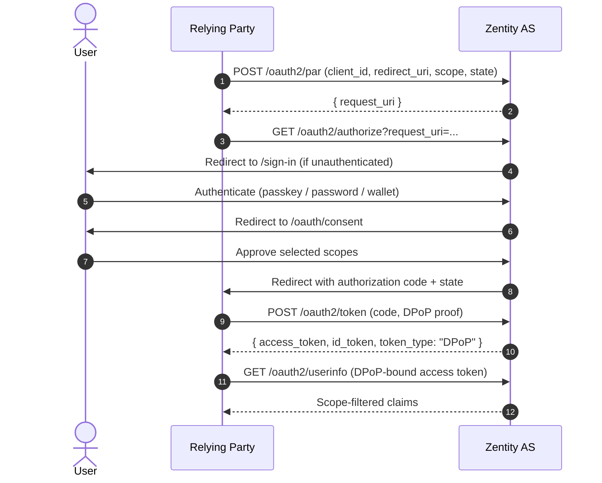
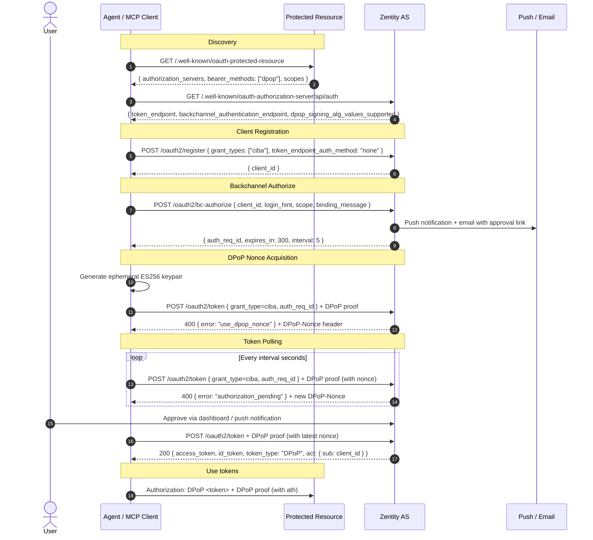
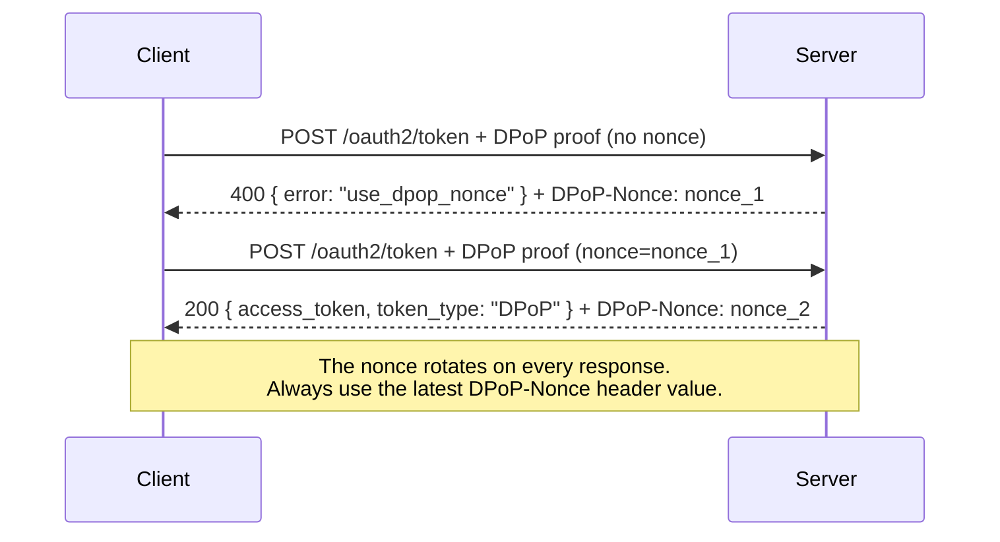
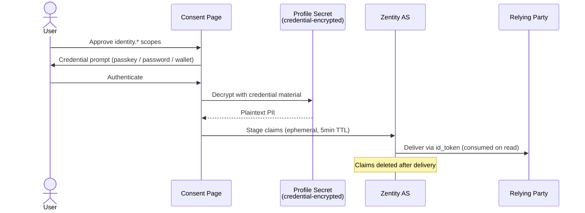

# OAuth Integrations

Zentity acts as an OAuth 2.1 / OpenID Connect authorization server for relying parties that need verified identity claims without receiving raw PII. This document covers the protocol surface area, authorization flows, token security, and privacy guarantees.

1. [Endpoints](#endpoints)
2. [Authorization Flows](#authorization-flows)
3. [Token Security](#token-security)
4. [Scopes and Selective Disclosure](#scopes-and-selective-disclosure)
5. [Credential Issuance (OIDC4VCI)](#credential-issuance-oidc4vci)
6. [Credential Presentation (OIDC4VP)](#credential-presentation-oidc4vp)
7. [Discovery and Metadata](#discovery-and-metadata)
8. [Privacy Guarantees](#privacy-guarantees)

---

## Endpoints

### Discovery

| Endpoint | Standard | Purpose |
| --- | --- | --- |
| `GET /.well-known/oauth-protected-resource` | RFC 9728 | Protected resource metadata (AS pointers, scopes, bearer methods) |
| `GET /.well-known/oauth-authorization-server/api/auth` | RFC 8414 | Authorization server metadata |
| `GET /api/auth/.well-known/openid-configuration` | OIDC Discovery | OpenID Connect discovery |

### Authorization

| Endpoint | Standard | Purpose |
| --- | --- | --- |
| `POST /api/auth/oauth2/par` | RFC 9126 | Pushed Authorization Request (required) |
| `GET /api/auth/oauth2/authorize` | OAuth 2.1 | Authorization request (interactive) |
| `POST /api/auth/oauth2/bc-authorize` | OIDC CIBA | Backchannel authorization (headless) |
| `POST /api/auth/oauth2/consent` | OAuth 2.1 | User consent submission |

### Tokens

| Endpoint | Standard | Purpose |
| --- | --- | --- |
| `POST /api/auth/oauth2/token` | OAuth 2.1 | Token exchange (all grant types) |
| `POST /api/auth/oauth2/introspect` | RFC 7662 | Token introspection |
| `POST /api/auth/oauth2/revoke` | RFC 7009 | Token revocation |
| `GET /api/auth/oauth2/jwks` | RFC 7517 | Public signing keys (RSA, Ed25519, ML-DSA-65) |

### User data

| Endpoint | Standard | Purpose |
| --- | --- | --- |
| `GET /api/auth/oauth2/userinfo` | OIDC Core | Scope-filtered verified claims |
| `GET /api/auth/oauth2/end-session` | OIDC Session | Session logout |

### Client management

| Endpoint | Standard | Purpose |
| --- | --- | --- |
| `POST /api/auth/oauth2/register` | RFC 7591 | Dynamic Client Registration |
| `GET /api/auth/oauth2/get-consents` | — | List user's active consents |
| `POST /api/auth/oauth2/delete-consent` | — | Revoke a consent grant |
| `POST /api/auth/oauth2/update-consent` | — | Update consented scopes |

### CIBA lifecycle

| Endpoint | Purpose |
| --- | --- |
| `GET /api/auth/ciba/verify?auth_req_id=...` | Fetch pending request details (for approval page) |
| `POST /api/auth/ciba/authorize` | Approve a pending CIBA request |
| `POST /api/auth/ciba/reject` | Deny a pending CIBA request |

---

## Authorization Flows

Zentity supports two authorization paths. Both require DPoP and produce the same token format.

### Interactive (browser redirect)

For traditional web applications where the user is present at the RP.


```mermaid
sequenceDiagram
  autonumber
  actor User
  participant RP as Relying Party
  participant AS as Zentity AS

  RP->>AS: POST /oauth2/par (client_id, redirect_uri, scope, state)
  AS-->>RP: { request_uri }
  RP->>AS: GET /oauth2/authorize?request_uri=...
  AS->>User: Redirect to /sign-in (if unauthenticated)
  User->>AS: Authenticate (passkey / password / wallet)
  AS->>User: Redirect to /oauth/consent
  User->>AS: Approve selected scopes
  AS->>RP: Redirect with authorization code + state

  RP->>AS: POST /oauth2/token (code, DPoP proof)
  AS-->>RP: { access_token, id_token, token_type: "DPoP" }
  RP->>AS: GET /oauth2/userinfo (DPoP-bound access token)
  AS-->>RP: Scope-filtered claims
```

**Grant type**: `authorization_code`

PAR is required — all authorization requests must first be pushed to the PAR endpoint, which returns a `request_uri` (60-second TTL) passed to the authorize endpoint.

### Headless (CIBA)

For agents and background services where the user approves from a separate device. This is the path MCP clients take.


```mermaid
sequenceDiagram
  autonumber
  actor User
  participant Agent as Agent / MCP Client
  participant RS as Protected Resource
  participant AS as Zentity AS
  participant Notify as Push / Email

  Note over Agent,RS: Discovery
  Agent->>RS: GET /.well-known/oauth-protected-resource
  RS-->>Agent: { authorization_servers, bearer_methods: ["dpop"], scopes }
  Agent->>AS: GET /.well-known/oauth-authorization-server/api/auth
  AS-->>Agent: { token_endpoint, backchannel_authentication_endpoint, dpop_signing_alg_values_supported }

  Note over Agent,AS: Client Registration
  Agent->>AS: POST /oauth2/register { grant_types: ["ciba"], token_endpoint_auth_method: "none" }
  AS-->>Agent: { client_id }

  Note over Agent,AS: Backchannel Authorize
  Agent->>AS: POST /oauth2/bc-authorize { client_id, login_hint, scope, binding_message }
  AS->>Notify: Push notification + email with approval link
  AS-->>Agent: { auth_req_id, expires_in: 300, interval: 5 }

  Note over Agent,AS: DPoP Nonce Acquisition
  Agent->>Agent: Generate ephemeral ES256 keypair
  Agent->>AS: POST /oauth2/token { grant_type=ciba, auth_req_id } + DPoP proof
  AS-->>Agent: 400 { error: "use_dpop_nonce" } + DPoP-Nonce header

  Note over Agent,AS: Token Polling
  loop Every interval seconds
    Agent->>AS: POST /oauth2/token { grant_type=ciba, auth_req_id } + DPoP proof (with nonce)
    AS-->>Agent: 400 { error: "authorization_pending" } + new DPoP-Nonce
  end

  User->>AS: Approve via dashboard / push notification
  Agent->>AS: POST /oauth2/token + DPoP proof (with latest nonce)
  AS-->>Agent: 200 { access_token, id_token, token_type: "DPoP", act: { sub: client_id } }

  Note over Agent,RS: Use tokens
  Agent->>RS: Authorization: DPoP <token> + DPoP proof (with ath)
```

**Grant type**: `urn:openid:params:grant-type:ciba`

CIBA requests support `authorization_details` (RFC 9396) for structured action metadata (e.g., purchase amounts, merchant info). These flow through to the approval UI, email notification, and token response.

The user is notified through three channels: web push notifications with inline approve/deny actions, email with an approval link, and a dashboard listing at `/dashboard/ciba`.

The `act` claim in the token response identifies the agent acting on behalf of the user, per `draft-oauth-ai-agents-on-behalf-of-user-02`.

### Grant types

| Grant type | Flow |
| --- | --- |
| `authorization_code` | Browser redirect (PAR required) |
| `urn:openid:params:grant-type:ciba` | CIBA poll mode |
| `urn:ietf:params:oauth:grant-type:pre-authorized_code` | OIDC4VCI credential issuance |

---

## Token Security

### DPoP (RFC 9449)

All token requests require Demonstrating Proof-of-Possession. DPoP binds access tokens to the client's ephemeral keypair, preventing token theft and replay.

**How it works:**

1. The client generates an ephemeral ES256 keypair (once per session)
2. Each request to the token endpoint includes a `DPoP` header: a JWT signed by the client's private key containing the HTTP method (`htm`), URL (`htu`), and a server-issued nonce
3. The server binds the access token to the client's public key via `cnf.jkt` (JWK thumbprint)
4. When using the access token at a resource endpoint, the client includes a DPoP proof with an `ath` claim (SHA-256 hash of the access token)

**Nonce protocol:**


```mermaid
sequenceDiagram
  participant Client
  participant Server

  Client->>Server: POST /oauth2/token + DPoP proof (no nonce)
  Server-->>Client: 400 { error: "use_dpop_nonce" } + DPoP-Nonce: nonce_1

  Client->>Server: POST /oauth2/token + DPoP proof (nonce=nonce_1)
  Server-->>Client: 200 { access_token, token_type: "DPoP" } + DPoP-Nonce: nonce_2

  Note over Client,Server: The nonce rotates on every response.<br/>Always use the latest DPoP-Nonce header value.
```

**DPoP proof structure:**

```json
{
  "header": {
    "alg": "ES256",
    "typ": "dpop+jwt",
    "jwk": { "kty": "EC", "crv": "P-256", "x": "...", "y": "..." }
  },
  "payload": {
    "htm": "POST",
    "htu": "https://app.zentity.xyz/api/auth/oauth2/token",
    "jti": "unique-per-request",
    "iat": 1741654800,
    "nonce": "server-provided-nonce",
    "ath": "base64url(SHA-256(access_token))"
  }
}
```

The `ath` claim is only included when presenting the access token at a resource endpoint, not at the token endpoint.

### Token format

| Token | Format | Signing |
| --- | --- | --- |
| Access token | Opaque (random string) | — |
| ID token | JWT | RS256 (default), ES256, EdDSA, or ML-DSA-65 per client preference |
| Token type | `"DPoP"` | — |

Access tokens are opaque by design — they prevent `sub` leakage for pairwise clients and keep DPoP binding server-side.

### JWT signing algorithms

| Algorithm | Usage | Notes |
| --- | --- | --- |
| RS256 | ID tokens (default) | OIDC Discovery 1.0 mandates RS256 support |
| ES256 | DPoP proofs | Client-side only |
| EdDSA | Access token JWTs (internal) | Compact 64-byte signatures |
| ML-DSA-65 | ID tokens (opt-in) | Post-quantum, requires compatible JWT library |

Clients opt into non-default signing algorithms via `id_token_signed_response_alg` in DCR metadata. Keys are generated on first use and persisted in the database — standard OIDC provider pattern.

### Client registration

All clients register via RFC 7591 Dynamic Client Registration. CIBA clients register as public clients (`token_endpoint_auth_method: "none"`). The `subject_type` is forced to `"pairwise"` for all DCR clients.

```json
{
  "client_name": "My Agent",
  "redirect_uris": ["http://localhost/callback"],
  "scope": "openid",
  "token_endpoint_auth_method": "none",
  "grant_types": ["urn:openid:params:grant-type:ciba"]
}
```

Optional metadata fields: `id_token_signed_response_alg` (signing algorithm preference), `optionalScopes` (scopes selectable but not required at consent).

---

## Scopes and Selective Disclosure

### Proof scopes (`proof:*`)

Non-PII boolean verification flags, delivered via id_token and userinfo.

| Scope | Claims |
| --- | --- |
| `proof:identity` | All verification claims (umbrella — expanded at consent) |
| `proof:verification` | `verification_level`, `verified`, `identity_binding_verified` |
| `proof:age` | `age_proof_verified` |
| `proof:document` | `document_verified`, `doc_validity_proof_verified` |
| `proof:liveness` | `liveness_verified`, `face_match_verified` |
| `proof:nationality` | `nationality_proof_verified` |
| `proof:compliance` | `policy_version`, `verification_time`, `attestation_expires_at` |
| `proof:chip` | `chip_verified`, `chip_verification_method` |
| `compliance:key:read` | Read RP encryption keys for compliance data |
| `compliance:key:write` | Register/rotate RP encryption keys |

### Identity scopes (`identity.*`)

Actual PII, delivered via id_token only (the server stores no persistent PII).

| Scope | Claims |
| --- | --- |
| `identity.name` | `given_name`, `family_name`, `name` |
| `identity.dob` | `birthdate` |
| `identity.address` | `address` |
| `identity.document` | `document_number`, `document_type`, `issuing_country` |
| `identity.nationality` | `nationality`, `nationalities` |

Standard OIDC scopes (`openid`, `profile`, `email`, `offline_access`) are auto-approved.

### Consent and selective disclosure

When an RP requests `proof:identity`, the consent page expands it into individual sub-scope checkboxes. All start **unchecked** — the user actively opts into each claim.

```text
Consent page:
  [auto] Basic authentication (openid)
  [auto] Email address (email)

  Verification Claims:
  [ ] Whether your identity is verified (proof:verification)
  [ ] Whether your age has been proven (proof:age)
  [ ] Whether your document has been verified (proof:document)
  ...
```

### Identity PII delivery pipeline

Identity scopes require a special pipeline because the server stores no plaintext PII. During verification, the user's PII is encrypted with their credential (passkey PRF / OPAQUE export key / wallet signature) and stored as a **profile secret** — an opaque blob the server cannot decrypt.


```mermaid
sequenceDiagram
  actor User
  participant Consent as Consent Page
  participant Secret as Profile Secret<br/>(credential-encrypted)
  participant AS as Zentity AS
  participant RP as Relying Party

  User->>Consent: Approve identity.* scopes
  Consent->>User: Credential prompt (passkey / password / wallet)
  User->>Consent: Authenticate
  Consent->>Secret: Decrypt with credential material
  Secret-->>Consent: Plaintext PII
  Consent->>AS: Stage claims (ephemeral, 5min TTL)
  AS->>RP: Deliver via id_token (consumed on read)
  Note over AS: Claims deleted after delivery
```

Identity scopes are **never persisted** in consent records. The consent page reappears each session, requiring a fresh credential unlock — the server cannot decrypt the profile secret itself.

### Disclosure paths

| Path | Standard | Delivery |
| --- | --- | --- |
| `proof:*` / `identity.*` scopes | OAuth 2.0 custom scopes | id_token + userinfo (proof only) |
| `verified_claims` parameter | OIDC for Identity Assurance | id_token + userinfo |
| SD-JWT VC | OIDC4VCI | Holder-controlled at presentation |

---

## Credential Issuance (OIDC4VCI)

Zentity acts as a Verifiable Credential Issuer following the OIDC4VCI specification.

**Discovery**: `GET /.well-known/openid-credential-issuer`

**Credential endpoint**: `POST /api/auth/oidc4vci/credential` (DPoP required)

**Supported format**: `dc+sd-jwt` (SD-JWT VC), credential type `zentity_identity`

**Flow:**

1. User completes identity verification
2. Server creates credential offer with pre-authorized code
3. Wallet scans QR or follows deep link
4. Wallet exchanges code for DPoP-bound access token
5. Wallet requests credential with holder binding proof

**Deferred issuance**: When verification is pending, the issuer returns a `transaction_id`. The wallet polls `POST /api/auth/oidc4vci/deferred-credential` until ready.

**Derived claims only** — credentials contain verification flags (e.g., `verified`, `verification_level`, `age_proof_verified`), never raw PII.

---

## Credential Presentation (OIDC4VP)

Zentity can act as a verifier requesting presentations from wallets using DCQL (Digital Credentials Query Language).

**Request**: `POST /api/auth/oidc4vp/verify` returns a `request_uri`

**Response**: `response_mode: direct_post.jwt` — the wallet posts a JARM-encrypted response (ECDH-ES, P-256) to `/api/auth/oidc4vp/response`

**Client identification**: `client_id_scheme: x509_hash` — the `client_id` is the SHA-256 thumbprint of the leaf certificate in the x5c chain.

**KB-JWT verification** order: issuer signature → disclosure decode → `cnf.jkt` match → KB-JWT signature → nonce/audience/freshness.

See [SSI Architecture](ssi-architecture.md) for the complete model.

---

## Discovery and Metadata

### Authorization server (RFC 8414)

`GET /.well-known/oauth-authorization-server/api/auth` returns:

```json
{
  "issuer": "https://app.zentity.xyz/api/auth",
  "token_endpoint": "https://app.zentity.xyz/api/auth/oauth2/token",
  "authorization_endpoint": "https://app.zentity.xyz/api/auth/oauth2/authorize",
  "jwks_uri": "https://app.zentity.xyz/api/auth/oauth2/jwks",
  "backchannel_authentication_endpoint": "https://app.zentity.xyz/api/auth/oauth2/bc-authorize",
  "pushed_authorization_request_endpoint": "https://app.zentity.xyz/api/auth/oauth2/par",
  "require_pushed_authorization_requests": true,
  "grant_types_supported": ["authorization_code", "urn:openid:params:grant-type:ciba", "..."],
  "dpop_signing_alg_values_supported": ["ES256"],
  "id_token_signing_alg_values_supported": ["RS256", "ES256", "EdDSA", "ML-DSA-65"],
  "subject_types_supported": ["public", "pairwise"],
  "backchannel_token_delivery_modes_supported": ["poll", "ping"],
  "client_id_metadata_document_supported": true,
  "resource_indicators_supported": true
}
```

### Protected resource (RFC 9728)

`GET /.well-known/oauth-protected-resource` is the starting point for MCP-compatible clients:

```json
{
  "resource": "https://app.zentity.xyz",
  "authorization_servers": ["https://app.zentity.xyz/api/auth"],
  "bearer_methods_supported": ["dpop"],
  "scopes_supported": ["openid", "email", "proof:identity", "proof:age", "..."],
  "resource_signing_alg_values_supported": ["EdDSA"]
}
```

Clients follow `authorization_servers[0]` to the AS metadata, then proceed with DCR and authorization.

---

## Privacy Guarantees

### Pairwise subject identifiers

All DCR clients use `subject_type: "pairwise"`. Each (user, client) pair gets a unique opaque `sub`:

```text
sub = Base64(HMAC-SHA256(PAIRWISE_SECRET, sectorId + userId))
```

The `sectorId` is derived from the host of the client's first `redirect_uri` (per OIDC Core §8.1). Related services under one domain share a sector; cross-domain tracking is prevented.

### Double anonymity (ARCOM)

For pairwise proof-only flows, additional measures remove all server-side linkage:

- **Opaque access tokens** — random strings prevent `sub` leakage (JWT access tokens would embed it)
- **Consent record deletion** — consent rows deleted after authorization code issuance
- **Token record deletion** — token DB records deleted after JWT issuance
- **Session metadata scrubbing** — IP address and user-agent scrubbed from session records

See [ADR-0001: ARCOM Double Anonymity](adr/0001-arcom-double-anonymity.md).

### Zero persistent PII

The server never stores plaintext PII. The user's profile secret (encrypted with their credential) is the only copy. Identity claims are staged ephemerally at consent time (5-minute TTL, consumed on read) and delivered via id_token. After delivery, no trace remains.

### HAIP compliance

| Feature | Standard | Status |
| --- | --- | --- |
| DPoP | RFC 9449 | Enforced globally |
| PAR | RFC 9126 | Required |
| Wallet attestation | HAIP | Supported (`TRUSTED_WALLET_ISSUERS` config) |
| JARM | OIDC JARM | ECDH-ES P-256 |
| x5c certificate chain | RFC 5280 | Leaf + CA, env vars or filesystem |
| Pairwise subjects | OIDC Core §8.1 | Enforced for all DCR clients |
