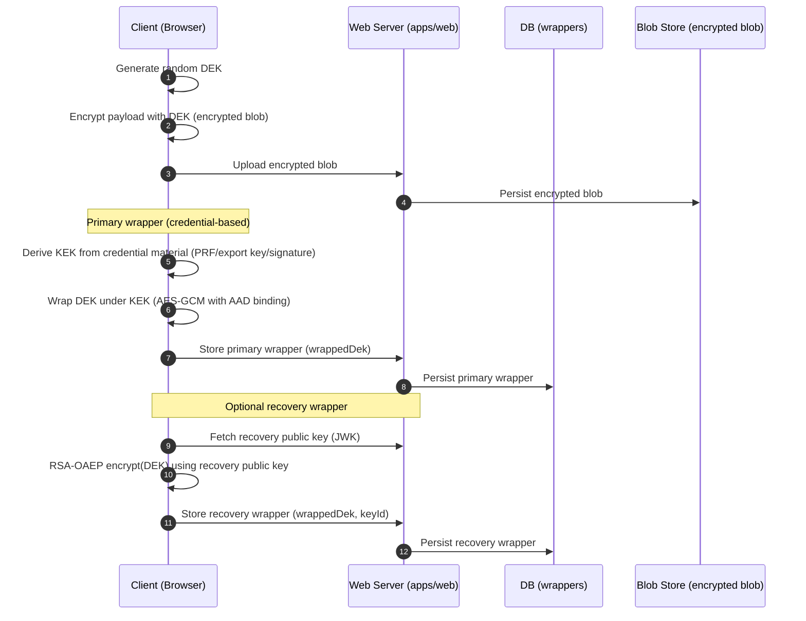
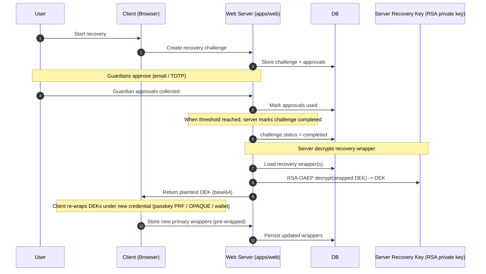

# Recovery Trust Model (Server-Held Key vs Guardian-Controlled)

This document explains, in plain terms, what your current recovery implementation enables, why that differs from a "guardian-controlled threshold recovery" trust model, and what can be changed (with trade-offs) using your existing architecture.

## Glossary

- **DEK**: Data Encryption Key. Random symmetric key used to encrypt the secret payload (the encrypted blob).
- **KEK**: Key Encryption Key. Derived from a credential (passkey PRF, OPAQUE export key, wallet signature) and used to wrap/unwrap the DEK.
- **Wrapper**: A record containing an AEAD-encrypted DEK (wrapped under a KEK) plus metadata (credentialId, prfSalt, etc).
- **Recovery wrapper**: A special wrapper meant for account recovery.
- **Trust model**: Who has *cryptographic capability* to recover keys, not who is *supposed* to do so.

## What You Have Today (Current Design)

### Data stored on the server

1. **Encrypted blob** (payload encrypted under DEK)

- Stored server-side (filesystem-backed secret blob store).

1. **Primary wrappers** (DEK wrapped under credential-derived KEKs)

- Stored server-side (DB).
- Server is *not supposed* to have credential material to derive KEKs.

1. **Recovery wrappers** (DEK wrapped under server-published recovery public key)

- Stored server-side (DB).
- Wrapped using RSA-OAEP with a server-generated/persisted RSA keypair.

### Where the recovery key lives

- The recovery RSA **private key is server-held** (env var or local file) and used for decryption.

### Current flows (visual)

#### A. Storing a secret with a recovery wrapper

#### B. Recovery today

## The Specific Problem (Trust, Not Workflow)

### Can the server decrypt "eternally"?

For any user who has a stored recovery wrapper:

- If the server still has the recovery RSA private key for that wrapper's `keyId`, it can decrypt the DEK at any time.
- If you rotate keys but retain old private keys for backward recovery, the capability persists for older wrappers too.

### Can the server decrypt "without recovery being started"?

Yes.

"Recovery started" is a *policy gate* on a route (an API-level permission check). It is not a cryptographic gate.

If the server process (or an attacker with code execution / secrets access) can:

- read `recovery_secret_wrappers.wrapped_dek`, and
- access the recovery RSA private key material,

then it can compute `DEK = decrypt(wrapped_dek)` offline and decrypt the corresponding encrypted blob.

### What does this mean, practically?

It means enabling recovery (as implemented today) changes the security posture for those users:

- **Without recovery wrappers**: server compromise yields encrypted blobs + wrapped DEKs, but no credential material to derive KEKs (assuming the passkey/OPAQUE/wallet material truly never reaches the server).
- **With recovery wrappers**: server compromise + recovery private key yields plaintext DEKs, which yields plaintext secrets (because blobs are server-readable and DEK decrypts them).

This is why this is a patent/security-claims issue: some statements like "server lacks decryption capability" or "server compromise cannot recover key material" must be scoped or qualified if recovery is implemented as a server-held private key.

## What "Guardian-Controlled Threshold Recovery" Would Change

The goal is:

- The server can store blobs and wrappers.
- The server cannot unwrap the DEK unless a threshold of guardians *cryptographically participates*.

The key nuance:

- **Email/TOTP approvals are not cryptographic shares**.
- They can authorize an action, but they do not prevent a malicious server (or server compromise) from acting unilaterally if the server already holds the recovery private key.

## Design Options Using Your Existing Architecture

### Option 1: Keep server-held key, but harden (minimal UX change)

This does *not* achieve "not even the server can unilaterally recover", but it reduces practical risk.

Changes:

- Move recovery private key into KMS/HSM (no raw PEM on disk/env).
- Enforce "decrypt only with an audit trail and strict policy" (rate limits, explicit operator approval, separate service identity).
- Ensure recovery wrapper decryption is only possible through a dedicated service with tight IAM.

UX impact:

- Nearly none for users.

Security impact:

- Still a single trust domain: if that service or its IAM is compromised, attacker can decrypt.

### Option 2: Split recovery capability (true threshold, moderate UX change)

Two practical sub-approaches.

#### 2A. Shamir-split recovery KEK (simplest conceptual model)

Setup:

1. Generate a random **recovery KEK** (symmetric) for a user.
2. Wrap each DEK under the recovery KEK (AES-GCM wrapper).
3. Split the recovery KEK into `n` shares with threshold `t` (Shamir).
4. Give each guardian one share, stored such that the server cannot reconstruct (e.g., guardians hold shares on devices, or on services they control).

Recovery:

1. Collect `t` shares from guardians.
2. Reconstruct recovery KEK on the client.
3. Client unwraps DEKs and rewraps under new primary credential.

UX impact:

- Setup requires each guardian to "store" something.
- Recovery requires contacting `t` guardians (this is already part of your flow), but now their participation is *cryptographic*, not just approval.

Security impact:

- Server cannot recover unless it compromises `t` guardian shares.

#### 2B. Threshold signature or threshold decryption (closest to your provisional narrative)

Your repo already has a FROST-related service layer (`docs` + `apps/web/src/lib/recovery/frost-service.ts`), but today that code is **server-run orchestration**, which means the server can obtain the aggregated result.

To get "not the server":

- Guardians must hold signing shares in a place the server cannot access without guardian consent.
- Aggregation and key derivation must occur client-side (or in a neutral party the server does not control).

UX impact:

- Guardians need a device/app/wallet/passkey-based "approve-and-sign" step.
- Recovery becomes a "collect t cryptographic responses" process (usually seconds to minutes).

Security impact:

- Stronger than Shamir in some models, but higher implementation complexity.

## Baby-Step Migration Plan (From Today to Threshold)

### Step 0: Decide the target trust model

Pick one:

- **Model A (simple recovery)**: server-held key is acceptable; document and harden.
- **Model B (strong recovery)**: server must not be able to decrypt; implement threshold.

### Step 1: Make the trust model explicit in docs/UI

- If Model A: clearly state recovery implies a trusted recovery service.
- If Model B: state guardians are cryptographic participants, not just approvers.

### Step 2: Remove plaintext DEK release to the client (even in Model A)

Even if you keep server-held RSA, consider changing the API so the server never returns plaintext DEK directly:

- Instead return DEK re-wrapped under the new credential (client provides a wrapper public input).

This improves "accidental leakage" risk and logging hygiene, but does not fix the fundamental trust model.

### Step 3: Replace RSA recovery wrapper with threshold-controlled recovery wrapper

- Shamir path: introduce share storage/retrieval for guardians.
- Threshold signature/decryption path: move signing shares to guardian-controlled devices/services and ensure server cannot invoke them unilaterally.

### Step 4: Operational hardening (both models)

- Strong logging and alerting on any recovery-related operations.
- Rate limits and cooldown windows.
- Mandatory step-up auth for the recovering user.

## What This Means for UX

- **Day-to-day usage**: essentially unchanged in both models.
- **Setup**: threshold requires each guardian to be "real" (device/app/wallet/passkey), not just email.
- **Recovery**: threshold adds 1 or 2 additional cryptographic steps and may increase time-to-recover, but recovery is rare.

## Quick Decision Guide

Choose **server-held** if:

- You prioritize "it always works" recovery and minimal setup friction.
- You're comfortable treating recovery as a trusted service and scoping claims accordingly.

Choose **threshold** if:

- You want to defend the statement "not even the server can recover keys" in a strong compromise model.
- You're willing to accept more recovery setup complexity.
