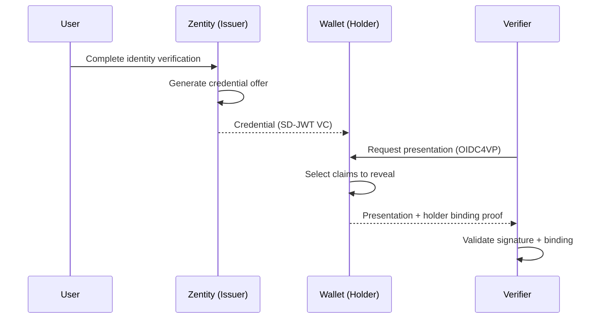

# Self-Sovereign Identity Architecture

> **Purpose**: Define how Zentity implements Self-Sovereign Identity through verifiable credentials, selective disclosure, and non-custodial key custody.

## Executive Summary

Zentity issues **portable verifiable credentials** following OpenID standards while preserving the existing privacy model: **no server-decryptable PII**, **passkey-secured secrets**, and **ZK/FHE-derived claims**.

- **OIDC4VCI**: Credential issuance with pre-authorized code flow; SD-JWT VC format.
- **OIDC4VP**: Presentation requests from verifiers; Presentation Exchange (PEX) support.
- **Derived claims only**: Credentials contain verification flags, not raw PII.
- **Holder binding**: EdDSA proof JWT ties credentials to holder's cryptographic key.
- **Selective disclosure**: SD-JWT format lets users reveal only the claims needed.
- **Pairwise identifiers**: Different `sub` per relying party to prevent correlation.

This model enables external wallets to hold credentials and third-party verifiers to request presentations without Zentity involvement.

---

## SSI Trust Model

SSI operates through three roles forming a "trust triangle":

| Role | Actor | Responsibilities |
|------|-------|------------------|
| **Issuer** | Zentity | Verifies identity; issues signed credentials; never stores raw PII |
| **Holder** | User / Wallet | Controls keys via passkey; stores credentials; chooses what to reveal |
| **Verifier** | Relying Party | Requests presentations; validates signatures; verifies holder binding |

```text
              ISSUER
             (Zentity)
            /         \
           /   issues  \
          ↓    trust    ↓
       HOLDER ←───────→ VERIFIER
       (User)  presents   (RP)
```

### Issuer (Zentity)

- Verifies user identity through document OCR, liveness detection, and face matching
- Issues SD-JWT verifiable credentials with derived claims only
- Signs credentials with issuer keys
- Never stores raw PII—only cryptographic artifacts

### Holder (User)

- Controls cryptographic keys via passkey, OPAQUE password, or Web3 wallet
- Stores credentials in wallet (internal or external)
- Chooses which claims to reveal during presentation
- Authorizes all disclosures explicitly

**Note on wallets**: The term "wallet" can refer to two distinct concepts:

1. **Credential wallet** — stores and presents verifiable credentials (SSI context)
2. **Web3 wallet** — signs transactions and can be used for authentication (EIP-712 signatures)

These are not mutually exclusive—a Web3 wallet user can also hold credentials in a credential wallet.

### Verifier (Relying Party)

- Requests credential presentations via OIDC4VP
- Validates holder binding and issuer signatures
- Verifies claims without contacting the issuer
- Cannot correlate users across presentations (pairwise identifiers)

### Flow overview



---

## Credential Issuance (OIDC4VCI)

### Protocol

[OpenID for Verifiable Credential Issuance](https://openid.net/specs/openid-4-verifiable-credential-issuance-1_0.html)

### Endpoints

| Endpoint | Purpose |
|----------|---------|
| `/.well-known/openid-credential-issuer` | Issuer metadata |
| `/.well-known/oauth-authorization-server` | Authorization server metadata |
| `/api/auth/oidc4vci/credential` | Credential endpoint |

### Pre-authorized code flow

1. User completes identity verification (document + liveness + face match).
2. Server creates credential offer with pre-authorized code.
3. Wallet scans QR or follows deep link.
4. Wallet exchanges code for access token.
5. Wallet requests credential with holder binding proof.
6. Server validates proof, generates SD-JWT VC.

### Credential type

- Identifier: `zentity_identity`
- VCT: `urn:zentity:credential:identity`
- Format: `dc+sd-jwt` (SD-JWT VC with selective disclosure)

---

## Credential Presentation (OIDC4VP)

### Protocol

[OpenID for Verifiable Presentations](https://openid.net/specs/openid-4-verifiable-presentations-1_0.html)

### Endpoints

| Endpoint | Purpose |
|----------|---------|
| `/api/auth/oidc4vp/verify` | Create presentation request |
| `/api/auth/oidc4vp/response` | Submit presentation |

### Flow

1. Verifier creates presentation request with required claims (PEX format).
2. Wallet displays request to user.
3. User selects which claims to reveal (selective disclosure).
4. Wallet creates presentation with holder binding proof.
5. Verifier validates issuer signature, holder binding, and claims.

---

## Derived Claims

**Legend:** ✅ always included, ◐ included if verified, — never included.

| Claim | Included | Source | Notes |
|-------|----------|--------|-------|
| `verification_level` | ✅ | Server-computed | `none` \| `basic` \| `full` |
| `verified` | ✅ | Server-computed | Overall verification status |
| `document_verified` | ◐ | OCR signed claim | Document processed and validated |
| `liveness_verified` | ◐ | Liveness signed claim | Liveness detection passed |
| `face_match_verified` | ◐ | Face match signed claim | Face match threshold exceeded |
| `age_proof_verified` | ◐ | ZK proof | Age proof generated and stored |
| `doc_validity_proof_verified` | ◐ | ZK proof | Document validity proof stored |
| `nationality_proof_verified` | ◐ | ZK proof | Nationality membership proof stored |
| `policy_version` | ✅ | Server-computed | Policy version used for verification |
| `issuer_id` | ✅ | Static | Zentity issuer identifier |
| `verification_time` | ✅ | Server-computed | ISO 8601 timestamp |
| Full name | — | — | Never included |
| Date of birth | — | — | Never included |
| Document number | — | — | Never included |
| Nationality | — | — | Never included |

**Important:** Credentials derive claims from existing verification artifacts (ZK proofs, signed claims). No new PII collection is required for credential issuance.

---

## Holder Binding

Credentials are cryptographically bound to the holder's key to prevent theft and misuse.

### Mechanism

- **JWK Thumbprint Confirmation (`cnf.jkt`)**: Credential includes thumbprint of holder's public key.
- **Proof JWT**: Holder signs a proof demonstrating possession of private key.
- **EdDSA (Ed25519)**: Efficient, secure binding signatures.

### Key custody options

| Option | Description | Use case |
|--------|-------------|----------|
| **External wallet key** | Wallet generates its own key pair | Standard OIDC4VCI flow; full interoperability |
| **Internal web wallet key** | Browser generates Ed25519 key via WebCrypto; encrypted with passkey PRF | Passkey-protected local wallet |

---

## Privacy Preservation

### Pairwise subject identifiers

To prevent cross-RP correlation, each relying party sees a different `sub`:

```text
sub = HMAC(user_id, client_id, issuer_secret)
```

### Selective disclosure (SD-JWT)

Users reveal only the claims needed. The holder controls which disclosure keys are included in the presentation.

### ZK proofs for predicates

For binary eligibility checks, ZK proofs reveal nothing beyond the answer:

| Predicate | Circuit | Revealed |
|-----------|---------|----------|
| Age ≥ 18 | `age_verification` | Yes/No only |
| Document valid | `doc_validity` | Yes/No only |
| Nationality in group | `nationality_membership` | Yes/No only |
| Face match ≥ threshold | `face_match` | Yes/No only |

---

## Relationship to Other Components

### How VCs connect to existing architecture

| Component | Relationship to VCs |
|-----------|---------------------|
| **ZK proofs** | VC claims like `age_proof_verified` indicate a ZK proof exists |
| **FHE encryption** | `compliance_level` derives from FHE evaluations |
| **Signed claims** | Document, liveness, and face match claims feed VC issuance |
| **Evidence packs** | `policy_version` ties credentials to verification policy |
| **Passkey custody** | Internal wallet keys use same PRF-based encryption |

### What VCs do NOT replace

- ZK proofs (VCs package results, not replace the underlying proofs)
- Passkey-sealed profile (raw PII stays in vault, not in credentials)
- FHE ciphertexts (encrypted computation is separate from credential presentation)

---

## Standards Compliance

| Standard | Specification | Support |
|----------|---------------|---------|
| OpenID4VCI | openid-4-verifiable-credential-issuance-1_0 | Full |
| OpenID4VP | openid-4-verifiable-presentations-1_0 | Full |
| SD-JWT VC | draft-ietf-oauth-sd-jwt-vc | Full |
| Presentation Exchange | presentation-exchange-2.0.0 | Full |
| OAuth 2.0 | RFC 6749 | Full |
| PKCE | RFC 7636 | Required |

---

## Security Considerations

| Threat | Mitigation |
|--------|------------|
| Credential theft | Holder binding (`cnf.jkt`) prevents use without private key |
| Issuer impersonation | Issuer keys in JWKS; verifiers validate signatures |
| Replay attacks | Nonce in presentation; holder binding proof |
| Correlation | Pairwise identifiers; selective disclosure |
| Server breach | No PII in credentials; server holds only issuance metadata |

---

## Related Documentation

- [Attestation & Privacy Architecture](attestation-privacy-architecture.md) — data classification and storage boundaries
- [Cryptographic Pillars](cryptographic-pillars.md) — ZK, FHE, commitments, key custody
- [OAuth Integrations](oauth-integrations.md) — OIDC4VCI/VP endpoint details
- [RFC-0016](rfcs/0016-oidc-vc-issuance-and-presentation.md) — design decisions for VC issuance
- [RFC-0018](rfcs/0018-pure-ssi-did-bbs-anoncreds.md) — DIDs, BBS+, AnonCreds roadmap
