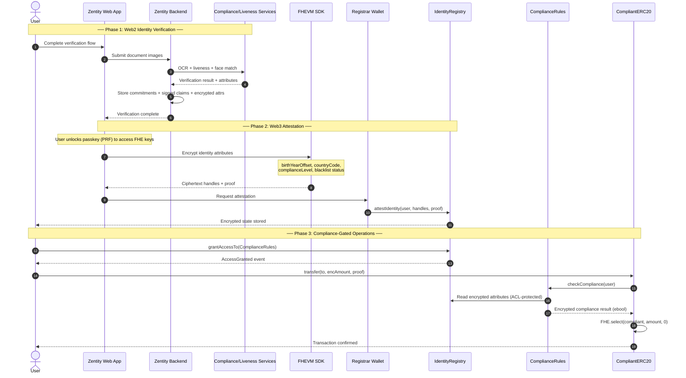
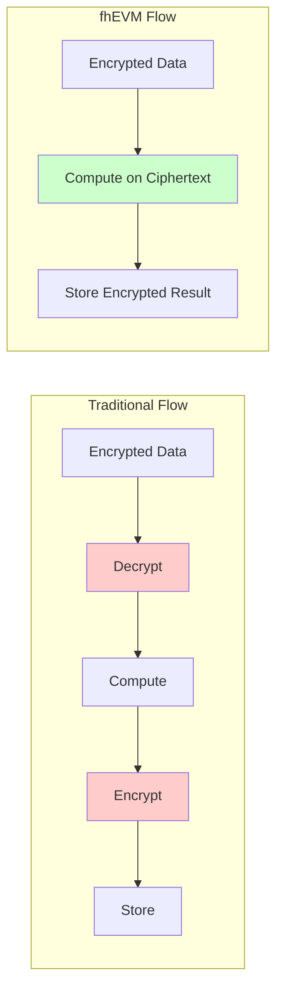
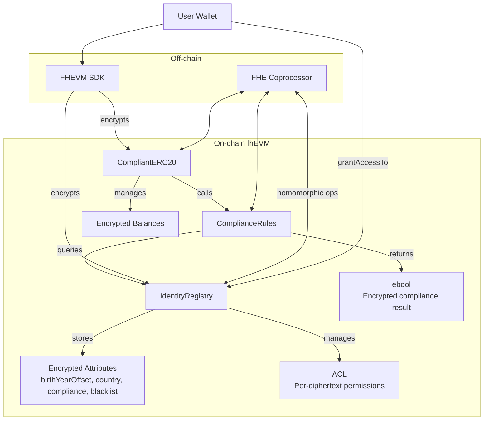
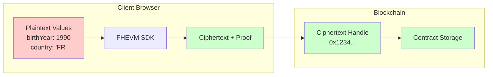
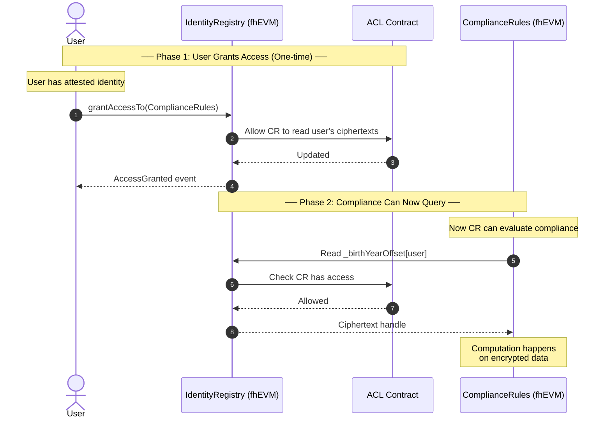

# Web2 to Web3 Transition Guide

> **Related docs:** [Web3 Architecture](web3-architecture.md) | [Blockchain Setup](blockchain-setup.md) | [Attestation & Privacy Architecture](attestation-privacy-architecture.md)

This document explains the end-to-end flow from Web2 identity verification to Web3 on-chain attestation and encrypted compliance checks.

## PoC Limitations

The current implementation has several known limitations that would need to be addressed for production:

| Limitation | Current State | Production Requirement |
|------------|---------------|------------------------|
| **Country codes** | ~55 countries supported (EU, EEA, LATAM, Five Eyes, + 4 additional) | Full ISO 3166-1 (195+ countries) |
| **Rate limiting** | In-memory Map (resets on server restart) | Redis or database-backed |
| **Liveness sessions** | In-memory storage | Persistent storage (Redis/DB) |

**Note:** The `attestation.submit` endpoint supports a demo mode that simulates successful attestation without executing real blockchain transactions. This is controlled by the `NEXT_PUBLIC_ATTESTATION_DEMO` environment variable.

## Table of Contents

1. [Overview](#overview)
2. [Data Flow Diagram](#data-flow-diagram)
3. [What Stays in Web2](#what-stays-in-web2)
4. [What Moves to Web3](#what-moves-to-web3)
5. [Smart Contract Architecture](#smart-contract-architecture)
6. [Encryption Boundaries](#encryption-boundaries)
7. [Access Control Model](#access-control-model)
8. [Silent Failure Pattern](#silent-failure-pattern)
9. [Operational Responsibilities](#operational-responsibilities)
10. [Integration Checklist](#integration-checklist)

---

## Overview

Zentity bridges traditional identity verification (compliance/liveness) with privacy-preserving blockchain attestation. The key insight is that **identity verification happens off-chain**, but the **attestation and compliance enforcement happen on-chain with encrypted data**.

### The Two Worlds

| Aspect | Web2 (Off-Chain) | Web3 (On-Chain) |
|--------|------------------|-----------------|
| **Purpose** | Collect & verify identity | Store & enforce compliance |
| **Data State** | Plaintext (briefly) | Always encrypted |
| **Trust Model** | Trust Zentity backend | Trustless verification |
| **Storage** | SQLite (commitments only, via libSQL client) | Blockchain (ciphertext handles) |
| **Operations** | OCR, liveness, face match | Encrypted comparisons |

---

## Data Flow Diagram

The complete journey from user verification to compliant token transfer:



---

## What Stays in Web2

The Web2 layer handles all **sensitive data collection and verification**:

### Identity Collection

- **Document OCR**: Extract MRZ/VIZ data from passports, IDs
- **Data validation**: Check document authenticity, expiry, checksums
- **Liveness detection**: Multi-gesture challenges (smile, blink, head turns)
- **Face matching**: Compare selfie to document photo

### Data Processing

- **Attribute extraction**: Birth year offset, nationality, document expiry
- **ZK proof generation**: Client-side proofs for age, nationality membership
- **FHE encryption**: Prepare encrypted inputs for on-chain storage
- **Key custody**: Passkey PRF unlocks FHE keys locally; encrypted key blobs + wrappers stored server-side

### What Web2 Stores (Privacy-First)

```text
SQLite Database (via libSQL client)
├── User accounts (email, auth tokens)
├── Verification status (verified/pending/failed)
├── ZK proofs (age >= 18, nationality in EU, etc.)
├── Encrypted secrets (passkey-wrapped FHE keys, no plaintext)
├── Cryptographic commitments (SHA-256 of attributes)
├── Signed claim hashes (OCR, liveness, face match metadata)
├── Encrypted attributes (birth_year_offset, country_code, compliance_level, liveness_score)
├── Passkey-sealed profile (encrypted PII, user unlock required)
├── Evidence pack (policy_hash, proof_set_hash)
└── Attestation records (txHash, status, networkId)

NOT stored: Raw images, plaintext PII, biometric templates
```

---

## What Moves to Web3

The Web3 layer handles **encrypted storage and computation**:

### On-Chain Data (Always Encrypted)

```solidity
// IdentityRegistry.sol
mapping(address => euint8) private _birthYearOffset;   // Years from 1900
mapping(address => euint16) private _countryCode;      // ISO 3166-1 numeric
mapping(address => euint8) private _complianceLevel;   // 0-10 verification level
mapping(address => ebool) private _isBlacklisted;      // Sanctions check
```

Public metadata should include `policy_hash` + `proof_set_hash` so auditors can verify which proofs and policy version were used for the attestation.

### On-Chain Operations

- **Attestation storage**: Encrypted identity attributes per user
- **ACL management**: Who can compute on which ciphertexts
- **Compliance checks**: Encrypted comparisons (age >= 18, country in allowlist)
- **Conditional transfers**: `FHE.select(compliant, amount, 0)`

### Key Insight: Computation Under Encryption



The fhEVM never decrypts data for computation. All operations happen on ciphertexts.

---

## Smart Contract Architecture

### Contract Hierarchy



### Contract Responsibilities

| Contract | Purpose | Key Functions |
|----------|---------|---------------|
| **IdentityRegistry** | Store encrypted identity attributes | `attestIdentity()`, `grantAccessTo()`, `revokeAccessFrom()` |
| **ComplianceRules** | Evaluate compliance on encrypted data | `checkCompliance()`, `isCompliant()` |
| **CompliantERC20** | Compliance-gated token transfers | `transfer()`, `transferFrom()`, `mint()` |

### Data Flow Through Contracts

```text
User submits transfer(to, encAmount, proof)
    │
    ▼
CompliantERC20.transfer()
    │
    ├─► Validate encAmount proof via InputVerifier
    │
    ├─► Call ComplianceRules.checkCompliance(from)
    │       │
    │       ├─► Read _birthYearOffset[from] from IdentityRegistry
    │       │   (requires ACL permission)
    │       │
    │       ├─► Encrypted comparison: birthYearOffset >= 24
    │       │   (age >= 18 as of 2024, offset from 1900)
    │       │
    │       └─► Return ebool (encrypted true/false)
    │
    └─► FHE.select(compliant, encAmount, EUINT64_ZERO)
            │
            ├─► If compliant: transfer encAmount
            └─► If not compliant: transfer 0 (silent failure)
```

---

## Encryption Boundaries

### Where Encryption Happens



### Encryption Points

1. **Client-Side Encryption** (via FHEVM SDK)
   - User's birth year → `euint8` (offset from 1900)
   - User's country code → `euint16` (ISO numeric)
   - Transfer amounts → `euint64`

2. **Server-Side Encryption** (via Registrar)
   - compliance level → `euint8`
   - Blacklist status → `ebool`

3. **Never Encrypted**
   - Wallet addresses (public by design)
   - Transaction hashes
   - Event logs (contain only addresses, not values)

---

## Access Control Model

### ACL (Access Control List)

Each ciphertext handle has an associated ACL controlling who can:

- **Read**: Use the ciphertext in computations
- **Decrypt**: Request decryption via Gateway/KMS

### Access Grant Flow



### Access States

| State | Can Transfer | Can Read Own Data | CR Can Check |
|-------|--------------|-------------------|--------------|
| Not attested | No | No | No |
| Attested, no grant | No | Yes (via Gateway) | No |
| Attested + granted | Yes | Yes | Yes |

---

## Silent Failure Pattern

### Why Silent Failure?

If a compliance check fails, the contract **does not revert**. Instead, it silently transfers 0 tokens. This prevents information leakage:

```solidity
// BAD: Leaks compliance status
require(isCompliant(from), "Not compliant");  // Reveals user is non-compliant

// GOOD: Silent failure
euint64 effectiveAmount = FHE.select(
    complianceResult,   // ebool
    amount,             // Transfer this if compliant
    EUINT64_ZERO        // Transfer 0 if not compliant
);
```

### Implications for UI

1. **Transaction will succeed** even if compliance fails
2. **Balance won't change** (effectively a no-op)
3. **UI must check** actual balance changes, not just tx success
4. **User should verify** recipient is attested before transferring

### Detecting Silent Failures

```typescript
// After transfer tx confirms
const balanceBefore = await token.balanceOf(from);
await transfer(to, amount);
const balanceAfter = await token.balanceOf(from);

// Note: balances are encrypted, so you need userDecrypt
// to compare. The transfer "succeeded" on-chain but
// balance may be unchanged.
```

---

## Operational Responsibilities

### For Users

1. **Complete Web2 verification** (documents + liveness)
2. **Attest identity on-chain** (one-time per network)
3. **Grant access to ComplianceRules** before first transfer
4. **Understand silent failures** - tx success ≠ transfer success

### For Deployers/Operators

1. **Deploy contracts** in correct order:

   ```text
   IdentityRegistry → ComplianceRules → CompliantERC20
   ```

2. **Configure authorized callers**:

   ```solidity
   complianceRules.setAuthorizedCaller(erc20Address, true);
   ```

3. **Set registrar address** in IdentityRegistry:

   ```solidity
   identityRegistry.setRegistrar(registrarAddress);
   ```

### For UI Developers

1. **Check attestation status** before showing DeFi features
2. **Check access grants** before allowing transfers
3. **Handle silent failures** gracefully in UI
4. **Don't cache access state** - always check on-chain

---

## Integration Checklist

### Before First Transfer

- [ ] User completed Web2 verification
- [ ] Identity attested on target network
- [ ] `grantAccessTo(ComplianceRules)` called
- [ ] Wallet connected to correct network
- [ ] Sufficient ETH for gas

### Contract Deployment

- [ ] IdentityRegistry deployed and configured
- [ ] ComplianceRules deployed with authorized callers
- [ ] CompliantERC20 deployed and linked to ComplianceRules
- [ ] Registrar wallet funded and configured

### Environment Variables

```bash
# Required for attestation
FHEVM_RPC_URL=https://ethereum-sepolia-rpc.publicnode.com
FHEVM_IDENTITY_REGISTRY=0x...
FHEVM_REGISTRAR_PRIVATE_KEY=0x...

# Required for DeFi demo
FHEVM_COMPLIANCE_RULES=0x...
FHEVM_COMPLIANT_ERC20=0x...
```

### Common Issues

| Issue | Cause | Solution |
|-------|-------|----------|
| Transfer silently fails | No access grant | Call `grantAccessTo(ComplianceRules)` |
| "Unauthorized caller" | ERC20 not authorized | Call `setAuthorizedCaller(erc20, true)` |
| Attestation fails | Registrar not set | Call `setRegistrar(address)` |
| Compliance always fails | Birth year encoding wrong | Use offset from 1900, not actual year |

---

## Security Model

### Trust Assumptions

| Component | Trusted For |
|-----------|-------------|
| Zentity Backend | Correct identity verification |
| FHEVM Gateway | Key management, not learning plaintext |
| FHE Coprocessor | Correct computation, not learning plaintext |
| Smart Contracts | Immutable logic, ACL enforcement |

### What Cannot Be Leaked

- **Birth year** (encrypted, never stored in plaintext on-chain)
- **Nationality** (encrypted country code)
- **Compliance level (verification tier)** (encrypted verification tier)
- **Compliance result** (encrypted boolean)
- **Transfer amounts** (encrypted balances)

### What Is Public

- **Wallet addresses** (sender, recipient)
- **Transaction existence** (that a transfer happened)
- **Contract interactions** (which functions called)
- **Gas costs** (may leak some operation info)

---

## Further Reading

- [Web3 Architecture Documentation](./web3-architecture.md) - Detailed technical implementation
- [FHEVM Documentation (Zama)](https://docs.zama.ai/fhevm) - FHE for Ethereum
- [EIP-712: Typed Data Signing](https://eips.ethereum.org/EIPS/eip-712) - Signature standard
