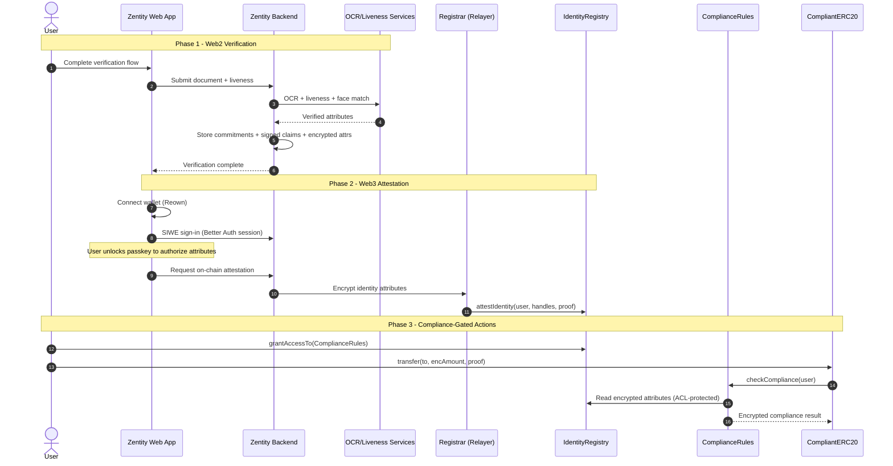
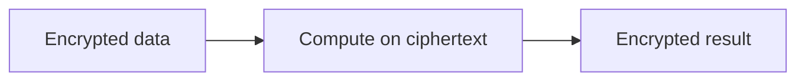
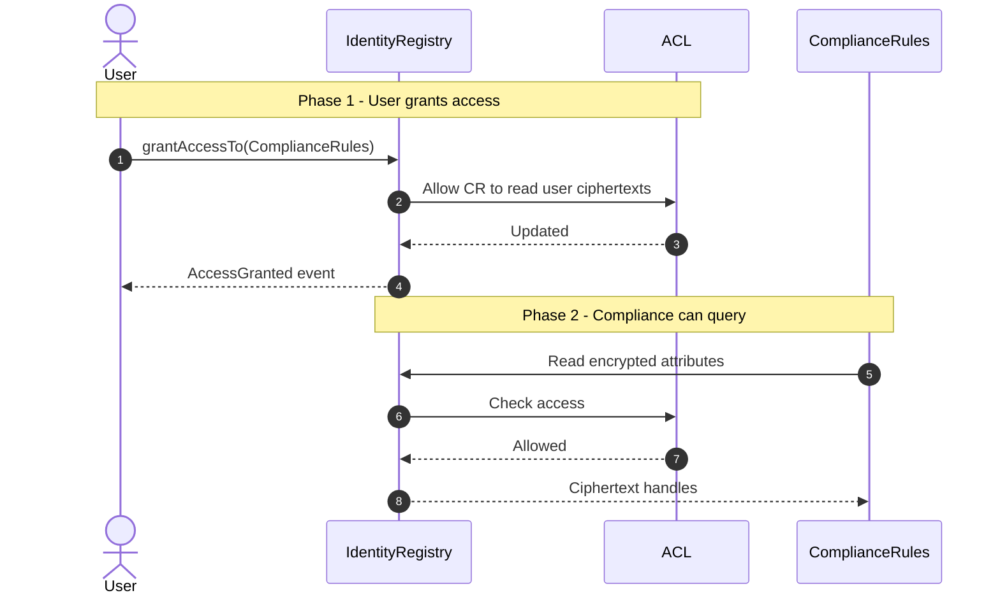
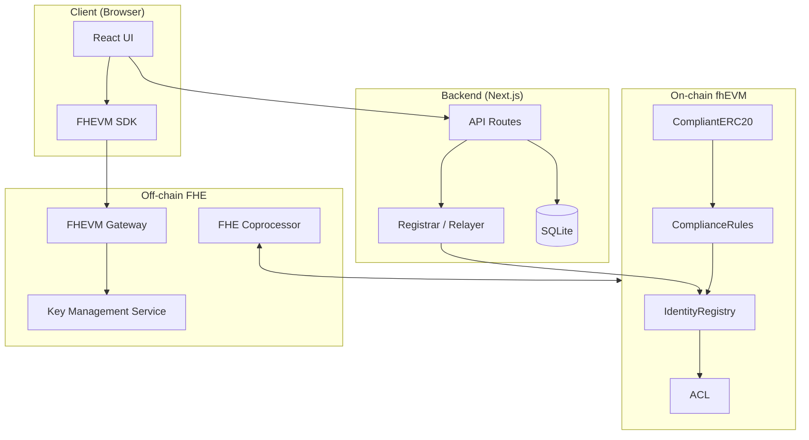
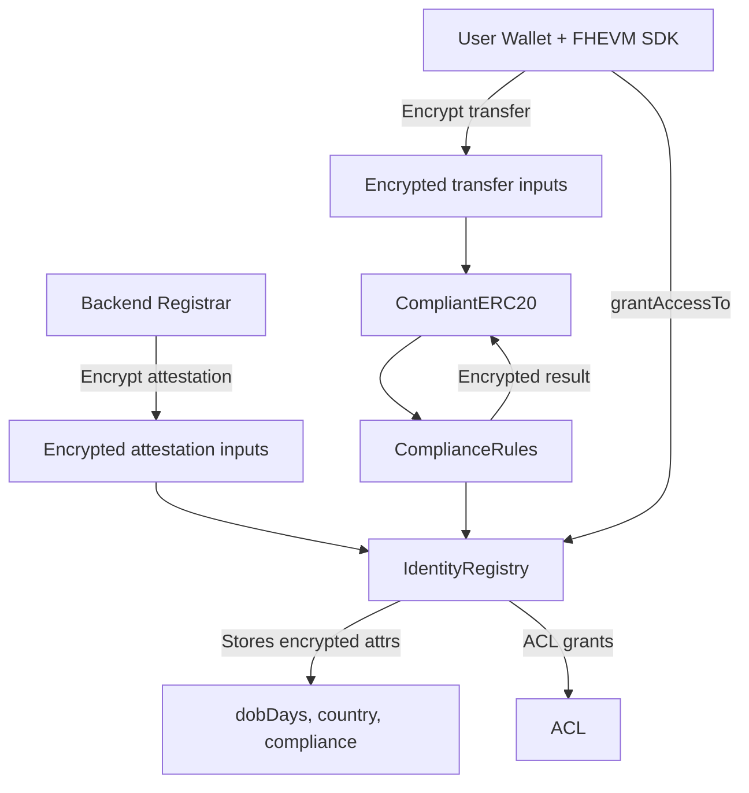
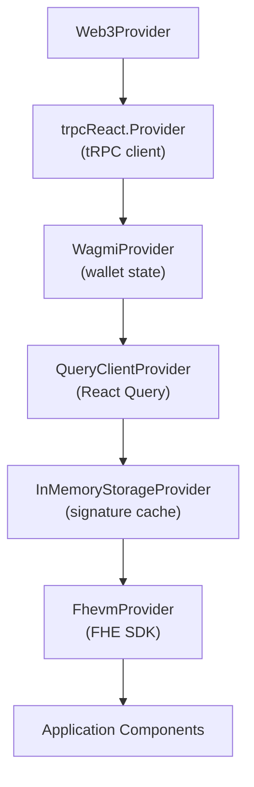
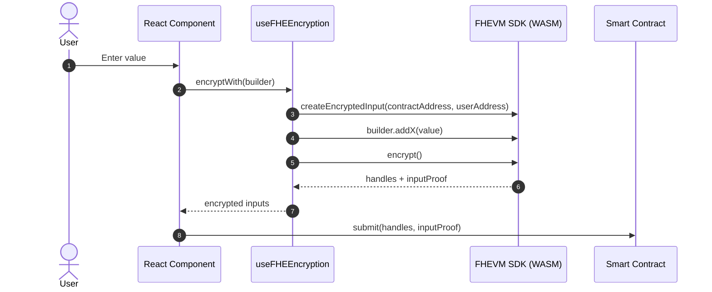
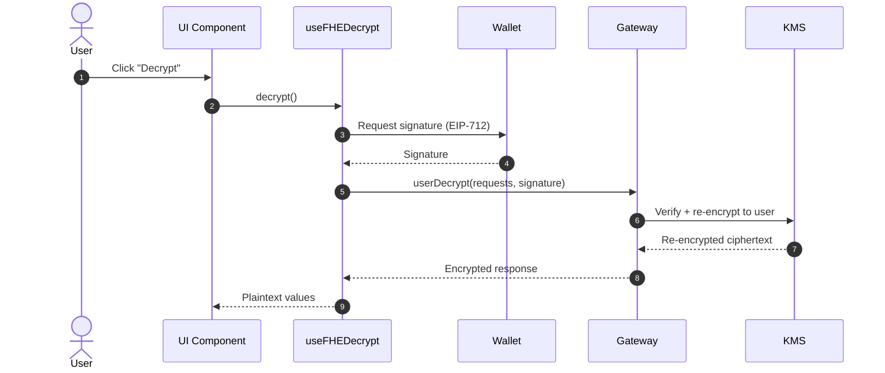
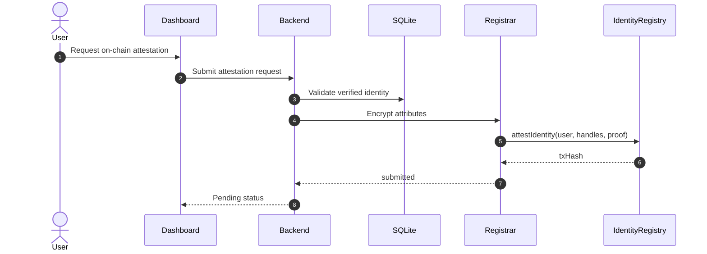

# Web3 Architecture

This document provides a **high-level architecture overview** of Zentity's optional Web3 layer and explains the **Web2-to-Web3 transition** from verification to on-chain attestation.

## Overview

Zentity keeps **identity verification off-chain** and uses the Web3 layer only for **encrypted attestation + compliance checks**. The server (registrar) encrypts identity attributes and submits attestations to fhEVM. Users authorize decryption and access via explicit grants.

This doc moves from **high-level system context**, to **transition flow**, and then to **Web3-specific mechanics**.

### Key technologies

| Technology | Purpose |
|---|---|
| **FHEVM** | Encrypted smart contract operations |
| **Reown AppKit** | Wallet connection UX |
| **Wagmi** | Wallet state + Ethereum hooks |
| **tRPC** | Type-safe API between frontend and backend |
| **ethers.js** | Transaction signing + EIP-712 support |

### Key ideas

- **Encrypted on-chain state**: ciphertext handles only, no plaintext in contracts.
- **Server-side attestation**: registrar encrypts identity attributes and submits attestations.
- **User-controlled access**: decryption and access are gated by user-authorized grants.
- **FHE-based compliance**: contracts evaluate policies on encrypted data.

### Auth & session gating

- **Wallet connection ≠ session**: Reown AppKit connects a wallet, but it does not create a server session.
- **SIWE bridge**: the UI performs Sign‑In With Ethereum via Better Auth (`/api/auth/siwe/*`) to mint a session and link the wallet address.
- **Server gating**: Web3/FHE APIs should require a Better Auth session and only proceed when the user has explicitly unlocked passkey‑sealed data (PRF unlock) for any encrypted payloads.

---

## Web2 to Web3 Transition

Zentity bridges traditional identity verification with privacy-preserving blockchain attestation.

### The two worlds

| Aspect | Web2 (Off-chain) | Web3 (On-chain) |
|---|---|---|
| **Purpose** | Collect and verify identity | Enforce compliance on encrypted data |
| **Data state** | Plaintext briefly; encrypted at rest | Encrypted throughout |
| **Trust model** | Trust Zentity backend | Trustless verification |
| **Storage** | Commitments and ciphertexts | Ciphertext handles |
| **Operations** | OCR, liveness, face match | Encrypted comparisons and policy checks |

### PoC limitations

| Limitation | Current state | Production requirement |
|---|---|---|
| Country codes | ~55 countries supported (EU, EEA, LATAM, Five Eyes, + 4 additional) | Full ISO 3166-1 coverage |
| Rate limiting | In-memory (resets on restart) | Redis or DB-backed |
| Liveness sessions | In-memory storage | Persistent storage (Redis/DB) |

Note: The attestation flow supports a demo mode that simulates successful submissions without on-chain transactions. See [RFC: Feature flags](rfcs/0007-feature-flags.md) for details.

### Data flow

### What stays in Web2

- Document OCR and authenticity checks
- Liveness and face match scoring
- ZK proof generation (client-side)
- Encryption of sensitive attributes
- Storage of commitments, proofs, and evidence packs
- Passkey-based key custody for encrypted attributes

### What moves to Web3

- Encrypted identity attributes stored in smart contracts
- ACL-gated access to ciphertexts
- Encrypted compliance checks (no plaintext)
- Optional encrypted asset transfers (demo)
- Typical encrypted fields: date of birth (dobDays), country code, compliance tier, and sanctions status

### Encryption boundaries

- **Web2**: Attributes are encrypted off-chain and stored as ciphertexts; only the user can decrypt.
- **Web3**: Attestations are encrypted server-side and stored on-chain as ciphertext handles.
- **Access**: Users grant contracts explicit access via ACLs; decryption requires user authorization.

### Encryption points

1. **Client-side encryption** for user-initiated encrypted transfers.
2. **Server-side encryption** for on-chain attestations.
3. **Never encrypted**: wallet addresses, transaction hashes, and event metadata.

### Computation under encryption

The fhEVM never sees plaintext. Compliance checks execute directly on encrypted attributes.

### Access control model

Each ciphertext handle has an ACL that controls who can read or decrypt encrypted state.

| State | Can transfer | Can read own data | Compliance can check |
|---|---|---|---|
| Not attested | No | No | No |
| Attested, no grant | No | Yes | No |
| Attested + granted | Yes | Yes | Yes |

### Silent failure pattern

Compliance checks do not revert when failing. Instead, they return an encrypted "false" that results in a zero-value transfer. This avoids leaking compliance status on-chain.

UI implications:

- A transaction can succeed while transferring zero.
- The UI must verify balance changes to detect failures.
- Users should grant access and verify attestation status before transferring.

### Operational responsibilities

- **Users**: complete Web2 verification, attest on-chain, grant access before transfers.
- **Operators**: deploy contracts, set authorized callers, configure registrar keys.
- **UI integrators**: check attestation and access status before enabling transfers.

### Integration checklist

- Verify Web2 proofs and signed claims before enabling Web3 attestation.
- Ensure the wallet is connected to the target network with gas available.
- Ensure SIWE has established a Better Auth session for the wallet address.
- Require a passkey PRF unlock before generating or decrypting encrypted payloads.
- Confirm the registrar keys and contract addresses are configured.
- Confirm ACL grants are issued for required contracts.
- Validate disclosure flows against the evidence pack schema.

Configuration details live in [Blockchain Setup](blockchain-setup.md).

### Common failure modes

- Transfers succeed but move zero because access was not granted.
- Attestations fail because registrar configuration is missing.
- Compliance checks fail due to incorrect attribute encoding.

### Security model (public vs encrypted)

Encrypted:

- Date of birth (dobDays) and nationality
- Compliance level and sanctions status
- Compliance results and encrypted balances

Public:

- Wallet addresses and transaction existence
- Contract interactions and event metadata
- Gas usage

---

## High-Level Architecture

---

## On-Chain Data Flow

**Key points**:

- Attestation encryption happens **server-side** (registrar + relayer SDK).
- Wallet-initiated operations use **client-side** FHEVM SDK.
- Contracts operate on **ciphertexts only**; no plaintext is revealed.
- Access is **explicit**: users grant contract-level access to their ciphertexts.

---

## Provider Hierarchy

### Provider responsibilities

| Provider | Purpose |
|---|---|
| `Web3Provider` | Root wrapper; initializes AppKit and shared clients |
| `trpcReact.Provider` | Type-safe API client |
| `WagmiProvider` | Wallet connection state + hooks |
| `QueryClientProvider` | Shared cache for tRPC + Wagmi |
| `InMemoryStorageProvider` | Signature cache for decryption |
| `FhevmProvider` | Manages FHEVM SDK lifecycle |

## SDK Lifecycle States

| State | Meaning |
|---|---|
| `idle` | No wallet connected or SDK not initialized |
| `loading` | WASM modules and SDK are initializing |
| `ready` | SDK is usable for encryption/decryption |
| `error` | Initialization failed |

## Client-Side Encryption Flow

## Decryption Flow

## Attestation Flow

---

## Data Privacy Model

1. **Identity verification** happens off-chain (OCR, liveness, face match).
2. **Identity attributes** are encrypted server-side by the registrar.
3. **Ciphertext handles** are stored on-chain (no plaintext).
4. **Compliance checks** operate on ciphertexts (no decryption in contracts).
5. **Attestation metadata** includes proof and policy hashes for auditability.
6. **User decryption** requires explicit authorization (signature-based).

---

## Privacy & Access Control Patterns

- **Encryption boundaries**: data is encrypted before it touches the chain and remains encrypted throughout contract execution.
- **ACL-gated access**: ciphertext handles are readable only by approved contracts.
- **User-authorized decryption**: decryption requires explicit user authorization.
- **Silent failure**: compliance checks avoid leaking policy details when access is missing.

See [Tamper Model](tamper-model.md) for integrity controls and [Attestation & Privacy Architecture](attestation-privacy-architecture.md) for data classification.

---

## How This Fits the Web2 Flow

Web2 performs **collection + verification**; Web3 performs **encrypted attestation + compliance checks**.

- Web2 stores **commitments, proofs, and encrypted attributes**.
- Web3 stores **encrypted attestation handles + public metadata**.

The end-to-end transition is captured in the Web2 to Web3 Transition section above.

---

## Implementation References

- **ADR:** [fhEVM on-chain attestations](adr/fhe/0001-fhevm-onchain-attestations.md)
- **ADR:** [Split encryption & computation](adr/fhe/0002-split-encryption-and-computation.md)
- **Setup:** [Blockchain configuration](blockchain-setup.md)
