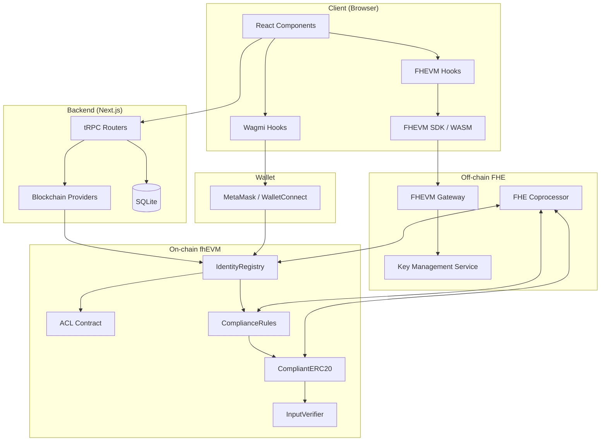
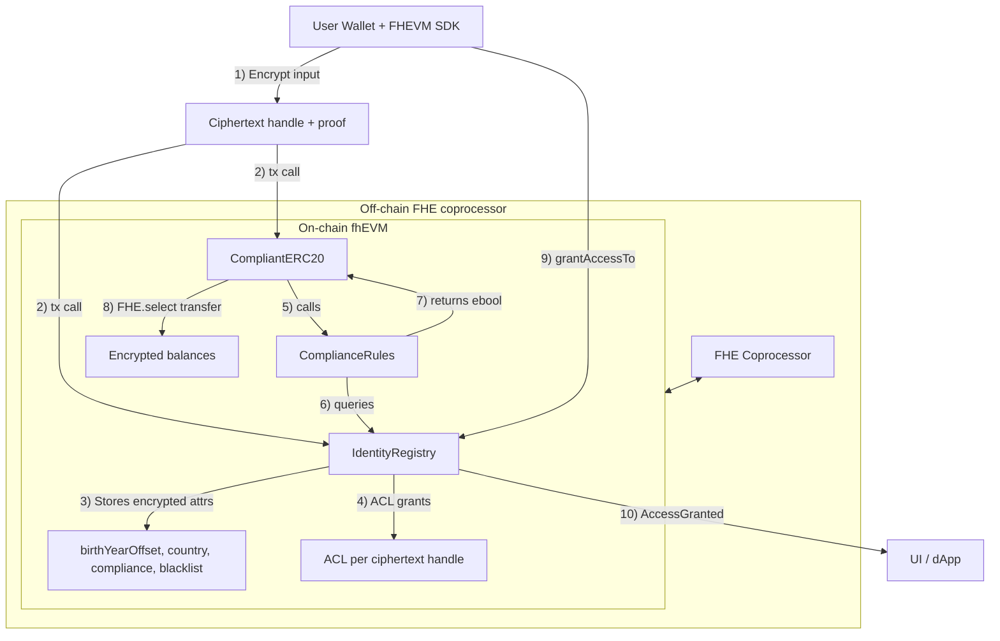
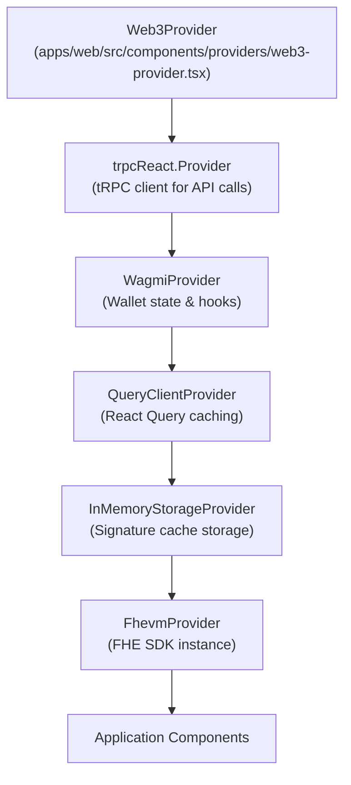
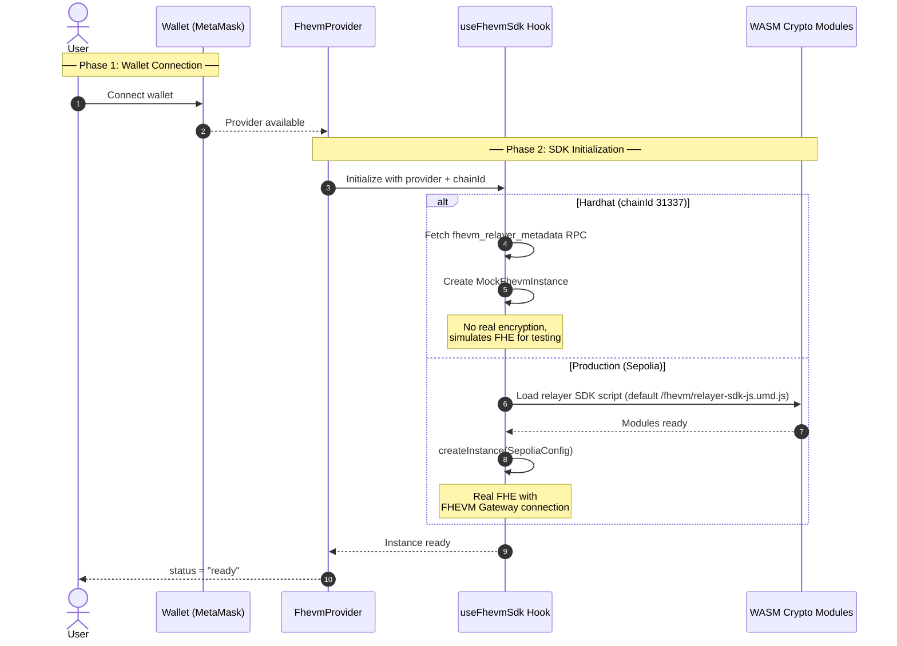
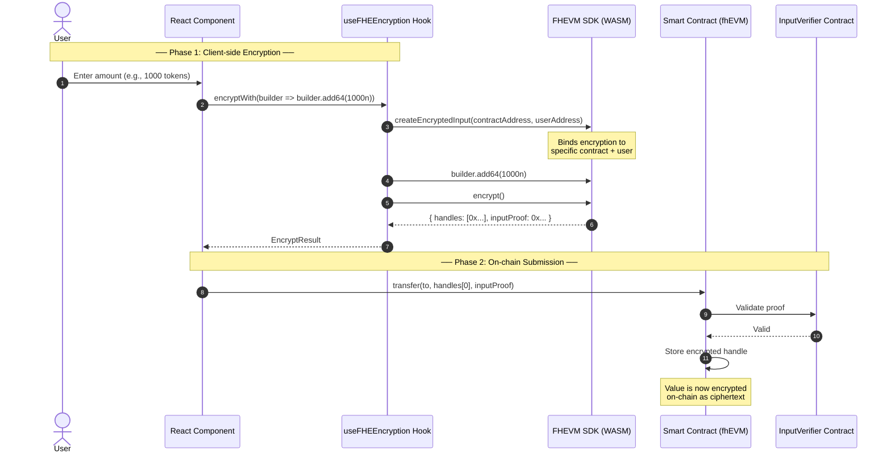
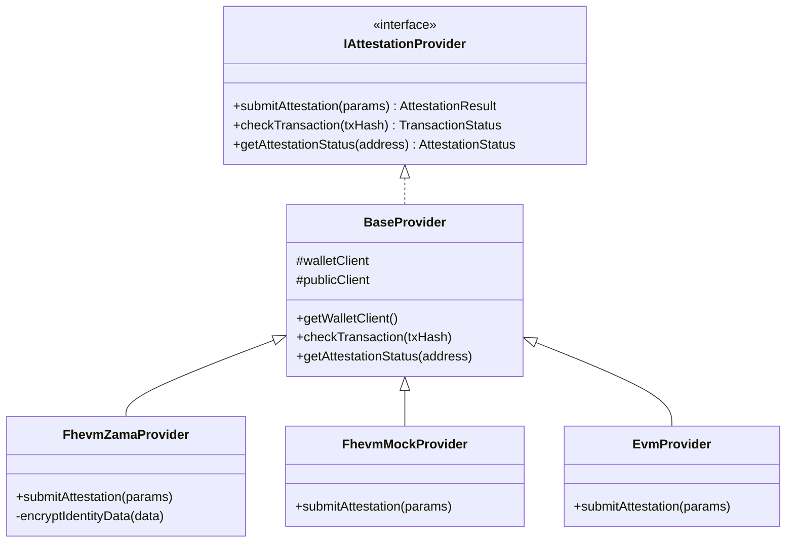
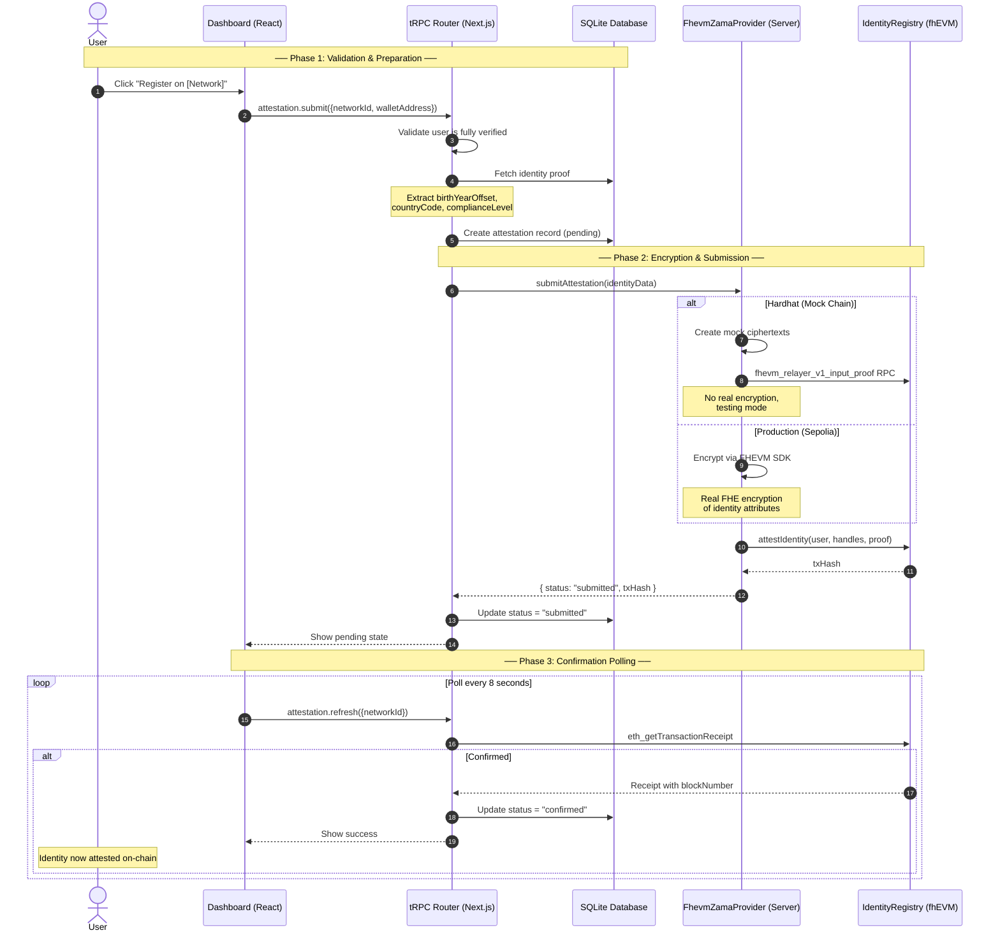
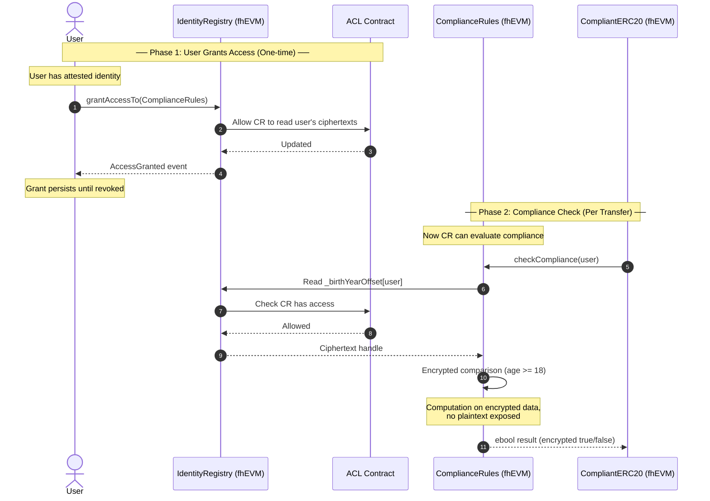
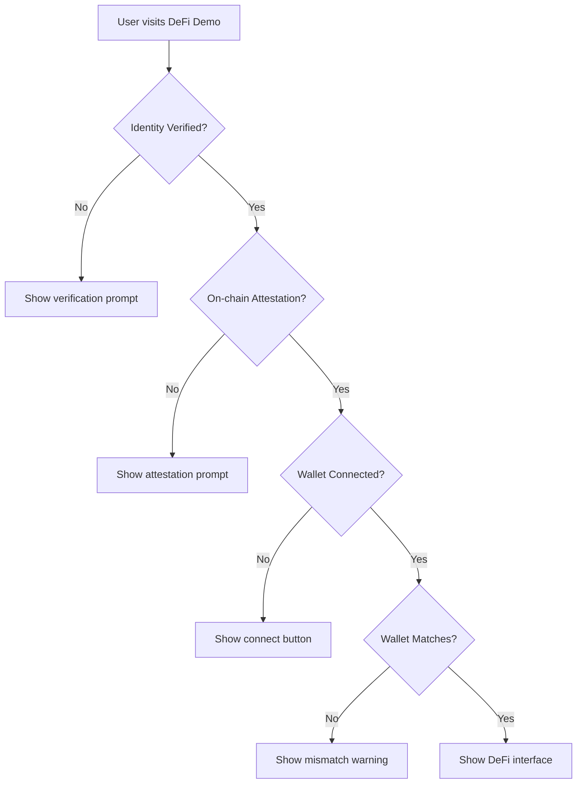
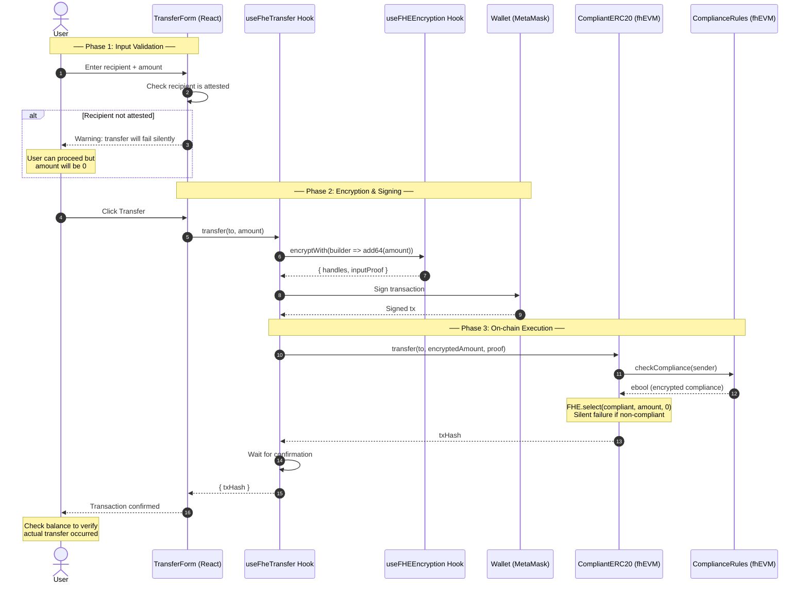

# Web3 Architecture Documentation

> **Related docs:** [Web2 to Web3 Transition](web2-to-web3-transition.md) | [Blockchain Setup](blockchain-setup.md) | [Attestation & Privacy Architecture](attestation-privacy-architecture.md)

This document provides a comprehensive overview of Zentity's web3 implementation, covering Fully Homomorphic Encryption (FHE), blockchain attestation, and wallet integration.

## Table of Contents

1. [Overview](#overview)
2. [Provider Hierarchy](#provider-hierarchy)
3. [FHEVM Module](#fhevm-module)
4. [Blockchain Attestation](#blockchain-attestation)
5. [Access Control & Privacy Patterns](#access-control--privacy-patterns)
6. [Wallet Integration](#wallet-integration)
7. [DeFi Demo Components](#defi-demo-components)
8. [Quick Reference](#quick-reference)

**Related Documentation:**

- [Web2 to Web3 Transition Guide](./web2-to-web3-transition.md) - End-to-end flow from identity verification to on-chain attestation

---

## Overview

Zentity's web3 stack enables privacy-preserving identity attestation and compliant DeFi interactions using Fully Homomorphic Encryption (FHE). Users can attest their verified identity on-chain while keeping sensitive data (birth year, nationality, compliance level) encrypted. Smart contracts can perform compliance checks on encrypted data without ever seeing plaintext values.

### Key Technologies

| Technology | Purpose |
|------------|---------|
| **FHEVM** | Fully Homomorphic Encryption for EVM - enables encrypted smart contract operations |
| **Reown AppKit** | Wallet connection UI (formerly WalletConnect) |
| **Wagmi** | React hooks for Ethereum interactions |
| **tRPC** | Type-safe API layer between frontend and backend |
| **ethers.js v6** | Ethereum library for signatures and transactions |

### High-Level Architecture



### On-Chain Data Flow (Encrypted State)

This diagram shows how encrypted data flows through the smart contracts:



**Key points:**

- Encryption happens **client-side** using the FHEVM SDK
- On-chain storage is **always encrypted** (ciphertext handles)
- Compliance is evaluated **under encryption** - contracts never see plaintext
- Access grants are **explicit** - users must call `grantAccessTo()` for contracts to read their data

### Data Privacy Model

1. **Identity Verification** happens off-chain (document OCR, liveness detection)
2. **Identity Data** (birth year offset, country code, compliance level) is encrypted client-side using the FHEVM SDK
3. **Encrypted Handles** are stored on-chain in the IdentityRegistry contract
4. **Compliance Checks** operate on encrypted data - the smart contract never sees plaintext
5. **Attestation Metadata** stores `policy_hash` + `proof_set_hash` for auditability
6. **User Decryption** requires EIP-712 signature authorization - only the user can decrypt their own data
7. **Profile PII** is stored off-chain as a **passkey-sealed profile** (encrypted client-side). Disclosure is consented: the client decrypts locally and re-encrypts to the relying party.

---

## Provider Hierarchy

The application uses nested React providers to manage state and dependencies. Understanding this hierarchy is essential for debugging and extending the codebase.

### Provider Stack



### Provider Responsibilities

| Provider | File | Purpose |
|----------|------|---------|
| `Web3Provider` | `providers/web3-provider.tsx` | Root wrapper; initializes AppKit, creates shared clients |
| `trpcReact.Provider` | (inline) | Provides tRPC client for type-safe API calls |
| `WagmiProvider` | from `wagmi` | Manages wallet connection state, exposes hooks |
| `QueryClientProvider` | from `@tanstack/react-query` | Shared cache for tRPC and wagmi queries |
| `InMemoryStorageProvider` | `hooks/fhevm/use-in-memory-storage.tsx` | Provides storage for EIP-712 signature caching |
| `FhevmProvider` | `providers/fhevm-provider.tsx` | Manages FHEVM SDK lifecycle, provides FHE instance |

### Why This Order Matters

- **tRPC above Wagmi**: API calls don't depend on wallet state
- **QueryClient shared**: Both tRPC and Wagmi use the same React Query instance for caching
- **InMemoryStorage before FHEVM**: Signature storage must exist before FHE operations
- **FhevmProvider innermost**: Depends on wallet connection to initialize SDK

---

## FHEVM Module

The FHEVM module enables client-side encryption and user-controlled decryption of on-chain data.

### File Structure

```text
apps/web/src/
├── hooks/fhevm/
│   ├── use-fhevm-sdk.ts            # SDK lifecycle management
│   ├── use-fhe-encryption.ts       # Client-side encryption
│   ├── use-fhe-decrypt.ts          # User-controlled decryption
│   ├── use-fhe-transfer.ts         # Encrypted transfer helper
│   └── use-in-memory-storage.tsx   # Signature cache provider
├── lib/fhevm/
│   ├── types.ts                    # TypeScript definitions
│   ├── fhevm-decryption-signature.ts # EIP-712 signature management
│   ├── providers/
│   │   ├── global.ts               # Global provider registry bootstrap
│   │   ├── registry.ts             # Provider registry
│   │   ├── types.ts                # Provider types
│   │   ├── zama/
│   │   │   ├── index.ts             # Zama provider factory
│   │   │   └── relayer.ts           # Zama relayer transport
│   │   └── mock/
│   │       └── index.ts             # Hardhat mock provider
│   └── storage/
│       └── generic-string-storage.ts # Storage interface
└── components/providers/
    └── fhevm-provider.tsx           # React context provider
```

### SDK Lifecycle

The `useFhevmSdk` hook manages initialization of the FHEVM SDK instance.

#### States

| State | Description |
|-------|-------------|
| `idle` | Not initialized (no wallet connected) |
| `loading` | WASM modules loading, SDK initializing |
| `ready` | Instance available for operations |
| `error` | Initialization failed |

#### Mock vs Production

| Environment | Chain ID | Behavior |
|-------------|----------|----------|
| **Hardhat** | 31337 | Uses `MockFhevmInstance` from `@fhevm/mock-utils` |
| **Sepolia** | 11155111 | Uses real FHEVM SDK with WASM crypto modules |

#### Initialization Flow



#### Usage

```typescript
import { useFhevmContext } from "@/components/providers/fhevm-provider";

function MyComponent() {
  const { instance, isReady, status, error, refresh } = useFhevmContext();

  if (!isReady) {
    return <div>Loading FHEVM SDK...</div>;
  }

  // Use instance for encryption/decryption
}
```

### Encryption Flow

The `useFHEEncryption` hook encrypts values before sending to smart contracts.

#### How It Works

1. **Context Binding**: Encryption is bound to (contractAddress, userAddress)
2. **Builder Pattern**: Add values via `builder.add64()`, `builder.add8()`, etc.
3. **Output**: Returns `handles` (references to ciphertexts) and `inputProof` (ZK proof)

#### Sequence Diagram



#### Supported Types

| Solidity Type | SDK Method | Bits |
|---------------|------------|------|
| `ebool` | `addBool()` | 1 |
| `euint8` | `add8()` | 8 |
| `euint16` | `add16()` | 16 |
| `euint32` | `add32()` | 32 |
| `euint64` | `add64()` | 64 |
| `euint128` | `add128()` | 128 |
| `euint256` | `add256()` | 256 |
| `eaddress` | `addAddress()` | 256 |

#### Usage

```typescript
import { useFHEEncryption, toHex } from "@/hooks/fhevm/use-fhe-encryption";

function TransferForm({ contractAddress }) {
  const { instance } = useFhevmContext();
  const signer = useEthersSigner();

  const { canEncrypt, encryptWith } = useFHEEncryption({
    instance,
    ethersSigner: signer,
    contractAddress,
  });

  const handleTransfer = async (amount: bigint) => {
    const result = await encryptWith((builder) => {
      builder.add64(amount);
    });

    if (result) {
      const encryptedAmount = toHex(result.handles[0]);
      const proof = toHex(result.inputProof);
      // Send to contract
    }
  };
}
```

### Decryption Flow

The `useFHEDecrypt` hook enables users to decrypt their on-chain data.

#### How It Works

1. **EIP-712 Signature**: User signs a message authorizing decryption
2. **Signature Caching**: Signature can be cached for up to 365 days (default in-memory cache resets on refresh)
3. **Gateway Request**: Signature + requests sent to FHEVM Gateway
4. **KMS Re-encryption**: KMS re-encrypts data to user's ephemeral public key
5. **Local Decryption**: User decrypts locally with ephemeral private key

#### Sequence Diagram

```mermaid
sequenceDiagram
    autonumber
    actor User
    participant C as ViewIdentityData Component
    participant H as useFHEDecrypt Hook
    participant Cache as Signature Cache (In-Memory)
    participant W as Wallet (MetaMask)
    participant G as FHEVM Gateway
    participant K as Key Management Service

    Note over User,Cache: ── Phase 1: Authorization ──
    User->>C: Click "Decrypt & View"
    C->>H: decrypt()
    H->>Cache: Check for cached signature

    alt Signature not cached
        H->>H: Generate ephemeral keypair
        H->>W: Request EIP-712 signature
        Note over W: User sees wallet popup<br/>to authorize decryption
        W-->>H: Signature
        H->>Cache: Store signature (max 365 days; default in-memory)
    else Signature cached
        Cache-->>H: Return cached signature
        Note over H: No wallet popup needed
    end

    Note over H,K: ── Phase 2: Secure Decryption via Gateway ──
    H->>G: userDecrypt(requests, signature, keypair)
    G->>K: Verify signature against ACL
    K->>K: Re-encrypt to user's ephemeral pubkey
    Note over K: KMS never sees plaintext,<br/>only re-encrypts
    K-->>G: Re-encrypted ciphertext
    G-->>H: Encrypted response

    Note over H,User: ── Phase 3: Local Decryption ──
    H->>H: Decrypt with ephemeral privkey
    H-->>C: Plaintext values
    C-->>User: Display decrypted data
    Note over User: Only user can see plaintext
```

#### Error Recovery

The hook implements automatic error recovery:

| Error | Recovery Action |
|-------|----------------|
| "Invalid EIP-712 signature" | Clear cache, request new signature |
| Signature still fails | Refresh SDK instance (Hardhat relayer restart) |
| Network error | Return error, allow retry |

#### Usage

```typescript
import { useFHEDecrypt } from "@/hooks/fhevm/use-fhe-decrypt";
import { useInMemoryStorage } from "@/hooks/fhevm/use-in-memory-storage";

function ViewIdentityData({ contractAddress, handles }) {
  const { instance, refresh } = useFhevmContext();
  const signer = useEthersSigner();
  const { storage } = useInMemoryStorage();
  const chainId = useChainId();

  const requests = handles.map(handle => ({
    handle,
    contractAddress,
  }));

  const {
    canDecrypt,
    decrypt,
    isDecrypting,
    results,
    error,
  } = useFHEDecrypt({
    instance,
    ethersSigner: signer,
    fhevmDecryptionSignatureStorage: storage,
    chainId,
    requests,
    refreshFhevmInstance: refresh,
  });

  // results is a Record<handle, plaintext>
}
```

### Storage & Caching

#### GenericStringStorage Interface

```typescript
interface GenericStringStorage {
  getItem(key: string): string | Promise<string | null> | null;
  setItem(key: string, value: string): void | Promise<void>;
  removeItem(key: string): void | Promise<void>;
}
```

#### Storage Options

| Type | Persistence | Security | Use Case |
|------|-------------|----------|----------|
| **In-Memory** (default) | Page refresh clears | Most secure | Production |
| **sessionStorage** | Tab close clears | Medium | Development |
| **localStorage** | Persists indefinitely | Least secure | Not recommended |

#### What Gets Cached

- **Key**: `${userAddress}:${eip712TypeHash}`
- **Value**: JSON containing ephemeral keypair + signature + expiry

**TTL Enforcement:** The `FhevmDecryptionSignature.isValid()` method checks if `timestampNow() < startTimestamp + durationDays * 86400`. Expired signatures are automatically replaced on next decrypt.

---

## Blockchain Attestation

The attestation module handles on-chain identity registration.

### File Structure

```text
apps/web/src/lib/blockchain/
├── index.ts                          # Public exports
├── config/
│   └── networks.ts                   # Network definitions
└── providers/
    ├── types.ts                      # Interface definitions
    ├── base-provider.ts              # Shared wallet/tx logic
    ├── fhevm-zama-provider.ts        # fhEVM attestation (Zama relayer)
    ├── evm-provider.ts               # Standard EVM (future)
    └── factory.ts                    # Provider factory
```

### Network Configuration

Networks are defined in `config/networks.ts`:

```typescript
interface NetworkConfig {
  id: string;           // "fhevm_sepolia", "hardhat"
  name: string;         // Display name
  chainId: number;      // EVM chain ID
  rpcUrl: string;       // RPC endpoint
  type: "fhevm" | "evm";
  providerId?: string; // "zama" | "mock"
  features: ["encrypted"] | ["basic"];
  contracts: {
    identityRegistry: string;
    complianceRules?: string;
    compliantERC20?: string;
  };
  explorer?: string;
  enabled: boolean;
}
```

#### Environment Variables

| Variable | Required | Description |
|----------|----------|-------------|
| `NEXT_PUBLIC_ENABLE_FHEVM` | No | Enable fhEVM network (default: true) |
| `NEXT_PUBLIC_ENABLE_HARDHAT` | No | Enable local Hardhat (dev only) |
| `NEXT_PUBLIC_ATTESTATION_DEMO` | No | Enable demo mode (mock networks) |
| `FHEVM_RPC_URL` | Yes | fhEVM RPC endpoint |
| `FHEVM_NETWORK_ID` | No | Network identifier (string) |
| `FHEVM_CHAIN_ID` | No | EVM chain ID |
| `FHEVM_NETWORK_NAME` | No | Display name |
| `FHEVM_EXPLORER_URL` | No | Block explorer base URL |
| `FHEVM_PROVIDER_ID` | No | FHEVM provider implementation (`zama` or `mock`) |
| `FHEVM_IDENTITY_REGISTRY` | Yes | IdentityRegistry contract address |
| `FHEVM_COMPLIANCE_RULES` | No | ComplianceRules contract address |
| `FHEVM_COMPLIANT_ERC20` | No | CompliantERC20 contract address |
| `FHEVM_REGISTRAR_PRIVATE_KEY` | Yes | Server-side signing key (fhEVM/Sepolia) |
| `LOCAL_REGISTRAR_PRIVATE_KEY` | No | Server-side signing key (local Hardhat) |
| `REGISTRAR_PRIVATE_KEY` | No | Global fallback if per-network keys are not set |

### Provider Architecture

The client SDK uses a small provider registry keyed by `FHEVM_PROVIDER_ID`.
This allows swapping or adding FHEVM vendors without changing app logic.
Default providers:
`zama` (Zama relayer SDK on testnet/mainnet) and `mock` (local Hardhat).

Provider adapters are responsible for any vendor-specific bootstrapping.
For example, the Zama adapter injects the relayer SDK script at runtime
so the rest of the app stays vendor-agnostic.

#### Client Provider Registry (How to extend)

If you need a different FHEVM vendor, register a provider factory at runtime:

```ts
// Example: load this before the app mounts (e.g., in a small inline script tag)
window.__FHEVM_PROVIDER_FACTORIES__ = {
  customVendor: async ({ provider, chainId }) => {
    const { createInstance, initSDK, SepoliaConfig } = await import(
      "@vendor/fhevm-sdk/bundle"
    );

    await initSDK();
    return createInstance({
      ...SepoliaConfig,
      network: provider,
      chainId,
    });
  },
};
```

Then set:

```bash
FHEVM_PROVIDER_ID=customVendor
NEXT_PUBLIC_FHEVM_PROVIDER_ID=customVendor
```

This keeps the app code stable while swapping the underlying FHEVM implementation.



### Attestation Flow



### tRPC API Reference

#### `attestation.networks` (Query)

Lists all enabled networks with user's attestation status.

```typescript
// Response
{
  networks: Array<{
    id: string;
    name: string;
    chainId: number;
    type: "fhevm" | "evm";
    identityRegistry: string | null;
    attestation: {
      status: "pending" | "submitted" | "confirmed" | "failed";
      txHash: string | null;
      walletAddress: string;
      explorerUrl?: string;
    } | null;
  }>;
  demo: boolean;
}
```

#### `attestation.submit` (Mutation)

Submits identity attestation to blockchain.

```typescript
// Input
{ networkId: string; walletAddress: string }

// Response
{ success: true; status: "submitted"; txHash: string; explorerUrl?: string }
```

**Requirements:**

- User must be fully verified (document + liveness + face match)
- Rate limit: 3 attempts per hour per network

#### `attestation.refresh` (Mutation)

Polls transaction confirmation status.

```typescript
// Input
{ networkId: string }

// Response
{ status: "confirmed"; blockNumber: number }
// or
{ status: "submitted"; pending: true }
```

#### `attestation.retry` (Mutation)

Resets a failed attestation for retry.

```typescript
// Input
{ networkId: string }

// Response
{ reset: true; message: "Call submit to retry" }
```

---

## Access Control & Privacy Patterns

### ACL (Access Control List)

In fhEVM, each ciphertext handle has an associated ACL that controls who can use it for computation or request decryption.

#### How ACL Works



#### Access States

| State | Can Transfer | Can Decrypt Own Data | ComplianceRules Can Check |
|-------|--------------|---------------------|---------------------------|
| Not attested | No | No | No |
| Attested, no grant | No | Yes (via Gateway) | No |
| Attested + granted | Yes | Yes | Yes |

#### UI Implications

1. **Check access before transfers**: The UI should verify `grantAccessTo()` was called
2. **Don't cache access state**: Always check on-chain state
3. **One-time operation**: Grant persists until explicitly revoked

### Silent Failure Pattern

fhEVM uses **silent failure** to prevent information leakage about compliance status.

#### The Problem with Reverts

```solidity
// BAD: Leaks compliance status
require(isCompliant(from), "Not compliant");
// An observer learns user is non-compliant from the revert
```

#### The Silent Failure Solution

```solidity
// GOOD: No information leakage
euint64 effectiveAmount = FHE.select(
    complianceResult,   // ebool (encrypted true/false)
    amount,             // Transfer this if compliant
    EUINT64_ZERO        // Transfer 0 if not compliant
);
// Transaction succeeds either way - observer learns nothing
```

#### Implications for UI/UX

| Behavior | Traditional ERC20 | Compliant ERC20 |
|----------|-------------------|-----------------|
| Failed compliance | Transaction reverts | Transaction succeeds, 0 transferred |
| Balance change | None (revert) | None (silent 0) |
| Gas cost | Refunded | Fully consumed |
| User feedback | Error message | Must check balance |

#### Detecting Silent Failures

```typescript
// Check if transfer actually happened
const handleTransfer = async (to: string, amount: bigint) => {
  // Get balance before (requires decryption)
  const balanceBefore = await getDecryptedBalance(userAddress);

  // Execute transfer
  const tx = await transfer(to, amount);
  await tx.wait();

  // Get balance after
  const balanceAfter = await getDecryptedBalance(userAddress);

  // Compare
  if (balanceBefore === balanceAfter) {
    // Silent failure - transfer was 0
    showWarning("Transfer may have failed due to compliance");
  }
};
```

#### Best Practices

1. **Warn before transfer**: Check recipient attestation status
2. **Verify after transfer**: Compare balances (requires decryption)
3. **Explain to users**: Silent failure is a privacy feature, not a bug
4. **Don't assume success**: Transaction confirmation ≠ transfer success

---

## Wallet Integration

### Reown AppKit Setup

Configuration is in `lib/wagmi/config.ts`:

```typescript
// Supported networks
export const fhevmSepolia = {
  id: 11155111,
  name: "FHEVM (Sepolia)",
  rpcUrls: { default: { http: ["https://ethereum-sepolia-rpc.publicnode.com"] } },
  // ...
};

// AppKit adapter
export const wagmiAdapter = new WagmiAdapter({
  storage: cookieStorage,
  ssr: true,
  projectId,
  networks,
});
```

### Key Hooks

#### `useEthersSigner`

Bridges wagmi wallet to ethers v6 signer.

```typescript
import { useEthersSigner } from "@/lib/wagmi/use-ethers-signer";

function MyComponent() {
  const signer = useEthersSigner();
  // signer is ethers.JsonRpcSigner or undefined
}
```

**Why needed**: FHEVM SDK requires ethers signers for EIP-712 operations.

#### `useDevFaucet`

Development utility for Hardhat test ETH.

```typescript
import { useDevFaucet } from "@/lib/wagmi/use-dev-faucet";

function DevTools() {
  const { faucet, isFauceting, isSupported } = useDevFaucet(chainId);

  if (isSupported) {
    return <button onClick={() => faucet(address)}>Get Test ETH</button>;
  }
}
```

#### `useFheTransfer`

High-level hook for encrypted token transfers.

```typescript
import { useFheTransfer } from "@/hooks/use-fhe-transfer";

function TransferForm({ contractAddress }) {
  const {
    transfer,
    isReady,
    isPending,
    txHash,
    error,
    debug,
  } = useFheTransfer({ contractAddress });

  const handleSubmit = async () => {
    const result = await transfer(recipientAddress, amount);
  };
}
```

---

## DeFi Demo Components

The DeFi demo showcases compliant token transfers using encrypted identity checks.

### Component Hierarchy

```text
DefiDemoClient (orchestrator)
├── ComplianceAccessCard (grant contract access)
├── TokenStatus (token info display)
├── MintForm (request test tokens)
├── TransferForm (encrypted transfers)
└── TxHistory (transaction log)
```

### Verification Gates

The demo enforces sequential verification:



### Transfer Flow



### Demo Mode

When `NEXT_PUBLIC_ATTESTATION_DEMO=true`:

- Wallet mismatch checks are skipped
- Compliance access is auto-granted
- Mock transaction hashes (0xdemo...)
- No real blockchain interactions

---

## Quick Reference

### Environment Variables

#### Required

```bash
# Wallet Connection
NEXT_PUBLIC_PROJECT_ID=<reown-cloud-project-id>

# Blockchain
FHEVM_RPC_URL=https://ethereum-sepolia-rpc.publicnode.com
FHEVM_NETWORK_ID=fhevm_sepolia
FHEVM_CHAIN_ID=11155111
FHEVM_NETWORK_NAME="fhEVM (Sepolia)"
FHEVM_EXPLORER_URL=https://sepolia.etherscan.io
FHEVM_IDENTITY_REGISTRY=0x...
FHEVM_REGISTRAR_PRIVATE_KEY=0x...

# Client-side equivalents (used by SDK + wallet UI)
NEXT_PUBLIC_FHEVM_RPC_URL=...
NEXT_PUBLIC_FHEVM_NETWORK_ID=...
NEXT_PUBLIC_FHEVM_CHAIN_ID=...
NEXT_PUBLIC_FHEVM_NETWORK_NAME="fhEVM (Sepolia)"
NEXT_PUBLIC_FHEVM_EXPLORER_URL=...
NEXT_PUBLIC_FHEVM_PROVIDER_ID=zama
```

#### Optional

```bash
# Feature Flags
NEXT_PUBLIC_ENABLE_FHEVM=true         # Default: true
NEXT_PUBLIC_ENABLE_HARDHAT=false      # Dev only
NEXT_PUBLIC_ATTESTATION_DEMO=false    # UI testing

# Contract Addresses (for DeFi demo)
FHEVM_COMPLIANCE_RULES=0x...
FHEVM_COMPLIANT_ERC20=0x...

# Local Development
LOCAL_RPC_URL=http://127.0.0.1:8545
LOCAL_IDENTITY_REGISTRY=0x...
LOCAL_REGISTRAR_PRIVATE_KEY=0x...

# Relayer/Gateway overrides (advanced)
NEXT_PUBLIC_FHEVM_RELAYER_URL=...
NEXT_PUBLIC_FHEVM_GATEWAY_CHAIN_ID=...
NEXT_PUBLIC_FHEVM_ACL_CONTRACT_ADDRESS=...
NEXT_PUBLIC_FHEVM_KMS_CONTRACT_ADDRESS=...
NEXT_PUBLIC_FHEVM_INPUT_VERIFIER_CONTRACT_ADDRESS=...
NEXT_PUBLIC_FHEVM_DECRYPTION_ADDRESS=...
NEXT_PUBLIC_FHEVM_INPUT_VERIFICATION_ADDRESS=...
NEXT_PUBLIC_FHEVM_ZAMA_SDK_URL=/fhevm/relayer-sdk-js.umd.js
```

### Common Patterns

#### Check if FHE is Ready

```typescript
const { isReady, status, error } = useFhevmContext();

if (status === "loading") return <Spinner />;
if (status === "error") return <Error message={error.message} />;
if (!isReady) return <WalletPrompt />;
```

#### Encrypt Values for Contract

```typescript
const { canEncrypt, encryptWith } = useFHEEncryption({
  instance,
  ethersSigner: signer,
  contractAddress,
});

const result = await encryptWith((builder) => {
  builder.add64(amount);
  builder.add8(level);
});

// result.handles[0] = encrypted amount
// result.handles[1] = encrypted level
// result.inputProof = ZK proof
```

#### Handle Decryption Errors

```typescript
const { error, decrypt } = useFHEDecrypt({ ... });

useEffect(() => {
  if (error?.includes("Invalid EIP-712")) {
    // Signature cache invalidated, user will be prompted again
    refresh(); // Refresh SDK instance
  }
}, [error]);
```

### Troubleshooting

| Issue | Cause | Solution |
|-------|-------|----------|
| "FHE encryption not available" | SDK still loading | Check `fhevmStatus`, wait for "ready" |
| "Invalid EIP-712 signature" | Stale SDK instance (Hardhat restart) | Click "Refresh SDK" or call `refresh()` |
| "Insufficient funds" | No ETH for gas | Use `useDevFaucet` on Hardhat |
| "Recipient not attested" | Target wallet not registered | Recipient must complete attestation first |
| Double wallet popup | Auto-recovery after stale signature | Normal behavior, second signature uses fresh instance |
| Chain mismatch error | Connected to wrong network | Switch chain via wallet or AppKit |

### Debug Info

The `useFheTransfer` hook exposes debug info:

```typescript
const { debug } = useFheTransfer({ contractAddress });

console.log(debug);
// {
//   isFhevmReady: true,
//   fhevmStatus: "ready",
//   fhevmError: undefined,
//   hasInstance: true,
//   hasSigner: true,
//   hasContract: true,
//   canEncrypt: true
// }
```

---

## Further Reading

### Internal Documentation

- [Web2 to Web3 Transition Guide](./web2-to-web3-transition.md) - Complete flow from verification to attestation

### External Resources

- [FHEVM Documentation](https://docs.zama.ai/fhevm) - Fully Homomorphic Encryption for Ethereum
- [Reown AppKit Docs](https://docs.reown.com/appkit/overview) - Wallet connection UI
- [Wagmi Documentation](https://wagmi.sh) - React Hooks for Ethereum
- [EIP-712: Typed Data Signing](https://eips.ethereum.org/EIPS/eip-712) - Signature standard for decryption authorization
