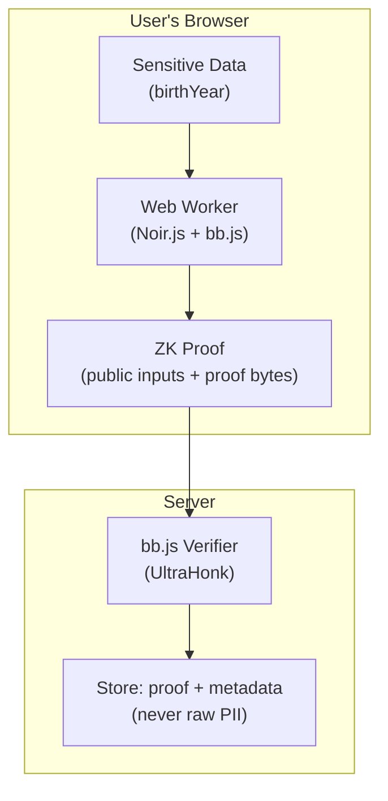
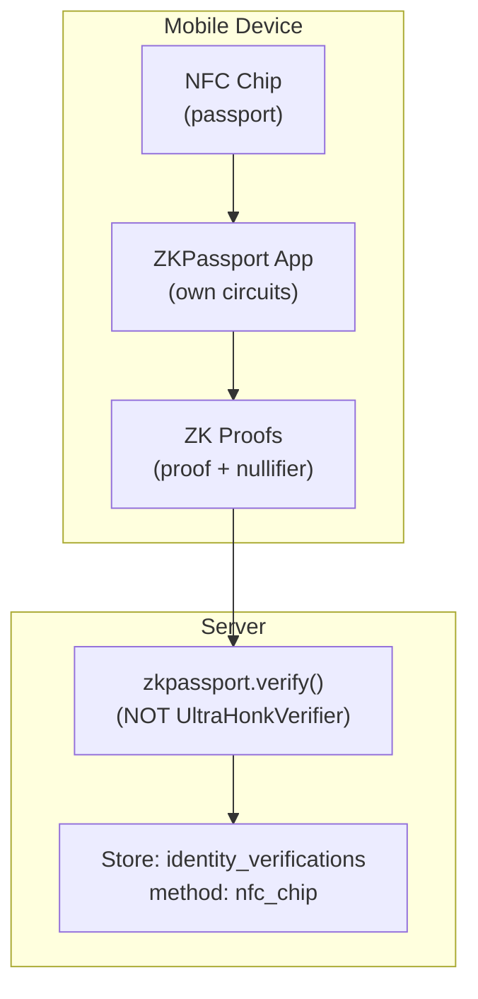
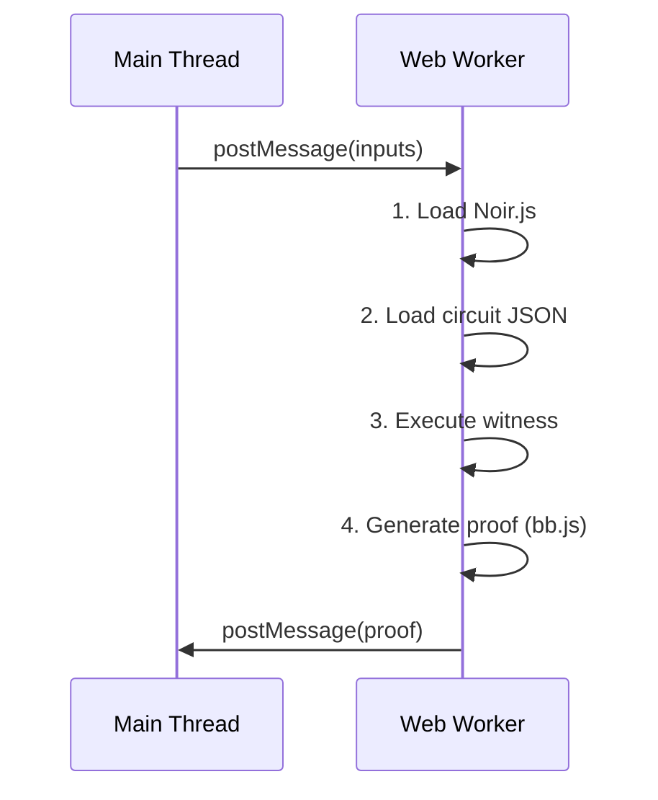
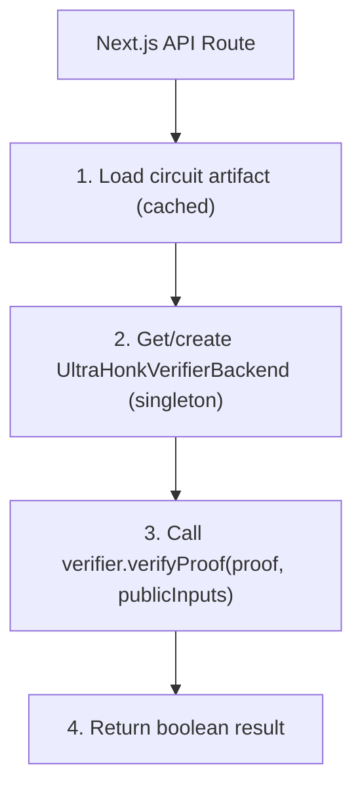

# ZK Proof Architecture

This document describes Zentity’s zero‑knowledge proof system using **Noir** circuits with **UltraHonk** proofs. It focuses on **architecture and trust boundaries**, not implementation details.

## Overview

Zentity generates proofs **client‑side** so private inputs stay in the browser. Proofs are verified **server‑side** and stored with metadata for auditability. Private inputs are derived from passkey‑sealed profile data (e.g., birth year, nationality) and server‑signed claim payloads (e.g., face match score). The server never sees plaintext values.



## Circuits

| Circuit | Purpose | Private Inputs | Public Inputs |
|---------|---------|----------------|---------------|
| `age_verification` | Prove age >= threshold | DOB (days since 1900) + document hash | Current days, min age days, nonce, claim hash |
| `doc_validity` | Prove document not expired | Expiry date + document hash | Current date, nonce, claim hash |
| `nationality_membership` | Prove nationality in group | Nationality code (weighted-sum) + Merkle path | Merkle root, nonce, claim hash |
| `address_jurisdiction` | Prove address in jurisdiction | Address + Merkle path | Merkle root, nonce, claim hash |
| `face_match` | Prove similarity >= threshold | Similarity score + document hash | Threshold, nonce, claim hash |
| `identity_binding` | Bind proof to user identity | Binding secret, user ID hash, document hash | Nonce, msg_sender_hash, audience_hash, base_commitment, binding_commitment |

**Importance:** The verifier learns only the boolean outcome (e.g., "over 18"), never the underlying PII.

### Identity Binding Circuit

The `identity_binding` circuit provides replay protection by cryptographically binding proofs to a specific user identity. It works across all four authentication modes:

| Auth Mode | Binding Secret Source | Privacy Level |
|-----------|----------------------|---------------|
| **Passkey** | PRF output (32 bytes) | Highest – device-bound, non-extractable |
| **OPAQUE** | Export key (64 bytes) | High – password-derived, deterministic |
| **Wallet** | EIP-712 signature (65 bytes) | Medium – wallet address stored for association |
| **Wallet + BBS+** | BBS+ credential proof hash | Highest – unlinkable presentations, wallet address hidden |

The circuit is **auth-mode agnostic**: it accepts a generic `binding_secret` as a private input. The TypeScript layer (`binding-secret.ts`) handles per-mode derivation using HKDF with domain separation strings (e.g., `zentity-binding-wallet-bbs-v1`) to prevent cross-use attacks. See [RFC-0020](rfcs/0020-privacy-preserving-wallet-binding.md) for BBS+ wallet binding details.

> **ZK vs FHE encoding:** Nationality codes in ZK circuits use weighted-sum encoding (`char1×65536 + char2×256 + char3`) via `getCountryWeightedSum()` from `@zkpassport/utils`. FHE encryption uses a separate encoding for homomorphic operations. See [Nationality Proofs](zk-nationality-proofs.md) for details.

**Dual-commitment design:**

The circuit computes two commitments from the private inputs and verifies them against the corresponding public inputs:

```text
base_commitment    = Poseidon2(binding_secret, user_id_hash)
binding_commitment = Poseidon2(binding_secret, user_id_hash, document_hash, msg_sender_hash, audience_hash)
```

- `base_commitment` — binds the proof to the user's identity secret only, enabling linkage across sessions for the same user
- `binding_commitment` — binds the full session context (document, caller, audience), preventing replay across different verification contexts

The circuit returns `pub bool` (`is_bound`) — `true` when both commitments match, otherwise the circuit panics via `assert`. This is a **return value**, not a public input.

This ensures that:

- Same user + same document + same auth secret + same caller/audience context = same commitment (deterministic)
- Different auth modes produce different commitments (domain separation)
- Proofs cannot be replayed across users, documents, callers, or relying-party audiences

### Mandatory Enforcement

Identity binding is **mandatory** — `generateAllProofs` requires a `BindingContext` and will not generate any proofs without it. This applies to both on-chain attestation and off-chain verification:

- **On-chain**: Prevents proof replay across wallets. Without binding, a malicious relayer could submit someone else's valid proofs under a different address.
- **Off-chain**: Provides tamper-evidence. The cryptographic user↔proof link means shuffled DB records would fail verification.

### Credential Material Lifecycle During Verification

Binding requires the user's raw credential material (PRF output, OPAQUE export key, or wallet signature). This material follows a specific lifecycle:

1. **Cached at FHE enrollment** — When the user enrolls FHE keys (verification preflight), the credential material is stored in an in-memory cache.
2. **Consumed at proof generation** — The binding context resolver reads the cache to derive the binding secret via HKDF.
3. **Cleared after proof storage** — The cache is cleared after all proofs are stored, regardless of success or failure.
4. **TTL safety net** — If cleanup doesn't run (e.g., tab crash), the cache auto-expires.

For the ZKPassport NFC flow, credential material is still required for identity binding but the WebAuthn prompt can be suppressed via the `promptPasskey` option when the cache is warm.

If the cache is expired when proofs are generated (user was idle, page refreshed, TTL fired), the behavior depends on auth mode:

| Auth Mode | Recovery | UX |
|-----------|----------|-----|
| **Passkey** | Automatic — WebAuthn PRF is re-prompted directly | User taps/scans biometric |
| **OPAQUE** | Re-auth dialog — user enters password to re-derive export key | Modal with password input |
| **Wallet** | Re-auth dialog — user signs EIP-712 typed data | Modal with "Sign with Wallet" button |

The re-auth dialog blocks proof generation until credential material is available. There is no fallback path that skips binding.

## Proof Binding & Integrity

- **Nonces** (server‑issued) prevent replay.
- **Claim hashes** bind proofs to server‑signed OCR/liveness claims.
- **Context hashes** (`msg_sender_hash`, `audience_hash`) bind identity proofs to the authenticated caller and relying-party audience.
- **Verifier metadata** stores circuit/version identifiers for audit.

See [Tamper Model](tamper-model.md) for integrity rules and [Attestation & Privacy Architecture](attestation-privacy-architecture.md) for data classification.

## Performance & UX Notes

- Proof generation runs in a **Web Worker** to avoid UI blocking.
- Circuits are optimized for **Poseidon2** hashing (cheaper in ZK than SHA‑256).
- Detailed profiling and timing guidance live in [Noir Profiling](noir-profiling.md).
- Proof times are device- and circuit-dependent; treat any numbers as guidance.

## Security Notes

- **Nonce binding** prevents proof replay.
- **Claim binding** ties proofs to server‑signed measurements (OCR, liveness, face match).
- **Range checks** avoid wrap‑around and invalid inputs (dates, scores, thresholds).
- **Date input sanity checks** enforce plausible ranges (`current_days`, `min_age_days`, `current_date`) at both circuit and server validation layers.

## BN254 Field Constraints

All ZK circuits operate over the **BN254 scalar field** (~254 bits). Values exceeding the field modulus will cause proof generation to fail.

### Field Modulus

```text
BN254_FR_MODULUS = 0x30644e72e131a029b85045b68181585d2833e84879b9709143e1f593f0000001
                ≈ 2^254 (actually slightly less)
```

### Common Pitfalls

| Source | Size | Risk |
|--------|------|------|
| Passkey PRF output | 32 bytes (256 bits) | ⚠️ Can exceed modulus |
| OPAQUE export key | 64 bytes (512 bits) | ⚠️ Must reduce |
| Wallet signature | 65 bytes (520 bits) | ⚠️ Must reduce |
| SHA-256 hash | 32 bytes (256 bits) | ⚠️ Can exceed modulus |
| Poseidon2 output | ~254 bits | ✓ Always valid |

### Required: Hash-to-Field Mapping

Direct `value % BN254_FR_MODULUS` on 256-bit cryptographic outputs introduces
small statistical bias. For cryptographic inputs (SHA-256 hashes, PRF outputs,
wallet signatures), we now use **HKDF-based hash-to-field**:

1. HKDF-Extract+Expand (SHA-256) with domain-separated `info`
2. Expand to 512 bits
3. Reduce modulo `BN254_FR_MODULUS`

```typescript
async function hashToField(hexValue: string, info: string): Promise<string> {
  const input = hexToBytes(hexValue);
  const key = await crypto.subtle.importKey("raw", input, "HKDF", false, [
    "deriveBits",
  ]);
  const wideBits = await crypto.subtle.deriveBits(
    {
      name: "HKDF",
      hash: "SHA-256",
      salt: new Uint8Array(32), // zero salt
      info: new TextEncoder().encode(info),
    },
    key,
    512
  );
  const wide = bytesToBigInt(new Uint8Array(wideBits));
  const reduced = wide % BN254_FR_MODULUS;
  return `0x${reduced.toString(16).padStart(64, "0")}`;
}
```

For values that are already field elements (e.g., previously normalized
`documentHashField`), we only canonicalize formatting.

### Where This Matters

- **Identity binding**: `bindingSecretField`, `userIdHashField` from passkey/OPAQUE/wallet
- **Document hashes**: SHA-256 outputs before circuit use
- **Any 32-byte cryptographic output**

See `src/lib/privacy/zk/noir-prover.worker.ts` for implementation and `src/lib/blockchain/attestation/claim-hash.ts` for server-side reduction.

## ZKPassport NFC Chip Verification

ZKPassport provides an alternative trust model where proofs are generated on the user's mobile device by the ZKPassport app, not in the browser Web Worker.



Key differences from browser-based Noir proving:

- **Proof generation**: ZKPassport's own circuit infrastructure on mobile, not Noir/Barretenberg in a Web Worker
- **Verification**: Server-side via `zkpassport.verify()`, not `UltraHonkVerifierBackend`
- **Liveness**: Synthetic score (1.0) — physical chip challenge-response proves possession
- **Nullifier**: `uniqueIdentifier` prevents the same passport from being registered across multiple accounts
- **Country/document pre-check**: `buildCountryDocumentList` (uses `@zkpassport/registry`) confirms NFC support before showing the option
- **Dev mode**: `devMode` flag relaxes proof verification in `development`/`test` environments; production enforces strict verification

The unified `identity_verifications` table stores results from both paths via the `method` discriminator (`"ocr"` | `"nfc_chip"`). FHE encryption is scheduled identically after either path completes.

## Sybil Deduplication

Zentity prevents the same identity document from being registered under multiple accounts using HMAC-based deduplication.

**OCR path:** `computeDedupKey(DEDUP_HMAC_SECRET, docNumber, issuerCountry, dob)` → `HMAC-SHA256` stored as `dedupKey` on `identity_verifications` (unique constraint). Any attempt to register the same document under a different account is rejected at the DB level.

**NFC path:** ZKPassport does not expose the document number. Deduplication relies solely on `uniqueIdentifier` (a nullifier from the NFC chip proof). Cross-method dedup (same passport via both OCR and NFC) is handled only by `uniqueIdentifier`.

**Per-RP nullifier:** `computeRpNullifier(DEDUP_HMAC_SECRET, dedupKey, clientId)` → `HMAC-SHA256`. Delivered via the `proof:sybil` scope as `sybil_nullifier` in access tokens (not id_tokens). Each RP receives a unique pseudonymous nullifier — the same user always produces the same nullifier for the same RP, but different RPs cannot correlate users.

## Implementation Notes

### Proving flow (Web Worker)



### Verification flow



Verification uses Barretenberg's `UltraHonkVerifierBackend` directly in the API route with singleton instances for efficiency.

### Proof metadata (stored for auditability)

- `noirVersion`
- `bbVersion`
- `circuitHash`
- `verificationKeyHash`
- `verificationKeyPoseidonHash`
- `circuitId` (derived from the verification key hash)

## Implementation References

- **ADR:** [Client‑side ZK proving](adr/zk/0001-client-side-zk-proving.md)
- **Deep dive:** [Nationality proofs](zk-nationality-proofs.md)
